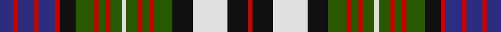

**Bands:** [RKWKGRGRGWGRGRGKRBRBRB](/stripes/rkwkgrgrgwgrgrgkrbrbrb/) · **Stripes:** [R K W K DG R DG R DG W DG R DG R DG K R DB R DB R DB](/stripes/stripes22/) R K W K DG R DG R DG W DG R DG R DG K R DB R DB R DB

This was sourced from register-of-tartans.  It is a [22 band tartan](/bands/bands22/).

Original link https://www.tartanregister.gov.uk/tartanDetails.aspx?ref=2384

## Attestations

This cloth appears in 2 source records; the oldest owns this page.

- 01/01/2002 — MacDonell of Glengarry Dress (register-of-tartans, [record](https://www.tartanregister.gov.uk/tartanDetails.aspx?ref=2384))
- pre 2002 — MacDonell of Glengarry Dress (Clan?) (tartans-authority, [record](http://www.tartansauthority.com/tartan-ferret/display/1999/))

## Register references

External register numbers recorded for this tartan.

- Scottish Register of Tartans: [2384](https://www.tartanregister.gov.uk/tartanDetails.aspx?ref=2384)
- Scottish Tartans Authority (ITI): 1999
- Scottish Tartans World Register: 1999

## Thread count
DB/12 R4 DB14 R4 DB14 R4 K14 G16 R4 G6 R4 G10 LN4 G10 R4 G6 R4 G16 K18 LN30 K18 R/4

## Palette
Each colour and its ΔE from the base-6 reference it is a variant of.

| Colour | Shade | Base | ΔE (OKLab) |
|---|---|---|---|
| DB | <code style="background-color:#2C2C80;">#2C2C80</code> `#2C2C80` | B <code style="background-color:#2A418A;">#2A418A</code> | 0.06 |
| G | <code style="background-color:#285800;">#285800</code> `#285800` | G <code style="background-color:#006100;">#006100</code> | 0.03 |
| K | <code style="background-color:#101010;">#101010</code> `#101010` | K <code style="background-color:#000000;">#000000</code> | 0.17 |
| LN | <code style="background-color:#E0E0E0;">#E0E0E0</code> `#E0E0E0` | W <code style="background-color:#F7F7F7;">#F7F7F7</code> | 0.07 |
| R | <code style="background-color:#C80000;">#C80000</code> `#C80000` | R <code style="background-color:#CC0000;">#CC0000</code> | 0.01 |

## Nearest tartans

The nearest existing variants by ΔTartan distance.

1. [MacDonell of Glengarry, dress](/setts/s22/db6r2db7r2db7r2k7g8r2g3r2g5w2g5r2g3r2g8k9w15k9r2~x2/) — ΔT 0.67
1. [Soutar/Souter](/setts/s16/k20w3t20k3r3dg20r10w3k20~x2/) — ΔT 0.83
1. [Gullane](/setts/s23/k10n2k3m2w1m3w1m4w1o2w1o3w1o4w1n2w1n3w1n4w1k4w2~x4/) — ΔT 0.93
1. [Highfield Dress](/setts/s20/db10k2g2r2g2k2w2k2w4k1w2~x4/) — ΔT 0.96
1. [MacKinlay Dress](/setts/s29/r2k1db8k6lb8k2lb2k2lb8k6g8k1r2k1g8k6lb2k2lb2k2lb6k2lb2k2lb2k6db8k1r2~x2/) — ΔT 1.10
1. [Campbell of Loch Neil Dress](/setts/s28/k20dg14k2ly4k2dg14k10w6db6w18db3w4db3w18db6w6k10dg14k2w4k2dg14k12db12k2db6k2db12/) — ΔT 1.11
1. [MacKenzie Dress #4](/setts/s20/db10k10dg9k2w2k2dg9k10w2db2w14db2w2db2w14db2w2k10db10r2~x2/) — ΔT 1.11
1. [Argyle Dress](/setts/s22/db4k3g17k17db15k3r4k3db15k17w3db4w25db3w6db3w25db4w3k17g17k3~x2/) — ΔT 1.11
1. [Campbell #2](/setts/s26/k11dg15k2ly3k2dg15k11w5k5w19k2w5k2w19k5w5k11dg15k2w3k2dg15k11db11k3db11~x2/) — ΔT 1.14
1. [Langston (Personal)](/setts/s18/k14g2t14g3t14g2k14g14w2g14k14r2g2r10ly4r10g2r2~x2/) — ΔT 1.14

## Neighbour map

Every grey dot is one of 14299 variants placed by the first two principal components of the ΔTartan feature space (44% of its variance). Red is this tartan; blue dots are its nearest — click one to open its page.

<svg viewBox="0 0 640 380" role="img" style="max-width:100%;height:auto;border:1px solid #e0e0e0;border-radius:4px;display:block" xmlns="http://www.w3.org/2000/svg"><image href="/nn/cloud.v1.png" width="640" height="380"/><a href="/setts/s22/db6r2db7r2db7r2k7g8r2g3r2g5w2g5r2g3r2g8k9w15k9r2~x2/"><circle cx="32.9" cy="143.6" r="4" fill="#3465a4"><title>MacDonell of Glengarry, dress</title></circle></a><a href="/setts/s16/k20w3t20k3r3dg20r10w3k20~x2/"><circle cx="65.0" cy="161.7" r="4" fill="#3465a4"><title>Soutar/Souter</title></circle></a><a href="/setts/s23/k10n2k3m2w1m3w1m4w1o2w1o3w1o4w1n2w1n3w1n4w1k4w2~x4/"><circle cx="69.2" cy="119.8" r="4" fill="#3465a4"><title>Gullane</title></circle></a><a href="/setts/s20/db10k2g2r2g2k2w2k2w4k1w2~x4/"><circle cx="53.0" cy="129.1" r="4" fill="#3465a4"><title>Highfield Dress</title></circle></a><a href="/setts/s29/r2k1db8k6lb8k2lb2k2lb8k6g8k1r2k1g8k6lb2k2lb2k2lb6k2lb2k2lb2k6db8k1r2~x2/"><circle cx="81.3" cy="133.6" r="4" fill="#3465a4"><title>MacKinlay Dress</title></circle></a><a href="/setts/s28/k20dg14k2ly4k2dg14k10w6db6w18db3w4db3w18db6w6k10dg14k2w4k2dg14k12db12k2db6k2db12/"><circle cx="50.3" cy="127.6" r="4" fill="#3465a4"><title>Campbell of Loch Neil Dress</title></circle></a><a href="/setts/s20/db10k10dg9k2w2k2dg9k10w2db2w14db2w2db2w14db2w2k10db10r2~x2/"><circle cx="59.4" cy="142.7" r="4" fill="#3465a4"><title>MacKenzie Dress #4</title></circle></a><a href="/setts/s22/db4k3g17k17db15k3r4k3db15k17w3db4w25db3w6db3w25db4w3k17g17k3~x2/"><circle cx="63.8" cy="129.0" r="4" fill="#3465a4"><title>Argyle Dress</title></circle></a><a href="/setts/s26/k11dg15k2ly3k2dg15k11w5k5w19k2w5k2w19k5w5k11dg15k2w3k2dg15k11db11k3db11~x2/"><circle cx="74.0" cy="130.8" r="4" fill="#3465a4"><title>Campbell #2</title></circle></a><a href="/setts/s18/k14g2t14g3t14g2k14g14w2g14k14r2g2r10ly4r10g2r2~x2/"><circle cx="60.1" cy="149.1" r="4" fill="#3465a4"><title>Langston (Personal)</title></circle></a><circle cx="48.8" cy="148.7" r="5" fill="#c00000"/></svg>

ID: /setts/s22/db6r2db7r2db7r2k7dg8r2dg3r2dg5w2dg5r2dg3r2dg8k9w15k9r2~x2/
