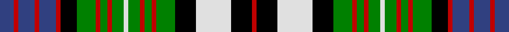

In pattern [BRBRBRKGRGRGWGRGRGKWKR](/stripes/brbrbrkgrgrgwgrgrgkwkr/).

This was sourced from weddslist.  It is a [22 stripe tartan](/stripes/stripes22/).

Original link http://www.weddslist.com/cgi-bin/tartans/pg.pl?source=sts

## Thread count
B/12 R4 B14 R4 B14 R4 K14 G16 R4 G6 R4 G10 LN4 G10 R4 G6 R4 G16 K18 LN30 K18 R/4

## Palette
Each colour and the base-6 reference it is a variant of.

| Colour | Shade | Base |
|---|---|---|
| B | <code style="background-color:#304080;">#304080</code> `oklch(39.4% 0.109 270.2)` <small>#304080</small> | B <code style="background-color:#2A418A;">#2A418A</code> |
| G | <code style="background-color:#008000;">#008000</code> `oklch(52.0% 0.177 142.5)` <small>#008000</small> | G <code style="background-color:#006100;">#006100</code> |
| K | <code style="background-color:#000000;">#000000</code> `oklch(0.0% 0.000 0.0)` <small>#000000</small> | K <code style="background-color:#000000;">#000000</code> |
| LN | <code style="background-color:#E0E0E0;">#E0E0E0</code> `oklch(90.7% 0.000 89.9)` <small>#E0E0E0</small> | W <code style="background-color:#F7F7F7;">#F7F7F7</code> |
| R | <code style="background-color:#C00000;">#C00000</code> `oklch(50.7% 0.208 29.2)` <small>#C00000</small> | R <code style="background-color:#CC0000;">#CC0000</code> |

## Nearest tartans

The nearest existing variants by ΔTartan distance.

1. [MacDonell of Glengarry Dress](/setts/s22/db6r2db7r2db7r2k7dg8r2dg3r2dg5w2dg5r2dg3r2dg8k9w15k9r2~x2/) — ΔT 0.67
1. [Campbell dress](/setts/s23/k12g12ly3g12k9w5db6w19db2w6db2w19db6w5k9g12w3k12db10k2db2k2db10~x2/) — ΔT 0.95
1. [MacKenzie, dress](/setts/s20/db10k10g9k2w2k2g9k10w2db2w14db2w2db2w14db2w2k10db10r2~x2/) — ΔT 0.95
1. [Campbell of Loch Neil, dress](/setts/s28/k20g14k2ly4k2g14k10w6db6w18db3w4db3w18db6w6k10g14k2w4k2g14k12db12k2db6k2db12/) — ΔT 0.96
1. [Campbell #2](/setts/s26/k11dg15k2ly3k2dg15k11w5k5w19k2w5k2w19k5w5k11dg15k2w3k2dg15k11db11k3db11~x2/) — ΔT 0.96
1. [Campbell](/setts/s26/k11g15k2ly3k2g15k11w5k5w19k2w5k2w19k5w5k11g15k2w3k2g15k11db11k3db11~x2/) — ΔT 1.01
1. [Highfield Dress](/setts/s20/db10k2g2r2g2k2w2k2w4k1w2~x4/) — ΔT 1.04
1. [Colquhoun, dress](/setts/s22/k15w3db3w18db2r2db2w19db3w3k15w2g13r2g14w2k15db10k2db2k2db10/) — ΔT 1.06
1. [Campbell of Loch Neil Dress](/setts/s28/k20dg14k2ly4k2dg14k10w6db6w18db3w4db3w18db6w6k10dg14k2w4k2dg14k12db12k2db6k2db12/) — ΔT 1.07
1. [Soutar/Souter](/setts/s16/k20w3t20k3r3dg20r10w3k20~x2/) — ΔT 1.08

## Neighbour map

Every grey dot is one of 14299 variants placed by the first two principal components of the ΔTartan feature space (44% of its variance). Red is this tartan; blue dots are its nearest — click one to open its page.

<svg viewBox="0 0 640 380" role="img" style="max-width:100%;height:auto;border:1px solid #e0e0e0;border-radius:4px;display:block" xmlns="http://www.w3.org/2000/svg"><image href="/nn/cloud.v1.png" width="640" height="380"/><a href="/setts/s22/db6r2db7r2db7r2k7dg8r2dg3r2dg5w2dg5r2dg3r2dg8k9w15k9r2~x2/"><circle cx="48.8" cy="148.7" r="4" fill="#3465a4"><title>MacDonell of Glengarry Dress</title></circle></a><a href="/setts/s23/k12g12ly3g12k9w5db6w19db2w6db2w19db6w5k9g12w3k12db10k2db2k2db10~x2/"><circle cx="48.2" cy="133.8" r="4" fill="#3465a4"><title>Campbell dress</title></circle></a><a href="/setts/s20/db10k10g9k2w2k2g9k10w2db2w14db2w2db2w14db2w2k10db10r2~x2/"><circle cx="50.9" cy="140.5" r="4" fill="#3465a4"><title>MacKenzie, dress</title></circle></a><a href="/setts/s28/k20g14k2ly4k2g14k10w6db6w18db3w4db3w18db6w6k10g14k2w4k2g14k12db12k2db6k2db12/"><circle cx="38.4" cy="123.4" r="4" fill="#3465a4"><title>Campbell of Loch Neil, dress</title></circle></a><a href="/setts/s26/k11dg15k2ly3k2dg15k11w5k5w19k2w5k2w19k5w5k11dg15k2w3k2dg15k11db11k3db11~x2/"><circle cx="74.0" cy="130.8" r="4" fill="#3465a4"><title>Campbell #2</title></circle></a><a href="/setts/s26/k11g15k2ly3k2g15k11w5k5w19k2w5k2w19k5w5k11g15k2w3k2g15k11db11k3db11~x2/"><circle cx="62.7" cy="127.7" r="4" fill="#3465a4"><title>Campbell</title></circle></a><a href="/setts/s20/db10k2g2r2g2k2w2k2w4k1w2~x4/"><circle cx="53.0" cy="129.1" r="4" fill="#3465a4"><title>Highfield Dress</title></circle></a><a href="/setts/s22/k15w3db3w18db2r2db2w19db3w3k15w2g13r2g14w2k15db10k2db2k2db10/"><circle cx="68.3" cy="117.5" r="4" fill="#3465a4"><title>Colquhoun, dress</title></circle></a><a href="/setts/s28/k20dg14k2ly4k2dg14k10w6db6w18db3w4db3w18db6w6k10dg14k2w4k2dg14k12db12k2db6k2db12/"><circle cx="50.3" cy="127.6" r="4" fill="#3465a4"><title>Campbell of Loch Neil Dress</title></circle></a><a href="/setts/s16/k20w3t20k3r3dg20r10w3k20~x2/"><circle cx="65.0" cy="161.7" r="4" fill="#3465a4"><title>Soutar/Souter</title></circle></a><circle cx="32.9" cy="143.6" r="5" fill="#c00000"/></svg>

ID: /setts/s22/db6r2db7r2db7r2k7g8r2g3r2g5w2g5r2g3r2g8k9w15k9r2~x2/
