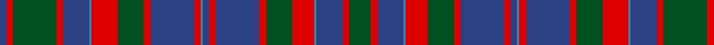

**Bands:** [BRGRBBRGRBRBBRBRGRBBRG](/stripes/brgrbbrgrbrbbrbrgrbbrg/) · **Stripes:** [DB R DG R DB T R DG R DB R T DB R DB R DG R T DB R DG](/stripes/stripes22/) DB R DG R DB T R DG R DB R T DB R DB R DG R T DB R DG

This was sourced from register-of-tartans.  It is a [22 band tartan](/bands/bands22/).

Original link https://www.tartanregister.gov.uk/tartanDetails.aspx?ref=834

## Register references

External register numbers recorded for this tartan.

- Scottish Register of Tartans: [834](https://www.tartanregister.gov.uk/tartanDetails.aspx?ref=834)
- Scottish Tartans World Register: 508

## Variants

Other setts woven to the same stripe pattern.

- [Cumming of Glenorchy](/setts/s22/dg34r3db12t1r8dg12r3db20r3db3t1r3db20r3dg12r8t1db12r3dg22r3db3~x2/)

## Thread count
B/6 R6 G40 R6 B24 Ba2 R24 G24 R6 B40 R6 Ba2 B6 R6 B40 R6 G24 R20 Ba2 B24 R6 G/20

## Palette
Each colour and its ΔE from the base-6 reference it is a variant of.

| Colour | Shade | Base | ΔE (OKLab) |
|---|---|---|---|
| B | <code style="background-color:#2C4084;">#2C4084</code> `#2C4084` | B <code style="background-color:#2A418A;">#2A418A</code> | 0.01 |
| Ba | <code style="background-color:#3C82AF;">#3C82AF</code> `#3C82AF` | B <code style="background-color:#2A418A;">#2A418A</code> | 0.19 |
| G | <code style="background-color:#005020;">#005020</code> `#005020` | G <code style="background-color:#006100;">#006100</code> | 0.07 |
| R | <code style="background-color:#DC0000;">#DC0000</code> `#DC0000` | R <code style="background-color:#CC0000;">#CC0000</code> | 0.03 |

## Nearest tartans

The nearest existing variants by ΔTartan distance.

1. [MacIntyre of Littleport](/setts/s21/r3db21r3dg7r7db8r3dg21r3db3r3dg21r3db8r6dg7r3db21r3db3t1~x2/) — ΔT 0.38
1. [Cumming](/setts/s22/g10r3db12t1r10g12r3db20r3db3t1r3db20r3g12r12t1db12r3g20r3db3~x2/) — ΔT 0.64
1. [MacIntyre, or Perthshire](/setts/s21/r3db21r3g7r7db8r3g21r3db3r3g21r3db8r6g7r3db21r3db3t1~x2/) — ΔT 0.87
1. [Cumming and Glenorchy](/setts/s22/r3db20r3dg12r8t1db12r3dg22r3db3dg33r3db12t1r8dg12r3db20r3db3t1~x2/) — ΔT 1.05
1. [Cumming of Glenorchy](/setts/s22/dg34r3db12t1r8dg12r3db20r3db3t1r3db20r3dg12r8t1db12r3dg22r3db3~x2/) — ΔT 1.11
1. [Cairns of Finavon](/setts/s28/db16g3db3g3db3g16db3g3db3g3db16m15db1ly3db1m15db16g15db3g3db3g15db16m15b1m3b1m15~x2/) — ΔT 1.13
1. [Cairns of Finavon (Name)](/setts/s28/g16db3g3db3g3db16m15db1ly3db1m15db16g15db3g3db3g15db16m15b1m3b1m15db16g3db3g3db3~x2/) — ΔT 1.13
1. [Highland Granite Weavers Tartan Tartan Number: 6499. Earliest known date: 2005 The colours reflect the imposing scenery when journeying north from Perth to Inverness or through to Royal Deeside, granite being the predominant composition of the surrounding unique hills and mountains. This tartan is for those wishing to embrace the growing popularity of the kilt who may either have no strong clan tartan connection, or who wish to wear a tartan different from their own. See products available Copyright © Blair Urquhart, Comrie, 2015](/setts/s18/o16k2o3k2o4k10n27lr2n8lr2n27k10o4k2o3k2o16n2~x2/) — ΔT 1.21
1. [Norwich No.023](/setts/s26/g2r2t1db16r2g6r2t1db6r2g16r2t1db2t1r2g16r2db6t1r2g6r2db16t1r2~x2/) — ΔT 1.23
1. [MacDonald](/setts/s23/g20r2g4r6g32k32r2db32r6db3r2db20r2db3r6db32r2k32g32r6g4r2g10~x2/) — ΔT 1.32

## Neighbour map

Every grey dot is one of 14313 variants placed by the first two principal components of the ΔTartan feature space (44% of its variance). Red is this tartan; blue dots are its nearest — click one to open its page.

<svg viewBox="0 0 640 380" role="img" style="max-width:100%;height:auto;border:1px solid #e0e0e0;border-radius:4px;display:block" xmlns="http://www.w3.org/2000/svg"><image href="/nn/cloud.v1.png" width="640" height="380"/><a href="/setts/s21/r3db21r3dg7r7db8r3dg21r3db3r3dg21r3db8r6dg7r3db21r3db3t1~x2/"><circle cx="258.9" cy="138.0" r="4" fill="#3465a4"><title>MacIntyre of Littleport</title></circle></a><a href="/setts/s22/g10r3db12t1r10g12r3db20r3db3t1r3db20r3g12r12t1db12r3g20r3db3~x2/"><circle cx="239.9" cy="140.5" r="4" fill="#3465a4"><title>Cumming</title></circle></a><a href="/setts/s21/r3db21r3g7r7db8r3g21r3db3r3g21r3db8r6g7r3db21r3db3t1~x2/"><circle cx="249.9" cy="135.2" r="4" fill="#3465a4"><title>MacIntyre, or Perthshire</title></circle></a><a href="/setts/s22/r3db20r3dg12r8t1db12r3dg22r3db3dg33r3db12t1r8dg12r3db20r3db3t1~x2/"><circle cx="291.4" cy="122.4" r="4" fill="#3465a4"><title>Cumming and Glenorchy</title></circle></a><a href="/setts/s22/dg34r3db12t1r8dg12r3db20r3db3t1r3db20r3dg12r8t1db12r3dg22r3db3~x2/"><circle cx="294.6" cy="120.8" r="4" fill="#3465a4"><title>Cumming of Glenorchy</title></circle></a><a href="/setts/s28/db16g3db3g3db3g16db3g3db3g3db16m15db1ly3db1m15db16g15db3g3db3g15db16m15b1m3b1m15~x2/"><circle cx="212.1" cy="127.7" r="4" fill="#3465a4"><title>Cairns of Finavon</title></circle></a><a href="/setts/s28/g16db3g3db3g3db16m15db1ly3db1m15db16g15db3g3db3g15db16m15b1m3b1m15db16g3db3g3db3~x2/"><circle cx="212.1" cy="127.7" r="4" fill="#3465a4"><title>Cairns of Finavon (Name)</title></circle></a><a href="/setts/s18/o16k2o3k2o4k10n27lr2n8lr2n27k10o4k2o3k2o16n2~x2/"><circle cx="273.3" cy="154.8" r="4" fill="#3465a4"><title>Highland Granite Weavers Tartan Tartan Number: 6499. Earliest known date: 2005 The colours reflect the imposing scenery when journeying north from Perth to Inverness or through to Royal Deeside, granite being the predominant composition of the surrounding unique hills and mountains. This tartan is for those wishing to embrace the growing popularity of the kilt who may either have no strong clan tartan connection, or who wish to wear a tartan different from their own. See products available Copyright © Blair Urquhart, Comrie, 2015</title></circle></a><a href="/setts/s26/g2r2t1db16r2g6r2t1db6r2g16r2t1db2t1r2g16r2db6t1r2g6r2db16t1r2~x2/"><circle cx="244.6" cy="124.0" r="4" fill="#3465a4"><title>Norwich No.023</title></circle></a><a href="/setts/s23/g20r2g4r6g32k32r2db32r6db3r2db20r2db3r6db32r2k32g32r6g4r2g10~x2/"><circle cx="200.3" cy="139.2" r="4" fill="#3465a4"><title>MacDonald</title></circle></a><circle cx="247.6" cy="143.5" r="5" fill="#c00000"/></svg>

ID: /setts/s22/dg10r3db12t1r10dg12r3db20r3db3t1r3db20r3dg12r12t1db12r3dg20r3db3~x2/
