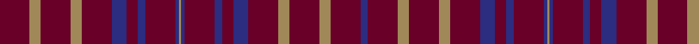

In pattern [BBYBYBBBBBBYBBBBBBYBYB](/stripes/bbybybbbbbbybbbbbbybyb/).

This was sourced from house-of-tartan.  It is a [22 stripe tartan](/stripes/stripes22/).

Original link http://www.house-of-tartan.scotland.net/house/TartanViewjs.asp?colr=Def&tnam=2416

## Thread count
DR/32 LT12 DR32 LT12 DR32 DB16 DR12 DB8 DR32 DB4 LT2 DB4 DR32 DB8 DR12 DB16 DR32 LT12 DR32 LT12 DR32 DB/8

## Palette
Each colour and its ΔE from the base-6 reference it is a variant of.

| Colour | Shade | Base | ΔE (OKLab) |
|---|---|---|---|
| DB | <code style="background-color:#2C2C80;">#2C2C80</code> `#2C2C80` | B <code style="background-color:#2A418A;">#2A418A</code> | 0.06 |
| DR | <code style="background-color:#680028;">#680028</code> `#680028` | B <code style="background-color:#2A418A;">#2A418A</code> | 0.21 |
| LT | <code style="background-color:#A08858;">#A08858</code> `#A08858` | Y <code style="background-color:#F2BF00;">#F2BF00</code> | 0.21 |

## Nearest tartans

The nearest existing variants by ΔTartan distance.

1. [Glover, Thomas Blake (Corporate)](/setts/s12/db4dr16lo6dr16lo6dr16db8dr6db4dr16db2lo1~x2/) — ΔT 1.27
1. [James (Welsh Name)](/setts/s15/r11k1k3r6k1r6k3r4k7r11db1r11k7db2k4~x2/) — ΔT 1.73
1. [Thomas Blake Glover](/setts/s12/db4dr16o6dr16o6dr16db8dr6db4dr16db2o1~x2/) — ΔT 1.98
1. [James of Wales](/setts/s28/db11k1r3db6k1db6r3db4r7db11lo1db11r7lo2k4/) — ΔT 2.19
1. [James Welsh Name Tartan Tartan Number: 5736. Earliest known date: Unknown The tartan for this Welsh surname and it's variants, Jacob, Jago, Jamie, Jamison, Jaymes, Jayume, Jamsey, Jem, Jemes and Gimson, is actually woven in Wales at the Cambrian Woollen Mill, weaving on the same site since 1830. This tartan differs from many traditional patterns in that the warp and weft differ, giving the finished worsted wool cloth more of a predominant stripe, vertically noticeable in the finished Kilt, or Cilt in Wales. See products available Copyright © Blair Urquhart, Comrie, 2015](/setts/s15/db11k1r3db6k1db6r3db4r7db11lo1db11r7lo2k4~x2/) — ΔT 2.31
1. [Chicago University of.. Corporate Tartan Tartan Number: 2073. Earliest known date: 1991 William Rainey Harper, a Scot, was founder and first president of the University. Andrew MacLeish was one of the original trustees. See products available Copyright © Blair Urquhart, Comrie, 2015](/setts/s16/r30k8r2k2r3k2r8r15r8k2r3k2r2k8r30w3~x2/) — ΔT 2.32
1. [Orlando Fire Department](/setts/s16/db12ly1r16db1r1db14r3db14ly1~x4/) — ΔT 2.45
1. [Rice of Wales](/setts/s18/r21lo1r21y8db4y5db4y4lo4y4db4y5db4y8r21lo1r21lo4~x2/) — ΔT 2.45
1. [Greyhound Grenadiers Pipe Band](/setts/s22/k2n2k2n1n10r2n4n10k4b9n10n2~x2/) — ΔT 2.51
1. [Killin](/setts/s28/k26r2k6r2k26r4k4r4k4r18lo2r18k4r4k4r4k26r2k6r2k26r9k4r20w2r20k4r9~x2/) — ΔT 2.57

## Neighbour map

Every grey dot is one of 14299 variants placed by the first two principal components of the ΔTartan feature space (44% of its variance). Red is this tartan; blue dots are its nearest — click one to open its page.

<svg viewBox="0 0 640 380" role="img" style="max-width:100%;height:auto;border:1px solid #e0e0e0;border-radius:4px;display:block" xmlns="http://www.w3.org/2000/svg"><image href="/nn/cloud.v1.png" width="640" height="380"/><a href="/setts/s12/db4dr16lo6dr16lo6dr16db8dr6db4dr16db2lo1~x2/"><circle cx="460.3" cy="221.8" r="4" fill="#3465a4"><title>Glover, Thomas Blake (Corporate)</title></circle></a><a href="/setts/s15/r11k1k3r6k1r6k3r4k7r11db1r11k7db2k4~x2/"><circle cx="374.0" cy="205.4" r="4" fill="#3465a4"><title>James (Welsh Name)</title></circle></a><a href="/setts/s12/db4dr16o6dr16o6dr16db8dr6db4dr16db2o1~x2/"><circle cx="502.6" cy="245.8" r="4" fill="#3465a4"><title>Thomas Blake Glover</title></circle></a><a href="/setts/s28/db11k1r3db6k1db6r3db4r7db11lo1db11r7lo2k4/"><circle cx="354.1" cy="188.0" r="4" fill="#3465a4"><title>James of Wales</title></circle></a><a href="/setts/s15/db11k1r3db6k1db6r3db4r7db11lo1db11r7lo2k4~x2/"><circle cx="372.5" cy="217.7" r="4" fill="#3465a4"><title>James Welsh Name Tartan Tartan Number: 5736. Earliest known date: Unknown The tartan for this Welsh surname and it's variants, Jacob, Jago, Jamie, Jamison, Jaymes, Jayume, Jamsey, Jem, Jemes and Gimson, is actually woven in Wales at the Cambrian Woollen Mill, weaving on the same site since 1830. This tartan differs from many traditional patterns in that the warp and weft differ, giving the finished worsted wool cloth more of a predominant stripe, vertically noticeable in the finished Kilt, or Cilt in Wales. See products available Copyright © Blair Urquhart, Comrie, 2015</title></circle></a><a href="/setts/s16/r30k8r2k2r3k2r8r15r8k2r3k2r2k8r30w3~x2/"><circle cx="445.0" cy="148.9" r="4" fill="#3465a4"><title>Chicago University of.. Corporate Tartan Tartan Number: 2073. Earliest known date: 1991 William Rainey Harper, a Scot, was founder and first president of the University. Andrew MacLeish was one of the original trustees. See products available Copyright © Blair Urquhart, Comrie, 2015</title></circle></a><a href="/setts/s16/db12ly1r16db1r1db14r3db14ly1~x4/"><circle cx="394.2" cy="164.8" r="4" fill="#3465a4"><title>Orlando Fire Department</title></circle></a><a href="/setts/s18/r21lo1r21y8db4y5db4y4lo4y4db4y5db4y8r21lo1r21lo4~x2/"><circle cx="392.3" cy="159.1" r="4" fill="#3465a4"><title>Rice of Wales</title></circle></a><a href="/setts/s22/k2n2k2n1n10r2n4n10k4b9n10n2~x2/"><circle cx="397.5" cy="206.2" r="4" fill="#3465a4"><title>Greyhound Grenadiers Pipe Band</title></circle></a><a href="/setts/s28/k26r2k6r2k26r4k4r4k4r18lo2r18k4r4k4r4k26r2k6r2k26r9k4r20w2r20k4r9~x2/"><circle cx="357.4" cy="153.6" r="4" fill="#3465a4"><title>Killin</title></circle></a><circle cx="457.6" cy="202.5" r="5" fill="#c00000"/></svg>

ID: /setts/s22/dr16lo6dr16lo6dr16db8dr6db4dr16db2lo1db2dr16db4dr6db8dr16lo6dr16lo6dr16db4~x2/
