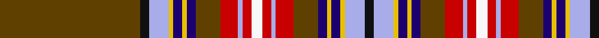

**Bands:** [KWYBYBGRWRWRWRGBYBYWKG](/stripes/kwybybgrwrwrwrgbybywkg/) · **Stripes:** [K LB LY DB LY DB DY R LB R W R LB R DY DB LY DB LY LB K DY](/stripes/stripes22/) K LB LY DB LY DB DY R LB R W R LB R DY DB LY DB LY LB K DY

This was sourced from register-of-tartans.  It is a [22 band tartan](/bands/bands22/).

Original link https://www.tartanregister.gov.uk/tartanDetails.aspx?ref=3764

## Register references

External register numbers recorded for this tartan.

- Scottish Register of Tartans: [3764](https://www.tartanregister.gov.uk/tartanDetails.aspx?ref=3764)
- Scottish Tartans Authority (ITI): 1737
- Scottish Tartans World Register: 1737

## Thread count
Ta/126 K8 LP18 Y4 DB8 Y4 DB8 Ta22 R16 LP4 R8 Wa10 R8 LP4 R16 Ta22 DB8 Y4 DB8 Y4 LP18 K/8

## Palette
Each colour and its ΔE from the base-6 reference it is a variant of.

| Colour | Shade | Base | ΔE (OKLab) |
|---|---|---|---|
| DB | <code style="background-color:#1C0070;">#1C0070</code> `#1C0070` | B <code style="background-color:#2A418A;">#2A418A</code> | 0.14 |
| DR | <code style="background-color:#880000;">#880000</code> `#880000` | R <code style="background-color:#CC0000;">#CC0000</code> | 0.15 |
| DY | <code style="background-color:#D09800;">#D09800</code> `#D09800` | Y <code style="background-color:#F2BF00;">#F2BF00</code> | 0.12 |
| K | <code style="background-color:#101010;">#101010</code> `#101010` | K <code style="background-color:#000000;">#000000</code> | 0.17 |
| LP | <code style="background-color:#A8ACE8;">#A8ACE8</code> `#A8ACE8` | W <code style="background-color:#F7F7F7;">#F7F7F7</code> | 0.23 |
| R | <code style="background-color:#C80000;">#C80000</code> `#C80000` | R <code style="background-color:#CC0000;">#CC0000</code> | 0.01 |
| T | <code style="background-color:#4C3428;">#4C3428</code> `#4C3428` | B <code style="background-color:#2A418A;">#2A418A</code> | 0.17 |
| Ta | <code style="background-color:#604000;">#604000</code> `#604000` | G <code style="background-color:#006100;">#006100</code> | 0.14 |
| W | <code style="background-color:#FCFCFC;">#FCFCFC</code> `#FCFCFC` | W <code style="background-color:#F7F7F7;">#F7F7F7</code> | 0.01 |
| Wa | <code style="background-color:#F8F8F8;">#F8F8F8</code> `#F8F8F8` | W <code style="background-color:#F7F7F7;">#F7F7F7</code> | 0.00 |
| Y | <code style="background-color:#E8C000;">#E8C000</code> `#E8C000` | Y <code style="background-color:#F2BF00;">#F2BF00</code> | 0.02 |

## Nearest tartans

The nearest existing variants by ΔTartan distance.

1. [MacRae, of Ardentoul](/setts/s18/r11t3db18ly1db2w1k1g18r3k1r2k3r2k1r40k1r2k3~x2/) — ΔT 1.07
1. [MacBean](/setts/s19/r24w1db2t1w1t1db2w1k1g6k1w1r2r2g1r2r2w1g3~x2/) — ΔT 1.17
1. [MacBean](/setts/s19/r24lr1db2b1lr1b1db2lr1k1dg6k1lr1r2dr2dg1dr2r2lr1dg3~x2/) — ΔT 1.18
1. [MacBean](/setts/s19/r24lr1db2b1lr1b1db2lr1k1dg6k1lr1r2dr2dg1dr2r2lr1dg3/) — ΔT 1.18
1. [McBain](/setts/s19/r60w2lb5k2w2k2lb5w2k2g12k2w2r5r5g2r5r5g10w2~x2/) — ΔT 1.23
1. [MacBean (Lord Lyon version)](/setts/s19/r60w2lb5k2w2k2lb5w2k2g12k2w2r5r5g2r5r5w2g10~x2/) — ΔT 1.23
1. [Fitzgerald Dress](/setts/s25/w2k1r3db3r3r3r19r3r3db3r3db29ly3g29r3db3r3r3r19r3r3db3r3k1w2~x4/) — ΔT 1.23
1. [Chattan](/setts/s19/r36k2w1g18w1o2ly2r3k1r3ly2o2w1t18k5r4ly5o2w2~x2/) — ΔT 1.27
1. [Chattan Clan Tartan Tartan Number: 1620. Earliest known date: pre 2003 This sett includes a brown stripe next to the yellow which does not appear in the records of Lord Lyon. The sett is similar in other respects. See products available Copyright © Blair Urquhart, Comrie, 2015](/setts/s19/r36k2w1g18w1dy2ly2r3k1r3ly2dy2w1t18k5r4ly5dy2w2~x2/) — ΔT 1.30
1. [Chattan (brown stripe variation)](/setts/s19/r36k2w1dg18w1o2ly2r3k1r3ly2o2w1t18k5r4ly5o2w2~x2/) — ΔT 1.35

## Neighbour map

Every grey dot is one of 14299 variants placed by the first two principal components of the ΔTartan feature space (44% of its variance). Red is this tartan; blue dots are its nearest — click one to open its page.

<svg viewBox="0 0 640 380" role="img" style="max-width:100%;height:auto;border:1px solid #e0e0e0;border-radius:4px;display:block" xmlns="http://www.w3.org/2000/svg"><image href="/nn/cloud.v1.png" width="640" height="380"/><a href="/setts/s18/r11t3db18ly1db2w1k1g18r3k1r2k3r2k1r40k1r2k3~x2/"><circle cx="287.5" cy="14.0" r="4" fill="#3465a4"><title>MacRae, of Ardentoul</title></circle></a><a href="/setts/s19/r24w1db2t1w1t1db2w1k1g6k1w1r2r2g1r2r2w1g3~x2/"><circle cx="256.4" cy="14.0" r="4" fill="#3465a4"><title>MacBean</title></circle></a><a href="/setts/s19/r24lr1db2b1lr1b1db2lr1k1dg6k1lr1r2dr2dg1dr2r2lr1dg3~x2/"><circle cx="272.0" cy="26.9" r="4" fill="#3465a4"><title>MacBean</title></circle></a><a href="/setts/s19/r24lr1db2b1lr1b1db2lr1k1dg6k1lr1r2dr2dg1dr2r2lr1dg3/"><circle cx="272.0" cy="26.9" r="4" fill="#3465a4"><title>MacBean</title></circle></a><a href="/setts/s19/r60w2lb5k2w2k2lb5w2k2g12k2w2r5r5g2r5r5g10w2~x2/"><circle cx="296.0" cy="21.5" r="4" fill="#3465a4"><title>McBain</title></circle></a><a href="/setts/s19/r60w2lb5k2w2k2lb5w2k2g12k2w2r5r5g2r5r5w2g10~x2/"><circle cx="296.0" cy="21.5" r="4" fill="#3465a4"><title>MacBean (Lord Lyon version)</title></circle></a><a href="/setts/s25/w2k1r3db3r3r3r19r3r3db3r3db29ly3g29r3db3r3r3r19r3r3db3r3k1w2~x4/"><circle cx="185.4" cy="19.5" r="4" fill="#3465a4"><title>Fitzgerald Dress</title></circle></a><a href="/setts/s19/r36k2w1g18w1o2ly2r3k1r3ly2o2w1t18k5r4ly5o2w2~x2/"><circle cx="193.5" cy="14.0" r="4" fill="#3465a4"><title>Chattan</title></circle></a><a href="/setts/s19/r36k2w1g18w1dy2ly2r3k1r3ly2dy2w1t18k5r4ly5dy2w2~x2/"><circle cx="204.7" cy="14.0" r="4" fill="#3465a4"><title>Chattan Clan Tartan Tartan Number: 1620. Earliest known date: pre 2003 This sett includes a brown stripe next to the yellow which does not appear in the records of Lord Lyon. The sett is similar in other respects. See products available Copyright © Blair Urquhart, Comrie, 2015</title></circle></a><a href="/setts/s19/r36k2w1dg18w1o2ly2r3k1r3ly2o2w1t18k5r4ly5o2w2~x2/"><circle cx="200.6" cy="14.0" r="4" fill="#3465a4"><title>Chattan (brown stripe variation)</title></circle></a><circle cx="249.2" cy="14.0" r="5" fill="#c00000"/></svg>

ID: /setts/s22/dy63k4lb9ly2db4ly2db4dy11r8lb2r4w5~x2/
