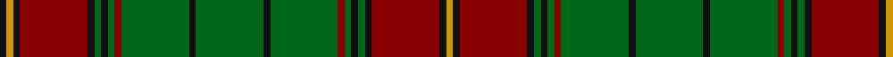

This page is one **sett** — a single exact thread-count. It belongs to the [tartan](/tartans/g10k1g10dr1g1k1g1k1dr10k1dy1k1/)
(the same proportion at any scale), whose colour order is pattern [KYKRKGKGRGKGKGRGKGKRKY](/stripes/kykrkgkgrgkgkgrgkgkrky/).

Sourced from register-of-tartans.  It is a [22 stripe tartan](/stripes/stripes22/).

Original link https://www.tartanregister.gov.uk/tartanDetails.aspx?ref=4197

## Also known as

This cloth is also recorded under:

- Ulster

## Register references

External register numbers recorded for this tartan.

- Scottish Register of Tartans: [4197](https://www.tartanregister.gov.uk/tartanDetails.aspx?ref=4197)
- Scottish Tartans Authority (ITI): 792
- Scottish Tartans World Register: 792

## Thread count
K/4 DY4 K4 DR40 K4 G4 K4 G4 DR4 G40 K4 G40 K4 G40 DR4 G4 K4 G4 K4 DR40 K4 DY/4

## Palette
Each colour and the base-6 reference it is a variant of.

| Colour | Shade | Base |
|---|---|---|
| DR | <code style="background-color:#880000;">#880000</code> `oklch(39.4% 0.162 29.2)` <small>#880000</small> | R <code style="background-color:#CC0000;">#CC0000</code> |
| DY | <code style="background-color:#D09800;">#D09800</code> `oklch(71.4% 0.147 82.1)` <small>#D09800</small> | Y <code style="background-color:#F2BF00;">#F2BF00</code> |
| G | <code style="background-color:#006818;">#006818</code> `oklch(45.0% 0.142 145.0)` <small>#006818</small> | G <code style="background-color:#006100;">#006100</code> |
| K | <code style="background-color:#101010;">#101010</code> `oklch(17.3% 0.000 89.9)` <small>#101010</small> | K <code style="background-color:#000000;">#000000</code> |

## Nearest tartans

The nearest existing variants by ΔTartan distance, with this tartan at the top so the swatches line up against it.

ΔTartan

Tartan

Sett

—

<a href="/ttd/edit/#slug=g10k1g10r1g1k1g1k1r10k1lo1k1~x4">Ulster (Red)</a> <a class="nn-out" href="/setts/s22/g10k1g10r1g1k1g1k1r10k1lo1k1~x4/" title="open its dictionary page">↗</a>

1.24

<a href="/ttd/edit/#slug=g3k1g1r12g1r1g1k4g1t2g15k1g1k1g3~x4">Hickey (Name)</a> <a class="nn-out" href="/setts/s15/g3k1g1r12g1r1g1k4g1t2g15k1g1k1g3~x4/" title="open its dictionary page">↗</a>

1.27

<a href="/setts/s16/db12r1db1r1db1r4g12ly1g2~x4/">Durie Clan Tartan Tartan Number: 2228. Earliest known date: 1988 When the matriculation of the Durie 'Arms' was updated in June 1988, this tartan was designed for family use by Harry G Lindlay of Kinloch &amp; Anderson of Edinburgh. The design is said to be based on the Argyle &amp; Southern Highlanders regimental tartan - the yellow is from the mess dress (military uniform evening wear) facings (lapels) and the burgundy represents the Durie family's French connections. Andrew, son of Lt. Col. Raymond Varley Dewar Durie succeded his father as clan chieftain in 1999. See products available Copyright © Blair Urquhart, Comrie, 2015</a>

1.35

<a href="/ttd/edit/#slug=r6g6r2k24r2db2k2r2k24r2g6r6db2k6r2g27r2k2r2g27r2k6db2~x2">Buchan</a> <a class="nn-out" href="/setts/s23/r6g6r2k24r2db2k2r2k24r2g6r6db2k6r2g27r2k2r2g27r2k6db2~x2/" title="open its dictionary page">↗</a>

1.37

<a href="/ttd/edit/#slug=g10k1g10r1g1k1g1k1r10k1lo1k1~x4">Ulster Red (District)</a> <a class="nn-out" href="/setts/s12/g10k1g10r1g1k1g1k1r10k1lo1k1~x4/" title="open its dictionary page">↗</a>

1.48

<a href="/setts/s22/r3db16k16g4k2g2k2g34r4g3r2g3~x2/">Park Clan/Family Weavers Tartan Tartan Number: 2387. Earliest known date: September 1996 William D. Park wished to have a tartan for himself and family. Can be worn by those of the same name. See products available Copyright © Blair Urquhart, Comrie, 2015</a>

1.50

<a href="/setts/s18/dy3g1dy15r2dy1r2dy1g7w1g2~x4/">Seton Hunting</a>

1.53

<a href="/ttd/edit/#slug=k2r2dg27r2k6db2r6dg6r2k24r2k2db2r2k24r2dg6r6db2k6r2dg27r2k2~x2">Cumming/Buchan Hunting</a> <a class="nn-out" href="/setts/s24/k2r2dg27r2k6db2r6dg6r2k24r2k2db2r2k24r2dg6r6db2k6r2dg27r2k2~x2/" title="open its dictionary page">↗</a>

1.55

<a href="/ttd/edit/#slug=g4r4g2r2g2r18db4g4r2g2r2g3r4g2r2g2r2db4g4r2g4~x2">Matheson (WCWM)</a> <a class="nn-out" href="/setts/s21/g4r4g2r2g2r18db4g4r2g2r2g3r4g2r2g2r2db4g4r2g4~x2/" title="open its dictionary page">↗</a>

1.64

<a href="/ttd/edit/#slug=g14dy4db4dy27g3dy4ly5dy4g3dy27db4dy4g14ly5~x2">Invertere (Daks #2)</a> <a class="nn-out" href="/setts/s14/g14dy4db4dy27g3dy4ly5dy4g3dy27db4dy4g14ly5~x2/" title="open its dictionary page">↗</a>

1.65

<a href="/ttd/edit/#slug=k4r2k10g3k10g30k8g3r4lo2r4lb2r4g3k8g30k10g3k10r2k4~x2">Pilette of Kinnear (Personal)</a> <a class="nn-out" href="/setts/s21/k4r2k10g3k10g30k8g3r4lo2r4lb2r4g3k8g30k10g3k10r2k4~x2/" title="open its dictionary page">↗</a>

## Neighbour map

Every grey dot is one of 14299 variants placed by the first two principal components of the ΔTartan feature space (44% of its variance). Red is this tartan; blue dots are its nearest — click one to open its page.

<svg viewBox="0 0 640 380" role="img" style="max-width:100%;height:auto;border:1px solid #e0e0e0;border-radius:4px;display:block" xmlns="http://www.w3.org/2000/svg"><image href="/nn/cloud.v1.png" width="640" height="380"/><a href="/setts/s15/g3k1g1r12g1r1g1k4g1t2g15k1g1k1g3~x4/"><circle cx="324.5" cy="133.7" r="4" fill="#3465a4"><title>Hickey (Name)</title></circle></a><a href="/setts/s16/db12r1db1r1db1r4g12ly1g2~x4/"><circle cx="275.7" cy="152.7" r="4" fill="#3465a4"><title>Durie Clan Tartan Tartan Number: 2228. Earliest known date: 1988 When the matriculation of the Durie 'Arms' was updated in June 1988, this tartan was designed for family use by Harry G Lindlay of Kinloch &amp; Anderson of Edinburgh. The design is said to be based on the Argyle &amp; Southern Highlanders regimental tartan - the yellow is from the mess dress (military uniform evening wear) facings (lapels) and the burgundy represents the Durie family's French connections. Andrew, son of Lt. Col. Raymond Varley Dewar Durie succeded his father as clan chieftain in 1999. See products available Copyright © Blair Urquhart, Comrie, 2015</title></circle></a><a href="/setts/s23/r6g6r2k24r2db2k2r2k24r2g6r6db2k6r2g27r2k2r2g27r2k6db2~x2/"><circle cx="254.5" cy="135.1" r="4" fill="#3465a4"><title>Buchan</title></circle></a><a href="/setts/s12/g10k1g10r1g1k1g1k1r10k1lo1k1~x4/"><circle cx="344.8" cy="177.8" r="4" fill="#3465a4"><title>Ulster Red (District)</title></circle></a><a href="/setts/s22/r3db16k16g4k2g2k2g34r4g3r2g3~x2/"><circle cx="293.8" cy="130.2" r="4" fill="#3465a4"><title>Park Clan/Family Weavers Tartan Tartan Number: 2387. Earliest known date: September 1996 William D. Park wished to have a tartan for himself and family. Can be worn by those of the same name. See products available Copyright © Blair Urquhart, Comrie, 2015</title></circle></a><a href="/setts/s18/dy3g1dy15r2dy1r2dy1g7w1g2~x4/"><circle cx="375.8" cy="148.1" r="4" fill="#3465a4"><title>Seton Hunting</title></circle></a><a href="/setts/s24/k2r2dg27r2k6db2r6dg6r2k24r2k2db2r2k24r2dg6r6db2k6r2dg27r2k2~x2/"><circle cx="251.9" cy="129.2" r="4" fill="#3465a4"><title>Cumming/Buchan Hunting</title></circle></a><a href="/setts/s21/g4r4g2r2g2r18db4g4r2g2r2g3r4g2r2g2r2db4g4r2g4~x2/"><circle cx="322.5" cy="186.3" r="4" fill="#3465a4"><title>Matheson (WCWM)</title></circle></a><a href="/setts/s14/g14dy4db4dy27g3dy4ly5dy4g3dy27db4dy4g14ly5~x2/"><circle cx="310.0" cy="180.7" r="4" fill="#3465a4"><title>Invertere (Daks #2)</title></circle></a><a href="/setts/s21/k4r2k10g3k10g30k8g3r4lo2r4lb2r4g3k8g30k10g3k10r2k4~x2/"><circle cx="255.9" cy="124.8" r="4" fill="#3465a4"><title>Pilette of Kinnear (Personal)</title></circle></a><circle cx="304.2" cy="146.6" r="5" fill="#c00000"/></svg>

ID: /setts/s22/g10k1g10r1g1k1g1k1r10k1lo1k1~x4/
