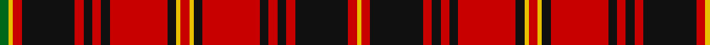

**Bands:** [GYRKRKRKRKYRYKRKRKRKRY](/stripes/gyrkrkrkrkyrykrkrkrkry/) · **Stripes:** [G LY R K R K R K R K LY R LY K R K R K R K R LY](/stripes/stripes22/) G LY R K R K R K R K LY R LY K R K R K R K R LY

This was sourced from register-of-tartans.  It is a [22 band tartan](/bands/bands22/).

Original link https://www.tartanregister.gov.uk/tartanDetails.aspx?ref=1574

## Register references

External register numbers recorded for this tartan.

- Scottish Register of Tartans: [1574](https://www.tartanregister.gov.uk/tartanDetails.aspx?ref=1574)
- Scottish Tartans Authority (ITI): 1021
- Scottish Tartans World Register: 1021

## Thread count
G/4 Y2 R4 K24 R4 K4 R4 K4 R26 K4 Y2 R4 Y2 K4 R26 K4 R4 K4 R4 K24 R4 Y/2

## Palette
Each colour and its ΔE from the base-6 reference it is a variant of.

| Colour | Shade | Base | ΔE (OKLab) |
|---|---|---|---|
| G | <code style="background-color:#006818;">#006818</code> `#006818` | G <code style="background-color:#006100;">#006100</code> | 0.02 |
| K | <code style="background-color:#101010;">#101010</code> `#101010` | K <code style="background-color:#000000;">#000000</code> | 0.17 |
| R | <code style="background-color:#C80000;">#C80000</code> `#C80000` | R <code style="background-color:#CC0000;">#CC0000</code> | 0.01 |
| Y | <code style="background-color:#E8C000;">#E8C000</code> `#E8C000` | Y <code style="background-color:#F2BF00;">#F2BF00</code> | 0.02 |

## Nearest tartans

The nearest existing variants by ΔTartan distance.

1. [Smeaton (Wedding) (Personal)](/setts/s18/r3k2lo3k3r3k32r44lb3r4k6r4lb3r44k32r3k3lo3k2~x2/) — ΔT 1.15
1. [Murray of Tullibardine - Artefact](/setts/s21/k4r3k3r4k22r4k3r3dg4r3k3r44k30r10dg10r40dg30r27k10r14dg3~x2/) — ΔT 1.19
1. [Murray of Tullibardine #4](/setts/s25/db6r5db4r3db6r4db4r5db9r5db4r3k8r3db4r36db27r4dg4r14dg27r9db6r6k3/) — ΔT 1.21
1. [Unidentified No 3 #2](/setts/s15/r5k1r2k2r16t2r2k9r2dg2r2dg13r2k2r4~x2/) — ΔT 1.24
1. [Hallingdal (District)](/setts/s12/g2ly1r2k12r2k2r2k2r13k2ly1r2~x2/) — ΔT 1.24
1. [Unidentified Scarlett #8](/setts/s17/g2r20k2r2g3r2k18r3w1g3r20k2r2k18r2g2ly1~x2/) — ΔT 1.25
1. [MacRae of Inverinate (Clan)](/setts/s21/dg5r5dg2r3dg2r3dg2r23dg23r5dg15r5dg23r23dg2r3dg2r3dg2r5dp5~x2/) — ΔT 1.26
1. [Hebrides #12](/setts/s20/k2r2k12r2k2r18k2r2k12r2w1r2k12r2k2r18k2r2k12r2~x2/) — ΔT 1.27
1. [Grant, Kilt](/setts/s15/r5k1r2k2r16t2r2k9r2g2r2g13r2k2r4~x2/) — ΔT 1.29
1. [City of New Bern 300 (District)](/setts/s18/r12k2ly2k2r2k2ly2k2r12k1k2k3k2k1r12k2ly2k2~x2/) — ΔT 1.32

## Neighbour map

Every grey dot is one of 14313 variants placed by the first two principal components of the ΔTartan feature space (44% of its variance). Red is this tartan; blue dots are its nearest — click one to open its page.

<svg viewBox="0 0 640 380" role="img" style="max-width:100%;height:auto;border:1px solid #e0e0e0;border-radius:4px;display:block" xmlns="http://www.w3.org/2000/svg"><image href="/nn/cloud.v1.png" width="640" height="380"/><a href="/setts/s18/r3k2lo3k3r3k32r44lb3r4k6r4lb3r44k32r3k3lo3k2~x2/"><circle cx="349.6" cy="89.0" r="4" fill="#3465a4"><title>Smeaton (Wedding) (Personal)</title></circle></a><a href="/setts/s21/k4r3k3r4k22r4k3r3dg4r3k3r44k30r10dg10r40dg30r27k10r14dg3~x2/"><circle cx="320.0" cy="135.0" r="4" fill="#3465a4"><title>Murray of Tullibardine - Artefact</title></circle></a><a href="/setts/s25/db6r5db4r3db6r4db4r5db9r5db4r3k8r3db4r36db27r4dg4r14dg27r9db6r6k3/"><circle cx="236.9" cy="116.5" r="4" fill="#3465a4"><title>Murray of Tullibardine #4</title></circle></a><a href="/setts/s15/r5k1r2k2r16t2r2k9r2dg2r2dg13r2k2r4~x2/"><circle cx="296.5" cy="128.1" r="4" fill="#3465a4"><title>Unidentified No 3 #2</title></circle></a><a href="/setts/s12/g2ly1r2k12r2k2r2k2r13k2ly1r2~x2/"><circle cx="296.0" cy="137.6" r="4" fill="#3465a4"><title>Hallingdal (District)</title></circle></a><a href="/setts/s17/g2r20k2r2g3r2k18r3w1g3r20k2r2k18r2g2ly1~x2/"><circle cx="291.6" cy="89.1" r="4" fill="#3465a4"><title>Unidentified Scarlett #8</title></circle></a><a href="/setts/s21/dg5r5dg2r3dg2r3dg2r23dg23r5dg15r5dg23r23dg2r3dg2r3dg2r5dp5~x2/"><circle cx="308.8" cy="142.1" r="4" fill="#3465a4"><title>MacRae of Inverinate (Clan)</title></circle></a><a href="/setts/s20/k2r2k12r2k2r18k2r2k12r2w1r2k12r2k2r18k2r2k12r2~x2/"><circle cx="355.1" cy="133.7" r="4" fill="#3465a4"><title>Hebrides #12</title></circle></a><a href="/setts/s15/r5k1r2k2r16t2r2k9r2g2r2g13r2k2r4~x2/"><circle cx="276.4" cy="123.2" r="4" fill="#3465a4"><title>Grant, Kilt</title></circle></a><a href="/setts/s18/r12k2ly2k2r2k2ly2k2r12k1k2k3k2k1r12k2ly2k2~x2/"><circle cx="292.5" cy="118.0" r="4" fill="#3465a4"><title>City of New Bern 300 (District)</title></circle></a><circle cx="289.1" cy="112.9" r="5" fill="#c00000"/></svg>

ID: /setts/s22/g2ly1r2k12r2k2r2k2r13k2ly1r2ly1k2r13k2r2k2r2k12r2ly1~x2/
