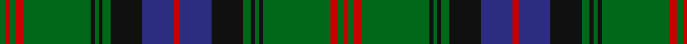

In pattern [GRGRGKGKGKBRBKGKGKGRGR](/patterns/grgrgkgkgkbrbkgkgkgrgr/).

This was sourced from house-of-tartan.  It is a [22 stripes tartan](/stripes/stripes22/).

Original link http://www.house-of-tartan.scotland.net/house/TartanViewjs.asp?colr=Def&tnam=2387

## Thread count
G/6 R4 G6 R8 G68 K4 G4 K4 G8 K32 DB32 R6 DB32 K32 G8 K4 G4 K4 G68 R8 G6 R/4

## Palette
Each colour and its ΔE from the base-6 reference it is a variant of.

| Colour | Shade | Base | ΔE (OKLab) |
|---|---|---|---|
| DB | <code style="background-color:#2C2C80;">#2C2C80</code> `#2C2C80` | B <code style="background-color:#2A418A;">#2A418A</code> | 0.06 |
| G | <code style="background-color:#006818;">#006818</code> `#006818` | G <code style="background-color:#006100;">#006100</code> | 0.02 |
| K | <code style="background-color:#101010;">#101010</code> `#101010` | K <code style="background-color:#000000;">#000000</code> | 0.17 |
| R | <code style="background-color:#C80000;">#C80000</code> `#C80000` | R <code style="background-color:#CC0000;">#CC0000</code> | 0.01 |

## Nearest tartans

The nearest existing variants by ΔTartan distance.

1. [Durie Clan Tartan Tartan Number: 2228. Earliest known date: 1988 When the matriculation of the Durie 'Arms' was updated in June 1988, this tartan was designed for family use by Harry G Lindlay of Kinloch & Anderson of Edinburgh. The design is said to be based on the Argyle & Southern Highlanders regimental tartan - the yellow is from the mess dress (military uniform evening wear) facings (lapels) and the burgundy represents the Durie family's French connections. Andrew, son of Lt. Col. Raymond Varley Dewar Durie succeded his father as clan chieftain in 1999. See products available Copyright © Blair Urquhart, Comrie, 2015](/setts/s16/g2y1g12r4b1r1b1r1b12r1b1r1b1r4g12y1x4~b202060-g006818-r880000-ye8c000/) — ΔT 1.03
1. [Buchan](/setts/s23/r6g6r2k24r2b2k2r2k24r2g6r6b2k6r2g27r2k2r2g27r2k6b2x2~b2c2c80-g006818-k101010-ra00000/) — ΔT 1.10
1. [Scottish Tourist Board (1981)](/setts/s20/b30k2b2k2b2k32g15r2g4r4g30r4g4r2g15k32b2k2b2k2x2~b2c2c80-g006818-k101010-rc80000/) — ΔT 1.21
1. [Buchan Cumming MacIntyre District Tartan Tartan Number: 1991. Earliest known date: 1790 Also MacIntyre and Glenorchy. Adopted by the Buchan family around 1965, on account of their long association with the Cummings which began with the marriage of Margaret, daughter of King Edgar, to William Coymen, sheriff of Forfar in 1210. The name, Buchan, though a family name, is territorial in origin. The sett is asymmetrical. There is a sample in the collection of the Highland Society of London, housed in the National Museums of Scotland, Edinburgh. See products available Copyright © Blair Urquhart, Comrie, 2015](/setts/s23/r6g6r2k24r2b2k2r2k24r2g6r6b2k6r2g27r2k2r2g27r2k6b2x2~b2c2c80-g006818-k101010-rc80000/) — ΔT 1.23
1. [Park](/setts/s12/g3r2g3r4g34k2g2k2g4k16b16r3x2~b2c2c80-g006818-k101010-rc80000/) — ΔT 1.24
1. [Blairlogie or Blair Athol District Tartan Tartan Number: 443. Earliest known date: 1882 Discovered by a STS member in 1967 in the records of D C Dalgleish (Weavers) of Selkirk. Three counts are given in varying widths. See products available Copyright © Blair Urquhart, Comrie, 2015](/setts/s17/k20r3b10g3b5g25k1g1w3g1k1g25b5g3b10r1b2x2~b2c2c80-g006818-k101010-rc80000-we0e0e0/) — ΔT 1.25
1. [Sarafilovic](/setts/s16/b15k18g3k2g2k2g44y4g44k2g2k2g3k18b15r4x2~b2c2c80-g006818-k101010-rc80000-ye8c000/) — ΔT 1.28
1. [Cochrane](/setts/s15/g34r4g3r2g4r2g3r4g17k17r2b17r4b4y3x2~b202060-g006818-k101010-rc80000-yd8b000/) — ΔT 1.31
1. [Blairgowrie](/setts/s17/k20g3b10ga3b5ga25k1ga1w3ga1k1ga25b5ga3b10g1b2x4~b2c2c80-g808080-ga006818-k101010-wffffff/) — ΔT 1.32
1. [Cochrane (1984) Clan Tartan Tartan Number: 978. Earliest known date: 1984 Lord Dundonald originally registered a version missing a red and a green stripe in 1974. There is a story that a fragment of this design was discovered in the foundations of a Perthshire house in 1934. Around that time, a count was recorded from the sample books of Messrs William Anderson. The red and green have been restored in this version, which is now the 'approved' tartan, and appears in the 'Appendix' of the Lyon Court Books dated 12th November 1984. See products available Copyright © Blair Urquhart, Comrie, 2015](/setts/s15/g34r4g4r2g4r2g3r4g17k17r2b17r4b4y3x2~b2c2c80-g006818-k101010-rc80000-ye8c000/) — ΔT 1.32

## Neighbour map

Every grey dot is one of 15726 variants placed by the first two principal components of the ΔTartan feature space (44% of its variance). Red is this tartan; blue dots are its nearest — click one to open its page.

<svg viewBox="0 0 640 380" role="img" style="max-width:100%;height:auto;border:1px solid #e0e0e0;border-radius:4px;display:block" xmlns="http://www.w3.org/2000/svg"><image href="/nn/cloud.v1.png" width="640" height="380"/><a href="/setts/s16/g2y1g12r4b1r1b1r1b12r1b1r1b1r4g12y1x4~b202060-g006818-r880000-ye8c000/"><circle cx="273.2" cy="148.4" r="4" fill="#3465a4"><title>Durie Clan Tartan Tartan Number: 2228. Earliest known date: 1988 When the matriculation of the Durie 'Arms' was updated in June 1988, this tartan was designed for family use by Harry G Lindlay of Kinloch &amp; Anderson of Edinburgh. The design is said to be based on the Argyle &amp; Southern Highlanders regimental tartan - the yellow is from the mess dress (military uniform evening wear) facings (lapels) and the burgundy represents the Durie family's French connections. Andrew, son of Lt. Col. Raymond Varley Dewar Durie succeded his father as clan chieftain in 1999. See products available Copyright © Blair Urquhart, Comrie, 2015</title></circle></a><a href="/setts/s23/r6g6r2k24r2b2k2r2k24r2g6r6b2k6r2g27r2k2r2g27r2k6b2x2~b2c2c80-g006818-k101010-ra00000/"><circle cx="251.7" cy="130.1" r="4" fill="#3465a4"><title>Buchan</title></circle></a><a href="/setts/s20/b30k2b2k2b2k32g15r2g4r4g30r4g4r2g15k32b2k2b2k2x2~b2c2c80-g006818-k101010-rc80000/"><circle cx="240.4" cy="131.9" r="4" fill="#3465a4"><title>Scottish Tourist Board (1981)</title></circle></a><a href="/setts/s23/r6g6r2k24r2b2k2r2k24r2g6r6b2k6r2g27r2k2r2g27r2k6b2x2~b2c2c80-g006818-k101010-rc80000/"><circle cx="239.8" cy="123.9" r="4" fill="#3465a4"><title>Buchan Cumming MacIntyre District Tartan Tartan Number: 1991. Earliest known date: 1790 Also MacIntyre and Glenorchy. Adopted by the Buchan family around 1965, on account of their long association with the Cummings which began with the marriage of Margaret, daughter of King Edgar, to William Coymen, sheriff of Forfar in 1210. The name, Buchan, though a family name, is territorial in origin. The sett is asymmetrical. There is a sample in the collection of the Highland Society of London, housed in the National Museums of Scotland, Edinburgh. See products available Copyright © Blair Urquhart, Comrie, 2015</title></circle></a><a href="/setts/s12/g3r2g3r4g34k2g2k2g4k16b16r3x2~b2c2c80-g006818-k101010-rc80000/"><circle cx="302.5" cy="148.7" r="4" fill="#3465a4"><title>Park</title></circle></a><a href="/setts/s17/k20r3b10g3b5g25k1g1w3g1k1g25b5g3b10r1b2x2~b2c2c80-g006818-k101010-rc80000-we0e0e0/"><circle cx="276.0" cy="108.4" r="4" fill="#3465a4"><title>Blairlogie or Blair Athol District Tartan Tartan Number: 443. Earliest known date: 1882 Discovered by a STS member in 1967 in the records of D C Dalgleish (Weavers) of Selkirk. Three counts are given in varying widths. See products available Copyright © Blair Urquhart, Comrie, 2015</title></circle></a><a href="/setts/s16/b15k18g3k2g2k2g44y4g44k2g2k2g3k18b15r4x2~b2c2c80-g006818-k101010-rc80000-ye8c000/"><circle cx="313.4" cy="116.4" r="4" fill="#3465a4"><title>Sarafilovic</title></circle></a><a href="/setts/s15/g34r4g3r2g4r2g3r4g17k17r2b17r4b4y3x2~b202060-g006818-k101010-rc80000-yd8b000/"><circle cx="263.4" cy="124.7" r="4" fill="#3465a4"><title>Cochrane</title></circle></a><a href="/setts/s17/k20g3b10ga3b5ga25k1ga1w3ga1k1ga25b5ga3b10g1b2x4~b2c2c80-g808080-ga006818-k101010-wffffff/"><circle cx="272.7" cy="108.2" r="4" fill="#3465a4"><title>Blairgowrie</title></circle></a><a href="/setts/s15/g34r4g4r2g4r2g3r4g17k17r2b17r4b4y3x2~b2c2c80-g006818-k101010-rc80000-ye8c000/"><circle cx="263.1" cy="124.7" r="4" fill="#3465a4"><title>Cochrane (1984) Clan Tartan Tartan Number: 978. Earliest known date: 1984 Lord Dundonald originally registered a version missing a red and a green stripe in 1974. There is a story that a fragment of this design was discovered in the foundations of a Perthshire house in 1934. Around that time, a count was recorded from the sample books of Messrs William Anderson. The red and green have been restored in this version, which is now the 'approved' tartan, and appears in the 'Appendix' of the Lyon Court Books dated 12th November 1984. See products available Copyright © Blair Urquhart, Comrie, 2015</title></circle></a><circle cx="291.0" cy="125.3" r="5" fill="#c00000"/></svg>

ID: /setts/s22/g3r2g3r4g34k2g2k2g4k16b16r3b16k16g4k2g2k2g34r4g3r2x2~b2c2c80-g006818-k101010-rc80000/
