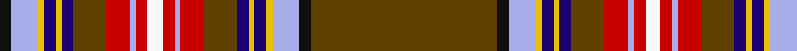

In pattern [GKWYBYBGRWRWRWRGBYBYWK](/patterns/gkwybybgrwrwrwrgbybywk/).

This was sourced from register-of-tartans.  It is a [22 stripes tartan](/stripes/stripes22/).

Original link https://www.tartanregister.gov.uk/tartanDetails.aspx?ref=3764

## Thread count
K/8 LP18 Y4 DB8 Y4 DB8 Ta22 R16 LP4 R8 Wa10 R8 LP4 R16 Ta22 DB8 Y4 DB8 Y4 LP18 K8 Ta/126

## Palette
Each colour and its ΔE from the base-6 reference it is a variant of.

| Colour | Shade | Base | ΔE (OKLab) |
|---|---|---|---|
| DB | <code style="background-color:#1C0070;">#1C0070</code> `#1C0070` | B <code style="background-color:#2A418A;">#2A418A</code> | 0.14 |
| DR | <code style="background-color:#880000;">#880000</code> `#880000` | R <code style="background-color:#CC0000;">#CC0000</code> | 0.15 |
| DY | <code style="background-color:#D09800;">#D09800</code> `#D09800` | Y <code style="background-color:#F2BF00;">#F2BF00</code> | 0.12 |
| K | <code style="background-color:#101010;">#101010</code> `#101010` | K <code style="background-color:#000000;">#000000</code> | 0.17 |
| LP | <code style="background-color:#A8ACE8;">#A8ACE8</code> `#A8ACE8` | W <code style="background-color:#F7F7F7;">#F7F7F7</code> | 0.23 |
| R | <code style="background-color:#C80000;">#C80000</code> `#C80000` | R <code style="background-color:#CC0000;">#CC0000</code> | 0.01 |
| T | <code style="background-color:#4C3428;">#4C3428</code> `#4C3428` | B <code style="background-color:#2A418A;">#2A418A</code> | 0.17 |
| Ta | <code style="background-color:#604000;">#604000</code> `#604000` | G <code style="background-color:#006100;">#006100</code> | 0.14 |
| W | <code style="background-color:#FCFCFC;">#FCFCFC</code> `#FCFCFC` | W <code style="background-color:#F7F7F7;">#F7F7F7</code> | 0.01 |
| Wa | <code style="background-color:#F8F8F8;">#F8F8F8</code> `#F8F8F8` | W <code style="background-color:#F7F7F7;">#F7F7F7</code> | 0.00 |
| Y | <code style="background-color:#E8C000;">#E8C000</code> `#E8C000` | Y <code style="background-color:#F2BF00;">#F2BF00</code> | 0.02 |

## Nearest tartans

The nearest existing variants by ΔTartan distance.

1. [MacRae, of Ardentoul](/setts/s18/r11b3ba18y1ba2w1k1g18r3k1r2k3r2k1r40k1r2k3~b5480b0-ba304080-g008000-k000000-rc00000-we0e0e0-yf0c000~x2/) — ΔT 1.06
1. [MacBean](/setts/s19/r24w1b2ba1w1ba1b2w1k1g6k1w1r2ra2g1ra2r2w1g3~b304080-ba5480b0-g008000-k000000-rc00000-ra900030-we0e0e0~x2/) — ΔT 1.16
1. [MacBean](/setts/s19/r24y1b2ba1y1ba1b2y1k1g6k1y1r2bb2g1bb2r2y1g3~b000052-ba4367ae-bb59110d-g11450d-k000000-raa0000-yaaaaaa~x2/) — ΔT 1.18
1. [McBain](/setts/s19/r60w2wa5k2w2k2wa5w2k2g12k2w2r5ra5g2ra5r5g10w2~g006818-k101010-r880000-racc4438-wfcfcfc-waa8ace8~x2/) — ΔT 1.22
1. [MacBean (Lord Lyon version)](/setts/s19/r60w2wa5k2w2k2wa5w2k2g12k2w2r5ra5g2ra5r5w2g10~g006818-k101010-r880000-racc4438-wfcfcfc-waa8ace8~x2/) — ΔT 1.22
1. [Fitzgerald Dress](/setts/s25/w2k1r3b3r3ra3r19ra3r3b3r3b29y3g29r3b3r3ra3r19ra3r3b3r3k1w2~b000088-g007800-k000000-rc40000-ra9c0030-we0e0e0-y9c9c00~x4/) — ΔT 1.23
1. [MacRae of Ardentoul Artifact Tartan Tartan Number: 1178. Earliest known date: 1830 Jacket of Col Sir John MacRae of Ardentoul c1820 See products available Copyright © Blair Urquhart, Comrie, 2015](/setts/s18/r11b3ba18y1ba2w1k1g18r3k1r2k3r2k1r40k1r2k3~b5c8ca8-ba2c2c80-g006818-k101010-rc80000-we0e0e0-ye8c000~x2/) — ΔT 1.24
1. [Chattan](/setts/s19/r36k2w1g18w1ra2y2r3k1r3y2ra2w1b18k5r4y5ra2w2~b5480b0-g008000-k000000-rc00000-ra906030-we0e0e0-yf0c000~x2/) — ΔT 1.27
1. [Chattan Clan Tartan Tartan Number: 1620. Earliest known date: pre 2003 This sett includes a brown stripe next to the yellow which does not appear in the records of Lord Lyon. The sett is similar in other respects. See products available Copyright © Blair Urquhart, Comrie, 2015](/setts/s19/r36k2w1g18w1ga2y2r3k1r3y2ga2w1b18k5r4y5ga2w2~b5c8ca8-g006818-ga604000-k101010-rc80000-we0e0e0-ye8c000~x2/) — ΔT 1.30
1. [Chattan (brown stripe variation)](/setts/s19/r36k2w1g18w1ra2y2r3k1r3y2ra2w1b18k5r4y5ra2w2~b3c82af-g005020-k101010-rdc0000-rabe7832-we0e0e0-ye8c000~x2/) — ΔT 1.35

## Neighbour map

Every grey dot is one of 15726 variants placed by the first two principal components of the ΔTartan feature space (44% of its variance). Red is this tartan; blue dots are its nearest — click one to open its page.

<svg viewBox="0 0 640 380" role="img" style="max-width:100%;height:auto;border:1px solid #e0e0e0;border-radius:4px;display:block" xmlns="http://www.w3.org/2000/svg"><image href="/nn/cloud.v1.png" width="640" height="380"/><a href="/setts/s18/r11b3ba18y1ba2w1k1g18r3k1r2k3r2k1r40k1r2k3~b5480b0-ba304080-g008000-k000000-rc00000-we0e0e0-yf0c000~x2/"><circle cx="286.5" cy="14.0" r="4" fill="#3465a4"><title>MacRae, of Ardentoul</title></circle></a><a href="/setts/s19/r24w1b2ba1w1ba1b2w1k1g6k1w1r2ra2g1ra2r2w1g3~b304080-ba5480b0-g008000-k000000-rc00000-ra900030-we0e0e0~x2/"><circle cx="255.6" cy="14.0" r="4" fill="#3465a4"><title>MacBean</title></circle></a><a href="/setts/s19/r24y1b2ba1y1ba1b2y1k1g6k1y1r2bb2g1bb2r2y1g3~b000052-ba4367ae-bb59110d-g11450d-k000000-raa0000-yaaaaaa~x2/"><circle cx="270.9" cy="24.5" r="4" fill="#3465a4"><title>MacBean</title></circle></a><a href="/setts/s19/r60w2wa5k2w2k2wa5w2k2g12k2w2r5ra5g2ra5r5g10w2~g006818-k101010-r880000-racc4438-wfcfcfc-waa8ace8~x2/"><circle cx="295.0" cy="22.0" r="4" fill="#3465a4"><title>McBain</title></circle></a><a href="/setts/s19/r60w2wa5k2w2k2wa5w2k2g12k2w2r5ra5g2ra5r5w2g10~g006818-k101010-r880000-racc4438-wfcfcfc-waa8ace8~x2/"><circle cx="295.0" cy="22.0" r="4" fill="#3465a4"><title>MacBean (Lord Lyon version)</title></circle></a><a href="/setts/s25/w2k1r3b3r3ra3r19ra3r3b3r3b29y3g29r3b3r3ra3r19ra3r3b3r3k1w2~b000088-g007800-k000000-rc40000-ra9c0030-we0e0e0-y9c9c00~x4/"><circle cx="183.4" cy="17.2" r="4" fill="#3465a4"><title>Fitzgerald Dress</title></circle></a><a href="/setts/s18/r11b3ba18y1ba2w1k1g18r3k1r2k3r2k1r40k1r2k3~b5c8ca8-ba2c2c80-g006818-k101010-rc80000-we0e0e0-ye8c000~x2/"><circle cx="299.9" cy="14.9" r="4" fill="#3465a4"><title>MacRae of Ardentoul Artifact Tartan Tartan Number: 1178. Earliest known date: 1830 Jacket of Col Sir John MacRae of Ardentoul c1820 See products available Copyright © Blair Urquhart, Comrie, 2015</title></circle></a><a href="/setts/s19/r36k2w1g18w1ra2y2r3k1r3y2ra2w1b18k5r4y5ra2w2~b5480b0-g008000-k000000-rc00000-ra906030-we0e0e0-yf0c000~x2/"><circle cx="192.0" cy="14.0" r="4" fill="#3465a4"><title>Chattan</title></circle></a><a href="/setts/s19/r36k2w1g18w1ga2y2r3k1r3y2ga2w1b18k5r4y5ga2w2~b5c8ca8-g006818-ga604000-k101010-rc80000-we0e0e0-ye8c000~x2/"><circle cx="203.5" cy="14.0" r="4" fill="#3465a4"><title>Chattan Clan Tartan Tartan Number: 1620. Earliest known date: pre 2003 This sett includes a brown stripe next to the yellow which does not appear in the records of Lord Lyon. The sett is similar in other respects. See products available Copyright © Blair Urquhart, Comrie, 2015</title></circle></a><a href="/setts/s19/r36k2w1g18w1ra2y2r3k1r3y2ra2w1b18k5r4y5ra2w2~b3c82af-g005020-k101010-rdc0000-rabe7832-we0e0e0-ye8c000~x2/"><circle cx="199.4" cy="14.0" r="4" fill="#3465a4"><title>Chattan (brown stripe variation)</title></circle></a><circle cx="247.5" cy="14.0" r="5" fill="#c00000"/></svg>

ID: /setts/s22/g63k4w9y2b4y2b4g11r8w2r4wa5r4w2r8g11b4y2b4y2w9k4~b1c0070-g604000-k101010-rc80000-wa8ace8-waf8f8f8-ye8c000~x2/
