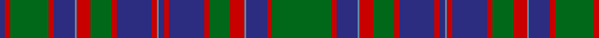

In pattern [BRGRBBRGRBRBBRBRGRBBRG](/patterns/brgrbbrgrbrbbrbrgrbbrg/).

This was sourced from house-of-tartan.  It is a [22 stripes tartan](/stripes/stripes22/).

Original link http://www.house-of-tartan.scotland.net/house/TartanViewjs.asp?colr=Def&tnam=507

## Thread count
DB/6 R6 G44 R6 DB24 B2 R16 G24 R6 DB40 R6 B2 DB6 R6 DB40 R6 G24 R16 B2 DB24 R6 G/68

## Palette
Each colour and its ΔE from the base-6 reference it is a variant of.

| Colour | Shade | Base | ΔE (OKLab) |
|---|---|---|---|
| B | <code style="background-color:#5C8CA8;">#5C8CA8</code> `#5C8CA8` | B <code style="background-color:#2C4084;">#2C4084</code> | 0.23 |
| DB | <code style="background-color:#2C2C80;">#2C2C80</code> `#2C2C80` | B <code style="background-color:#2C4084;">#2C4084</code> | 0.05 |
| G | <code style="background-color:#006818;">#006818</code> `#006818` | G <code style="background-color:#006400;">#006400</code> | 0.02 |
| R | <code style="background-color:#C80000;">#C80000</code> `#C80000` | R <code style="background-color:#C80000;">#C80000</code> | 0.00 |

ID: /setts/s22/g68r6b24ba2r16g24r6b40r6b6ba2r6b40r6g24r16ba2b24r6g44r6b6-b2c2c80-ba5c8ca8-g006818-rc80000/
