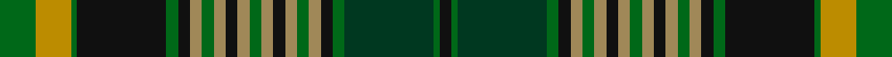

In pattern [GYGKGKYGYKYGYKYGYKGGGK](/stripes/gygkgkygykygykygykgggk/).

This was sourced from tartans-authority.  It is a [22 stripe tartan](/stripes/stripes22/).

Original link http://www.tartansauthority.com/tartan-ferret/display/10482/

## Thread count
G/12 DY12 G2 K30 G4 K4 LT4 G4 LT4 K4 LT4 G4 LT4 K4 LT4 G4 LT4 K4 G4 DG30 G2 K/4

## Palette
Each colour and its ΔE from the base-6 reference it is a variant of.

| Colour | Shade | Base | ΔE (OKLab) |
|---|---|---|---|
| DG | <code style="background-color:#003820;">#003820</code> `#003820` | G <code style="background-color:#006100;">#006100</code> | 0.15 |
| DY | <code style="background-color:#BC8C00;">#BC8C00</code> `#BC8C00` | Y <code style="background-color:#F2BF00;">#F2BF00</code> | 0.16 |
| G | <code style="background-color:#006818;">#006818</code> `#006818` | G <code style="background-color:#006100;">#006100</code> | 0.02 |
| K | <code style="background-color:#101010;">#101010</code> `#101010` | K <code style="background-color:#000000;">#000000</code> | 0.17 |
| LT | <code style="background-color:#A08858;">#A08858</code> `#A08858` | Y <code style="background-color:#F2BF00;">#F2BF00</code> | 0.21 |

## Nearest tartans

The nearest existing variants by ΔTartan distance.

1. [International College of Dentists (Canadian Section)](/setts/s22/dg6lo6dg1k15dg2k2y2dg2y2k2y2dg2y2k2y2dg2y2k2dg2dg15dg1k2~x2/) — ΔT 0.42
1. [Ranking Corporate Tartan Tartan Number: 3242. Earliest known date: 2002 Personal/Family tartan for the Ranking family and its close relatives as determined by the current head of the family. A minor variation of Rankine tartan. See products available Copyright © Blair Urquhart, Comrie, 2015](/setts/s20/dt36k5r2k5g15r2g10w2g10r2g15k5r2k5dt10r2dt2r2dt4w2~x2/) — ΔT 1.21
1. [Barkway (Name)](/setts/s18/g3g2g2g16g2g2g2g2g4n4k2n2k2n2k24r2k2w3~x2/) — ΔT 1.29
1. [Watson](/setts/s18/db24k2db2r2db2k20g16ly2g2ly3~x2/) — ΔT 1.31
1. [Rankine](/setts/s23/db15k1db1k1db1k12g9r1g9k1w1k1g9r1g9k12r1db9r2db1r1db6w1~x2/) — ΔT 1.36
1. [Farquharson](/setts/s16/r4k2db16k16g16ly4g16k16db1k1db1k1db1k1db8r2~x2/) — ΔT 1.37
1. [O'Doherty (Name)](/setts/s13/w2dt10dg3dt2dg3k18dg10ly1dg3ly2dg2k2ly2~x2/) — ΔT 1.42
1. [Murtaugh Hunting Tartan Tartan Number: 5818. Earliest known date: 2003 After original Murtaugh by Don Smith, Heraldic Graphics See products available Copyright © Blair Urquhart, Comrie, 2015](/setts/s21/r4k4n4ly2n2w2n2ly2n2w2k4g3k2g24w2k2n3k3w2r4k2~x2/) — ΔT 1.43
1. [Cameron](/setts/s21/ly2db8r3db16r1k16g16r3g1r1g8r1g1r3g16k16r1db16r3db8ly1~x4/) — ΔT 1.43
1. [Rankin (Dalgleish) #2](/setts/s23/db12k2db3k2db3k16g8r2g8k1k1w2g8r2g8k16r2db8r3db2r2db3w2~x2/) — ΔT 1.44

## Neighbour map

Every grey dot is one of 14299 variants placed by the first two principal components of the ΔTartan feature space (44% of its variance). Red is this tartan; blue dots are its nearest — click one to open its page.

<svg viewBox="0 0 640 380" role="img" style="max-width:100%;height:auto;border:1px solid #e0e0e0;border-radius:4px;display:block" xmlns="http://www.w3.org/2000/svg"><image href="/nn/cloud.v1.png" width="640" height="380"/><a href="/setts/s22/dg6lo6dg1k15dg2k2y2dg2y2k2y2dg2y2k2y2dg2y2k2dg2dg15dg1k2~x2/"><circle cx="167.3" cy="119.8" r="4" fill="#3465a4"><title>International College of Dentists (Canadian Section)</title></circle></a><a href="/setts/s20/dt36k5r2k5g15r2g10w2g10r2g15k5r2k5dt10r2dt2r2dt4w2~x2/"><circle cx="219.1" cy="120.4" r="4" fill="#3465a4"><title>Ranking Corporate Tartan Tartan Number: 3242. Earliest known date: 2002 Personal/Family tartan for the Ranking family and its close relatives as determined by the current head of the family. A minor variation of Rankine tartan. See products available Copyright © Blair Urquhart, Comrie, 2015</title></circle></a><a href="/setts/s18/g3g2g2g16g2g2g2g2g4n4k2n2k2n2k24r2k2w3~x2/"><circle cx="173.1" cy="103.8" r="4" fill="#3465a4"><title>Barkway (Name)</title></circle></a><a href="/setts/s18/db24k2db2r2db2k20g16ly2g2ly3~x2/"><circle cx="178.2" cy="128.8" r="4" fill="#3465a4"><title>Watson</title></circle></a><a href="/setts/s23/db15k1db1k1db1k12g9r1g9k1w1k1g9r1g9k12r1db9r2db1r1db6w1~x2/"><circle cx="180.6" cy="125.1" r="4" fill="#3465a4"><title>Rankine</title></circle></a><a href="/setts/s16/r4k2db16k16g16ly4g16k16db1k1db1k1db1k1db8r2~x2/"><circle cx="182.0" cy="135.8" r="4" fill="#3465a4"><title>Farquharson</title></circle></a><a href="/setts/s13/w2dt10dg3dt2dg3k18dg10ly1dg3ly2dg2k2ly2~x2/"><circle cx="177.1" cy="129.5" r="4" fill="#3465a4"><title>O'Doherty (Name)</title></circle></a><a href="/setts/s21/r4k4n4ly2n2w2n2ly2n2w2k4g3k2g24w2k2n3k3w2r4k2~x2/"><circle cx="121.6" cy="83.5" r="4" fill="#3465a4"><title>Murtaugh Hunting Tartan Tartan Number: 5818. Earliest known date: 2003 After original Murtaugh by Don Smith, Heraldic Graphics See products available Copyright © Blair Urquhart, Comrie, 2015</title></circle></a><a href="/setts/s21/ly2db8r3db16r1k16g16r3g1r1g8r1g1r3g16k16r1db16r3db8ly1~x4/"><circle cx="168.8" cy="127.0" r="4" fill="#3465a4"><title>Cameron</title></circle></a><a href="/setts/s23/db12k2db3k2db3k16g8r2g8k1k1w2g8r2g8k16r2db8r3db2r2db3w2~x2/"><circle cx="153.7" cy="126.8" r="4" fill="#3465a4"><title>Rankin (Dalgleish) #2</title></circle></a><circle cx="157.5" cy="115.7" r="5" fill="#c00000"/></svg>

ID: /setts/s22/g6lo6g1k15g2k2lo2g2lo2k2lo2g2lo2k2lo2g2lo2k2g2dg15g1k2~x2/
