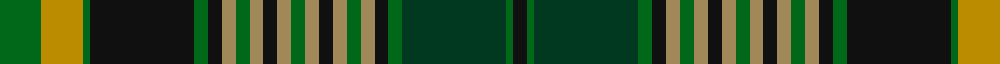

In pattern [GYGKGKYGYKYGYKYGYKGGGK](/patterns/gygkgkygykygykygykgggk/).

This was sourced from tartans-authority.  It is a [22 stripes tartan](/stripes/stripes22/).

Original link http://www.tartansauthority.com/tartan-ferret/display/10482/

## Thread count
G/12 DY12 G2 K30 G4 K4 LT4 G4 LT4 K4 LT4 G4 LT4 K4 LT4 G4 LT4 K4 G4 DG30 G2 K/4

## Palette
Each colour and its ΔE from the base-6 reference it is a variant of.

| Colour | Shade | Base | ΔE (OKLab) |
|---|---|---|---|
| DG | <code style="background-color:#003820;">#003820</code> `#003820` | G <code style="background-color:#006100;">#006100</code> | 0.15 |
| DY | <code style="background-color:#BC8C00;">#BC8C00</code> `#BC8C00` | Y <code style="background-color:#F2BF00;">#F2BF00</code> | 0.16 |
| G | <code style="background-color:#006818;">#006818</code> `#006818` | G <code style="background-color:#006100;">#006100</code> | 0.02 |
| K | <code style="background-color:#101010;">#101010</code> `#101010` | K <code style="background-color:#000000;">#000000</code> | 0.17 |
| LT | <code style="background-color:#A08858;">#A08858</code> `#A08858` | Y <code style="background-color:#F2BF00;">#F2BF00</code> | 0.21 |

## Nearest tartans

The nearest existing variants by ΔTartan distance.

1. [International College of Dentists (Canadian Section)](/setts/s22/g6y6g1k15g2k2ga2g2ga2k2ga2g2ga2k2ga2g2ga2k2g2gb15g1k2x2~g2d5c33-ga826b3a-gb043300-k101010-ye99e01/) — ΔT 0.42
1. [Ranking Corporate Tartan Tartan Number: 3242. Earliest known date: 2002 Personal/Family tartan for the Ranking family and its close relatives as determined by the current head of the family. A minor variation of Rankine tartan. See products available Copyright © Blair Urquhart, Comrie, 2015](/setts/s20/b36k5r2k5g15r2g10w2g10r2g15k5r2k5b10r2b2r2b4w2x2~b003c64-g006818-k101010-rc80000-we0e0e0/) — ΔT 1.21
1. [Barkway (Name)](/setts/s18/g3ga2g2ga16g2ga2g2ga2g4b4k2b2k2b2k24r2k2w3x2~b5c5c5c-g408060-ga006818-k101010-rc8002c-we0e0e0/) — ΔT 1.29
1. [Watson](/setts/s18/b24k2b2r2b2k20g16y2g2y3g2y2g16k20b2r2b2k2x2~b2c2c80-g006818-k101010-rc80000-ye8c000/) — ΔT 1.31
1. [Rankine](/setts/s23/b15k1b1k1b1k12g9r1g9k1w1k1g9r1g9k12r1b9r2b1r1b6w1x2~b2c2c80-g006818-k101010-rc80000-we0e0e0/) — ΔT 1.36
1. [O'Doherty (Name)](/setts/s13/w2b10g3b2g3k18g10y1g3y2g2k2y2x2~b003c64-g285800-k101010-we0e0e0-yfccc00/) — ΔT 1.42
1. [Murtaugh Hunting Tartan Tartan Number: 5818. Earliest known date: 2003 After original Murtaugh by Don Smith, Heraldic Graphics See products available Copyright © Blair Urquhart, Comrie, 2015](/setts/s21/r4k4b4y2b2w2b2y2b2w2k4g3k2g24w2k2b3k3w2r4k2x2~b5c5c5c-g006818-k101010-r800000-we0e0e0-ye8c000/) — ΔT 1.43
1. [Rankin (Dalgleish) #2](/setts/s23/b12k2b3k2b3k16g8r2g8k1k1w2g8r2g8k16r2b8r3b2r2b3w2x2~b2c2c80-g006818-k101010-r880000-wf8f8f8/) — ΔT 1.44
1. [Hunnisett/Edinchip (Personal)](/setts/s20/b38w2b2k10g2y2g22k3r3k3r3k3r3k3g22y2g2k10b2w2x2~b202060-g006818-k101010-rc80000-we0e0e0-ye8c000/) — ΔT 1.48
1. [Ogilvie of Inverarity (Wilson) / Ochterlonie](/setts/s16/b20y3k7g11k2g3k2g3r4g3k2g3k2g11k7y3x2~b2c2c80-g006818-k101010-rc80000-yd8b000/) — ΔT 1.48

## Neighbour map

Every grey dot is one of 15726 variants placed by the first two principal components of the ΔTartan feature space (44% of its variance). Red is this tartan; blue dots are its nearest — click one to open its page.

<svg viewBox="0 0 640 380" role="img" style="max-width:100%;height:auto;border:1px solid #e0e0e0;border-radius:4px;display:block" xmlns="http://www.w3.org/2000/svg"><image href="/nn/cloud.v1.png" width="640" height="380"/><a href="/setts/s22/g6y6g1k15g2k2ga2g2ga2k2ga2g2ga2k2ga2g2ga2k2g2gb15g1k2x2~g2d5c33-ga826b3a-gb043300-k101010-ye99e01/"><circle cx="164.2" cy="112.4" r="4" fill="#3465a4"><title>International College of Dentists (Canadian Section)</title></circle></a><a href="/setts/s20/b36k5r2k5g15r2g10w2g10r2g15k5r2k5b10r2b2r2b4w2x2~b003c64-g006818-k101010-rc80000-we0e0e0/"><circle cx="215.8" cy="113.3" r="4" fill="#3465a4"><title>Ranking Corporate Tartan Tartan Number: 3242. Earliest known date: 2002 Personal/Family tartan for the Ranking family and its close relatives as determined by the current head of the family. A minor variation of Rankine tartan. See products available Copyright © Blair Urquhart, Comrie, 2015</title></circle></a><a href="/setts/s18/g3ga2g2ga16g2ga2g2ga2g4b4k2b2k2b2k24r2k2w3x2~b5c5c5c-g408060-ga006818-k101010-rc8002c-we0e0e0/"><circle cx="169.6" cy="98.0" r="4" fill="#3465a4"><title>Barkway (Name)</title></circle></a><a href="/setts/s18/b24k2b2r2b2k20g16y2g2y3g2y2g16k20b2r2b2k2x2~b2c2c80-g006818-k101010-rc80000-ye8c000/"><circle cx="174.6" cy="124.0" r="4" fill="#3465a4"><title>Watson</title></circle></a><a href="/setts/s23/b15k1b1k1b1k12g9r1g9k1w1k1g9r1g9k12r1b9r2b1r1b6w1x2~b2c2c80-g006818-k101010-rc80000-we0e0e0/"><circle cx="177.0" cy="118.6" r="4" fill="#3465a4"><title>Rankine</title></circle></a><a href="/setts/s13/w2b10g3b2g3k18g10y1g3y2g2k2y2x2~b003c64-g285800-k101010-we0e0e0-yfccc00/"><circle cx="173.6" cy="126.1" r="4" fill="#3465a4"><title>O'Doherty (Name)</title></circle></a><a href="/setts/s21/r4k4b4y2b2w2b2y2b2w2k4g3k2g24w2k2b3k3w2r4k2x2~b5c5c5c-g006818-k101010-r800000-we0e0e0-ye8c000/"><circle cx="118.3" cy="79.6" r="4" fill="#3465a4"><title>Murtaugh Hunting Tartan Tartan Number: 5818. Earliest known date: 2003 After original Murtaugh by Don Smith, Heraldic Graphics See products available Copyright © Blair Urquhart, Comrie, 2015</title></circle></a><a href="/setts/s23/b12k2b3k2b3k16g8r2g8k1k1w2g8r2g8k16r2b8r3b2r2b3w2x2~b2c2c80-g006818-k101010-r880000-wf8f8f8/"><circle cx="150.2" cy="120.9" r="4" fill="#3465a4"><title>Rankin (Dalgleish) #2</title></circle></a><a href="/setts/s20/b38w2b2k10g2y2g22k3r3k3r3k3r3k3g22y2g2k10b2w2x2~b202060-g006818-k101010-rc80000-we0e0e0-ye8c000/"><circle cx="171.3" cy="74.2" r="4" fill="#3465a4"><title>Hunnisett/Edinchip (Personal)</title></circle></a><a href="/setts/s16/b20y3k7g11k2g3k2g3r4g3k2g3k2g11k7y3x2~b2c2c80-g006818-k101010-rc80000-yd8b000/"><circle cx="163.0" cy="152.6" r="4" fill="#3465a4"><title>Ogilvie of Inverarity (Wilson) / Ochterlonie</title></circle></a><circle cx="154.2" cy="109.1" r="5" fill="#c00000"/></svg>

ID: /setts/s22/g6y6g1k15g2k2ya2g2ya2k2ya2g2ya2k2ya2g2ya2k2g2ga15g1k2x2~g006818-ga003820-k101010-ybc8c00-yaa08858/
