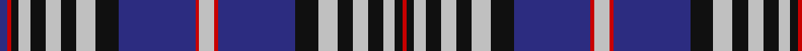

This page is one **sett** — a single exact thread-count. It belongs to the [tartan](/tartans/n4r1dba20k6n5k4n4k4n3k2r1dba2/)
(the same proportion at any scale), whose colour order is pattern [BRKWKWKWKBRWRBKWKWKWKR](/stripes/brkwkwkwkbrwrbkwkwkwkr/).

Sourced from register-of-tartans.  It is a [22 stripe tartan](/stripes/stripes22/).

Original link https://www.tartanregister.gov.uk/tartanDetails.aspx?ref=3728

## Register references

External register numbers recorded for this tartan.

- Scottish Register of Tartans: [3728](https://www.tartanregister.gov.uk/tartanDetails.aspx?ref=3728)
- Scottish Tartans Authority (ITI): 559
- Scottish Tartans World Register: 559

## Thread count
DBa/4 R2 K4 N6 K8 N8 K8 N10 K12 DBa40 R2 N8 R2 DBa40 K12 N10 K8 N8 K8 N6 K4 R/2

## Palette
Each colour and the base-6 reference it is a variant of.

| Colour | Shade | Base |
|---|---|---|
| DB | <code style="background-color:#1C0070;">#1C0070</code> `oklch(26.3% 0.162 277.1)` <small>#1C0070</small> | B <code style="background-color:#2A418A;">#2A418A</code> |
| DBa | <code style="background-color:#2C2C80;">#2C2C80</code> `oklch(35.0% 0.138 276.6)` <small>#2C2C80</small> | B <code style="background-color:#2A418A;">#2A418A</code> |
| DR | <code style="background-color:#880000;">#880000</code> `oklch(39.4% 0.162 29.2)` <small>#880000</small> | R <code style="background-color:#CC0000;">#CC0000</code> |
| K | <code style="background-color:#101010;">#101010</code> `oklch(17.3% 0.000 89.9)` <small>#101010</small> | K <code style="background-color:#000000;">#000000</code> |
| N | <code style="background-color:#C0C0C0;">#C0C0C0</code> `oklch(80.8% 0.000 89.9)` <small>#C0C0C0</small> | W <code style="background-color:#F7F7F7;">#F7F7F7</code> |
| R | <code style="background-color:#C80000;">#C80000</code> `oklch(52.3% 0.215 29.2)` <small>#C80000</small> | R <code style="background-color:#CC0000;">#CC0000</code> |

## Nearest tartans

The nearest existing variants by ΔTartan distance, with this tartan at the top so the swatches line up against it.

ΔTartan

Tartan

Sett

—

<a href="/ttd/edit/#slug=lb4r1db20k6lb5k4lb4k4lb3k2r1db2~x2">Scottish Knights Templar St. Andrews</a> <a class="nn-out" href="/setts/s22/lb4r1db20k6lb5k4lb4k4lb3k2r1db2~x2/" title="open its dictionary page">↗</a>

1.04

<a href="/setts/s24/r2w7dt3w3dt3w3dt3w1dt12db14r1db1r2~x2/">Hogmany Plaid</a>

1.06

<a href="/setts/s16/r3db20k6lb5k4lb3k2r1db2~x2/">Scottish Knights Templar International</a>

1.16

<a href="/ttd/edit/#slug=db4dg10k2db2w14k2dg2k2dg2k2dg2k2dg2k2db25w8dg4k4db3k1db3k1~x2">Alberta, Quebec, Nova Scotia.</a> <a class="nn-out" href="/setts/s22/db4dg10k2db2w14k2dg2k2dg2k2dg2k2dg2k2db25w8dg4k4db3k1db3k1~x2/" title="open its dictionary page">↗</a>

1.20

<a href="/ttd/edit/#slug=r4b5r2b7r10k4lo2k2lo2k4lb4k4b18r1k2r1b4r3~x2">Anderson Blue (Westwood)</a> <a class="nn-out" href="/setts/s18/r4b5r2b7r10k4lo2k2lo2k4lb4k4b18r1k2r1b4r3~x2/" title="open its dictionary page">↗</a>

1.22

<a href="/setts/s18/db2r2k2lb3k4lb5k6db20r2lb4r2db20k6lb5k4lb3k2r2~x2/">Scottish Knights Templar Militi Templi Scotia</a>

1.23

<a href="/ttd/edit/#slug=lb4r1db20k6lb5k4lb4k4lb3k2r1db2~x2">Scottish Knights Templar St. A (Corp</a> <a class="nn-out" href="/setts/s12/lb4r1db20k6lb5k4lb4k4lb3k2r1db2~x2/" title="open its dictionary page">↗</a>

1.32

<a href="/ttd/edit/#slug=lo7db3lo2db2lo2db30k9lb2db2lo2db2lo3db5lo2db2lo2db2k9lo5db3lo4~x2">Blue Matheson Hunting (Kinloch Anderson)</a> <a class="nn-out" href="/setts/s21/lo7db3lo2db2lo2db30k9lb2db2lo2db2lo3db5lo2db2lo2db2k9lo5db3lo4~x2/" title="open its dictionary page">↗</a>

1.33

<a href="/ttd/edit/#slug=db3g1k1db2lb16db2k4g1k1db16lb2db2k1g3~x2">Tiger of Sweden</a> <a class="nn-out" href="/setts/s14/db3g1k1db2lb16db2k4g1k1db16lb2db2k1g3~x2/" title="open its dictionary page">↗</a>

1.33

<a href="/ttd/edit/#slug=r8w4db24db2db4db2db1db2db4db2db1db20w6~x2">Icelandic</a> <a class="nn-out" href="/setts/s13/r8w4db24db2db4db2db1db2db4db2db1db20w6~x2/" title="open its dictionary page">↗</a>

1.34

<a href="/ttd/edit/#slug=r4w13k6w6k6w6k5w1k24dt28r2dt2r4~x2">Hogmany Plaid</a> <a class="nn-out" href="/setts/s13/r4w13k6w6k6w6k5w1k24dt28r2dt2r4~x2/" title="open its dictionary page">↗</a>

## Neighbour map

Every grey dot is one of 14299 variants placed by the first two principal components of the ΔTartan feature space (44% of its variance). Red is this tartan; blue dots are its nearest — click one to open its page.

<svg viewBox="0 0 640 380" role="img" style="max-width:100%;height:auto;border:1px solid #e0e0e0;border-radius:4px;display:block" xmlns="http://www.w3.org/2000/svg"><image href="/nn/cloud.v1.png" width="640" height="380"/><a href="/setts/s24/r2w7dt3w3dt3w3dt3w1dt12db14r1db1r2~x2/"><circle cx="174.2" cy="118.9" r="4" fill="#3465a4"><title>Hogmany Plaid</title></circle></a><a href="/setts/s16/r3db20k6lb5k4lb3k2r1db2~x2/"><circle cx="258.1" cy="124.3" r="4" fill="#3465a4"><title>Scottish Knights Templar International</title></circle></a><a href="/setts/s22/db4dg10k2db2w14k2dg2k2dg2k2dg2k2dg2k2db25w8dg4k4db3k1db3k1~x2/"><circle cx="190.6" cy="86.2" r="4" fill="#3465a4"><title>Alberta, Quebec, Nova Scotia.</title></circle></a><a href="/setts/s18/r4b5r2b7r10k4lo2k2lo2k4lb4k4b18r1k2r1b4r3~x2/"><circle cx="188.5" cy="112.1" r="4" fill="#3465a4"><title>Anderson Blue (Westwood)</title></circle></a><a href="/setts/s18/db2r2k2lb3k4lb5k6db20r2lb4r2db20k6lb5k4lb3k2r2~x2/"><circle cx="202.6" cy="139.3" r="4" fill="#3465a4"><title>Scottish Knights Templar Militi Templi Scotia</title></circle></a><a href="/setts/s12/lb4r1db20k6lb5k4lb4k4lb3k2r1db2~x2/"><circle cx="212.2" cy="128.7" r="4" fill="#3465a4"><title>Scottish Knights Templar St. A (Corp</title></circle></a><a href="/setts/s21/lo7db3lo2db2lo2db30k9lb2db2lo2db2lo3db5lo2db2lo2db2k9lo5db3lo4~x2/"><circle cx="265.6" cy="105.4" r="4" fill="#3465a4"><title>Blue Matheson Hunting (Kinloch Anderson)</title></circle></a><a href="/setts/s14/db3g1k1db2lb16db2k4g1k1db16lb2db2k1g3~x2/"><circle cx="238.2" cy="116.7" r="4" fill="#3465a4"><title>Tiger of Sweden</title></circle></a><a href="/setts/s13/r8w4db24db2db4db2db1db2db4db2db1db20w6~x2/"><circle cx="248.2" cy="119.2" r="4" fill="#3465a4"><title>Icelandic</title></circle></a><a href="/setts/s13/r4w13k6w6k6w6k5w1k24dt28r2dt2r4~x2/"><circle cx="196.4" cy="113.7" r="4" fill="#3465a4"><title>Hogmany Plaid</title></circle></a><circle cx="203.2" cy="104.6" r="5" fill="#c00000"/></svg>

ID: /setts/s22/lb4r1db20k6lb5k4lb4k4lb3k2r1db2~x2/
