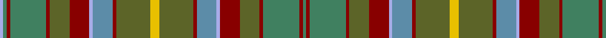

This page is one **sett** — a single exact thread-count. It belongs to the [tartan](/tartans/ly5y19r2t11lb2r11y11r2g20r2g2lb2/)
(the same proportion at any scale), whose colour order is pattern [GRGRGRWBRGYGRBWRGRGRGW](/stripes/grgrgrwbrgygrbwrgrgrgw/).

Sourced from register-of-tartans.  It is a [22 stripe tartan](/stripes/stripes22/).

Original link https://www.tartanregister.gov.uk/tartanDetails.aspx?ref=1468

## Register references

External register numbers recorded for this tartan.

- Scottish Register of Tartans: [1468](https://www.tartanregister.gov.uk/tartanDetails.aspx?ref=1468)
- Scottish Tartans Authority (ITI): 190
- Scottish Tartans World Register: 190

## Thread count
LP/4 Gb4 DR4 Gb40 DR4 Ga22 DR22 LP4 B22 DR4 Ga38 Y10 Ga38 DR4 B22 LP4 DR22 Ga22 DR4 Gb40 DR4 Gb/4

## Palette

Palette: <strong>Tartan Register</strong> <small style="color:#888">(9 of 10 colours)</small>
<table><thead><tr><th>Colour</th><th>Threads</th><th>Shade</th><th>Base</th><th>OKLCh</th></tr></thead><tbody><tr><td>LP/</td><td style="text-align:right;font-variant-numeric:tabular-nums">4</td><td><code style="background-color:#A8ACE8;">#A8ACE8</code> <small style="color:#888">#A8ACE8</small></td><td>W <code style="background-color:#F7F7F7;">#F7F7F7</code></td><td><small style="color:#888">oklch(76.3% 0.086 281.2)</small></td></tr><tr><td>Gb</td><td style="text-align:right;font-variant-numeric:tabular-nums">4</td><td><code style="background-color:#408060;">#408060</code> <small style="color:#888">#408060</small></td><td>G <code style="background-color:#006100;">#006100</code></td><td><small style="color:#888">oklch(54.8% 0.084 160.1)</small></td></tr><tr><td>DR</td><td style="text-align:right;font-variant-numeric:tabular-nums">4</td><td><code style="background-color:#880000;">#880000</code> <small style="color:#888">#880000</small></td><td>R <code style="background-color:#CC0000;">#CC0000</code></td><td><small style="color:#888">oklch(39.4% 0.162 29.2)</small></td></tr><tr><td>Gb</td><td style="text-align:right;font-variant-numeric:tabular-nums">40</td><td><code style="background-color:#408060;">#408060</code> <small style="color:#888">#408060</small></td><td>G <code style="background-color:#006100;">#006100</code></td><td><small style="color:#888">oklch(54.8% 0.084 160.1)</small></td></tr><tr><td>DR</td><td style="text-align:right;font-variant-numeric:tabular-nums">4</td><td><code style="background-color:#880000;">#880000</code> <small style="color:#888">#880000</small></td><td>R <code style="background-color:#CC0000;">#CC0000</code></td><td><small style="color:#888">oklch(39.4% 0.162 29.2)</small></td></tr><tr><td>Ga</td><td style="text-align:right;font-variant-numeric:tabular-nums">22</td><td><code style="background-color:#5C6428;">#5C6428</code> <small style="color:#888">#5C6428</small></td><td>G <code style="background-color:#006100;">#006100</code></td><td><small style="color:#888">oklch(48.3% 0.084 116.0)</small></td></tr><tr><td>DR</td><td style="text-align:right;font-variant-numeric:tabular-nums">22</td><td><code style="background-color:#880000;">#880000</code> <small style="color:#888">#880000</small></td><td>R <code style="background-color:#CC0000;">#CC0000</code></td><td><small style="color:#888">oklch(39.4% 0.162 29.2)</small></td></tr><tr><td>LP</td><td style="text-align:right;font-variant-numeric:tabular-nums">4</td><td><code style="background-color:#A8ACE8;">#A8ACE8</code> <small style="color:#888">#A8ACE8</small></td><td>W <code style="background-color:#F7F7F7;">#F7F7F7</code></td><td><small style="color:#888">oklch(76.3% 0.086 281.2)</small></td></tr><tr><td>B</td><td style="text-align:right;font-variant-numeric:tabular-nums">22</td><td><code style="background-color:#5C8CA8;">#5C8CA8</code> <small style="color:#888">#5C8CA8</small></td><td>B <code style="background-color:#2A418A;">#2A418A</code></td><td><small style="color:#888">oklch(61.7% 0.067 235.0)</small></td></tr><tr><td>DR</td><td style="text-align:right;font-variant-numeric:tabular-nums">4</td><td><code style="background-color:#880000;">#880000</code> <small style="color:#888">#880000</small></td><td>R <code style="background-color:#CC0000;">#CC0000</code></td><td><small style="color:#888">oklch(39.4% 0.162 29.2)</small></td></tr><tr><td>Ga</td><td style="text-align:right;font-variant-numeric:tabular-nums">38</td><td><code style="background-color:#5C6428;">#5C6428</code> <small style="color:#888">#5C6428</small></td><td>G <code style="background-color:#006100;">#006100</code></td><td><small style="color:#888">oklch(48.3% 0.084 116.0)</small></td></tr><tr><td>Y</td><td style="text-align:right;font-variant-numeric:tabular-nums">10</td><td><code style="background-color:#E8C000;">#E8C000</code> <small style="color:#888">#E8C000</small></td><td>Y <code style="background-color:#F2BF00;">#F2BF00</code></td><td><small style="color:#888">oklch(81.9% 0.168 93.7)</small></td></tr><tr><td>Ga</td><td style="text-align:right;font-variant-numeric:tabular-nums">38</td><td><code style="background-color:#5C6428;">#5C6428</code> <small style="color:#888">#5C6428</small></td><td>G <code style="background-color:#006100;">#006100</code></td><td><small style="color:#888">oklch(48.3% 0.084 116.0)</small></td></tr><tr><td>DR</td><td style="text-align:right;font-variant-numeric:tabular-nums">4</td><td><code style="background-color:#880000;">#880000</code> <small style="color:#888">#880000</small></td><td>R <code style="background-color:#CC0000;">#CC0000</code></td><td><small style="color:#888">oklch(39.4% 0.162 29.2)</small></td></tr><tr><td>B</td><td style="text-align:right;font-variant-numeric:tabular-nums">22</td><td><code style="background-color:#5C8CA8;">#5C8CA8</code> <small style="color:#888">#5C8CA8</small></td><td>B <code style="background-color:#2A418A;">#2A418A</code></td><td><small style="color:#888">oklch(61.7% 0.067 235.0)</small></td></tr><tr><td>LP</td><td style="text-align:right;font-variant-numeric:tabular-nums">4</td><td><code style="background-color:#A8ACE8;">#A8ACE8</code> <small style="color:#888">#A8ACE8</small></td><td>W <code style="background-color:#F7F7F7;">#F7F7F7</code></td><td><small style="color:#888">oklch(76.3% 0.086 281.2)</small></td></tr><tr><td>DR</td><td style="text-align:right;font-variant-numeric:tabular-nums">22</td><td><code style="background-color:#880000;">#880000</code> <small style="color:#888">#880000</small></td><td>R <code style="background-color:#CC0000;">#CC0000</code></td><td><small style="color:#888">oklch(39.4% 0.162 29.2)</small></td></tr><tr><td>Ga</td><td style="text-align:right;font-variant-numeric:tabular-nums">22</td><td><code style="background-color:#5C6428;">#5C6428</code> <small style="color:#888">#5C6428</small></td><td>G <code style="background-color:#006100;">#006100</code></td><td><small style="color:#888">oklch(48.3% 0.084 116.0)</small></td></tr><tr><td>DR</td><td style="text-align:right;font-variant-numeric:tabular-nums">4</td><td><code style="background-color:#880000;">#880000</code> <small style="color:#888">#880000</small></td><td>R <code style="background-color:#CC0000;">#CC0000</code></td><td><small style="color:#888">oklch(39.4% 0.162 29.2)</small></td></tr><tr><td>Gb</td><td style="text-align:right;font-variant-numeric:tabular-nums">40</td><td><code style="background-color:#408060;">#408060</code> <small style="color:#888">#408060</small></td><td>G <code style="background-color:#006100;">#006100</code></td><td><small style="color:#888">oklch(54.8% 0.084 160.1)</small></td></tr><tr><td>DR</td><td style="text-align:right;font-variant-numeric:tabular-nums">4</td><td><code style="background-color:#880000;">#880000</code> <small style="color:#888">#880000</small></td><td>R <code style="background-color:#CC0000;">#CC0000</code></td><td><small style="color:#888">oklch(39.4% 0.162 29.2)</small></td></tr><tr><td>Gb/</td><td style="text-align:right;font-variant-numeric:tabular-nums">4</td><td><code style="background-color:#408060;">#408060</code> <small style="color:#888">#408060</small></td><td>G <code style="background-color:#006100;">#006100</code></td><td><small style="color:#888">oklch(54.8% 0.084 160.1)</small></td></tr></tbody></table>

## Nearest tartans

The nearest existing variants by ΔTartan distance, with this tartan at the top so the swatches line up against it.

ΔTartan

Tartan

Sett

—

<a href="/ttd/edit/#slug=ly5y19r2t11lb2r11y11r2g20r2g2lb2~x2">Gordonstoun #2</a> <a class="nn-out" href="/setts/s22/ly5y19r2t11lb2r11y11r2g20r2g2lb2~x2/" title="open its dictionary page">↗</a>

1.36

<a href="/ttd/edit/#slug=r2t2dy3t14do1t1y7dy3t2dy3do7t3y2t3y16r2dy3t2~x2">Unidentified (Woven sample)</a> <a class="nn-out" href="/setts/s18/r2t2dy3t14do1t1y7dy3t2dy3do7t3y2t3y16r2dy3t2~x2/" title="open its dictionary page">↗</a>

1.43

<a href="/ttd/edit/#slug=y3dy3dg2dy6y7dg2y3dg2lo3dg5y3b3y20dy2~x2">Stewart Camel (Lochcarron)</a> <a class="nn-out" href="/setts/s14/y3dy3dg2dy6y7dg2y3dg2lo3dg5y3b3y20dy2~x2/" title="open its dictionary page">↗</a>

1.43

<a href="/ttd/edit/#slug=dg3r2o2r2n20db3n3r8dg2r2dg2r2dg8o2dg2o2dg2o8ly3~x2">Wcwm 1528</a> <a class="nn-out" href="/setts/s19/dg3r2o2r2n20db3n3r8dg2r2dg2r2dg8o2dg2o2dg2o8ly3~x2/" title="open its dictionary page">↗</a>

1.44

<a href="/ttd/edit/#slug=lo18do3lo3do3lo3do16y16r2ly2r2y16do16lo17do3lo3~x2">Lander (2013)</a> <a class="nn-out" href="/setts/s15/lo18do3lo3do3lo3do16y16r2ly2r2y16do16lo17do3lo3~x2/" title="open its dictionary page">↗</a>

1.44

<a href="/setts/s28/g4o2r4w3r4o4r6m21o4g2o2g20o4g2ly4/">Jewel Look JTB</a>

1.45

<a href="/ttd/edit/#slug=r43dy5g27dy5lo40r5lo40dy5g27dy5dg40g27dg40dy5g27dy5r43do8">Cuillins of Skye (Fashion)</a> <a class="nn-out" href="/setts/s18/r43dy5g27dy5lo40r5lo40dy5g27dy5dg40g27dg40dy5g27dy5r43do8/" title="open its dictionary page">↗</a>

1.53

<a href="/ttd/edit/#slug=g4o2r4w3r4o4r6m21o4g2o2g20o4g2ly4">Jewel Look JTB (Corporate)</a> <a class="nn-out" href="/setts/s15/g4o2r4w3r4o4r6m21o4g2o2g20o4g2ly4/" title="open its dictionary page">↗</a>

1.57

<a href="/ttd/edit/#slug=dg18r3dg3r15y13r14dg3r3dg18y5dg2o5dg3r2dg3n5dg2t5~x2">Ben Murad (Personal)</a> <a class="nn-out" href="/setts/s18/dg18r3dg3r15y13r14dg3r3dg18y5dg2o5dg3r2dg3n5dg2t5~x2/" title="open its dictionary page">↗</a>

1.62

<a href="/ttd/edit/#slug=o36lb3g3lb3r20o3t24g32lo3r3o3t6o6r3lo3lb3g6lb3lo3t3r6">Victoria, County of (District)</a> <a class="nn-out" href="/setts/s21/o36lb3g3lb3r20o3t24g32lo3r3o3t6o6r3lo3lb3g6lb3lo3t3r6/" title="open its dictionary page">↗</a>

1.64

<a href="/setts/s20/dy20dp2dy2dp2dy3dp8dg9g8y8dg1lb2~x2/">Isle of Skye</a>

## Neighbour map

Every grey dot is one of 14299 variants placed by the first two principal components of the ΔTartan feature space (44% of its variance). Red is this tartan; blue dots are its nearest — click one to open its page.

<svg viewBox="0 0 640 380" role="img" style="max-width:100%;height:auto;border:1px solid #e0e0e0;border-radius:4px;display:block" xmlns="http://www.w3.org/2000/svg"><image href="/nn/cloud.v1.png" width="640" height="380"/><a href="/setts/s18/r2t2dy3t14do1t1y7dy3t2dy3do7t3y2t3y16r2dy3t2~x2/"><circle cx="229.1" cy="149.4" r="4" fill="#3465a4"><title>Unidentified (Woven sample)</title></circle></a><a href="/setts/s14/y3dy3dg2dy6y7dg2y3dg2lo3dg5y3b3y20dy2~x2/"><circle cx="250.7" cy="168.3" r="4" fill="#3465a4"><title>Stewart Camel (Lochcarron)</title></circle></a><a href="/setts/s19/dg3r2o2r2n20db3n3r8dg2r2dg2r2dg8o2dg2o2dg2o8ly3~x2/"><circle cx="151.2" cy="133.0" r="4" fill="#3465a4"><title>Wcwm 1528</title></circle></a><a href="/setts/s15/lo18do3lo3do3lo3do16y16r2ly2r2y16do16lo17do3lo3~x2/"><circle cx="222.2" cy="189.8" r="4" fill="#3465a4"><title>Lander (2013)</title></circle></a><a href="/setts/s28/g4o2r4w3r4o4r6m21o4g2o2g20o4g2ly4/"><circle cx="167.6" cy="117.0" r="4" fill="#3465a4"><title>Jewel Look JTB</title></circle></a><a href="/setts/s18/r43dy5g27dy5lo40r5lo40dy5g27dy5dg40g27dg40dy5g27dy5r43do8/"><circle cx="108.1" cy="170.3" r="4" fill="#3465a4"><title>Cuillins of Skye (Fashion)</title></circle></a><a href="/setts/s15/g4o2r4w3r4o4r6m21o4g2o2g20o4g2ly4/"><circle cx="174.4" cy="140.4" r="4" fill="#3465a4"><title>Jewel Look JTB (Corporate)</title></circle></a><a href="/setts/s18/dg18r3dg3r15y13r14dg3r3dg18y5dg2o5dg3r2dg3n5dg2t5~x2/"><circle cx="246.2" cy="180.7" r="4" fill="#3465a4"><title>Ben Murad (Personal)</title></circle></a><a href="/setts/s21/o36lb3g3lb3r20o3t24g32lo3r3o3t6o6r3lo3lb3g6lb3lo3t3r6/"><circle cx="142.4" cy="105.9" r="4" fill="#3465a4"><title>Victoria, County of (District)</title></circle></a><a href="/setts/s20/dy20dp2dy2dp2dy3dp8dg9g8y8dg1lb2~x2/"><circle cx="164.6" cy="136.8" r="4" fill="#3465a4"><title>Isle of Skye</title></circle></a><circle cx="175.7" cy="152.9" r="5" fill="#c00000"/></svg>

ID: /setts/s22/ly5y19r2t11lb2r11y11r2g20r2g2lb2~x2/
