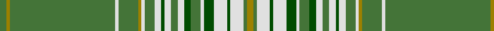

In pattern [GRGWGRWGWGWGWGGWGWGWGR](/stripes/grgwgrwgwgwgwggwgwgwgr/).

This was sourced from register-of-tartans.  It is a [22 stripe tartan](/stripes/stripes22/).

Original link https://www.tartanregister.gov.uk/tartanDetails.aspx?ref=1374

## Attestations

This cloth appears in 2 source records; the oldest owns this page.

- 01/01/2002 — Glen Elg (register-of-tartans, [record](https://www.tartanregister.gov.uk/tartanDetails.aspx?ref=1374))
- pre 2002 — Glen Elg (Fashion) (tartans-authority, [record](http://www.tartansauthority.com/tartan-ferret/display/5004/))

## Register references

External register numbers recorded for this tartan.

- Scottish Register of Tartans: [1374](https://www.tartanregister.gov.uk/tartanDetails.aspx?ref=1374)
- Scottish Tartans Authority (ITI): 5004

## Thread count
G/8 LG4 G128 LN4 G24 LG4 LN4 G12 LN8 Ga4 LN8 G8 LN8 Ga8 G12 LN4 Ga12 LN16 Ga4 LN16 G4 LG/8

## Palette
Each colour and the base-6 reference it is a variant of.

| Colour | Shade | Base |
|---|---|---|
| G | <code style="background-color:#447438;">#447438</code> `oklch(50.9% 0.104 139.6)` <small>#447438</small> | G <code style="background-color:#006100;">#006100</code> |
| Ga | <code style="background-color:#004C00;">#004C00</code> `oklch(36.1% 0.123 142.5)` <small>#004C00</small> | G <code style="background-color:#006100;">#006100</code> |
| LG | <code style="background-color:#9C8000;">#9C8000</code> `oklch(60.8% 0.125 93.4)` <small>#9C8000</small> | R <code style="background-color:#CC0000;">#CC0000</code> |
| LN | <code style="background-color:#E0E0E0;">#E0E0E0</code> `oklch(90.7% 0.000 89.9)` <small>#E0E0E0</small> | W <code style="background-color:#F7F7F7;">#F7F7F7</code> |

## Nearest tartans

The nearest existing variants by ΔTartan distance, with this tartan at the top so the swatches line up against it.

ΔTartan

Tartan

Sett

—

<a href="/ttd/edit/#slug=o2g1w4dg1w4dg3w1g3dg2w2g2w2dg1w2g3w1o1g6w1g32o1g2~x4">Glen Elg</a> <a class="nn-out" href="/setts/s22/o2g1w4dg1w4dg3w1g3dg2w2g2w2dg1w2g3w1o1g6w1g32o1g2~x4/" title="open its dictionary page">↗</a>

1.71

<a href="/ttd/edit/#slug=g64k3g20w2r3k2r3w2g2db18k2r4w2g3~x2">MacFarlane, hunting</a> <a class="nn-out" href="/setts/s14/g64k3g20w2r3k2r3w2g2db18k2r4w2g3~x2/" title="open its dictionary page">↗</a>

1.78

<a href="/ttd/edit/#slug=y42k10r2k2lb2k2y10lb6k2lb3y2~x2">Laggen Dress</a> <a class="nn-out" href="/setts/s11/y42k10r2k2lb2k2y10lb6k2lb3y2~x2/" title="open its dictionary page">↗</a>

1.81

<a href="/ttd/edit/#slug=y70k2lb4y2k2dg2k2dg2k14y8k2dg12k2lb3~x2">Wcwm 9275-1415</a> <a class="nn-out" href="/setts/s14/y70k2lb4y2k2dg2k2dg2k14y8k2dg12k2lb3~x2/" title="open its dictionary page">↗</a>

1.83

<a href="/ttd/edit/#slug=g1w1g39r2w3n13w3do2r1do2w1~x2">Schuster (Bavaria) (Personal), Benedikt</a> <a class="nn-out" href="/setts/s11/g1w1g39r2w3n13w3do2r1do2w1~x2/" title="open its dictionary page">↗</a>

1.88

<a href="/ttd/edit/#slug=w2g32r2g3r2g4r16g4r16g4r2g3r2g32w1g1w2~x2">Rothesay, hunting</a> <a class="nn-out" href="/setts/s17/w2g32r2g3r2g4r16g4r16g4r2g3r2g32w1g1w2~x2/" title="open its dictionary page">↗</a>

1.92

<a href="/ttd/edit/#slug=w8g83r7g5r7g7r28g7r28g7r7g5r7g83w4g4w8">Rothesay Hunting (District)</a> <a class="nn-out" href="/setts/s17/w8g83r7g5r7g7r28g7r28g7r7g5r7g83w4g4w8/" title="open its dictionary page">↗</a>

1.93

<a href="/ttd/edit/#slug=g2w10g3lo4g3lo4g24w2g4w4g1lo4g1~x2">McGill (Personal)</a> <a class="nn-out" href="/setts/s13/g2w10g3lo4g3lo4g24w2g4w4g1lo4g1~x2/" title="open its dictionary page">↗</a>

1.99

<a href="/ttd/edit/#slug=g1w1g39r2w3b13w3dr2r1dr2w1~x2">Schuster (Perosnal)</a> <a class="nn-out" href="/setts/s11/g1w1g39r2w3b13w3dr2r1dr2w1~x2/" title="open its dictionary page">↗</a>

1.99

<a href="/ttd/edit/#slug=ly8g84b21k10b10k10b10k10b21g62r3g6r3g10ly3g5r6">King Edward VII (Royal)</a> <a class="nn-out" href="/setts/s17/ly8g84b21k10b10k10b10k10b21g62r3g6r3g10ly3g5r6/" title="open its dictionary page">↗</a>

2.00

<a href="/ttd/edit/#slug=g5w1g32db1g8db9g2w2r3db3w1~x2">Portosalvo</a> <a class="nn-out" href="/setts/s11/g5w1g32db1g8db9g2w2r3db3w1~x2/" title="open its dictionary page">↗</a>

## Neighbour map

Every grey dot is one of 14299 variants placed by the first two principal components of the ΔTartan feature space (44% of its variance). Red is this tartan; blue dots are its nearest — click one to open its page.

<svg viewBox="0 0 640 380" role="img" style="max-width:100%;height:auto;border:1px solid #e0e0e0;border-radius:4px;display:block" xmlns="http://www.w3.org/2000/svg"><image href="/nn/cloud.v1.png" width="640" height="380"/><a href="/setts/s14/g64k3g20w2r3k2r3w2g2db18k2r4w2g3~x2/"><circle cx="418.4" cy="77.4" r="4" fill="#3465a4"><title>MacFarlane, hunting</title></circle></a><a href="/setts/s11/y42k10r2k2lb2k2y10lb6k2lb3y2~x2/"><circle cx="402.7" cy="122.2" r="4" fill="#3465a4"><title>Laggen Dress</title></circle></a><a href="/setts/s14/y70k2lb4y2k2dg2k2dg2k14y8k2dg12k2lb3~x2/"><circle cx="434.6" cy="81.6" r="4" fill="#3465a4"><title>Wcwm 9275-1415</title></circle></a><a href="/setts/s11/g1w1g39r2w3n13w3do2r1do2w1~x2/"><circle cx="369.2" cy="70.8" r="4" fill="#3465a4"><title>Schuster (Bavaria) (Personal), Benedikt</title></circle></a><a href="/setts/s17/w2g32r2g3r2g4r16g4r16g4r2g3r2g32w1g1w2~x2/"><circle cx="449.5" cy="118.0" r="4" fill="#3465a4"><title>Rothesay, hunting</title></circle></a><a href="/setts/s17/w8g83r7g5r7g7r28g7r28g7r7g5r7g83w4g4w8/"><circle cx="433.6" cy="128.5" r="4" fill="#3465a4"><title>Rothesay Hunting (District)</title></circle></a><a href="/setts/s13/g2w10g3lo4g3lo4g24w2g4w4g1lo4g1~x2/"><circle cx="323.2" cy="118.5" r="4" fill="#3465a4"><title>McGill (Personal)</title></circle></a><a href="/setts/s11/g1w1g39r2w3b13w3dr2r1dr2w1~x2/"><circle cx="369.2" cy="77.6" r="4" fill="#3465a4"><title>Schuster (Perosnal)</title></circle></a><a href="/setts/s17/ly8g84b21k10b10k10b10k10b21g62r3g6r3g10ly3g5r6/"><circle cx="353.5" cy="105.9" r="4" fill="#3465a4"><title>King Edward VII (Royal)</title></circle></a><a href="/setts/s11/g5w1g32db1g8db9g2w2r3db3w1~x2/"><circle cx="442.9" cy="115.8" r="4" fill="#3465a4"><title>Portosalvo</title></circle></a><circle cx="409.1" cy="67.4" r="5" fill="#c00000"/></svg>

ID: /setts/s22/o2g1w4dg1w4dg3w1g3dg2w2g2w2dg1w2g3w1o1g6w1g32o1g2~x4/
