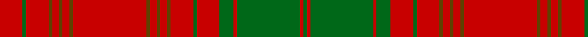

In pattern [GRGRGRGRGRGRGRGRGRGRGR](/stripes/grgrgrgrgrgrgrgrgrgrgr/).

This was sourced from register-of-tartans.  It is a [22 stripe tartan](/stripes/stripes22/).

Original link https://www.tartanregister.gov.uk/tartanDetails.aspx?ref=4283

## Register references

External register numbers recorded for this tartan.

- Scottish Register of Tartans: [4283](https://www.tartanregister.gov.uk/tartanDetails.aspx?ref=4283)
- Scottish Tartans Authority (ITI): 5865

## Thread count
R/26 Ga4 R26 T4 R8 T4 R8 T4 R84 T4 R8 T4 R8 T4 R26 Ga4 R26 Ga16 R4 Ga72 R4 Ga/4

## Palette
Each colour and its ΔE from the base-6 reference it is a variant of.

| Colour | Shade | Base | ΔE (OKLab) |
|---|---|---|---|
| G | <code style="background-color:#285800;">#285800</code> `#285800` | G <code style="background-color:#006100;">#006100</code> | 0.03 |
| Ga | <code style="background-color:#006818;">#006818</code> `#006818` | G <code style="background-color:#006100;">#006100</code> | 0.02 |
| R | <code style="background-color:#C80000;">#C80000</code> `#C80000` | R <code style="background-color:#CC0000;">#CC0000</code> | 0.01 |
| T | <code style="background-color:#604000;">#604000</code> `#604000` | G <code style="background-color:#006100;">#006100</code> | 0.14 |

## Nearest tartans

The nearest existing variants by ΔTartan distance.

1. [Munro](/setts/s20/r20g2r2g2r2g2r19db1ly1r2db4r2ly1db1r2g18r2db1ly1r19~x2/) — ΔT 1.12
1. [MacGillivray](/setts/s14/g19r7g7r7g7r14db3r3g19r3db3r66db7r14~x2/) — ΔT 1.18
1. [Munro](/setts/s20/r26g3r3g3r3g3r26db1ly1r3db6r3ly1db1r3g26r3db1ly1r13~x4/) — ΔT 1.22
1. [Ross 5](/setts/s14/r3g12r2g1r1g1r4db3r1db3r28db1r3db2~x2/) — ΔT 1.31
1. [Ross 4](/setts/s14/r5g25r5g2r2g2r8db6r2db6r62g2r5g5~x2/) — ΔT 1.35
1. [MacDonell of Keppoch](/setts/s15/r24g4r2g2r2g2r12g24r1k1r24k1r1k1r6~x2/) — ΔT 1.36
1. [Hebrides, Outer](/setts/s32/g9r2g3r20g2r1g2r2g20r2g3r2g2r22g3ly1r3~x2/) — ΔT 1.37
1. [MacGillivray #3](/setts/s14/dg19r7dg7r7dg7r14db3r3dg19r3db3r66db7r14~x2/) — ΔT 1.40
1. [Kyle (Green)](/setts/s14/r54g6r5g6r10g3r2g18~x2/) — ΔT 1.43
1. [Rothesay (Red)](/setts/s17/w8r83g7r5g7r7g28r7g28r7g7r5g7r83w4r4w8/) — ΔT 1.47

## Neighbour map

Every grey dot is one of 14299 variants placed by the first two principal components of the ΔTartan feature space (44% of its variance). Red is this tartan; blue dots are its nearest — click one to open its page.

<svg viewBox="0 0 640 380" role="img" style="max-width:100%;height:auto;border:1px solid #e0e0e0;border-radius:4px;display:block" xmlns="http://www.w3.org/2000/svg"><image href="/nn/cloud.v1.png" width="640" height="380"/><a href="/setts/s20/r20g2r2g2r2g2r19db1ly1r2db4r2ly1db1r2g18r2db1ly1r19~x2/"><circle cx="441.4" cy="101.4" r="4" fill="#3465a4"><title>Munro</title></circle></a><a href="/setts/s14/g19r7g7r7g7r14db3r3g19r3db3r66db7r14~x2/"><circle cx="445.6" cy="136.6" r="4" fill="#3465a4"><title>MacGillivray</title></circle></a><a href="/setts/s20/r26g3r3g3r3g3r26db1ly1r3db6r3ly1db1r3g26r3db1ly1r13~x4/"><circle cx="427.2" cy="92.2" r="4" fill="#3465a4"><title>Munro</title></circle></a><a href="/setts/s14/r3g12r2g1r1g1r4db3r1db3r28db1r3db2~x2/"><circle cx="469.2" cy="113.6" r="4" fill="#3465a4"><title>Ross 5</title></circle></a><a href="/setts/s14/r5g25r5g2r2g2r8db6r2db6r62g2r5g5~x2/"><circle cx="482.5" cy="107.2" r="4" fill="#3465a4"><title>Ross 4</title></circle></a><a href="/setts/s15/r24g4r2g2r2g2r12g24r1k1r24k1r1k1r6~x2/"><circle cx="468.2" cy="125.1" r="4" fill="#3465a4"><title>MacDonell of Keppoch</title></circle></a><a href="/setts/s32/g9r2g3r20g2r1g2r2g20r2g3r2g2r22g3ly1r3~x2/"><circle cx="407.1" cy="104.1" r="4" fill="#3465a4"><title>Hebrides, Outer</title></circle></a><a href="/setts/s14/dg19r7dg7r7dg7r14db3r3dg19r3db3r66db7r14~x2/"><circle cx="439.3" cy="129.0" r="4" fill="#3465a4"><title>MacGillivray #3</title></circle></a><a href="/setts/s14/r54g6r5g6r10g3r2g18~x2/"><circle cx="504.8" cy="143.4" r="4" fill="#3465a4"><title>Kyle (Green)</title></circle></a><a href="/setts/s17/w8r83g7r5g7r7g28r7g28r7g7r5g7r83w4r4w8/"><circle cx="441.5" cy="108.4" r="4" fill="#3465a4"><title>Rothesay (Red)</title></circle></a><circle cx="466.3" cy="121.5" r="5" fill="#c00000"/></svg>

ID: /setts/s22/r13g2r13dy2r4dy2r4dy2r42dy2r4dy2r4dy2r13g2r13g8r2g36r2g2~x2/
