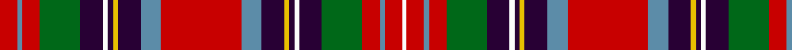

In pattern [RBRGBWBYBBRBBYBWBGRBRW](/patterns/rbrgbwbybbrbbybwbgrbrw/).

This was sourced from register-of-tartans.  It is a [22 stripes tartan](/stripes/stripes22/).

Original link https://www.tartanregister.gov.uk/tartanDetails.aspx?ref=4644

## Thread count
Ra/14 B4 Ra14 G32 DP18 Wa4 DP4 Ya4 DP18 B16 Ra64 B16 DP18 Ya4 DP4 Wa4 DP18 G32 Ra14 B4 Ra14 Wa/3

## Palette
Each colour and its ΔE from the base-6 reference it is a variant of.

| Colour | Shade | Base | ΔE (OKLab) |
|---|---|---|---|
| B | <code style="background-color:#5C8CA8;">#5C8CA8</code> `#5C8CA8` | B <code style="background-color:#2C4084;">#2C4084</code> | 0.23 |
| DG | <code style="background-color:#044028;">#044028</code> `#044028` | G <code style="background-color:#006400;">#006400</code> | 0.14 |
| DP | <code style="background-color:#280034;">#280034</code> `#280034` | B <code style="background-color:#2C4084;">#2C4084</code> | 0.21 |
| G | <code style="background-color:#006818;">#006818</code> `#006818` | G <code style="background-color:#006400;">#006400</code> | 0.02 |
| LB | <code style="background-color:#00FCFC;">#00FCFC</code> `#00FCFC` | W <code style="background-color:#F4F4F0;">#F4F4F0</code> | 0.17 |
| R | <code style="background-color:#C80000;">#C80000</code> `#C80000` | R <code style="background-color:#C80000;">#C80000</code> | 0.00 |
| Ra | <code style="background-color:#C80000;">#C80000</code> `#C80000` | R <code style="background-color:#C80000;">#C80000</code> | 0.00 |
| W | <code style="background-color:#FCFCFC;">#FCFCFC</code> `#FCFCFC` | W <code style="background-color:#F4F4F0;">#F4F4F0</code> | 0.03 |
| Wa | <code style="background-color:#FCFCFC;">#FCFCFC</code> `#FCFCFC` | W <code style="background-color:#F4F4F0;">#F4F4F0</code> | 0.03 |
| Y | <code style="background-color:#DCBC00;">#DCBC00</code> `#DCBC00` | Y <code style="background-color:#E8C000;">#E8C000</code> | 0.02 |
| Ya | <code style="background-color:#E8C000;">#E8C000</code> `#E8C000` | Y <code style="background-color:#E8C000;">#E8C000</code> | 0.00 |

## Nearest tartans

The nearest existing variants by ΔTartan distance.

1. [Westwood Red Anderson (Fashion)](/setts/s20/r10b12r4b18r8ra12r8k10y4k4y4k10w10k10ra46r2k4r2ra10r8-b1474b4-k101010-re87878-rac80000-we0e0e0-ybc8c00/) — ΔT 0.82
1. [Wilson's No.073](/setts/s22/r64b20k32y4k6w6k6g46r26k6r6w4r6k6r26g46k6w6k6y4k32b20-b5c8ca8-g006818-k101010-rc80000-wfcfcfc-ye8c000/) — ΔT 0.91
1. [Canadian Dental Association (Corp.)](/setts/s18/r16k6ra30k2w6k2ra16k2w6k2r38k4y4k4g4k4r4k4-g006818-k101010-rc80000-ra888888-we0e0e0-yfccc00/) — ΔT 0.97
1. [Unidentified Scarlett #14](/setts/s28/r6k4w4r16ra16k2g2k2ra16k30y2ra30r16w4r16w4r16ra30y2k30ra16k2g2k2ra16r16w4k4-g408060-k101010-rc80000-ra888888-wfcfcfc-ye8c000/) — ΔT 0.98
1. [Wilson's No.017](/setts/s28/r88g50k4w12k4y6k32b24r12b24k32y6k4w12r88w12k4y6k32b24r12b24k32y6k4w12k4g44-b5c8ca8-g006818-k101010-rc80000-wfcfcfc-ye8c000/) — ΔT 0.98
1. [Wilson's No.156](/setts/s17/r60w4b8k8y4k4w12k4b22k30y6g40r28w8r8k4r16-b5c8ca8-g006818-k101010-rc80000-we0e0e0-ye8c000/) — ΔT 1.02
1. [Norwich No.001](/setts/s22/r16g14k16y4k2w6k2ga38k2r16g6r16g6r16k2ga38k2w6k2y4k16g14-g789484-ga003820-k101010-rc80000-wc0c0c0-yd09800/) — ΔT 1.04
1. [Wilson's, No 156](/setts/s17/r60w4b8k8y4k4w12k4b22k30y6g40r28w8r8k4r16-b5480b0-g008000-k000000-rc00000-we0e0e0-yf0c000/) — ΔT 1.16
1. [Hay or Leith Clan Tartan Tartan Number: 1215. Earliest known date: 1810-15 Also recorded by Logan and Wilson in the Wilson's pattern books. The Hay Leith connection is believed to have come about through a marriage between the two families. At Delgattie Castle, Turriff, there is a Clan Hay centre and Leith Hall, home of the Leith-Hays, is owned by the National Trust for Scotland. See products available Copyright © Blair Urquhart, Comrie, 2015](/setts/s23/k6r2y2k4r32b4r2y2r4b30r2k30w2g30r4y2r2g4r32k4y2r2k6-b780078-g006818-k101010-rc80000-we0e0e0-ye8c000/) — ΔT 1.16
1. [Wilson's No.043](/setts/s28/k10w8r38b24k4b4k4b24k40y6g52r38b10r40b10r38g52y6k40b24k4b4k4b24r38w8k10r10-b5c8ca8-g006818-k101010-rc80000-wfcfcfc-ye8c000/) — ΔT 1.16

## Neighbour map

Every grey dot is one of 15726 variants placed by the first two principal components of the ΔTartan feature space (44% of its variance). Red is this tartan; blue dots are its nearest — click one to open its page.

<svg viewBox="0 0 640 380" role="img" style="max-width:100%;height:auto;border:1px solid #e0e0e0;border-radius:4px;display:block" xmlns="http://www.w3.org/2000/svg"><image href="/nn/cloud.v1.png" width="640" height="380"/><a href="/setts/s20/r10b12r4b18r8ra12r8k10y4k4y4k10w10k10ra46r2k4r2ra10r8-b1474b4-k101010-re87878-rac80000-we0e0e0-ybc8c00/"><circle cx="134.7" cy="65.5" r="4" fill="#3465a4"><title>Westwood Red Anderson (Fashion)</title></circle></a><a href="/setts/s22/r64b20k32y4k6w6k6g46r26k6r6w4r6k6r26g46k6w6k6y4k32b20-b5c8ca8-g006818-k101010-rc80000-wfcfcfc-ye8c000/"><circle cx="115.4" cy="80.6" r="4" fill="#3465a4"><title>Wilson's No.073</title></circle></a><a href="/setts/s18/r16k6ra30k2w6k2ra16k2w6k2r38k4y4k4g4k4r4k4-g006818-k101010-rc80000-ra888888-we0e0e0-yfccc00/"><circle cx="168.2" cy="64.4" r="4" fill="#3465a4"><title>Canadian Dental Association (Corp.)</title></circle></a><a href="/setts/s28/r6k4w4r16ra16k2g2k2ra16k30y2ra30r16w4r16w4r16ra30y2k30ra16k2g2k2ra16r16w4k4-g408060-k101010-rc80000-ra888888-wfcfcfc-ye8c000/"><circle cx="143.0" cy="76.8" r="4" fill="#3465a4"><title>Unidentified Scarlett #14</title></circle></a><a href="/setts/s28/r88g50k4w12k4y6k32b24r12b24k32y6k4w12r88w12k4y6k32b24r12b24k32y6k4w12k4g44-b5c8ca8-g006818-k101010-rc80000-wfcfcfc-ye8c000/"><circle cx="104.5" cy="48.4" r="4" fill="#3465a4"><title>Wilson's No.017</title></circle></a><a href="/setts/s17/r60w4b8k8y4k4w12k4b22k30y6g40r28w8r8k4r16-b5c8ca8-g006818-k101010-rc80000-we0e0e0-ye8c000/"><circle cx="151.5" cy="86.5" r="4" fill="#3465a4"><title>Wilson's No.156</title></circle></a><a href="/setts/s22/r16g14k16y4k2w6k2ga38k2r16g6r16g6r16k2ga38k2w6k2y4k16g14-g789484-ga003820-k101010-rc80000-wc0c0c0-yd09800/"><circle cx="112.4" cy="83.2" r="4" fill="#3465a4"><title>Norwich No.001</title></circle></a><a href="/setts/s17/r60w4b8k8y4k4w12k4b22k30y6g40r28w8r8k4r16-b5480b0-g008000-k000000-rc00000-we0e0e0-yf0c000/"><circle cx="137.6" cy="82.7" r="4" fill="#3465a4"><title>Wilson's, No 156</title></circle></a><a href="/setts/s23/k6r2y2k4r32b4r2y2r4b30r2k30w2g30r4y2r2g4r32k4y2r2k6-b780078-g006818-k101010-rc80000-we0e0e0-ye8c000/"><circle cx="174.1" cy="61.4" r="4" fill="#3465a4"><title>Hay or Leith Clan Tartan Tartan Number: 1215. Earliest known date: 1810-15 Also recorded by Logan and Wilson in the Wilson's pattern books. The Hay Leith connection is believed to have come about through a marriage between the two families. At Delgattie Castle, Turriff, there is a Clan Hay centre and Leith Hall, home of the Leith-Hays, is owned by the National Trust for Scotland. See products available Copyright © Blair Urquhart, Comrie, 2015</title></circle></a><a href="/setts/s28/k10w8r38b24k4b4k4b24k40y6g52r38b10r40b10r38g52y6k40b24k4b4k4b24r38w8k10r10-b5c8ca8-g006818-k101010-rc80000-wfcfcfc-ye8c000/"><circle cx="98.1" cy="91.9" r="4" fill="#3465a4"><title>Wilson's No.043</title></circle></a><circle cx="144.6" cy="70.8" r="5" fill="#c00000"/></svg>

ID: /setts/s22/r14b4r14g32ba18w4ba4y4ba18b16r64b16ba18y4ba4w4ba18g32r14b4r14w3-b5c8ca8-ba280034-g006818-rc80000-wfcfcfc-ye8c000/
