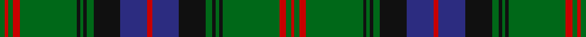

This page is one **sett** — a single exact thread-count. It belongs to the [tartan](/tartans/r3db16k16g4k2g2k2g34r4g3r2g3/)
(the same proportion at any scale), whose colour order is pattern [GRGRGKGKGKBRBKGKGKGRGR](/stripes/grgrgkgkgkbrbkgkgkgrgr/).

Sourced from house-of-tartan.  It is a [22 stripe tartan](/stripes/stripes22/).

Original link http://www.house-of-tartan.scotland.net/house/TartanViewjs.asp?colr=Def&tnam=2387

## Also known as

This cloth is also recorded under:

- Park Clan/Family Weavers

## Thread count
G/6 R4 G6 R8 G68 K4 G4 K4 G8 K32 DB32 R6 DB32 K32 G8 K4 G4 K4 G68 R8 G6 R/4

## Palette
Each colour and the base-6 reference it is a variant of.

| Colour | Shade | Base |
|---|---|---|
| DB | <code style="background-color:#2C2C80;">#2C2C80</code> `oklch(35.0% 0.138 276.6)` <small>#2C2C80</small> | B <code style="background-color:#2A418A;">#2A418A</code> |
| G | <code style="background-color:#006818;">#006818</code> `oklch(45.0% 0.142 145.0)` <small>#006818</small> | G <code style="background-color:#006100;">#006100</code> |
| K | <code style="background-color:#101010;">#101010</code> `oklch(17.3% 0.000 89.9)` <small>#101010</small> | K <code style="background-color:#000000;">#000000</code> |
| R | <code style="background-color:#C80000;">#C80000</code> `oklch(52.3% 0.215 29.2)` <small>#C80000</small> | R <code style="background-color:#CC0000;">#CC0000</code> |

## Nearest tartans

The nearest existing variants by ΔTartan distance, with this tartan at the top so the swatches line up against it.

ΔTartan

Tartan

Sett

—

<a href="/ttd/edit/#slug=r3db16k16g4k2g2k2g34r4g3r2g3~x2">Park Clan/Family Weavers Tartan Tartan Number: 2387. Earliest known date: September 1996 William D. Park wished to have a tartan for himself and family. Can be worn by those of the same name. See products available Copyright © Blair Urquhart, Comrie, 2015</a> <a class="nn-out" href="/setts/s22/r3db16k16g4k2g2k2g34r4g3r2g3~x2/" title="open its dictionary page">↗</a>

1.03

<a href="/setts/s16/db12r1db1r1db1r4g12ly1g2~x4/">Durie Clan Tartan Tartan Number: 2228. Earliest known date: 1988 When the matriculation of the Durie 'Arms' was updated in June 1988, this tartan was designed for family use by Harry G Lindlay of Kinloch &amp; Anderson of Edinburgh. The design is said to be based on the Argyle &amp; Southern Highlanders regimental tartan - the yellow is from the mess dress (military uniform evening wear) facings (lapels) and the burgundy represents the Durie family's French connections. Andrew, son of Lt. Col. Raymond Varley Dewar Durie succeded his father as clan chieftain in 1999. See products available Copyright © Blair Urquhart, Comrie, 2015</a>

1.10

<a href="/ttd/edit/#slug=r6g6r2k24r2db2k2r2k24r2g6r6db2k6r2g27r2k2r2g27r2k6db2~x2">Buchan</a> <a class="nn-out" href="/setts/s23/r6g6r2k24r2db2k2r2k24r2g6r6db2k6r2g27r2k2r2g27r2k6db2~x2/" title="open its dictionary page">↗</a>

1.21

<a href="/setts/s20/db30k2db2k2db2k32g15r2g4r4g30~x2/">Scottish Tourist Board (1981)</a>

1.23

<a href="/ttd/edit/#slug=r3db16k16g4k2g2k2g34r4g3r2g3~x2">Park</a> <a class="nn-out" href="/setts/s12/r3db16k16g4k2g2k2g34r4g3r2g3~x2/" title="open its dictionary page">↗</a>

1.28

<a href="/ttd/edit/#slug=db15k18g3k2g2k2g44ly4g44k2g2k2g3k18db15r4~x2">Sarafilovic</a> <a class="nn-out" href="/setts/s16/db15k18g3k2g2k2g44ly4g44k2g2k2g3k18db15r4~x2/" title="open its dictionary page">↗</a>

1.31

<a href="/ttd/edit/#slug=g34r4g3r2g4r2g3r4g17k17r2db17r4db4ly3~x2">Cochrane</a> <a class="nn-out" href="/setts/s15/g34r4g3r2g4r2g3r4g17k17r2db17r4db4ly3~x2/" title="open its dictionary page">↗</a>

1.32

<a href="/ttd/edit/#slug=k20y3db10g3db5g25k1g1w3g1k1g25db5g3db10y1db2~x4">Blairgowrie</a> <a class="nn-out" href="/setts/s17/k20y3db10g3db5g25k1g1w3g1k1g25db5g3db10y1db2~x4/" title="open its dictionary page">↗</a>

1.32

<a href="/ttd/edit/#slug=g34r4g4r2g4r2g3r4g17k17r2db17r4db4ly3~x2">Cochrane (1984) Clan Tartan Tartan Number: 978. Earliest known date: 1984 Lord Dundonald originally registered a version missing a red and a green stripe in 1974. There is a story that a fragment of this design was discovered in the foundations of a Perthshire house in 1934. Around that time, a count was recorded from the sample books of Messrs William Anderson. The red and green have been restored in this version, which is now the 'approved' tartan, and appears in the 'Appendix' of the Lyon Court Books dated 12th November 1984. See products available Copyright © Blair Urquhart, Comrie, 2015</a> <a class="nn-out" href="/setts/s15/g34r4g4r2g4r2g3r4g17k17r2db17r4db4ly3~x2/" title="open its dictionary page">↗</a>

1.33

<a href="/ttd/edit/#slug=k4r2k10g3k10g30k8g3r4lo2r4lb2r4g3k8g30k10g3k10r2k4~x2">Pilette of Kinnear (Personal)</a> <a class="nn-out" href="/setts/s21/k4r2k10g3k10g30k8g3r4lo2r4lb2r4g3k8g30k10g3k10r2k4~x2/" title="open its dictionary page">↗</a>

1.33

<a href="/ttd/edit/#slug=k2r2dg27r2k6db2r6dg6r2k24r2k2db2r2k24r2dg6r6db2k6r2dg27r2k2~x2">Cumming/Buchan Hunting</a> <a class="nn-out" href="/setts/s24/k2r2dg27r2k6db2r6dg6r2k24r2k2db2r2k24r2dg6r6db2k6r2dg27r2k2~x2/" title="open its dictionary page">↗</a>

## Neighbour map

Every grey dot is one of 14299 variants placed by the first two principal components of the ΔTartan feature space (44% of its variance). Red is this tartan; blue dots are its nearest — click one to open its page.

<svg viewBox="0 0 640 380" role="img" style="max-width:100%;height:auto;border:1px solid #e0e0e0;border-radius:4px;display:block" xmlns="http://www.w3.org/2000/svg"><image href="/nn/cloud.v1.png" width="640" height="380"/><a href="/setts/s16/db12r1db1r1db1r4g12ly1g2~x4/"><circle cx="275.7" cy="152.7" r="4" fill="#3465a4"><title>Durie Clan Tartan Tartan Number: 2228. Earliest known date: 1988 When the matriculation of the Durie 'Arms' was updated in June 1988, this tartan was designed for family use by Harry G Lindlay of Kinloch &amp; Anderson of Edinburgh. The design is said to be based on the Argyle &amp; Southern Highlanders regimental tartan - the yellow is from the mess dress (military uniform evening wear) facings (lapels) and the burgundy represents the Durie family's French connections. Andrew, son of Lt. Col. Raymond Varley Dewar Durie succeded his father as clan chieftain in 1999. See products available Copyright © Blair Urquhart, Comrie, 2015</title></circle></a><a href="/setts/s23/r6g6r2k24r2db2k2r2k24r2g6r6db2k6r2g27r2k2r2g27r2k6db2~x2/"><circle cx="254.5" cy="135.1" r="4" fill="#3465a4"><title>Buchan</title></circle></a><a href="/setts/s20/db30k2db2k2db2k32g15r2g4r4g30~x2/"><circle cx="243.7" cy="137.8" r="4" fill="#3465a4"><title>Scottish Tourist Board (1981)</title></circle></a><a href="/setts/s12/r3db16k16g4k2g2k2g34r4g3r2g3~x2/"><circle cx="305.3" cy="152.5" r="4" fill="#3465a4"><title>Park</title></circle></a><a href="/setts/s16/db15k18g3k2g2k2g44ly4g44k2g2k2g3k18db15r4~x2/"><circle cx="316.4" cy="121.1" r="4" fill="#3465a4"><title>Sarafilovic</title></circle></a><a href="/setts/s15/g34r4g3r2g4r2g3r4g17k17r2db17r4db4ly3~x2/"><circle cx="265.9" cy="128.3" r="4" fill="#3465a4"><title>Cochrane</title></circle></a><a href="/setts/s17/k20y3db10g3db5g25k1g1w3g1k1g25db5g3db10y1db2~x4/"><circle cx="276.0" cy="113.2" r="4" fill="#3465a4"><title>Blairgowrie</title></circle></a><a href="/setts/s15/g34r4g4r2g4r2g3r4g17k17r2db17r4db4ly3~x2/"><circle cx="265.6" cy="128.0" r="4" fill="#3465a4"><title>Cochrane (1984) Clan Tartan Tartan Number: 978. Earliest known date: 1984 Lord Dundonald originally registered a version missing a red and a green stripe in 1974. There is a story that a fragment of this design was discovered in the foundations of a Perthshire house in 1934. Around that time, a count was recorded from the sample books of Messrs William Anderson. The red and green have been restored in this version, which is now the 'approved' tartan, and appears in the 'Appendix' of the Lyon Court Books dated 12th November 1984. See products available Copyright © Blair Urquhart, Comrie, 2015</title></circle></a><a href="/setts/s21/k4r2k10g3k10g30k8g3r4lo2r4lb2r4g3k8g30k10g3k10r2k4~x2/"><circle cx="255.9" cy="124.8" r="4" fill="#3465a4"><title>Pilette of Kinnear (Personal)</title></circle></a><a href="/setts/s24/k2r2dg27r2k6db2r6dg6r2k24r2k2db2r2k24r2dg6r6db2k6r2dg27r2k2~x2/"><circle cx="251.9" cy="129.2" r="4" fill="#3465a4"><title>Cumming/Buchan Hunting</title></circle></a><circle cx="293.8" cy="130.2" r="5" fill="#c00000"/></svg>

ID: /setts/s22/r3db16k16g4k2g2k2g34r4g3r2g3~x2/
