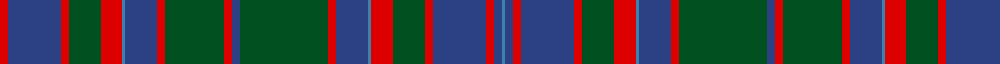

**Bands:** [RBRGRBBRGRBGRBBRGRBRBB](/stripes/rbrgrbbrgrbgrbbrgrbrbb/) · **Stripes:** [R DB R DG R T DB R DG R DB DG R DB T R DG R DB R DB T](/stripes/stripes22/) R DB R DG R T DB R DG R DB DG R DB T R DG R DB R DB T

This was sourced from register-of-tartans.  It is a [22 band tartan](/bands/bands22/).

Original link https://www.tartanregister.gov.uk/tartanDetails.aspx?ref=836

## Register references

External register numbers recorded for this tartan.

- Scottish Register of Tartans: [836](https://www.tartanregister.gov.uk/tartanDetails.aspx?ref=836)
- Scottish Tartans World Register: 1902

## Thread count
R/6 Ba40 R6 G24 R16 B2 Ba24 R6 G44 R6 Ba6 G66 R6 Ba24 B2 R16 G24 R6 Ba40 R6 Ba6 B/2

## Palette
Each colour and its ΔE from the base-6 reference it is a variant of.

| Colour | Shade | Base | ΔE (OKLab) |
|---|---|---|---|
| B | <code style="background-color:#3C82AF;">#3C82AF</code> `#3C82AF` | B <code style="background-color:#2A418A;">#2A418A</code> | 0.19 |
| Ba | <code style="background-color:#2C4084;">#2C4084</code> `#2C4084` | B <code style="background-color:#2A418A;">#2A418A</code> | 0.01 |
| G | <code style="background-color:#005020;">#005020</code> `#005020` | G <code style="background-color:#006100;">#006100</code> | 0.07 |
| R | <code style="background-color:#DC0000;">#DC0000</code> `#DC0000` | R <code style="background-color:#CC0000;">#CC0000</code> | 0.03 |

## Nearest tartans

The nearest existing variants by ΔTartan distance.

1. [Cumming of Glenorchy](/setts/s22/dg34r3db12t1r8dg12r3db20r3db3t1r3db20r3dg12r8t1db12r3dg22r3db3~x2/) — ΔT 0.06
1. [MacIntyre of Littleport](/setts/s21/r3db21r3dg7r7db8r3dg21r3db3r3dg21r3db8r6dg7r3db21r3db3t1~x2/) — ΔT 0.91
1. [Cumming, and Glenorchy](/setts/s22/r3db20r3g12r8t1db12r3g22r3db3g33r3db12t1r8g12r3db20r3db3t1~x2/) — ΔT 0.92
1. [Cumming, of Glenorchy](/setts/s22/g34r3db12t1r8g12r3db20r3db3t1r3db20r3g12r8t1db12r3g22r3db3~x2/) — ΔT 0.93
1. [MacIntyre, or Perthshire](/setts/s21/r3db21r3g7r7db8r3g21r3db3r3g21r3db8r6g7r3db21r3db3t1~x2/) — ΔT 1.02
1. [Cumming](/setts/s22/dg10r3db12t1r10dg12r3db20r3db3t1r3db20r3dg12r12t1db12r3dg20r3db3~x2/) — ΔT 1.05
1. [Cumming](/setts/s22/g10r3db12t1r10g12r3db20r3db3t1r3db20r3g12r12t1db12r3g20r3db3~x2/) — ΔT 1.12
1. [Unidentified Lindley #2](/setts/s18/r18db2r2db2r3db14dg29ly1dg2ly4~x2/) — ΔT 1.27
1. [Norwich No.023](/setts/s26/db2t1r2g16r2db6t1r2g6r2db16t1r2g2~x2/) — ΔT 1.34
1. [Nova Scotia](/setts/s18/g10dg2db2o14dg2g2dg2g2dg2db25o8g4dg4db3dg1db3dg1db4~x2/) — ΔT 1.46

## Neighbour map

Every grey dot is one of 14299 variants placed by the first two principal components of the ΔTartan feature space (44% of its variance). Red is this tartan; blue dots are its nearest — click one to open its page.

<svg viewBox="0 0 640 380" role="img" style="max-width:100%;height:auto;border:1px solid #e0e0e0;border-radius:4px;display:block" xmlns="http://www.w3.org/2000/svg"><image href="/nn/cloud.v1.png" width="640" height="380"/><a href="/setts/s22/dg34r3db12t1r8dg12r3db20r3db3t1r3db20r3dg12r8t1db12r3dg22r3db3~x2/"><circle cx="294.5" cy="120.8" r="4" fill="#3465a4"><title>Cumming of Glenorchy</title></circle></a><a href="/setts/s21/r3db21r3dg7r7db8r3dg21r3db3r3dg21r3db8r6dg7r3db21r3db3t1~x2/"><circle cx="258.7" cy="138.1" r="4" fill="#3465a4"><title>MacIntyre of Littleport</title></circle></a><a href="/setts/s22/r3db20r3g12r8t1db12r3g22r3db3g33r3db12t1r8g12r3db20r3db3t1~x2/"><circle cx="275.9" cy="115.0" r="4" fill="#3465a4"><title>Cumming, and Glenorchy</title></circle></a><a href="/setts/s22/g34r3db12t1r8g12r3db20r3db3t1r3db20r3g12r8t1db12r3g22r3db3~x2/"><circle cx="278.9" cy="113.3" r="4" fill="#3465a4"><title>Cumming, of Glenorchy</title></circle></a><a href="/setts/s21/r3db21r3g7r7db8r3g21r3db3r3g21r3db8r6g7r3db21r3db3t1~x2/"><circle cx="249.7" cy="135.2" r="4" fill="#3465a4"><title>MacIntyre, or Perthshire</title></circle></a><a href="/setts/s22/dg10r3db12t1r10dg12r3db20r3db3t1r3db20r3dg12r12t1db12r3dg20r3db3~x2/"><circle cx="247.5" cy="143.6" r="4" fill="#3465a4"><title>Cumming</title></circle></a><a href="/setts/s22/g10r3db12t1r10g12r3db20r3db3t1r3db20r3g12r12t1db12r3g20r3db3~x2/"><circle cx="239.7" cy="140.6" r="4" fill="#3465a4"><title>Cumming</title></circle></a><a href="/setts/s18/r18db2r2db2r3db14dg29ly1dg2ly4~x2/"><circle cx="303.0" cy="107.2" r="4" fill="#3465a4"><title>Unidentified Lindley #2</title></circle></a><a href="/setts/s26/db2t1r2g16r2db6t1r2g6r2db16t1r2g2~x2/"><circle cx="244.4" cy="124.1" r="4" fill="#3465a4"><title>Norwich No.023</title></circle></a><a href="/setts/s18/g10dg2db2o14dg2g2dg2g2dg2db25o8g4dg4db3dg1db3dg1db4~x2/"><circle cx="286.7" cy="141.3" r="4" fill="#3465a4"><title>Nova Scotia</title></circle></a><circle cx="291.2" cy="122.4" r="5" fill="#c00000"/></svg>

ID: /setts/s22/r3db20r3dg12r8t1db12r3dg22r3db3dg33r3db12t1r8dg12r3db20r3db3t1~x2/
