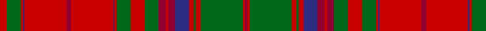

In pattern [RGRBRRRBRGRGRRRBRGRGRR](/stripes/rgrbrrrbrgrgrrrbrgrgrr/).

This was sourced from logan-1831.  It is a [22 stripe tartan](/stripes/stripes22/).

Original link /posts/logans-scottish-gael/

## Provenance

James Logan recorded the **MacDougall** sett in 1831, on page 405 of the *Table of Clan Tartans* in *The Scottish Gaël* — the earliest systematic published collection of clan setts. Logan gives the stripe widths in eighths of an inch, measured across the cloth and reflected about each end (a half-sett):

> 3 red · 6 green · 1 red · ½ blue · 18 red · 2 crimson · 18 red · ½ blue · 1 red · 6 green · 6 red · 6 green · 3 crimson · 1 red · 3 crimson · 6 blue · 2 red · 1 green · 2 red · 18 green · 1 red · 1 crimson

In threads (at 8 to the eighth-inch) that is `R/24 G48 R8 B4 R144 C16 R144 B4 R8 G48 R48 G48 C24 R8 C24 B48 R16 G8 R16 G144 R8 C/8`. Logan named his colours rather than dyeing to a standard, so the palette here is the Dictionary's modern reading of his names.

See [Logan's Scottish Gaël](/posts/logans-scottish-gael/) for the full table and method.

## Related setts

Later records of the **MacDougall** name adjusted Logan's counts: [MacDougall](/setts/s11/b4g8ba6b8r6g2r2g2r24g1r3~b5a008c-ba2c4084-g005020-rdc0000~x2/); [MacDougall (Kinloch Anderson)](/setts/s15/r7ra5rb5r31k9rb4ra3r5ra3rb4g30r4ra3rb5r5~g005020-k101010-rdc0000-rac82828-rb960000~x2/); [MacDougall #11](/setts/s15/r6ra3w3r4g33ra3w3r4w3ra3b9r33ra3w4r4~b2c4084-g005020-rdc0000-ra781c38-we0e0e0~x2/); [MacDougall #2](/setts/s24/b1r5ra2rb3g24rb5g2rb5ba11r3ra2rb2ra2r3g11rb11g11rb2ba2rb25r3ra2rb5b1~b3c82af-ba2c4084-g005020-r960028-rac82828-rbdc0000~x2/). Compare their thread counts with Logan's above.

## Thread count
R/24 G48 R8 DB4 R144 DR16 R144 DB4 R8 G48 R48 G48 DR24 R8 DR24 DB48 R16 G8 R16 G144 R8 DR/8

## Palette
Each colour and its ΔE from the base-6 reference it is a variant of.

| Colour | Shade | Base | ΔE (OKLab) |
|---|---|---|---|
| DB | <code style="background-color:#2C2C80;">#2C2C80</code> `#2C2C80` | B <code style="background-color:#2A418A;">#2A418A</code> | 0.06 |
| DR | <code style="background-color:#900030;">#900030</code> `#900030` | R <code style="background-color:#CC0000;">#CC0000</code> | 0.14 |
| G | <code style="background-color:#006818;">#006818</code> `#006818` | G <code style="background-color:#006100;">#006100</code> | 0.02 |
| R | <code style="background-color:#C80000;">#C80000</code> `#C80000` | R <code style="background-color:#CC0000;">#CC0000</code> | 0.01 |

## Nearest tartans

The nearest existing variants by ΔTartan distance.

1. [MacCoul](/setts/s18/r12r2r2g2r4g2r4db12r6r2r6g12r12g12r2db1r36r4~x2/) — ΔT 0.93
1. [Drummond](/setts/s16/r6db1r2db2r28t2r2db9r2g2r2g24r3db2r6db2~x2/) — ΔT 1.01
1. [MacCoul Clan Tartan Tartan Number: 1635. Earliest known date: 1850 This plate is taken from the manuscript of William and Andrew Smith's 'Authenticated Tartans of the Clans and Families of Scotland'. The Smith's sources included the findings of George Hunter, an Army clothier, who toured the Highlands in search of old tartans prior to 1822. See products available Copyright © Blair Urquhart, Comrie, 2015](/setts/s18/r12m2r2g2r4g2r4db12m6r2m6g12r12g12r2db1r36m4~x2/) — ΔT 1.11
1. [Dalziel (Clan)](/setts/s17/r24w1dp2r4g32r4dp2w1r4dp6r4w1dp2r32g6r6g6~x2/) — ΔT 1.13
1. [MacDougall 9](/setts/s27/r5g10r2db2r30p3r2w1r2p3r30db2r2g10r10g10p4r2p4db10r4g2r4g30r2p3w1~x2/) — ΔT 1.14
1. [MacDougall Clan Tartan Tartan Number: 1519. Earliest known date: 1815-16 The earliest reference to the MacDougall tartan is in the collection of the Highland Society of London where a sample exists, signed and sealed by the Clan Chief around 1815. The sett is a complex one and the nearest count to the present day day tartan comes from a sample in Paton's collection housed at the Scottish Tartans Museum, and dating to about 1830. The Highland Society also have a sample certified by the Chief MacDougall of MacDougall dated 1906, in their archives store at the Royal Caledonian School near London. See products available Copyright © Blair Urquhart, Comrie, 2015](/setts/s27/r5g10r2db2r30lr3r2w1r2lr3r30db2r2g10r10g10lr4r2lr4db10r4g2r4g30r2lr3w1~x2/) — ΔT 1.14
1. [MacDougall - 1970 (H of E)](/setts/s27/r5g10r2db2r30dp3r2w1r2dp3r30db2r2g10r10g10dp4r2dp4db10r4g2r4g30r2dp3w1~x2/) — ΔT 1.15
1. [MacDougal](/setts/s26/g10r2db2r30dp3r2w1r2dp3r30db2r2g10r10g10dp4r2dp4db10r4g2r4g30r2dp3w1~x2/) — ΔT 1.15
1. [Matheson Dress](/setts/s21/g8r4g1r1g1r24dp8g4r1g1r1g4r8g1r1g1r1dp8g8r2g4~x2/) — ΔT 1.21
1. [Fiddes](/setts/s18/g12r11p12k1p1k1r32g8p8g8p8r32k1p1k1p12r11g12~x2/) — ΔT 1.23

## Neighbour map

Every grey dot is one of 14299 variants placed by the first two principal components of the ΔTartan feature space (44% of its variance). Red is this tartan; blue dots are its nearest — click one to open its page.

<svg viewBox="0 0 640 380" role="img" style="max-width:100%;height:auto;border:1px solid #e0e0e0;border-radius:4px;display:block" xmlns="http://www.w3.org/2000/svg"><image href="/nn/cloud.v1.png" width="640" height="380"/><a href="/setts/s18/r12r2r2g2r4g2r4db12r6r2r6g12r12g12r2db1r36r4~x2/"><circle cx="380.6" cy="105.4" r="4" fill="#3465a4"><title>MacCoul</title></circle></a><a href="/setts/s16/r6db1r2db2r28t2r2db9r2g2r2g24r3db2r6db2~x2/"><circle cx="360.9" cy="99.6" r="4" fill="#3465a4"><title>Drummond</title></circle></a><a href="/setts/s18/r12m2r2g2r4g2r4db12m6r2m6g12r12g12r2db1r36m4~x2/"><circle cx="380.9" cy="103.8" r="4" fill="#3465a4"><title>MacCoul Clan Tartan Tartan Number: 1635. Earliest known date: 1850 This plate is taken from the manuscript of William and Andrew Smith's 'Authenticated Tartans of the Clans and Families of Scotland'. The Smith's sources included the findings of George Hunter, an Army clothier, who toured the Highlands in search of old tartans prior to 1822. See products available Copyright © Blair Urquhart, Comrie, 2015</title></circle></a><a href="/setts/s17/r24w1dp2r4g32r4dp2w1r4dp6r4w1dp2r32g6r6g6~x2/"><circle cx="345.3" cy="79.2" r="4" fill="#3465a4"><title>Dalziel (Clan)</title></circle></a><a href="/setts/s27/r5g10r2db2r30p3r2w1r2p3r30db2r2g10r10g10p4r2p4db10r4g2r4g30r2p3w1~x2/"><circle cx="306.3" cy="62.2" r="4" fill="#3465a4"><title>MacDougall 9</title></circle></a><a href="/setts/s27/r5g10r2db2r30lr3r2w1r2lr3r30db2r2g10r10g10lr4r2lr4db10r4g2r4g30r2lr3w1~x2/"><circle cx="306.5" cy="61.5" r="4" fill="#3465a4"><title>MacDougall Clan Tartan Tartan Number: 1519. Earliest known date: 1815-16 The earliest reference to the MacDougall tartan is in the collection of the Highland Society of London where a sample exists, signed and sealed by the Clan Chief around 1815. The sett is a complex one and the nearest count to the present day day tartan comes from a sample in Paton's collection housed at the Scottish Tartans Museum, and dating to about 1830. The Highland Society also have a sample certified by the Chief MacDougall of MacDougall dated 1906, in their archives store at the Royal Caledonian School near London. See products available Copyright © Blair Urquhart, Comrie, 2015</title></circle></a><a href="/setts/s27/r5g10r2db2r30dp3r2w1r2dp3r30db2r2g10r10g10dp4r2dp4db10r4g2r4g30r2dp3w1~x2/"><circle cx="307.8" cy="62.4" r="4" fill="#3465a4"><title>MacDougall - 1970 (H of E)</title></circle></a><a href="/setts/s26/g10r2db2r30dp3r2w1r2dp3r30db2r2g10r10g10dp4r2dp4db10r4g2r4g30r2dp3w1~x2/"><circle cx="301.3" cy="63.5" r="4" fill="#3465a4"><title>MacDougal</title></circle></a><a href="/setts/s21/g8r4g1r1g1r24dp8g4r1g1r1g4r8g1r1g1r1dp8g8r2g4~x2/"><circle cx="329.5" cy="115.4" r="4" fill="#3465a4"><title>Matheson Dress</title></circle></a><a href="/setts/s18/g12r11p12k1p1k1r32g8p8g8p8r32k1p1k1p12r11g12~x2/"><circle cx="317.2" cy="106.0" r="4" fill="#3465a4"><title>Fiddes</title></circle></a><circle cx="350.3" cy="91.1" r="5" fill="#c00000"/></svg>

ID: /setts/s22/r6g12r2db1r36r4r36db1r2g12r12g12r6r2r6db12r4g2r4g36r2r2~x4/
