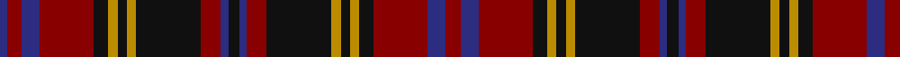

In pattern [BRBRKYKYKRBKBRKYKYKRBR](/patterns/brbrkykykrbkbrkykykrbr/).

This was sourced from register-of-tartans.  It is a [22 stripes tartan](/stripes/stripes22/).

Original link https://www.tartanregister.gov.uk/tartanDetails.aspx?ref=1895

## Register references

External register numbers recorded for this tartan.

- Scottish Register of Tartans: [1895](https://www.tartanregister.gov.uk/tartanDetails.aspx?ref=1895)
- Scottish Tartans Authority (ITI): 6100

## Thread count
DB/4 DR8 DB10 DR30 K8 DY5 K5 DY5 K36 DR11 DB4 K6 DB4 DR11 K36 DY5 K5 DY5 K8 DR30 DB10 DR/8

## Palette
Each colour and its ΔE from the base-6 reference it is a variant of.

| Colour | Shade | Base | ΔE (OKLab) |
|---|---|---|---|
| B | <code style="background-color:#1474B4;">#1474B4</code> `#1474B4` | B <code style="background-color:#2A418A;">#2A418A</code> | 0.15 |
| DB | <code style="background-color:#2C2C80;">#2C2C80</code> `#2C2C80` | B <code style="background-color:#2A418A;">#2A418A</code> | 0.06 |
| DBa | <code style="background-color:#303070;">#303070</code> `#303070` | B <code style="background-color:#2A418A;">#2A418A</code> | 0.06 |
| DR | <code style="background-color:#880000;">#880000</code> `#880000` | R <code style="background-color:#CC0000;">#CC0000</code> | 0.15 |
| DY | <code style="background-color:#BC8C00;">#BC8C00</code> `#BC8C00` | Y <code style="background-color:#F2BF00;">#F2BF00</code> | 0.16 |
| K | <code style="background-color:#101010;">#101010</code> `#101010` | K <code style="background-color:#000000;">#000000</code> | 0.17 |
| R | <code style="background-color:#C8002C;">#C8002C</code> `#C8002C` | R <code style="background-color:#CC0000;">#CC0000</code> | 0.03 |
| Y | <code style="background-color:#E8C000;">#E8C000</code> `#E8C000` | Y <code style="background-color:#F2BF00;">#F2BF00</code> | 0.02 |

## Nearest tartans

The nearest existing variants by ΔTartan distance.

1. [North Berwick Pipe Band District Tartan Tartan Number: 2342. Earliest known date: 1990 Designed by Donald Fraser for the North Berwick Pipe Band dancers for their visit to Maine USA in 1990. The Pipe Band itself normally wears McKenzie. See products available Copyright © Blair Urquhart, Comrie, 2015](/setts/s20/b10r2b10r10g2r2g2r2g10r1w2r1g10r2g2r2g2r10b10r2~b003c64-g003820-rc80000-wfcfcfc~x4/) — ΔT 1.07
1. [Cumming/Comyn/Buchan](/setts/s23/r6g6r1k8r1k1b1r1k8r1g6r6b1k6r1g8r1k1r1g8r1k6b1~b2c4084-g005020-k101010-rdc0000~x2/) — ΔT 1.17
1. [Reid Red Clan/Family Tartan Tartan Number: 5415. Earliest known date: pre 1991 Found in Dalgleish swatch files 1991, but in use long before then. known to be worn by James Reid of Washington D.C. Modification of Robertson. see 1428 for "Reid - green" designed by Phil Smith 1991 for Wm. M. Reid, Jr. (perhaps without knowledge of the previously existing "Reid - red"). See products available Copyright © Blair Urquhart, Comrie, 2015](/setts/s17/r3g3r18g6r4b3w3b18r6g18w3g3r3b4r18g3r3~b1c0070-g006818-r800000-wc0c0c0~x2/) — ΔT 1.24
1. [Johnnie Walker (2003) (Corporate)](/setts/s12/k6b4r11k36y5k5y5k8r30b10r8b4~b2c2c80-k101010-r880000-ybc8c00/) — ΔT 1.24
1. [Large (Personal)](/setts/s16/k2r17k2y2k2r8k2g2ka11g2k5g5k2g10r15k2~g5c6428-k101010-ka00002c-r880000-ye8c000~x2/) — ΔT 1.27
1. [MacRae Red Clan Tartan Tartan Number: 885. Earliest known date: pre 2003 Paton's 'Red MacRae' Alexander Macrae received the lands of Conchra and Ardachy in 1677 and became progenitor of the Macraes of Conchra. The Conchra tartan is blue and white. See products available Copyright © Blair Urquhart, Comrie, 2015](/setts/s20/g20r3g20r20b3r3b6r3b3r20b3r3b6r3b3r20w3r4b20r4~b202060-g003820-rc80000-we0e0e0/) — ΔT 1.34
1. [MacRae of Conchra](/setts/s20/g20r3g20r20b3r3b6r3b3r20b3r3b6r3b3r20w3r4b20r4~b000050-g003000-rc00000-we0e0e0/) — ΔT 1.39
1. [MacLachlan](/setts/s13/r16k2r2k2r2k16b16g3b16k16r16k2r2~b202060-g006818-k101010-rc80000~x2/) — ΔT 1.39
1. [Gwyn of Wales](/setts/s20/k3r30k2r4k2r30k3b30k35w2k35b30k3r30k2r4k2r30k3w2~b202060-k101010-r901c38-we0e0e0/) — ΔT 1.42
1. [Large (Personal)](/setts/s16/k2r15g10k2g5k5g2b11g2k2r8k2y2k2r15k2~b0c143c-g5c6428-k000000-r880000-yd09000~x2/) — ΔT 1.43

## Neighbour map

Every grey dot is one of 15726 variants placed by the first two principal components of the ΔTartan feature space (44% of its variance). Red is this tartan; blue dots are its nearest — click one to open its page.

<svg viewBox="0 0 640 380" role="img" style="max-width:100%;height:auto;border:1px solid #e0e0e0;border-radius:4px;display:block" xmlns="http://www.w3.org/2000/svg"><image href="/nn/cloud.v1.png" width="640" height="380"/><a href="/setts/s20/b10r2b10r10g2r2g2r2g10r1w2r1g10r2g2r2g2r10b10r2~b003c64-g003820-rc80000-wfcfcfc~x4/"><circle cx="192.5" cy="159.8" r="4" fill="#3465a4"><title>North Berwick Pipe Band District Tartan Tartan Number: 2342. Earliest known date: 1990 Designed by Donald Fraser for the North Berwick Pipe Band dancers for their visit to Maine USA in 1990. The Pipe Band itself normally wears McKenzie. See products available Copyright © Blair Urquhart, Comrie, 2015</title></circle></a><a href="/setts/s23/r6g6r1k8r1k1b1r1k8r1g6r6b1k6r1g8r1k1r1g8r1k6b1~b2c4084-g005020-k101010-rdc0000~x2/"><circle cx="177.4" cy="162.8" r="4" fill="#3465a4"><title>Cumming/Comyn/Buchan</title></circle></a><a href="/setts/s17/r3g3r18g6r4b3w3b18r6g18w3g3r3b4r18g3r3~b1c0070-g006818-r800000-wc0c0c0~x2/"><circle cx="220.0" cy="182.4" r="4" fill="#3465a4"><title>Reid Red Clan/Family Tartan Tartan Number: 5415. Earliest known date: pre 1991 Found in Dalgleish swatch files 1991, but in use long before then. known to be worn by James Reid of Washington D.C. Modification of Robertson. see 1428 for &quot;Reid - green&quot; designed by Phil Smith 1991 for Wm. M. Reid, Jr. (perhaps without knowledge of the previously existing &quot;Reid - red&quot;). See products available Copyright © Blair Urquhart, Comrie, 2015</title></circle></a><a href="/setts/s12/k6b4r11k36y5k5y5k8r30b10r8b4~b2c2c80-k101010-r880000-ybc8c00/"><circle cx="243.9" cy="185.5" r="4" fill="#3465a4"><title>Johnnie Walker (2003) (Corporate)</title></circle></a><a href="/setts/s16/k2r17k2y2k2r8k2g2ka11g2k5g5k2g10r15k2~g5c6428-k101010-ka00002c-r880000-ye8c000~x2/"><circle cx="212.6" cy="158.6" r="4" fill="#3465a4"><title>Large (Personal)</title></circle></a><a href="/setts/s20/g20r3g20r20b3r3b6r3b3r20b3r3b6r3b3r20w3r4b20r4~b202060-g003820-rc80000-we0e0e0/"><circle cx="238.8" cy="163.7" r="4" fill="#3465a4"><title>MacRae Red Clan Tartan Tartan Number: 885. Earliest known date: pre 2003 Paton's 'Red MacRae' Alexander Macrae received the lands of Conchra and Ardachy in 1677 and became progenitor of the Macraes of Conchra. The Conchra tartan is blue and white. See products available Copyright © Blair Urquhart, Comrie, 2015</title></circle></a><a href="/setts/s20/g20r3g20r20b3r3b6r3b3r20b3r3b6r3b3r20w3r4b20r4~b000050-g003000-rc00000-we0e0e0/"><circle cx="223.9" cy="161.4" r="4" fill="#3465a4"><title>MacRae of Conchra</title></circle></a><a href="/setts/s13/r16k2r2k2r2k16b16g3b16k16r16k2r2~b202060-g006818-k101010-rc80000~x2/"><circle cx="185.4" cy="187.3" r="4" fill="#3465a4"><title>MacLachlan</title></circle></a><a href="/setts/s20/k3r30k2r4k2r30k3b30k35w2k35b30k3r30k2r4k2r30k3w2~b202060-k101010-r901c38-we0e0e0/"><circle cx="296.3" cy="140.3" r="4" fill="#3465a4"><title>Gwyn of Wales</title></circle></a><a href="/setts/s16/k2r15g10k2g5k5g2b11g2k2r8k2y2k2r15k2~b0c143c-g5c6428-k000000-r880000-yd09000~x2/"><circle cx="180.4" cy="158.4" r="4" fill="#3465a4"><title>Large (Personal)</title></circle></a><circle cx="228.6" cy="160.4" r="5" fill="#c00000"/></svg>

ID: /setts/s22/r8b10r30k8y5k5y5k36r11b4k6b4r11k36y5k5y5k8r30b10r8b4~b2c2c80-k101010-r880000-ybc8c00/
