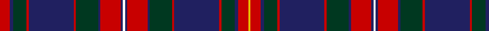

In pattern [RBGRBRGBRBWBRBGRBRGBRY](/patterns/rbgrbrgbrbwbrbgrbrgbry/).

This was sourced from register-of-tartans.  It is a [22 stripes tartan](/stripes/stripes22/).

Original link https://www.tartanregister.gov.uk/tartanDetails.aspx?ref=4991

## Thread count
R/18 DB6 DG24 R4 DB80 R4 DG40 DB4 R36 DB4 W4 DB4 R36 DB4 DG40 R4 DB80 R4 DG24 DB6 R18 Y/4

## Palette
Each colour and its ΔE from the base-6 reference it is a variant of.

| Colour | Shade | Base | ΔE (OKLab) |
|---|---|---|---|
| DB | <code style="background-color:#202060;">#202060</code> `#202060` | B <code style="background-color:#2A418A;">#2A418A</code> | 0.11 |
| DG | <code style="background-color:#003820;">#003820</code> `#003820` | G <code style="background-color:#006100;">#006100</code> | 0.15 |
| G | <code style="background-color:#006818;">#006818</code> `#006818` | G <code style="background-color:#006100;">#006100</code> | 0.02 |
| R | <code style="background-color:#C80000;">#C80000</code> `#C80000` | R <code style="background-color:#CC0000;">#CC0000</code> | 0.01 |
| W | <code style="background-color:#FCFCFC;">#FCFCFC</code> `#FCFCFC` | W <code style="background-color:#F7F7F7;">#F7F7F7</code> | 0.01 |
| Y | <code style="background-color:#E8C000;">#E8C000</code> `#E8C000` | Y <code style="background-color:#F2BF00;">#F2BF00</code> | 0.02 |

## Nearest tartans

The nearest existing variants by ΔTartan distance.

1. [Westmeath County Crest (Fashion)](/setts/s16/r4k1b8k1y3k2b4y6b4w3k2b20k4r21k1y3~b1c1c50-k101010-r880000-we0e0e0-ybc8c00~x2/) — ΔT 0.97
1. [Anderson of Kinnedear Red](/setts/s20/r4b6r2b2r4b6r3k4y2k2y2k4g2k4r22b1g2b1r6b3~b1c0070-g006818-k101010-r880000-yd09800~x2/) — ΔT 1.09
1. [Griffiths of Llangynin (Personal)](/setts/s18/b40k8r4k4r8k4r4k8g40k8r4k4r8k4r4k8b40y3~b202060-g285800-k101010-rc80000-ye8c000~x2/) — ΔT 1.12
1. [New Hampshire District Tartan Tartan Number: 1102. Earliest known date: 1994 New Hampshire State Representative Steven Avery, arranged for Governor Stephen Merrill to proclaim the Tartan as the State Tartan of New Hampshire in June 1994. In January 1995, Avery introduced the bill to the NH Legislature for permanent recognition, which was passed in May, 1995. The purple represents the finch and the lilac, green the forests, black the granite mountains, white for the snow, and red for the States heroes. New Hampshire Revised Statutes Annotated (RSA) 3:21. See products available Copyright © Blair Urquhart, Comrie, 2015](/setts/s21/g20k1g1k6w1k6b1k1b4r3b14r3b4k1b1k6w1k6g1k1g8~b780078-g006818-k101010-rc80000-we0e0e0~x2/) — ΔT 1.13
1. [Cairns of Finavon](/setts/s28/b16g3b3g3b3g16b3g3b3g3b16r15b1y3b1r15b16g15b3g3b3g15b16r15ba1r3ba1r15~b202060-ba1474b4-g006818-r980044-ye8c000~x2/) — ΔT 1.19
1. [Cairns of Finavon (Name)](/setts/s28/g16b3g3b3g3b16r15b1y3b1r15b16g15b3g3b3g15b16r15ba1r3ba1r15b16g3b3g3b3~b202060-ba1474b4-g006818-r980044-ye8c000~x2/) — ΔT 1.19
1. [Scottish Heritage Preservation](/setts/s26/b22k2b2k2b2k18g8w2g8k16b15b1k2b2k2b1b15k16g8w2g8k18b2k2b2k2~b780078-g006818-k101010-wc0c0c0~x2/) — ΔT 1.19
1. [Dryer](/setts/s29/b15k1b1k1b1k7r8k1y3k1r8k7b8k1ka3k1b8k7r8k1y3k1r8k7b1k1b1k1b9~b2c2c80-k101010-ka000000-r880000-ye8c000~x4/) — ΔT 1.26
1. [MacIntyre of Littleport](/setts/s21/r3b21r3g7r7b8r3g21r3b3r3g21r3b8r6g7r3b21r3b3ba1~b2c2c80-ba5c8ca8-g285800-rc80000~x2/) — ΔT 1.26
1. [Kormylo (Personal)](/setts/s12/w2b2r18b2g20r2b40r2g12b3r9y2~b202060-g003820-rc80000-wfcfcfc-ye8c000~x2/) — ΔT 1.28

## Neighbour map

Every grey dot is one of 15726 variants placed by the first two principal components of the ΔTartan feature space (44% of its variance). Red is this tartan; blue dots are its nearest — click one to open its page.

<svg viewBox="0 0 640 380" role="img" style="max-width:100%;height:auto;border:1px solid #e0e0e0;border-radius:4px;display:block" xmlns="http://www.w3.org/2000/svg"><image href="/nn/cloud.v1.png" width="640" height="380"/><a href="/setts/s16/r4k1b8k1y3k2b4y6b4w3k2b20k4r21k1y3~b1c1c50-k101010-r880000-we0e0e0-ybc8c00~x2/"><circle cx="221.8" cy="103.8" r="4" fill="#3465a4"><title>Westmeath County Crest (Fashion)</title></circle></a><a href="/setts/s20/r4b6r2b2r4b6r3k4y2k2y2k4g2k4r22b1g2b1r6b3~b1c0070-g006818-k101010-r880000-yd09800~x2/"><circle cx="286.2" cy="103.0" r="4" fill="#3465a4"><title>Anderson of Kinnedear Red</title></circle></a><a href="/setts/s18/b40k8r4k4r8k4r4k8g40k8r4k4r8k4r4k8b40y3~b202060-g285800-k101010-rc80000-ye8c000~x2/"><circle cx="209.8" cy="123.8" r="4" fill="#3465a4"><title>Griffiths of Llangynin (Personal)</title></circle></a><a href="/setts/s21/g20k1g1k6w1k6b1k1b4r3b14r3b4k1b1k6w1k6g1k1g8~b780078-g006818-k101010-rc80000-we0e0e0~x2/"><circle cx="184.3" cy="95.4" r="4" fill="#3465a4"><title>New Hampshire District Tartan Tartan Number: 1102. Earliest known date: 1994 New Hampshire State Representative Steven Avery, arranged for Governor Stephen Merrill to proclaim the Tartan as the State Tartan of New Hampshire in June 1994. In January 1995, Avery introduced the bill to the NH Legislature for permanent recognition, which was passed in May, 1995. The purple represents the finch and the lilac, green the forests, black the granite mountains, white for the snow, and red for the States heroes. New Hampshire Revised Statutes Annotated (RSA) 3:21. See products available Copyright © Blair Urquhart, Comrie, 2015</title></circle></a><a href="/setts/s28/b16g3b3g3b3g16b3g3b3g3b16r15b1y3b1r15b16g15b3g3b3g15b16r15ba1r3ba1r15~b202060-ba1474b4-g006818-r980044-ye8c000~x2/"><circle cx="209.7" cy="121.7" r="4" fill="#3465a4"><title>Cairns of Finavon</title></circle></a><a href="/setts/s28/g16b3g3b3g3b16r15b1y3b1r15b16g15b3g3b3g15b16r15ba1r3ba1r15b16g3b3g3b3~b202060-ba1474b4-g006818-r980044-ye8c000~x2/"><circle cx="209.7" cy="121.7" r="4" fill="#3465a4"><title>Cairns of Finavon (Name)</title></circle></a><a href="/setts/s26/b22k2b2k2b2k18g8w2g8k16b15b1k2b2k2b1b15k16g8w2g8k18b2k2b2k2~b780078-g006818-k101010-wc0c0c0~x2/"><circle cx="266.6" cy="118.0" r="4" fill="#3465a4"><title>Scottish Heritage Preservation</title></circle></a><a href="/setts/s29/b15k1b1k1b1k7r8k1y3k1r8k7b8k1ka3k1b8k7r8k1y3k1r8k7b1k1b1k1b9~b2c2c80-k101010-ka000000-r880000-ye8c000~x4/"><circle cx="178.0" cy="114.1" r="4" fill="#3465a4"><title>Dryer</title></circle></a><a href="/setts/s21/r3b21r3g7r7b8r3g21r3b3r3g21r3b8r6g7r3b21r3b3ba1~b2c2c80-ba5c8ca8-g285800-rc80000~x2/"><circle cx="256.5" cy="133.5" r="4" fill="#3465a4"><title>MacIntyre of Littleport</title></circle></a><a href="/setts/s12/w2b2r18b2g20r2b40r2g12b3r9y2~b202060-g003820-rc80000-wfcfcfc-ye8c000~x2/"><circle cx="247.0" cy="117.6" r="4" fill="#3465a4"><title>Kormylo (Personal)</title></circle></a><circle cx="246.8" cy="99.2" r="5" fill="#c00000"/></svg>

ID: /setts/s22/r9b3g12r2b40r2g20b2r18b2w2b2r18b2g20r2b40r2g12b3r9y2~b202060-g003820-rc80000-wfcfcfc-ye8c000~x2/
