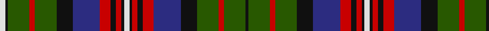

In pattern [KGRGKBRKRKWKRKRBKGRGKW](/stripes/kgrgkbrkrkwkrkrbkgrgkw/).

This was sourced from register-of-tartans.  It is a [22 stripe tartan](/stripes/stripes22/).

Original link https://www.tartanregister.gov.uk/tartanDetails.aspx?ref=5099

## Register references

External register numbers recorded for this tartan.

- Scottish Register of Tartans: [5099](https://www.tartanregister.gov.uk/tartanDetails.aspx?ref=5099)
- Scottish Tartans Authority (ITI): 3844

## Thread count
LN/4 K2 G16 R4 G16 K12 DB20 R8 K4 R4 K2 LN4 K2 R4 K4 R8 DB20 K12 G16 R4 G16 K/2

## Palette
Each colour and the base-6 reference it is a variant of.

| Colour | Shade | Base |
|---|---|---|
| DB | <code style="background-color:#2C2C80;">#2C2C80</code> `oklch(35.0% 0.138 276.6)` <small>#2C2C80</small> | B <code style="background-color:#2A418A;">#2A418A</code> |
| G | <code style="background-color:#285800;">#285800</code> `oklch(41.0% 0.122 135.8)` <small>#285800</small> | G <code style="background-color:#006100;">#006100</code> |
| K | <code style="background-color:#101010;">#101010</code> `oklch(17.3% 0.000 89.9)` <small>#101010</small> | K <code style="background-color:#000000;">#000000</code> |
| LN | <code style="background-color:#E0E0E0;">#E0E0E0</code> `oklch(90.7% 0.000 89.9)` <small>#E0E0E0</small> | W <code style="background-color:#F7F7F7;">#F7F7F7</code> |
| R | <code style="background-color:#C80000;">#C80000</code> `oklch(52.3% 0.215 29.2)` <small>#C80000</small> | R <code style="background-color:#CC0000;">#CC0000</code> |

## Nearest tartans

The nearest existing variants by ΔTartan distance, with this tartan at the top so the swatches line up against it.

ΔTartan

Tartan

Sett

—

<a href="/ttd/edit/#slug=w2k1dg8r2dg8k6db10r4k2r2k1w2~x2">Hargis</a> <a class="nn-out" href="/setts/s22/w2k1dg8r2dg8k6db10r4k2r2k1w2~x2/" title="open its dictionary page">↗</a>

0.84

<a href="/setts/s18/db3ly1db12k4ly2k4dg8r2dg8r1~x4/">MacMillan Hunting #2</a>

0.91

<a href="/ttd/edit/#slug=dt11k4dt4w2dt4k4dt11r26k4w3k4w2k14g10dt16g6~x2">Stuart-Houghton (Personal)</a> <a class="nn-out" href="/setts/s16/dt11k4dt4w2dt4k4dt11r26k4w3k4w2k14g10dt16g6~x2/" title="open its dictionary page">↗</a>

1.01

<a href="/ttd/edit/#slug=r5k3db10k3g20k3r5k3db5k3r5db5k3db5r5k3db5k3r5k3g20k3db10k3r5w3~x2">Schneidersohne Centenary</a> <a class="nn-out" href="/setts/s26/r5k3db10k3g20k3r5k3db5k3r5db5k3db5r5k3db5k3r5k3g20k3db10k3r5w3~x2/" title="open its dictionary page">↗</a>

1.07

<a href="/ttd/edit/#slug=o8w1o1n1o1k7n7k1n3k1n7k7o7k1n3~x2">Black Scottish National Tartan Tartan Number: 6622. Earliest known date: Marton Mills./Threadcount and colours aren't 100% original. Generated manually./ See products available Copyright © Blair Urquhart, Comrie, 2015</a> <a class="nn-out" href="/setts/s15/o8w1o1n1o1k7n7k1n3k1n7k7o7k1n3~x2/" title="open its dictionary page">↗</a>

1.08

<a href="/ttd/edit/#slug=k2r2k20r2g11r11lb2t11r2g19ly5g19r2t11lb2r11g11r2k20r2k2lb2~x2">Gordonstoun</a> <a class="nn-out" href="/setts/s22/k2r2k20r2g11r11lb2t11r2g19ly5g19r2t11lb2r11g11r2k20r2k2lb2~x2/" title="open its dictionary page">↗</a>

1.09

<a href="/ttd/edit/#slug=dp6k2dp6k12dp3k13ly2dg18dp3r3dp3dg18ly2k13dp15r5dp3r5~x2">Graham of Airth</a> <a class="nn-out" href="/setts/s18/dp6k2dp6k12dp3k13ly2dg18dp3r3dp3dg18ly2k13dp15r5dp3r5~x2/" title="open its dictionary page">↗</a>

1.10

<a href="/ttd/edit/#slug=r12db6k8g6r1g6r2g3k1ly2k1g1r1g2r1g7k9db11k1w2k1db11k9db8~x2">MacDonald of Pr Edward Island Tartan Tartan Number: 1973. Earliest known date: 1772 Estimated count from Coulson Bonner drawing. See products available Copyright © Blair Urquhart, Comrie, 2015</a> <a class="nn-out" href="/setts/s24/r12db6k8g6r1g6r2g3k1ly2k1g1r1g2r1g7k9db11k1w2k1db11k9db8~x2/" title="open its dictionary page">↗</a>

1.12

<a href="/ttd/edit/#slug=dg8k1dg1k1dg1k4m10w2m10k3dg3k6dg3k6dg3k3m10w3r4~x2">Pride of Loch Leven (Fashion?)</a> <a class="nn-out" href="/setts/s19/dg8k1dg1k1dg1k4m10w2m10k3dg3k6dg3k6dg3k3m10w3r4~x2/" title="open its dictionary page">↗</a>

1.15

<a href="/ttd/edit/#slug=r8dg8r2k14r2k2t2r2k14r2dg8r8t2db8r2dg14ly2dg2ly3dg2ly2dg14r2db8t2~x2">Gordonstoun (1957)</a> <a class="nn-out" href="/setts/s25/r8dg8r2k14r2k2t2r2k14r2dg8r8t2db8r2dg14ly2dg2ly3dg2ly2dg14r2db8t2~x2/" title="open its dictionary page">↗</a>

1.15

<a href="/ttd/edit/#slug=ly5dg2ly2dg15k9db2k2db2k2db9dg5db9k2db2k2db2k9dg15k2w4~x2">Fyvie</a> <a class="nn-out" href="/setts/s20/ly5dg2ly2dg15k9db2k2db2k2db9dg5db9k2db2k2db2k9dg15k2w4~x2/" title="open its dictionary page">↗</a>

## Neighbour map

Every grey dot is one of 14299 variants placed by the first two principal components of the ΔTartan feature space (44% of its variance). Red is this tartan; blue dots are its nearest — click one to open its page.

<svg viewBox="0 0 640 380" role="img" style="max-width:100%;height:auto;border:1px solid #e0e0e0;border-radius:4px;display:block" xmlns="http://www.w3.org/2000/svg"><image href="/nn/cloud.v1.png" width="640" height="380"/><a href="/setts/s18/db3ly1db12k4ly2k4dg8r2dg8r1~x4/"><circle cx="153.5" cy="157.8" r="4" fill="#3465a4"><title>MacMillan Hunting #2</title></circle></a><a href="/setts/s16/dt11k4dt4w2dt4k4dt11r26k4w3k4w2k14g10dt16g6~x2/"><circle cx="151.9" cy="145.3" r="4" fill="#3465a4"><title>Stuart-Houghton (Personal)</title></circle></a><a href="/setts/s26/r5k3db10k3g20k3r5k3db5k3r5db5k3db5r5k3db5k3r5k3g20k3db10k3r5w3~x2/"><circle cx="86.0" cy="149.7" r="4" fill="#3465a4"><title>Schneidersohne Centenary</title></circle></a><a href="/setts/s15/o8w1o1n1o1k7n7k1n3k1n7k7o7k1n3~x2/"><circle cx="118.2" cy="168.2" r="4" fill="#3465a4"><title>Black Scottish National Tartan Tartan Number: 6622. Earliest known date: Marton Mills./Threadcount and colours aren't 100% original. Generated manually./ See products available Copyright © Blair Urquhart, Comrie, 2015</title></circle></a><a href="/setts/s22/k2r2k20r2g11r11lb2t11r2g19ly5g19r2t11lb2r11g11r2k20r2k2lb2~x2/"><circle cx="110.5" cy="119.8" r="4" fill="#3465a4"><title>Gordonstoun</title></circle></a><a href="/setts/s18/dp6k2dp6k12dp3k13ly2dg18dp3r3dp3dg18ly2k13dp15r5dp3r5~x2/"><circle cx="123.1" cy="161.8" r="4" fill="#3465a4"><title>Graham of Airth</title></circle></a><a href="/setts/s24/r12db6k8g6r1g6r2g3k1ly2k1g1r1g2r1g7k9db11k1w2k1db11k9db8~x2/"><circle cx="107.6" cy="118.9" r="4" fill="#3465a4"><title>MacDonald of Pr Edward Island Tartan Tartan Number: 1973. Earliest known date: 1772 Estimated count from Coulson Bonner drawing. See products available Copyright © Blair Urquhart, Comrie, 2015</title></circle></a><a href="/setts/s19/dg8k1dg1k1dg1k4m10w2m10k3dg3k6dg3k6dg3k3m10w3r4~x2/"><circle cx="121.6" cy="146.6" r="4" fill="#3465a4"><title>Pride of Loch Leven (Fashion?)</title></circle></a><a href="/setts/s25/r8dg8r2k14r2k2t2r2k14r2dg8r8t2db8r2dg14ly2dg2ly3dg2ly2dg14r2db8t2~x2/"><circle cx="91.6" cy="128.6" r="4" fill="#3465a4"><title>Gordonstoun (1957)</title></circle></a><a href="/setts/s20/ly5dg2ly2dg15k9db2k2db2k2db9dg5db9k2db2k2db2k9dg15k2w4~x2/"><circle cx="131.1" cy="161.5" r="4" fill="#3465a4"><title>Fyvie</title></circle></a><circle cx="121.3" cy="148.5" r="5" fill="#c00000"/></svg>

ID: /setts/s22/w2k1dg8r2dg8k6db10r4k2r2k1w2~x2/
