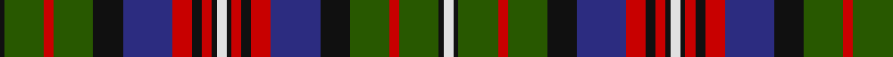

In pattern [KGRGKBRKRKWKRKRBKGRGKW](/patterns/kgrgkbrkrkwkrkrbkgrgkw/).

This was sourced from register-of-tartans.  It is a [22 stripes tartan](/stripes/stripes22/).

Original link https://www.tartanregister.gov.uk/tartanDetails.aspx?ref=5099

## Thread count
K/2 G16 R4 G16 K12 DB20 R8 K4 R4 K2 LN4 K2 R4 K4 R8 DB20 K12 G16 R4 G16 K2 LN/4

## Palette
Each colour and its ΔE from the base-6 reference it is a variant of.

| Colour | Shade | Base | ΔE (OKLab) |
|---|---|---|---|
| DB | <code style="background-color:#2C2C80;">#2C2C80</code> `#2C2C80` | B <code style="background-color:#2C4084;">#2C4084</code> | 0.05 |
| G | <code style="background-color:#285800;">#285800</code> `#285800` | G <code style="background-color:#006400;">#006400</code> | 0.04 |
| K | <code style="background-color:#101010;">#101010</code> `#101010` | K <code style="background-color:#000000;">#000000</code> | 0.17 |
| LN | <code style="background-color:#E0E0E0;">#E0E0E0</code> `#E0E0E0` | W <code style="background-color:#F4F4F0;">#F4F4F0</code> | 0.06 |
| R | <code style="background-color:#C80000;">#C80000</code> `#C80000` | R <code style="background-color:#C80000;">#C80000</code> | 0.00 |

## Nearest tartans

The nearest existing variants by ΔTartan distance.

1. [MacMillan Hunting #2](/setts/s18/b12y4b48k16y8k16g32r8g32r4g32r8g32k16y8k16b48y4-b2c2c80-g285800-k101010-rc80000-ye8c000/) — ΔT 0.83
1. [Stuart-Houghton (Personal)](/setts/s16/b22k8b8w4b8k8b22r52k8w6k8w4k28g20b32g12-b14283c-g006818-k101010-rc80000-we0e0e0/) — ΔT 0.91
1. [Schneidersohne Centenary Corporate Tartan Tartan Number: 4533. Earliest known date: April 2002 100 year celebration of German paper mill, Schneidersohne. The tartan design was prepared and presented to them by Inveresk in Scotland. See products available Copyright © Blair Urquhart, Comrie, 2015](/setts/s26/r10k6b20k6g40k6r10k6b10k6r10b10k6b10r10k6b10k6r10k6g40k6b20k6r10w6-b2c2c80-g006818-k101010-rc80028-we0e0e0/) — ΔT 1.01
1. [Schneidersohne Centenary](/setts/s26/r10k6b20k6g40k6r10k6b10k6r10b10k6b10r10k6b10k6r10k6g40k6b20k6r10w6-b2c2c80-g006818-k101010-rc8002c-we0e0e0/) — ΔT 1.02
1. [Black Scottish National Tartan Tartan Number: 6622. Earliest known date: Marton Mills./Threadcount and colours aren't 100% original. Generated manually./ See products available Copyright © Blair Urquhart, Comrie, 2015](/setts/s15/y16w2y2b2y2k14ba14k2ba6k2ba14k14y14k2b6-b58486c-ba534e4b-k080808-we0e0e0-y928d89/) — ΔT 1.07
1. [Gordonstoun](/setts/s22/k4r4k40r4g22r22w4b22r4g38y10g38r4b22w4r22g22r4k40r4k4w4-b5c8ca8-g408060-k101010-r800028-wa8ace8-ye8c000/) — ΔT 1.07
1. [Graham of Airth](/setts/s18/b12k4b12k24b6k26y4g36b6r6b6g36y4k26b30r10b6r10-b5a008c-g005020-k101010-rdc0000-ye8c000/) — ΔT 1.08
1. [MacDonald of Pr Edward Island Tartan Tartan Number: 1973. Earliest known date: 1772 Estimated count from Coulson Bonner drawing. See products available Copyright © Blair Urquhart, Comrie, 2015](/setts/s24/r24b12k16g12r2g12r4g6k2y4k2g2r2g4r2g14k18b22k2w4k2b22k18b16-b2c2c80-g006818-k101010-rc80000-we0e0e0-ye8c000/) — ΔT 1.10
1. [Pride of Loch Leven (Fashion?)](/setts/s19/g16k2g2k2g2k8r20w4r20k6g6k12g6k12g6k6r20w6ra8-g003820-k101010-r9c68a4-rac80000-wf8f8f8/) — ΔT 1.11
1. [Gordonstoun (1957)](/setts/s25/r16g16r4k28r4k4b4r4k28r4g16r16b4ba16r4g28y4g4y6g4y4g28r4ba16b4-b3c82af-ba2c4084-g005020-k101010-rdc0000-ye8c000/) — ΔT 1.14

## Neighbour map

Every grey dot is one of 15726 variants placed by the first two principal components of the ΔTartan feature space (44% of its variance). Red is this tartan; blue dots are its nearest — click one to open its page.

<svg viewBox="0 0 640 380" role="img" style="max-width:100%;height:auto;border:1px solid #e0e0e0;border-radius:4px;display:block" xmlns="http://www.w3.org/2000/svg"><image href="/nn/cloud.v1.png" width="640" height="380"/><a href="/setts/s18/b12y4b48k16y8k16g32r8g32r4g32r8g32k16y8k16b48y4-b2c2c80-g285800-k101010-rc80000-ye8c000/"><circle cx="148.4" cy="154.2" r="4" fill="#3465a4"><title>MacMillan Hunting #2</title></circle></a><a href="/setts/s16/b22k8b8w4b8k8b22r52k8w6k8w4k28g20b32g12-b14283c-g006818-k101010-rc80000-we0e0e0/"><circle cx="147.2" cy="142.9" r="4" fill="#3465a4"><title>Stuart-Houghton (Personal)</title></circle></a><a href="/setts/s26/r10k6b20k6g40k6r10k6b10k6r10b10k6b10r10k6b10k6r10k6g40k6b20k6r10w6-b2c2c80-g006818-k101010-rc80028-we0e0e0/"><circle cx="80.6" cy="146.8" r="4" fill="#3465a4"><title>Schneidersohne Centenary Corporate Tartan Tartan Number: 4533. Earliest known date: April 2002 100 year celebration of German paper mill, Schneidersohne. The tartan design was prepared and presented to them by Inveresk in Scotland. See products available Copyright © Blair Urquhart, Comrie, 2015</title></circle></a><a href="/setts/s26/r10k6b20k6g40k6r10k6b10k6r10b10k6b10r10k6b10k6r10k6g40k6b20k6r10w6-b2c2c80-g006818-k101010-rc8002c-we0e0e0/"><circle cx="80.6" cy="146.8" r="4" fill="#3465a4"><title>Schneidersohne Centenary</title></circle></a><a href="/setts/s15/y16w2y2b2y2k14ba14k2ba6k2ba14k14y14k2b6-b58486c-ba534e4b-k080808-we0e0e0-y928d89/"><circle cx="113.7" cy="166.0" r="4" fill="#3465a4"><title>Black Scottish National Tartan Tartan Number: 6622. Earliest known date: Marton Mills./Threadcount and colours aren't 100% original. Generated manually./ See products available Copyright © Blair Urquhart, Comrie, 2015</title></circle></a><a href="/setts/s22/k4r4k40r4g22r22w4b22r4g38y10g38r4b22w4r22g22r4k40r4k4w4-b5c8ca8-g408060-k101010-r800028-wa8ace8-ye8c000/"><circle cx="104.9" cy="117.0" r="4" fill="#3465a4"><title>Gordonstoun</title></circle></a><a href="/setts/s18/b12k4b12k24b6k26y4g36b6r6b6g36y4k26b30r10b6r10-b5a008c-g005020-k101010-rdc0000-ye8c000/"><circle cx="118.1" cy="158.7" r="4" fill="#3465a4"><title>Graham of Airth</title></circle></a><a href="/setts/s24/r24b12k16g12r2g12r4g6k2y4k2g2r2g4r2g14k18b22k2w4k2b22k18b16-b2c2c80-g006818-k101010-rc80000-we0e0e0-ye8c000/"><circle cx="101.5" cy="115.4" r="4" fill="#3465a4"><title>MacDonald of Pr Edward Island Tartan Tartan Number: 1973. Earliest known date: 1772 Estimated count from Coulson Bonner drawing. See products available Copyright © Blair Urquhart, Comrie, 2015</title></circle></a><a href="/setts/s19/g16k2g2k2g2k8r20w4r20k6g6k12g6k12g6k6r20w6ra8-g003820-k101010-r9c68a4-rac80000-wf8f8f8/"><circle cx="117.3" cy="145.7" r="4" fill="#3465a4"><title>Pride of Loch Leven (Fashion?)</title></circle></a><a href="/setts/s25/r16g16r4k28r4k4b4r4k28r4g16r16b4ba16r4g28y4g4y6g4y4g28r4ba16b4-b3c82af-ba2c4084-g005020-k101010-rdc0000-ye8c000/"><circle cx="86.4" cy="126.2" r="4" fill="#3465a4"><title>Gordonstoun (1957)</title></circle></a><circle cx="116.4" cy="145.7" r="5" fill="#c00000"/></svg>

ID: /setts/s22/w4k2g16r4g16k12b20r8k4r4k2w4k2r4k4r8b20k12g16r4g16k2-b2c2c80-g285800-k101010-rc80000-we0e0e0/
