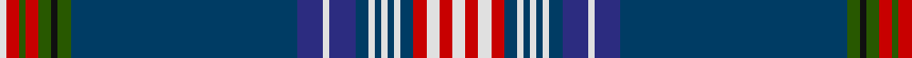

In pattern [WRGRGKGBBWBBWBWBWBRWRW](/patterns/wrgrgkgbbwbbwbwbwbrwrw/).

This was sourced from tartans-authority.  It is a [22 stripes tartan](/stripes/stripes22/).

Original link http://www.tartansauthority.com/tartan-ferret/display/11223/

## Thread count
LN/2 R4 G2 R4 G4 K2 G4 DBa70 DB8 LN2 DB8 DBa4 LN2 DBa2 LN2 DBa2 LN2 DBa4 R4 LN4 R4 LN/4

## Palette
Each colour and its ΔE from the base-6 reference it is a variant of.

| Colour | Shade | Base | ΔE (OKLab) |
|---|---|---|---|
| DB | <code style="background-color:#2C2C80;">#2C2C80</code> `#2C2C80` | B <code style="background-color:#2C4084;">#2C4084</code> | 0.05 |
| DBa | <code style="background-color:#003C64;">#003C64</code> `#003C64` | B <code style="background-color:#2C4084;">#2C4084</code> | 0.07 |
| G | <code style="background-color:#285800;">#285800</code> `#285800` | G <code style="background-color:#006400;">#006400</code> | 0.04 |
| K | <code style="background-color:#101010;">#101010</code> `#101010` | K <code style="background-color:#000000;">#000000</code> | 0.17 |
| LN | <code style="background-color:#E0E0E0;">#E0E0E0</code> `#E0E0E0` | W <code style="background-color:#F4F4F0;">#F4F4F0</code> | 0.06 |
| R | <code style="background-color:#C80000;">#C80000</code> `#C80000` | R <code style="background-color:#C80000;">#C80000</code> | 0.00 |

ID: /setts/s22/w4r4w4r4b4w2b2w2b2w2b4ba8w2ba8b70g4k2g4r4g2r4w2-b003c64-ba2c2c80-g285800-k101010-rc80000-we0e0e0/
