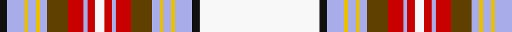

In pattern [KWYWYWGRWRWRWRGWYWYWKW](/patterns/kwywywgrwrwrwrgwywywkw/).

This was sourced from register-of-tartans.  It is a [22 stripes tartan](/stripes/stripes22/).

Original link https://www.tartanregister.gov.uk/tartanDetails.aspx?ref=3763

## Thread count
K/8 LP18 Y4 LP8 Y4 LP8 T22 R16 LP4 R8 Wa10 R8 LP4 R16 T22 LP8 Y4 LP8 Y4 LP18 K8 Wa/126

## Palette
Each colour and its ΔE from the base-6 reference it is a variant of.

| Colour | Shade | Base | ΔE (OKLab) |
|---|---|---|---|
| DR | <code style="background-color:#880000;">#880000</code> `#880000` | R <code style="background-color:#CC0000;">#CC0000</code> | 0.15 |
| DY | <code style="background-color:#D09800;">#D09800</code> `#D09800` | Y <code style="background-color:#F2BF00;">#F2BF00</code> | 0.12 |
| K | <code style="background-color:#101010;">#101010</code> `#101010` | K <code style="background-color:#000000;">#000000</code> | 0.17 |
| LP | <code style="background-color:#A8ACE8;">#A8ACE8</code> `#A8ACE8` | W <code style="background-color:#F7F7F7;">#F7F7F7</code> | 0.23 |
| R | <code style="background-color:#C80000;">#C80000</code> `#C80000` | R <code style="background-color:#CC0000;">#CC0000</code> | 0.01 |
| T | <code style="background-color:#604000;">#604000</code> `#604000` | G <code style="background-color:#006100;">#006100</code> | 0.14 |
| W | <code style="background-color:#FCFCFC;">#FCFCFC</code> `#FCFCFC` | W <code style="background-color:#F7F7F7;">#F7F7F7</code> | 0.01 |
| Wa | <code style="background-color:#F8F8F8;">#F8F8F8</code> `#F8F8F8` | W <code style="background-color:#F7F7F7;">#F7F7F7</code> | 0.00 |
| Y | <code style="background-color:#E8C000;">#E8C000</code> `#E8C000` | Y <code style="background-color:#F2BF00;">#F2BF00</code> | 0.02 |

## Nearest tartans

The nearest existing variants by ΔTartan distance.

1. [Oriflame](/setts/s24/w4y6w6ya21w9b27w10ya1b1ya5b1ya1w10r1ra1r5ra1r1w10b1r1b5r1b1~b5c5c5c-ra00048-radc0000-wf8f8f8-yb49870-yaa0a0a0~x2/) — ΔT 1.14
1. [Stewart/Stuart Dress (Four red lines)](/setts/s28/r4k3r15g42w5b3y3b13k13w66r4w2r2w10r2w2r4w66k13b13y3b3w5g42r15k3r4w2~b1c0070-g006818-k101010-rc80000-wfcfcfc-yd09800/) — ΔT 1.33
1. [Puccini's Madama Butterfly](/setts/s16/r6w1r1k15r1w2k1y5w25wa5k1ra5k1w5k1y5~k000000-rff0000-raf27e99-wffffff-waffd4de-ycdbf9a~x2/) — ΔT 1.39
1. [Oriflame](/setts/s24/w4wa6w6wa21w9b27w10wa1b1wa5b1wa1w10r1ra1r5ra1r1w10b1r1b5r1b1~b5c5c5c-ra00000-rac80000-wfcfcfc-wac0c0c0~x2/) — ΔT 1.41
1. [Strathyre Dress (Dance)](/setts/s18/w55g12r2g3w2ga10b9g2b6w2b6g2b9ga10w2g3r2g12~b780078-g285800-ga006818-rc80000-wf8f8f8~x2/) — ΔT 1.50
1. [Fyvie, Magenta (Dance)](/setts/s13/b12g1r4g1r4ba5w3ba5wa34ba5r2w2b4~b780078-ba542850-g003820-re87878-wb8dcc8-waf0e0c8~x2/) — ΔT 1.53
1. [Somerville Dress (Name?)](/setts/s18/w2r3ra6r48b4r2g16ra5r3ra5b20r5g3r5w54r3ra5y2~b2c2c80-g006818-rc80000-rae87878-we0e0e0-ye8c000~x2/) — ΔT 1.55
1. [Anderson](/setts/s26/r16g2w24g2r6k6r6g2w66y2k12y2w12y2k4y4k4y4k7r2k7r6g20r6g20r12~g006818-k101010-rc80000-wfcfcfc-yfccc00/) — ΔT 1.57
1. [MacDonald Dress #3](/setts/s31/b4r1b1r1b1r1b1r1k4r1k4g4r1g1r1g1r1g1r1g4k4w2r1w7ba3w23ba3w7r1w2k4~b2c4084-ba0596fa-g005020-k101010-rdc0000-we0e0e0~x2/) — ΔT 1.62
1. [MacDonald Dress Clan Tartan Tartan Number: 2001. Earliest known date: pre 2003 Estimated count See products available Copyright © Blair Urquhart, Comrie, 2015](/setts/s31/b4r1b1r1b1r1b1r1k4r1k4g4r1g1r1g1r1g1r1g4k4w2r1w7ba3w23ba3w7r1w2k4~b2c2c80-ba2888c4-g006818-k101010-rc80000-we0e0e0~x2/) — ΔT 1.64

## Neighbour map

Every grey dot is one of 15726 variants placed by the first two principal components of the ΔTartan feature space (44% of its variance). Red is this tartan; blue dots are its nearest — click one to open its page.

<svg viewBox="0 0 640 380" role="img" style="max-width:100%;height:auto;border:1px solid #e0e0e0;border-radius:4px;display:block" xmlns="http://www.w3.org/2000/svg"><image href="/nn/cloud.v1.png" width="640" height="380"/><a href="/setts/s24/w4y6w6ya21w9b27w10ya1b1ya5b1ya1w10r1ra1r5ra1r1w10b1r1b5r1b1~b5c5c5c-ra00048-radc0000-wf8f8f8-yb49870-yaa0a0a0~x2/"><circle cx="165.8" cy="32.3" r="4" fill="#3465a4"><title>Oriflame</title></circle></a><a href="/setts/s28/r4k3r15g42w5b3y3b13k13w66r4w2r2w10r2w2r4w66k13b13y3b3w5g42r15k3r4w2~b1c0070-g006818-k101010-rc80000-wfcfcfc-yd09800/"><circle cx="171.7" cy="14.0" r="4" fill="#3465a4"><title>Stewart/Stuart Dress (Four red lines)</title></circle></a><a href="/setts/s16/r6w1r1k15r1w2k1y5w25wa5k1ra5k1w5k1y5~k000000-rff0000-raf27e99-wffffff-waffd4de-ycdbf9a~x2/"><circle cx="148.0" cy="35.6" r="4" fill="#3465a4"><title>Puccini's Madama Butterfly</title></circle></a><a href="/setts/s24/w4wa6w6wa21w9b27w10wa1b1wa5b1wa1w10r1ra1r5ra1r1w10b1r1b5r1b1~b5c5c5c-ra00000-rac80000-wfcfcfc-wac0c0c0~x2/"><circle cx="185.1" cy="46.0" r="4" fill="#3465a4"><title>Oriflame</title></circle></a><a href="/setts/s18/w55g12r2g3w2ga10b9g2b6w2b6g2b9ga10w2g3r2g12~b780078-g285800-ga006818-rc80000-wf8f8f8~x2/"><circle cx="190.3" cy="43.8" r="4" fill="#3465a4"><title>Strathyre Dress (Dance)</title></circle></a><a href="/setts/s13/b12g1r4g1r4ba5w3ba5wa34ba5r2w2b4~b780078-ba542850-g003820-re87878-wb8dcc8-waf0e0c8~x2/"><circle cx="195.2" cy="36.4" r="4" fill="#3465a4"><title>Fyvie, Magenta (Dance)</title></circle></a><a href="/setts/s18/w2r3ra6r48b4r2g16ra5r3ra5b20r5g3r5w54r3ra5y2~b2c2c80-g006818-rc80000-rae87878-we0e0e0-ye8c000~x2/"><circle cx="176.7" cy="28.6" r="4" fill="#3465a4"><title>Somerville Dress (Name?)</title></circle></a><a href="/setts/s26/r16g2w24g2r6k6r6g2w66y2k12y2w12y2k4y4k4y4k7r2k7r6g20r6g20r12~g006818-k101010-rc80000-wfcfcfc-yfccc00/"><circle cx="171.5" cy="22.7" r="4" fill="#3465a4"><title>Anderson</title></circle></a><a href="/setts/s31/b4r1b1r1b1r1b1r1k4r1k4g4r1g1r1g1r1g1r1g4k4w2r1w7ba3w23ba3w7r1w2k4~b2c4084-ba0596fa-g005020-k101010-rdc0000-we0e0e0~x2/"><circle cx="159.9" cy="15.1" r="4" fill="#3465a4"><title>MacDonald Dress #3</title></circle></a><a href="/setts/s31/b4r1b1r1b1r1b1r1k4r1k4g4r1g1r1g1r1g1r1g4k4w2r1w7ba3w23ba3w7r1w2k4~b2c2c80-ba2888c4-g006818-k101010-rc80000-we0e0e0~x2/"><circle cx="160.3" cy="15.6" r="4" fill="#3465a4"><title>MacDonald Dress Clan Tartan Tartan Number: 2001. Earliest known date: pre 2003 Estimated count See products available Copyright © Blair Urquhart, Comrie, 2015</title></circle></a><circle cx="182.8" cy="14.0" r="5" fill="#c00000"/></svg>

ID: /setts/s22/w63k4wa9y2wa4y2wa4g11r8wa2r4w5r4wa2r8g11wa4y2wa4y2wa9k4~g604000-k101010-rc80000-wf8f8f8-waa8ace8-ye8c000~x2/
