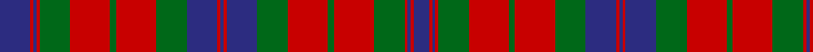

In pattern [BRBRGRGRGBRBRBGRGRGRBRB](/stripes/brbrgrgrgbrbrbgrgrgrbrb/).

This was sourced from logan-1831.  It is a [23 stripe tartan](/stripes/stripes23/).

Original link /posts/logans-scottish-gael/

## Provenance

James Logan recorded the **Fraser** sett in 1831, on page 403 of the *Table of Clan Tartans* in *The Scottish Gaël* — the earliest systematic published collection of clan setts. Logan gives the stripe widths in eighths of an inch, measured across the cloth and reflected about each end (a half-sett):

> 2½ blue · ½ red · ½ blue · ½ red · 5 green · 6½ red · 1 green · 6½ red · 5 green · 5 blue · ½ red · ½ blue · ½ red · 5 blue · 5 green · 6½ red · 1 green · 6½ red · 5 green · ½ red · ½ blue · ½ red · 5 blue

In threads (at 8 to the eighth-inch) that is `B/20 R4 B4 R4 G40 R52 G8 R52 G40 B40 R4 B4 R4 B40 G40 R52 G8 R52 G40 R4 B4 R4 B/40`. Logan named his colours rather than dyeing to a standard, so the palette here is the Dictionary's modern reading of his names.

See [Logan's Scottish Gaël](/posts/logans-scottish-gael/) for the full table and method.

## Related setts

Later records of the **Fraser** name adjusted Logan's counts: [Fraser (1745)](/setts/s6/r2b12r2g12r24w1~b2c2c80-g006818-rc80000-wfcfcfc~x2/); [Fraser of Stratherrick](/setts/s12/b20r2b2r2g19r18g2r18g19b19r2b2~b2c2c80-g006818-rc80000~x2/); [Fraser (Wilson 1820)](/setts/s9/b2r2b10r10b1r10g10r1b2~b2c2c80-g006818-rc80000~x4/); [Fraser Arisaid](/setts/s10/b14w2b3w2g10w32g10b10w2b3~b003c64-g006818-wc0c0c0~x2/). Compare their thread counts with Logan's above.

## Thread count
DB/40 R4 DB4 R4 G40 R52 G8 R52 G40 DB40 R4 DB4 R4 DB40 G40 R52 G8 R52 G40 R4 DB4 R4 DB/20

## Palette
Each colour and its ΔE from the base-6 reference it is a variant of.

| Colour | Shade | Base | ΔE (OKLab) |
|---|---|---|---|
| DB | <code style="background-color:#2C2C80;">#2C2C80</code> `#2C2C80` | B <code style="background-color:#2A418A;">#2A418A</code> | 0.06 |
| G | <code style="background-color:#006818;">#006818</code> `#006818` | G <code style="background-color:#006100;">#006100</code> | 0.02 |
| R | <code style="background-color:#C80000;">#C80000</code> `#C80000` | R <code style="background-color:#CC0000;">#CC0000</code> | 0.01 |

## Nearest tartans

The nearest existing variants by ΔTartan distance.

1. [Inverness Fencibles](/setts/s22/db10r1db1r1g10r13g2r13g10db10r1db1~x2/) — ΔT 0.21
1. [Ross](/setts/s20/db18r2db18r18dg2r4dg2r18dg18r2dg18r2dg18r18db1r1db2r1db1r18~x2/) — ΔT 0.87
1. [Stewart of Killiecrankie](/setts/s26/g6r2g2r18dp9r3g3r3dp9r3g24r2g2r4~x2/) — ΔT 0.93
1. [Ross 3](/setts/s20/db18r2db18r18g2r4g2r18g18r2g18r2g18r18db1r1db2r1db1r18~x2/) — ΔT 0.97
1. [Ross Clan Tartan Tartan Number: 864. Earliest known date: 1810-15 D.C.Stewart says, "The version here given may be taken to be correct." Later versions, including Logans, are known to have omissions. The Clan Ross is descended from Fearcher MacinTagart, Earl of Ross in the 13th century. The chiefship has passed to the Rosses of Shandwick. The tartan is also worn by the MacTiers. Also worn by the Metro Toronto Police pipe band. (Strathallan 1994) See products available Copyright © Blair Urquhart, Comrie, 2015](/setts/s27/g18r2g18r18g2r4g2r18db18r2db18r18db1r1db2r1db1r18db1r1db2r1db1r18g18r2g18~x2/) — ΔT 0.98
1. [Ross (Clan)](/setts/s27/g18r2g18r18g2r4g2r18db18r2db18r18db1r1db2r1db1r18db1r1g2r1db1r18g18r2g18~x2/) — ΔT 1.00
1. [Ross #4](/setts/s27/dg18r2dg18r18dg2r4dg2r18db18r2db18r18db1r1db2r1db1r18db1r1db2r1db1r18dg18r2dg18~x2/) — ΔT 1.03
1. [Matheson (Clan)](/setts/s21/dg8r4dg1r1dg1r14db8dg4r1dg1r1dg4r8dg1r1dg1r1db8dg8r2dg4~x4/) — ΔT 1.15
1. [Ross](/setts/s27/dg18r2dg18r18dg2r4dg2r18db18r2db18r18db1r1db2r1db1r18db1r1db2r1db1r18dg18r2dg18/) — ΔT 1.15
1. [Murray of Tullibardine 2](/setts/s21/db4r2db2r3db12r3db2r2k5r2db2r22db26r6g6r22g23r14db8r7k3~x2/) — ΔT 1.16

## Neighbour map

Every grey dot is one of 14299 variants placed by the first two principal components of the ΔTartan feature space (44% of its variance). Red is this tartan; blue dots are its nearest — click one to open its page.

<svg viewBox="0 0 640 380" role="img" style="max-width:100%;height:auto;border:1px solid #e0e0e0;border-radius:4px;display:block" xmlns="http://www.w3.org/2000/svg"><image href="/nn/cloud.v1.png" width="640" height="380"/><a href="/setts/s22/db10r1db1r1g10r13g2r13g10db10r1db1~x2/"><circle cx="253.7" cy="161.9" r="4" fill="#3465a4"><title>Inverness Fencibles</title></circle></a><a href="/setts/s20/db18r2db18r18dg2r4dg2r18dg18r2dg18r2dg18r18db1r1db2r1db1r18~x2/"><circle cx="287.6" cy="146.2" r="4" fill="#3465a4"><title>Ross</title></circle></a><a href="/setts/s26/g6r2g2r18dp9r3g3r3dp9r3g24r2g2r4~x2/"><circle cx="256.1" cy="142.5" r="4" fill="#3465a4"><title>Stewart of Killiecrankie</title></circle></a><a href="/setts/s20/db18r2db18r18g2r4g2r18g18r2g18r2g18r18db1r1db2r1db1r18~x2/"><circle cx="289.1" cy="149.9" r="4" fill="#3465a4"><title>Ross 3</title></circle></a><a href="/setts/s27/g18r2g18r18g2r4g2r18db18r2db18r18db1r1db2r1db1r18db1r1db2r1db1r18g18r2g18~x2/"><circle cx="292.8" cy="130.4" r="4" fill="#3465a4"><title>Ross Clan Tartan Tartan Number: 864. Earliest known date: 1810-15 D.C.Stewart says, &quot;The version here given may be taken to be correct.&quot; Later versions, including Logans, are known to have omissions. The Clan Ross is descended from Fearcher MacinTagart, Earl of Ross in the 13th century. The chiefship has passed to the Rosses of Shandwick. The tartan is also worn by the MacTiers. Also worn by the Metro Toronto Police pipe band. (Strathallan 1994) See products available Copyright © Blair Urquhart, Comrie, 2015</title></circle></a><a href="/setts/s27/g18r2g18r18g2r4g2r18db18r2db18r18db1r1db2r1db1r18db1r1g2r1db1r18g18r2g18~x2/"><circle cx="294.0" cy="130.7" r="4" fill="#3465a4"><title>Ross (Clan)</title></circle></a><a href="/setts/s27/dg18r2dg18r18dg2r4dg2r18db18r2db18r18db1r1db2r1db1r18db1r1db2r1db1r18dg18r2dg18~x2/"><circle cx="291.0" cy="127.5" r="4" fill="#3465a4"><title>Ross #4</title></circle></a><a href="/setts/s21/dg8r4dg1r1dg1r14db8dg4r1dg1r1dg4r8dg1r1dg1r1db8dg8r2dg4~x4/"><circle cx="282.2" cy="171.6" r="4" fill="#3465a4"><title>Matheson (Clan)</title></circle></a><a href="/setts/s27/dg18r2dg18r18dg2r4dg2r18db18r2db18r18db1r1db2r1db1r18db1r1db2r1db1r18dg18r2dg18/"><circle cx="298.2" cy="138.6" r="4" fill="#3465a4"><title>Ross</title></circle></a><a href="/setts/s21/db4r2db2r3db12r3db2r2k5r2db2r22db26r6g6r22g23r14db8r7k3~x2/"><circle cx="254.5" cy="133.5" r="4" fill="#3465a4"><title>Murray of Tullibardine 2</title></circle></a><circle cx="243.9" cy="161.1" r="5" fill="#c00000"/></svg>

ID: /setts/s23/db10r1db1r1g10r13g2r13g10db10r1db1r1db10g10r13g2r13g10r1db1r1db5~x4/
