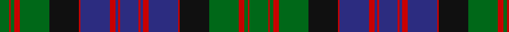

In pattern [GRGRGKRBRBRBRBRBRKGRGRG](/stripes/grgrgkrbrbrbrbrbrkgrgrg/).

This was sourced from logan-1831.  It is a [23 stripe tartan](/stripes/stripes23/).

Original link /posts/logans-scottish-gael/

## Provenance

James Logan recorded the **MacDonald** sett in 1831, on page 404 of the *Table of Clan Tartans* in *The Scottish Gaël* — the earliest systematic published collection of clan setts. Logan gives the stripe widths in eighths of an inch, measured across the cloth and reflected about each end (a half-sett):

> 2½ green · ½ red · 1 green · 1½ red · 8 green · 8 black · ½ red · 8 blue · 1½ red · ¾ blue · ½ red · 5 blue · ½ red · ¾ blue · 1½ red · 8 blue · ½ red · 8 black · 8 green · 1½ red · 1 green · ½ red · 5 green

In threads (at 8 to the eighth-inch) that is `G/20 R4 G8 R12 G64 K64 R4 B64 R12 B6 R4 B40 R4 B6 R12 B64 R4 K64 G64 R12 G8 R4 G/40`. Logan named his colours rather than dyeing to a standard, so the palette here is the Dictionary's modern reading of his names.

See [Logan's Scottish Gaël](/posts/logans-scottish-gael/) for the full table and method.

## Related setts

Later records of the **MacDonald** name adjusted Logan's counts: [MacDonald of Glencoe](/setts/s13/g3r1ra2g2ra16w1b4ra3g13ra1b1r1ra3~b2c2c80-g285800-re87878-ra880000-w98c8e8~x2/); [MacDonald](/setts/s12/b17r2b2r5b29r2k31g29r5g2r2g17~b2c2c80-g006818-k101010-rc80000~x2/); [MacDonald #2](/setts/s12/b11r2b2r4b15r2k15g15r4g2r2g11~b2c4084-g005020-k101010-rdc0000~x2/); [MacDonald #3](/setts/s12/b16r2b2r5b29r2k31g29r5g2r2g16~b2c4084-g005020-k101010-rdc0000~x2/). Compare their thread counts with Logan's above.

## Thread count
G/40 R4 G8 R12 G64 K64 R4 DB64 R12 DB6 R4 DB40 R4 DB6 R12 DB64 R4 K64 G64 R12 G8 R4 G/20

## Palette
Each colour and the base-6 reference it is a variant of.

| Colour | Shade | Base |
|---|---|---|
| DB | <code style="background-color:#2C2C80;">#2C2C80</code> `oklch(35.0% 0.138 276.6)` <small>#2C2C80</small> | B <code style="background-color:#2A418A;">#2A418A</code> |
| G | <code style="background-color:#006818;">#006818</code> `oklch(45.0% 0.142 145.0)` <small>#006818</small> | G <code style="background-color:#006100;">#006100</code> |
| K | <code style="background-color:#101010;">#101010</code> `oklch(17.3% 0.000 89.9)` <small>#101010</small> | K <code style="background-color:#000000;">#000000</code> |
| R | <code style="background-color:#C80000;">#C80000</code> `oklch(52.3% 0.215 29.2)` <small>#C80000</small> | R <code style="background-color:#CC0000;">#CC0000</code> |

## Nearest tartans

The nearest existing variants by ΔTartan distance, with this tartan at the top so the swatches line up against it.

ΔTartan

Tartan

Sett

—

<a href="/ttd/edit/#slug=g20r2g4r6g32k32r2db32r6db3r2db20r2db3r6db32r2k32g32r6g4r2g10~x2">MacDonald</a> <a class="nn-out" href="/setts/s23/g20r2g4r6g32k32r2db32r6db3r2db20r2db3r6db32r2k32g32r6g4r2g10~x2/" title="open its dictionary page">↗</a>

0.91

<a href="/ttd/edit/#slug=db12k1g2k1g2k1db12r2k12r1k12r2g12k1db2k1g12~x2">Stewart of Appin (Clan)</a> <a class="nn-out" href="/setts/s17/db12k1g2k1g2k1db12r2k12r1k12r2g12k1db2k1g12~x2/" title="open its dictionary page">↗</a>

0.91

<a href="/setts/s20/db30k2db2k2db2k32g15r2g4r4g30~x2/">Scottish Tourist Board (1981)</a>

0.92

<a href="/ttd/edit/#slug=ly2db8r3db16r1k16g16r3g1r1g8r1g1r3g16k16r1db16r3db8ly1~x4">Cameron</a> <a class="nn-out" href="/setts/s21/ly2db8r3db16r1k16g16r3g1r1g8r1g1r3g16k16r1db16r3db8ly1~x4/" title="open its dictionary page">↗</a>

0.93

<a href="/ttd/edit/#slug=db15k1db1k1db1k12g9r1g9k1w1k1g9r1g9k12r1db9r2db1r1db6w1~x2">Rankine</a> <a class="nn-out" href="/setts/s23/db15k1db1k1db1k12g9r1g9k1w1k1g9r1g9k12r1db9r2db1r1db6w1~x2/" title="open its dictionary page">↗</a>

0.95

<a href="/setts/s28/db23k3db3k3db3k17g22k2ly4k2g22k17db22k3db3~x2/">Gordon Clan</a>

0.97

<a href="/setts/s26/db2t1r2g16r2db6t1r2g6r2db16t1r2g2~x2/">Norwich No.023</a>

1.01

<a href="/ttd/edit/#slug=r10db6r3db3r3db28k22g28r2k2ly4k2r2g28k22db28r3db3r3db6r5~x2">Logan</a> <a class="nn-out" href="/setts/s21/r10db6r3db3r3db28k22g28r2k2ly4k2r2g28k22db28r3db3r3db6r5~x2/" title="open its dictionary page">↗</a>

1.02

<a href="/ttd/edit/#slug=db12k2db3k2db3k16g8r2g8k1k1w2g8r2g8k16r2db8r3db2r2db3w2~x2">Rankin (Dalgleish) #2</a> <a class="nn-out" href="/setts/s23/db12k2db3k2db3k16g8r2g8k1k1w2g8r2g8k16r2db8r3db2r2db3w2~x2/" title="open its dictionary page">↗</a>

1.02

<a href="/ttd/edit/#slug=g13k2g2k2g2k12dp16k1g2k1dp16k12g12k1ly2dp1~x2">Kettles, Ryan &amp; Alan (Personal)</a> <a class="nn-out" href="/setts/s16/g13k2g2k2g2k12dp16k1g2k1dp16k12g12k1ly2dp1~x2/" title="open its dictionary page">↗</a>

1.11

<a href="/ttd/edit/#slug=db11k1db1k1db1k9g9w1g1w1g1w1g9k9db8k1db1~x4">Baillie of Polkemmet</a> <a class="nn-out" href="/setts/s17/db11k1db1k1db1k9g9w1g1w1g1w1g9k9db8k1db1~x4/" title="open its dictionary page">↗</a>

## Neighbour map

Every grey dot is one of 14299 variants placed by the first two principal components of the ΔTartan feature space (44% of its variance). Red is this tartan; blue dots are its nearest — click one to open its page.

<svg viewBox="0 0 640 380" role="img" style="max-width:100%;height:auto;border:1px solid #e0e0e0;border-radius:4px;display:block" xmlns="http://www.w3.org/2000/svg"><image href="/nn/cloud.v1.png" width="640" height="380"/><a href="/setts/s17/db12k1g2k1g2k1db12r2k12r1k12r2g12k1db2k1g12~x2/"><circle cx="204.0" cy="170.1" r="4" fill="#3465a4"><title>Stewart of Appin (Clan)</title></circle></a><a href="/setts/s20/db30k2db2k2db2k32g15r2g4r4g30~x2/"><circle cx="243.7" cy="137.8" r="4" fill="#3465a4"><title>Scottish Tourist Board (1981)</title></circle></a><a href="/setts/s21/ly2db8r3db16r1k16g16r3g1r1g8r1g1r3g16k16r1db16r3db8ly1~x4/"><circle cx="168.8" cy="127.0" r="4" fill="#3465a4"><title>Cameron</title></circle></a><a href="/setts/s23/db15k1db1k1db1k12g9r1g9k1w1k1g9r1g9k12r1db9r2db1r1db6w1~x2/"><circle cx="180.6" cy="125.1" r="4" fill="#3465a4"><title>Rankine</title></circle></a><a href="/setts/s28/db23k3db3k3db3k17g22k2ly4k2g22k17db22k3db3~x2/"><circle cx="188.7" cy="156.0" r="4" fill="#3465a4"><title>Gordon Clan</title></circle></a><a href="/setts/s26/db2t1r2g16r2db6t1r2g6r2db16t1r2g2~x2/"><circle cx="244.4" cy="124.1" r="4" fill="#3465a4"><title>Norwich No.023</title></circle></a><a href="/setts/s21/r10db6r3db3r3db28k22g28r2k2ly4k2r2g28k22db28r3db3r3db6r5~x2/"><circle cx="168.8" cy="123.5" r="4" fill="#3465a4"><title>Logan</title></circle></a><a href="/setts/s23/db12k2db3k2db3k16g8r2g8k1k1w2g8r2g8k16r2db8r3db2r2db3w2~x2/"><circle cx="153.7" cy="126.8" r="4" fill="#3465a4"><title>Rankin (Dalgleish) #2</title></circle></a><a href="/setts/s16/g13k2g2k2g2k12dp16k1g2k1dp16k12g12k1ly2dp1~x2/"><circle cx="227.1" cy="160.9" r="4" fill="#3465a4"><title>Kettles, Ryan &amp; Alan (Personal)</title></circle></a><a href="/setts/s17/db11k1db1k1db1k9g9w1g1w1g1w1g9k9db8k1db1~x4/"><circle cx="187.8" cy="162.6" r="4" fill="#3465a4"><title>Baillie of Polkemmet</title></circle></a><circle cx="200.3" cy="139.3" r="5" fill="#c00000"/></svg>

ID: /setts/s23/g20r2g4r6g32k32r2db32r6db3r2db20r2db3r6db32r2k32g32r6g4r2g10~x2/
