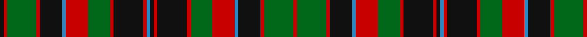

In pattern [KRGRKBRGRKRBKRKRGRBKRGR](/patterns/krgrkbrgrkrbkrkrgrbkrgr/).

This was sourced from register-of-tartans.  It is a [23 stripes tartan](/stripes/stripes23/).

Original link https://www.tartanregister.gov.uk/tartanDetails.aspx?ref=837

## Attestations

This cloth appears in 2 source records; the oldest owns this page.

- 01/01/1850 — Cumming Hunting (register-of-tartans, [record](https://www.tartanregister.gov.uk/tartanDetails.aspx?ref=837))
- 1850 — Cumming - 1970 Htg (Clan) (tartans-authority, [record](http://www.tartansauthority.com/tartan-ferret/display/4636/))

## Thread count
K/4 R4 G32 R4 K24 B4 R24 G24 R4 K32 R4 B4 K4 R4 K32 R4 G24 R24 B4 K24 R4 G32 R/4

## Palette
Each colour and its ΔE from the base-6 reference it is a variant of.

| Colour | Shade | Base | ΔE (OKLab) |
|---|---|---|---|
| B | <code style="background-color:#2888C4;">#2888C4</code> `#2888C4` | B <code style="background-color:#2A418A;">#2A418A</code> | 0.21 |
| DB | <code style="background-color:#2C2C80;">#2C2C80</code> `#2C2C80` | B <code style="background-color:#2A418A;">#2A418A</code> | 0.06 |
| G | <code style="background-color:#006818;">#006818</code> `#006818` | G <code style="background-color:#006100;">#006100</code> | 0.02 |
| K | <code style="background-color:#101010;">#101010</code> `#101010` | K <code style="background-color:#000000;">#000000</code> | 0.17 |
| R | <code style="background-color:#C80000;">#C80000</code> `#C80000` | R <code style="background-color:#CC0000;">#CC0000</code> | 0.01 |

## Nearest tartans

The nearest existing variants by ΔTartan distance.

1. [Cumming Comyn Buchan Clan Tartan Tartan Number: 2012. Earliest known date: pre 2003 D.C.Stewart comments, "Still further confusion has arisen from Smibert's illustration.." The present editor is none the wiser. See products available Copyright © Blair Urquhart, Comrie, 2015](/setts/s23/r6g6r1k8r1k1b1r1k8r1g6r6b1k6r1g8r1k1r1g8r1k6b1~b2c2c80-g006818-k101010-rc80000~x2/) — ΔT 0.14
1. [Cumming/Comyn/Buchan](/setts/s23/r6g6r1k8r1k1b1r1k8r1g6r6b1k6r1g8r1k1r1g8r1k6b1~b2c4084-g005020-k101010-rdc0000~x2/) — ΔT 0.45
1. [Kilbarchan Unidentified No. 7](/setts/s28/b4r4k4r6g24r4k3r6g3r4k24r6g4r4b4r4g4r6k24r4g3r6k3r4g24r6k4r4~b2888c4-g006818-k101010-rc80000~x2/) — ΔT 0.83
1. [Blackburn Appalachian Hunting](/setts/s16/g7k2g7y1k2y1k10y3r10y3k10y1g11k2g3k2~g124b24-k120a01-rdd1212-yf9c75c~x2/) — ΔT 1.12
1. [Comyn / Cumming, Buchan](/setts/s23/r6g6r1k8r1k1b1r1k8r1g6r6b1k6r1g8r1k1r1g8r1k6b1~b304080-g008000-k000000-rc00000~x2/) — ΔT 1.16
1. [North Berwick Pipe Band District Tartan Tartan Number: 2342. Earliest known date: 1990 Designed by Donald Fraser for the North Berwick Pipe Band dancers for their visit to Maine USA in 1990. The Pipe Band itself normally wears McKenzie. See products available Copyright © Blair Urquhart, Comrie, 2015](/setts/s20/b10r2b10r10g2r2g2r2g10r1w2r1g10r2g2r2g2r10b10r2~b003c64-g003820-rc80000-wfcfcfc~x4/) — ΔT 1.19
1. [Wilson (Clan)](/setts/s22/b45w4b6g6b6g6b6g37r6g6r6g6r6g6r6g39r27g6b6r12w4r30~b2c2c80-g006818-rc80000-wfcfcfc/) — ΔT 1.20
1. [Wilson Clan Tartan Tartan Number: 626. Earliest known date: 1780 Named after Janet Wilson, wife of the Bannockburn weaver, William Wilson who manufactured tartans from 1765. It is suggested in the extensive archives of the company that the tartan was prepared for the wedding in 1780 between the William Wilson, the son of the founder, and Janet Paterson. The sett was later introduced as the Wilson family tartan. Variations show blue instead of purple in the broad band and blue instead of azure (light blue) in the narrow stripes. See products available Copyright © Blair Urquhart, Comrie, 2015](/setts/s22/b45w4b6g6b6g6b6g37r6g6r6g6r6g6r6g39r27g6b6r12w4r30~b2c2c80-g006818-rc80000-we0e0e0/) — ΔT 1.21
1. [Innes of Cowie (Clan?)](/setts/s31/b1k6r1k1r1k1r6w1r2g3r2k1g5k1r2w1r2k1g5k1r2g3r2w1r6k1r1k1r1k6g1~b1c0070-g006818-k101010-r880000-wfcfcfc~x4/) — ΔT 1.29
1. [Wilson](/setts/s22/b45w4b6g6b6g6b6g37r6g6r6g6r6g6r6g39r27g6b6r12w4r30~b304080-g008000-rc00000-we0e0e0/) — ΔT 1.34

## Neighbour map

Every grey dot is one of 15726 variants placed by the first two principal components of the ΔTartan feature space (44% of its variance). Red is this tartan; blue dots are its nearest — click one to open its page.

<svg viewBox="0 0 640 380" role="img" style="max-width:100%;height:auto;border:1px solid #e0e0e0;border-radius:4px;display:block" xmlns="http://www.w3.org/2000/svg"><image href="/nn/cloud.v1.png" width="640" height="380"/><a href="/setts/s23/r6g6r1k8r1k1b1r1k8r1g6r6b1k6r1g8r1k1r1g8r1k6b1~b2c2c80-g006818-k101010-rc80000~x2/"><circle cx="173.3" cy="162.0" r="4" fill="#3465a4"><title>Cumming Comyn Buchan Clan Tartan Tartan Number: 2012. Earliest known date: pre 2003 D.C.Stewart comments, &quot;Still further confusion has arisen from Smibert's illustration..&quot; The present editor is none the wiser. See products available Copyright © Blair Urquhart, Comrie, 2015</title></circle></a><a href="/setts/s23/r6g6r1k8r1k1b1r1k8r1g6r6b1k6r1g8r1k1r1g8r1k6b1~b2c4084-g005020-k101010-rdc0000~x2/"><circle cx="177.4" cy="162.8" r="4" fill="#3465a4"><title>Cumming/Comyn/Buchan</title></circle></a><a href="/setts/s28/b4r4k4r6g24r4k3r6g3r4k24r6g4r4b4r4g4r6k24r4g3r6k3r4g24r6k4r4~b2888c4-g006818-k101010-rc80000~x2/"><circle cx="163.3" cy="136.4" r="4" fill="#3465a4"><title>Kilbarchan Unidentified No. 7</title></circle></a><a href="/setts/s16/g7k2g7y1k2y1k10y3r10y3k10y1g11k2g3k2~g124b24-k120a01-rdd1212-yf9c75c~x2/"><circle cx="163.3" cy="162.5" r="4" fill="#3465a4"><title>Blackburn Appalachian Hunting</title></circle></a><a href="/setts/s23/r6g6r1k8r1k1b1r1k8r1g6r6b1k6r1g8r1k1r1g8r1k6b1~b304080-g008000-k000000-rc00000~x2/"><circle cx="140.1" cy="152.1" r="4" fill="#3465a4"><title>Comyn / Cumming, Buchan</title></circle></a><a href="/setts/s20/b10r2b10r10g2r2g2r2g10r1w2r1g10r2g2r2g2r10b10r2~b003c64-g003820-rc80000-wfcfcfc~x4/"><circle cx="192.5" cy="159.8" r="4" fill="#3465a4"><title>North Berwick Pipe Band District Tartan Tartan Number: 2342. Earliest known date: 1990 Designed by Donald Fraser for the North Berwick Pipe Band dancers for their visit to Maine USA in 1990. The Pipe Band itself normally wears McKenzie. See products available Copyright © Blair Urquhart, Comrie, 2015</title></circle></a><a href="/setts/s22/b45w4b6g6b6g6b6g37r6g6r6g6r6g6r6g39r27g6b6r12w4r30~b2c2c80-g006818-rc80000-wfcfcfc/"><circle cx="208.6" cy="133.4" r="4" fill="#3465a4"><title>Wilson (Clan)</title></circle></a><a href="/setts/s22/b45w4b6g6b6g6b6g37r6g6r6g6r6g6r6g39r27g6b6r12w4r30~b2c2c80-g006818-rc80000-we0e0e0/"><circle cx="212.3" cy="134.9" r="4" fill="#3465a4"><title>Wilson Clan Tartan Tartan Number: 626. Earliest known date: 1780 Named after Janet Wilson, wife of the Bannockburn weaver, William Wilson who manufactured tartans from 1765. It is suggested in the extensive archives of the company that the tartan was prepared for the wedding in 1780 between the William Wilson, the son of the founder, and Janet Paterson. The sett was later introduced as the Wilson family tartan. Variations show blue instead of purple in the broad band and blue instead of azure (light blue) in the narrow stripes. See products available Copyright © Blair Urquhart, Comrie, 2015</title></circle></a><a href="/setts/s31/b1k6r1k1r1k1r6w1r2g3r2k1g5k1r2w1r2k1g5k1r2g3r2w1r6k1r1k1r1k6g1~b1c0070-g006818-k101010-r880000-wfcfcfc~x4/"><circle cx="145.6" cy="142.5" r="4" fill="#3465a4"><title>Innes of Cowie (Clan?)</title></circle></a><a href="/setts/s22/b45w4b6g6b6g6b6g37r6g6r6g6r6g6r6g39r27g6b6r12w4r30~b304080-g008000-rc00000-we0e0e0/"><circle cx="211.7" cy="135.0" r="4" fill="#3465a4"><title>Wilson</title></circle></a><circle cx="169.7" cy="160.5" r="5" fill="#c00000"/></svg>

ID: /setts/s23/k1r1g8r1k6b1r6g6r1k8r1b1k1r1k8r1g6r6b1k6r1g8r1~b2888c4-g006818-k101010-rc80000~x4/
