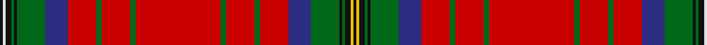

In pattern [KWKGKGBRGRGRGRGRBGKGKYK](/patterns/kwkgkgbrgrgrgrgrbgkgkyk/).

This was sourced from tartans-authority.  It is a [23 stripes tartan](/stripes/stripes23/).

Original link http://www.tartansauthority.com/tartan-ferret/display/10359/

## Thread count
K/2 LN2 K4 G2 K2 G20 DB16 R20 G4 R20 G4 R60 G4 R20 G4 R20 DB16 G20 K2 G2 K4 Y2 K/2

## Palette
Each colour and its ΔE from the base-6 reference it is a variant of.

| Colour | Shade | Base | ΔE (OKLab) |
|---|---|---|---|
| DB | <code style="background-color:#2C2C80;">#2C2C80</code> `#2C2C80` | B <code style="background-color:#2A418A;">#2A418A</code> | 0.06 |
| G | <code style="background-color:#006818;">#006818</code> `#006818` | G <code style="background-color:#006100;">#006100</code> | 0.02 |
| K | <code style="background-color:#101010;">#101010</code> `#101010` | K <code style="background-color:#000000;">#000000</code> | 0.17 |
| LN | <code style="background-color:#E0E0E0;">#E0E0E0</code> `#E0E0E0` | W <code style="background-color:#F7F7F7;">#F7F7F7</code> | 0.07 |
| R | <code style="background-color:#C80000;">#C80000</code> `#C80000` | R <code style="background-color:#CC0000;">#CC0000</code> | 0.01 |
| Y | <code style="background-color:#E8C000;">#E8C000</code> `#E8C000` | Y <code style="background-color:#F2BF00;">#F2BF00</code> | 0.02 |

## Nearest tartans

The nearest existing variants by ΔTartan distance.

1. [Stewart/Stuart of Galloway (VS)](/setts/s22/r24k4y1k2w1b4g6r3k1r2w1r2k1r3g6b4w1k2y1k4r24k3x4~b202060-g285800-k101010-rc80000-wfcfcfc-yd8b000/) — ΔT 0.92
1. [MacDougall - 1970 (H of E)](/setts/s27/r5g10r2b2r30ba3r2w1r2ba3r30b2r2g10r10g10ba4r2ba4b10r4g2r4g30r2ba3w1x2~b2c2c80-ba6c0070-g006818-rc80000-wfcfcfc/) — ΔT 1.07
1. [MacDougal](/setts/s26/g10r2b2r30ba3r2w1r2ba3r30b2r2g10r10g10ba4r2ba4b10r4g2r4g30r2ba3w1x2~b2c2c80-ba6c0070-g006818-rc80000-wfcfcfc/) — ΔT 1.12
1. [Unidentified Plaid #8](/setts/s22/w5r99g12r4g2r12g2r4g12r24b15k29g24r12g4r2g12r2g4r12g49y5x2~b0596fa-g005020-k101010-rdc0000-we0e0e0-ye8c000/) — ΔT 1.13
1. [MacAlister Modern (Lochcarron)](/setts/s25/r18b1r1g8r1b1r6w1r1ba4r1w1r2g3ga1r2ga1g3r3w1r1ba2r1w1r8x2~b2888c4-ba2c2c80-g006818-ga289c18-rc80000-we0e0e0/) — ΔT 1.15
1. [Unnamed C18th - Duke of Perth](/setts/s26/b30r14b2r14g20w1g2w1g20r44b4r10ba1r4ba1r10b4r44g20w1g2w1g20r14b2r14x2~b2c2c80-ba5c8ca8-g006818-rc80000-we0e0e0/) — ΔT 1.15
1. [MacDougall Clan Tartan Tartan Number: 1519. Earliest known date: 1815-16 The earliest reference to the MacDougall tartan is in the collection of the Highland Society of London where a sample exists, signed and sealed by the Clan Chief around 1815. The sett is a complex one and the nearest count to the present day day tartan comes from a sample in Paton's collection housed at the Scottish Tartans Museum, and dating to about 1830. The Highland Society also have a sample certified by the Chief MacDougall of MacDougall dated 1906, in their archives store at the Royal Caledonian School near London. See products available Copyright © Blair Urquhart, Comrie, 2015](/setts/s27/r5g10r2b2r30y3r2w1r2y3r30b2r2g10r10g10y4r2y4b10r4g2r4g30r2y3w1x2~b2c2c80-g006818-rc80000-we0e0e0-yc090a0/) — ΔT 1.17
1. [MacDougall 9](/setts/s27/r5g10r2b2r30ba3r2w1r2ba3r30b2r2g10r10g10ba4r2ba4b10r4g2r4g30r2ba3w1x2~b304080-ba800080-g008000-rc00000-we0e0e0/) — ΔT 1.17
1. [Dalziel (Logan) Family Tartan Tartan Number: 969. Earliest known date: 1831 Dalziel or Dalzell tartan is similar to the Munro. The basic form of the design was used for a 'George IV' tartan produced in honour of the King's visit in 1822. The Barony of Dalzell in Lanarkshire is the origin of the name. In Old Scots it means 'I dare' and this is also the motto on the family coat of arms. A cadet branch of the family built the House of the Binns in West Lothian which is now owned by the National Trust for Scotland. See products available Copyright © Blair Urquhart, Comrie, 2015](/setts/s17/r24w1b2r4g32r4b2w1r4b6r4w1b2r32g2ra3g6x2~b2c2c80-g006818-rc80000-raa00048-we0e0e0/) — ΔT 1.20
1. [Muzzi, Massimiliano Baron of Striche](/setts/s16/y2r1ra19k2ra8k3g9k3g6k2b6k1b5k2ra27w1x2~b2c2c80-g006818-k101010-r888888-rac80000-wfcfcfc-yfccc00/) — ΔT 1.22

## Neighbour map

Every grey dot is one of 15726 variants placed by the first two principal components of the ΔTartan feature space (44% of its variance). Red is this tartan; blue dots are its nearest — click one to open its page.

<svg viewBox="0 0 640 380" role="img" style="max-width:100%;height:auto;border:1px solid #e0e0e0;border-radius:4px;display:block" xmlns="http://www.w3.org/2000/svg"><image href="/nn/cloud.v1.png" width="640" height="380"/><a href="/setts/s22/r24k4y1k2w1b4g6r3k1r2w1r2k1r3g6b4w1k2y1k4r24k3x4~b202060-g285800-k101010-rc80000-wfcfcfc-yd8b000/"><circle cx="310.3" cy="43.6" r="4" fill="#3465a4"><title>Stewart/Stuart of Galloway (VS)</title></circle></a><a href="/setts/s27/r5g10r2b2r30ba3r2w1r2ba3r30b2r2g10r10g10ba4r2ba4b10r4g2r4g30r2ba3w1x2~b2c2c80-ba6c0070-g006818-rc80000-wfcfcfc/"><circle cx="307.3" cy="60.7" r="4" fill="#3465a4"><title>MacDougall - 1970 (H of E)</title></circle></a><a href="/setts/s26/g10r2b2r30ba3r2w1r2ba3r30b2r2g10r10g10ba4r2ba4b10r4g2r4g30r2ba3w1x2~b2c2c80-ba6c0070-g006818-rc80000-wfcfcfc/"><circle cx="300.6" cy="61.7" r="4" fill="#3465a4"><title>MacDougal</title></circle></a><a href="/setts/s22/w5r99g12r4g2r12g2r4g12r24b15k29g24r12g4r2g12r2g4r12g49y5x2~b0596fa-g005020-k101010-rdc0000-we0e0e0-ye8c000/"><circle cx="298.8" cy="21.6" r="4" fill="#3465a4"><title>Unidentified Plaid #8</title></circle></a><a href="/setts/s25/r18b1r1g8r1b1r6w1r1ba4r1w1r2g3ga1r2ga1g3r3w1r1ba2r1w1r8x2~b2888c4-ba2c2c80-g006818-ga289c18-rc80000-we0e0e0/"><circle cx="328.1" cy="58.9" r="4" fill="#3465a4"><title>MacAlister Modern (Lochcarron)</title></circle></a><a href="/setts/s26/b30r14b2r14g20w1g2w1g20r44b4r10ba1r4ba1r10b4r44g20w1g2w1g20r14b2r14x2~b2c2c80-ba5c8ca8-g006818-rc80000-we0e0e0/"><circle cx="347.7" cy="59.5" r="4" fill="#3465a4"><title>Unnamed C18th - Duke of Perth</title></circle></a><a href="/setts/s27/r5g10r2b2r30y3r2w1r2y3r30b2r2g10r10g10y4r2y4b10r4g2r4g30r2y3w1x2~b2c2c80-g006818-rc80000-we0e0e0-yc090a0/"><circle cx="306.0" cy="59.8" r="4" fill="#3465a4"><title>MacDougall Clan Tartan Tartan Number: 1519. Earliest known date: 1815-16 The earliest reference to the MacDougall tartan is in the collection of the Highland Society of London where a sample exists, signed and sealed by the Clan Chief around 1815. The sett is a complex one and the nearest count to the present day day tartan comes from a sample in Paton's collection housed at the Scottish Tartans Museum, and dating to about 1830. The Highland Society also have a sample certified by the Chief MacDougall of MacDougall dated 1906, in their archives store at the Royal Caledonian School near London. See products available Copyright © Blair Urquhart, Comrie, 2015</title></circle></a><a href="/setts/s27/r5g10r2b2r30ba3r2w1r2ba3r30b2r2g10r10g10ba4r2ba4b10r4g2r4g30r2ba3w1x2~b304080-ba800080-g008000-rc00000-we0e0e0/"><circle cx="305.7" cy="60.4" r="4" fill="#3465a4"><title>MacDougall 9</title></circle></a><a href="/setts/s17/r24w1b2r4g32r4b2w1r4b6r4w1b2r32g2ra3g6x2~b2c2c80-g006818-rc80000-raa00048-we0e0e0/"><circle cx="358.7" cy="72.8" r="4" fill="#3465a4"><title>Dalziel (Logan) Family Tartan Tartan Number: 969. Earliest known date: 1831 Dalziel or Dalzell tartan is similar to the Munro. The basic form of the design was used for a 'George IV' tartan produced in honour of the King's visit in 1822. The Barony of Dalzell in Lanarkshire is the origin of the name. In Old Scots it means 'I dare' and this is also the motto on the family coat of arms. A cadet branch of the family built the House of the Binns in West Lothian which is now owned by the National Trust for Scotland. See products available Copyright © Blair Urquhart, Comrie, 2015</title></circle></a><a href="/setts/s16/y2r1ra19k2ra8k3g9k3g6k2b6k1b5k2ra27w1x2~b2c2c80-g006818-k101010-r888888-rac80000-wfcfcfc-yfccc00/"><circle cx="278.1" cy="52.1" r="4" fill="#3465a4"><title>Muzzi, Massimiliano Baron of Striche</title></circle></a><circle cx="309.3" cy="52.0" r="5" fill="#c00000"/></svg>

ID: /setts/s23/k1w1k2g1k1g10b8r10g2r10g2r30g2r10g2r10b8g10k1g1k2y1k1x2~b2c2c80-g006818-k101010-rc80000-we0e0e0-ye8c000/
