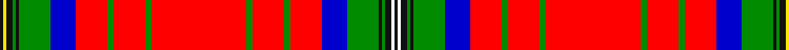

This page is one **sett** — a single exact thread-count. It belongs to the [tartan](/tartans/k1y1k2g1k1g10b8r10g2r10g2r30g2r10g2r10b8g10k1g1k2w1k1/)
(the same proportion at any scale), whose colour order is pattern [KWKGKGBRGRGRGRGRBGKGKYK](/stripes/kwkgkgbrgrgrgrgrbgkgkyk/).

Sourced from register-of-tartans.  It is a [23 stripe tartan](/stripes/stripes23/).

Original link https://www.tartanregister.gov.uk/tartanDetails.aspx?ref=10359

2 attestations — the source records this cloth was collapsed from (oldest owns this page)

<ul>
<li>28/10/2010 — Wood Dress (register-of-tartans, <a href="https://www.tartanregister.gov.uk/tartanDetails.aspx?ref=10359">record</a>)</li>
<li>28th Oct. 2010 — Wood Dress (Clan) (tartans-authority, <a href="http://www.tartansauthority.com/tartan-ferret/display/10359/">record</a>)</li>
</ul>

## Register references

External register numbers recorded for this tartan.

- Scottish Register of Tartans: [10359](https://www.tartanregister.gov.uk/tartanDetails.aspx?ref=10359)

## Thread count
K/2 Y2 K4 G2 K2 G20 B16 R20 G4 R20 G4 R60 G4 R20 G4 R20 B16 G20 K2 G2 K4 W2 K/2

## Palette
Each colour and the base-6 reference it is a variant of.

| Colour | Shade | Base |
|---|---|---|
| B | <code style="background-color:#0000CD;">#0000CD</code> `oklch(38.3% 0.266 264.1)` <small>#0000CD</small> | B <code style="background-color:#2A418A;">#2A418A</code> |
| G | <code style="background-color:#008B00;">#008B00</code> `oklch(55.2% 0.188 142.5)` <small>#008B00</small> | G <code style="background-color:#006100;">#006100</code> |
| K | <code style="background-color:#101010;">#101010</code> `oklch(17.3% 0.000 89.9)` <small>#101010</small> | K <code style="background-color:#000000;">#000000</code> |
| R | <code style="background-color:#FF0000;">#FF0000</code> `oklch(62.8% 0.258 29.2)` <small>#FF0000</small> | R <code style="background-color:#CC0000;">#CC0000</code> |
| W | <code style="background-color:#FFFFFF;">#FFFFFF</code> `oklch(100.0% 0.000 89.9)` <small>#FFFFFF</small> | W <code style="background-color:#F7F7F7;">#F7F7F7</code> |
| Y | <code style="background-color:#FFE600;">#FFE600</code> `oklch(91.7% 0.192 101.4)` <small>#FFE600</small> | Y <code style="background-color:#F2BF00;">#F2BF00</code> |

## Nearest tartans

The nearest existing variants by ΔTartan distance, with this tartan at the top so the swatches line up against it.

ΔTartan

Tartan

Sett

—

<a href="/ttd/edit/#slug=k1w1k2g1k1g10db8r10g2r10g2r30g2r10g2r10db8g10k1g1k2ly1k1~x2">Wood Dress</a> <a class="nn-out" href="/setts/s23/k1w1k2g1k1g10db8r10g2r10g2r30g2r10g2r10db8g10k1g1k2ly1k1~x2/" title="open its dictionary page">↗</a>

1.12

<a href="/ttd/edit/#slug=r21w5k1w5r21db6ly1db3ly1db3ly1db4r3g2k1g2k2g1db2g1~x2">McKee (Lone Star) (Personal), Dot</a> <a class="nn-out" href="/setts/s20/r21w5k1w5r21db6ly1db3ly1db3ly1db4r3g2k1g2k2g1db2g1~x2/" title="open its dictionary page">↗</a>

1.23

<a href="/ttd/edit/#slug=db5r3w2db1w2r3g9ly2w1ly2g9r1g1r27db1r1db1r27db1r1db9w1db1w4~x2">Hebridean, North Uist</a> <a class="nn-out" href="/setts/s24/db5r3w2db1w2r3g9ly2w1ly2g9r1g1r27db1r1db1r27db1r1db9w1db1w4~x2/" title="open its dictionary page">↗</a>

1.23

<a href="/ttd/edit/#slug=r24k4ly1k2w1db4dg6r3k1r2w1r2k1r3dg6db4w1k2ly1k4r24k3~x4">Stewart/Stuart of Galloway (VS)</a> <a class="nn-out" href="/setts/s22/r24k4ly1k2w1db4dg6r3k1r2w1r2k1r3dg6db4w1k2ly1k4r24k3~x4/" title="open its dictionary page">↗</a>

1.33

<a href="/ttd/edit/#slug=r24k1w1dg6w1ly2r2k1r2ly2w1t6k2r3ly3w1~x2">MacKintosh (Chief)</a> <a class="nn-out" href="/setts/s16/r24k1w1dg6w1ly2r2k1r2ly2w1t6k2r3ly3w1~x2/" title="open its dictionary page">↗</a>

1.34

<a href="/ttd/edit/#slug=r24k1w1dg6w1dg1ly2r2k1r2ly2dg1w1t6k2r3ly3dg2w1~x2">MacKintosh #8</a> <a class="nn-out" href="/setts/s19/r24k1w1dg6w1dg1ly2r2k1r2ly2dg1w1t6k2r3ly3dg2w1~x2/" title="open its dictionary page">↗</a>

1.38

<a href="/ttd/edit/#slug=r90db4w4k13ly3k3w3k3g18r14k3r7w3r7k3r14g18k3w3k3ly3k13w4db4r90k56">Not Specified #3</a> <a class="nn-out" href="/setts/s26/r90db4w4k13ly3k3w3k3g18r14k3r7w3r7k3r14g18k3w3k3ly3k13w4db4r90k56/" title="open its dictionary page">↗</a>

1.39

<a href="/ttd/edit/#slug=r24k1w1g6w1g1ly2r2k1r2ly2g1w1t6k2r3ly3g2w1~x2">MacKintosh 7</a> <a class="nn-out" href="/setts/s19/r24k1w1g6w1g1ly2r2k1r2ly2g1w1t6k2r3ly3g2w1~x2/" title="open its dictionary page">↗</a>

1.39

<a href="/ttd/edit/#slug=w5r99dg12r4dg2r12dg2r4dg12r24b15k29dg24r12dg4r2dg12r2dg4r12dg49ly5~x2">Unidentified Plaid #8</a> <a class="nn-out" href="/setts/s22/w5r99dg12r4dg2r12dg2r4dg12r24b15k29dg24r12dg4r2dg12r2dg4r12dg49ly5~x2/" title="open its dictionary page">↗</a>

1.42

<a href="/ttd/edit/#slug=r3dg1r2dg1r18k4ly1k2w1db4dg6r3k1r2w1~x2">Stuart/Stewart of Appin #4</a> <a class="nn-out" href="/setts/s15/r3dg1r2dg1r18k4ly1k2w1db4dg6r3k1r2w1~x2/" title="open its dictionary page">↗</a>

1.43

<a href="/ttd/edit/#slug=dg28r1dg2r3dg1r16dg1r3dg2r1dg14k3ly3k3db3k3r48w3r3w3~x2">Moray Plaid</a> <a class="nn-out" href="/setts/s20/dg28r1dg2r3dg1r16dg1r3dg2r1dg14k3ly3k3db3k3r48w3r3w3~x2/" title="open its dictionary page">↗</a>

## Neighbour map

Every grey dot is one of 14299 variants placed by the first two principal components of the ΔTartan feature space (44% of its variance). Red is this tartan; blue dots are its nearest — click one to open its page.

<svg viewBox="0 0 640 380" role="img" style="max-width:100%;height:auto;border:1px solid #e0e0e0;border-radius:4px;display:block" xmlns="http://www.w3.org/2000/svg"><image href="/nn/cloud.v1.png" width="640" height="380"/><a href="/setts/s20/r21w5k1w5r21db6ly1db3ly1db3ly1db4r3g2k1g2k2g1db2g1~x2/"><circle cx="242.5" cy="35.9" r="4" fill="#3465a4"><title>McKee (Lone Star) (Personal), Dot</title></circle></a><a href="/setts/s24/db5r3w2db1w2r3g9ly2w1ly2g9r1g1r27db1r1db1r27db1r1db9w1db1w4~x2/"><circle cx="297.4" cy="37.4" r="4" fill="#3465a4"><title>Hebridean, North Uist</title></circle></a><a href="/setts/s22/r24k4ly1k2w1db4dg6r3k1r2w1r2k1r3dg6db4w1k2ly1k4r24k3~x4/"><circle cx="310.5" cy="41.9" r="4" fill="#3465a4"><title>Stewart/Stuart of Galloway (VS)</title></circle></a><a href="/setts/s16/r24k1w1dg6w1ly2r2k1r2ly2w1t6k2r3ly3w1~x2/"><circle cx="279.8" cy="41.3" r="4" fill="#3465a4"><title>MacKintosh (Chief)</title></circle></a><a href="/setts/s19/r24k1w1dg6w1dg1ly2r2k1r2ly2dg1w1t6k2r3ly3dg2w1~x2/"><circle cx="252.8" cy="29.6" r="4" fill="#3465a4"><title>MacKintosh #8</title></circle></a><a href="/setts/s26/r90db4w4k13ly3k3w3k3g18r14k3r7w3r7k3r14g18k3w3k3ly3k13w4db4r90k56/"><circle cx="322.7" cy="15.8" r="4" fill="#3465a4"><title>Not Specified #3</title></circle></a><a href="/setts/s19/r24k1w1g6w1g1ly2r2k1r2ly2g1w1t6k2r3ly3g2w1~x2/"><circle cx="245.8" cy="29.4" r="4" fill="#3465a4"><title>MacKintosh 7</title></circle></a><a href="/setts/s22/w5r99dg12r4dg2r12dg2r4dg12r24b15k29dg24r12dg4r2dg12r2dg4r12dg49ly5~x2/"><circle cx="299.6" cy="21.4" r="4" fill="#3465a4"><title>Unidentified Plaid #8</title></circle></a><a href="/setts/s15/r3dg1r2dg1r18k4ly1k2w1db4dg6r3k1r2w1~x2/"><circle cx="281.5" cy="70.9" r="4" fill="#3465a4"><title>Stuart/Stewart of Appin #4</title></circle></a><a href="/setts/s20/dg28r1dg2r3dg1r16dg1r3dg2r1dg14k3ly3k3db3k3r48w3r3w3~x2/"><circle cx="324.9" cy="14.0" r="4" fill="#3465a4"><title>Moray Plaid</title></circle></a><circle cx="276.7" cy="30.5" r="5" fill="#c00000"/></svg>

ID: /setts/s23/k1w1k2g1k1g10db8r10g2r10g2r30g2r10g2r10db8g10k1g1k2ly1k1~x2/
