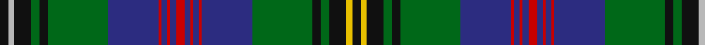

In pattern [KYKGKGBRBRBRBRBRBGKGKYK](/patterns/kykgkgbrbrbrbrbrbgkgkyk/).

This was sourced from tartans-authority.  It is a [23 stripes tartan](/stripes/stripes23/).

Original link http://www.tartansauthority.com/tartan-ferret/display/6630/

## Attestations

This cloth appears in 2 source records; the oldest owns this page.

- March 2005 — Wood (Clan) (tartans-authority, [record](http://www.tartansauthority.com/tartan-ferret/display/6630/))
- undated — Wood (Clan/Family) (register-of-tartans, [record](https://www.tartanregister.gov.uk/tartanDetails.aspx?ref=5069))

## Thread count
K/6 N4 K12 G6 K6 G42 DB36 R2 DB4 R2 DB4 R6 DB4 R2 DB4 R2 DB36 G42 K6 G6 K12 Y4 K/6

## Palette
Each colour and its ΔE from the base-6 reference it is a variant of.

| Colour | Shade | Base | ΔE (OKLab) |
|---|---|---|---|
| DB | <code style="background-color:#2C2C80;">#2C2C80</code> `#2C2C80` | B <code style="background-color:#2A418A;">#2A418A</code> | 0.06 |
| G | <code style="background-color:#006818;">#006818</code> `#006818` | G <code style="background-color:#006100;">#006100</code> | 0.02 |
| K | <code style="background-color:#101010;">#101010</code> `#101010` | K <code style="background-color:#000000;">#000000</code> | 0.17 |
| N | <code style="background-color:#B8B8B8;">#B8B8B8</code> `#B8B8B8` | Y <code style="background-color:#F2BF00;">#F2BF00</code> | 0.17 |
| R | <code style="background-color:#C80000;">#C80000</code> `#C80000` | R <code style="background-color:#CC0000;">#CC0000</code> | 0.01 |
| Y | <code style="background-color:#E8C000;">#E8C000</code> `#E8C000` | Y <code style="background-color:#F2BF00;">#F2BF00</code> | 0.02 |

## Nearest tartans

The nearest existing variants by ΔTartan distance.

1. [Storrie](/setts/s20/g20k1r1k1g20k10r2k2ra2b20w1b20ra2k2r2k10g20k1r1k1x2~b2c2c80-g006818-k101010-r888888-rac8002c-wfcfcfc/) — ΔT 0.63
1. [Cockburn #2](/setts/s27/r3k2g9b12w3b12g2k2g2k2g36k2g2k2g2b12w3b12k3y3k2g12k2r3k2g6w3x2~b2c4084-g005020-k101010-rdc0000-we0e0e0-ye8c000/) — ΔT 0.81
1. [Strathclyde, University of](/setts/s26/b7k1r3k1b24k1w3k3g3k3g3ga19k2w4k2ga19g3k3g3k3w3k1b24k1r3k1x2~b2c2c80-g5c6428-ga006818-k101010-rc80000-we0e0e0/) — ΔT 0.84
1. [Hunnisett/Edinchip (Personal)](/setts/s20/b38w2b2k10g2y2g22k3r3k3r3k3r3k3g22y2g2k10b2w2x2~b202060-g006818-k101010-rc80000-we0e0e0-ye8c000/) — ΔT 0.84
1. [Peter Pan](/setts/s20/b22g2ga2g2ga2g2b6k3g14b1gb4b1g2gb2g2gb2g1b1k1r2x2~b1c0070-g006818-ga0098a0-gb289c18-k101010-rc80000/) — ΔT 0.90
1. [Smithsonian](/setts/s20/b24y1r2g2r2y1k24g24w2b2w2g24k24y1r2g2r2y1b24g2x2~b202060-g406054-k101010-rc80000-we0e0e0-ye8c000/) — ΔT 0.96
1. [Nicolson Green Hunting](/setts/s17/b12k1g1k1g1k1b9r2k18r2g9k1y1k1w1k1g12x2~b1c0070-g006818-k101010-r880000-wc0c0c0-yd09800/) — ΔT 0.99
1. [Sutherland](/setts/s22/g6w2g24k12b3k2b2k2b12r1b1r3b1r1b12k2b2k2b3k12g24w2x2~b2c2c80-g006818-k101010-rc80000-wfcfcfc/) — ΔT 1.00
1. [Ranking Corporate Tartan Tartan Number: 3242. Earliest known date: 2002 Personal/Family tartan for the Ranking family and its close relatives as determined by the current head of the family. A minor variation of Rankine tartan. See products available Copyright © Blair Urquhart, Comrie, 2015](/setts/s20/b36k5r2k5g15r2g10w2g10r2g15k5r2k5b10r2b2r2b4w2x2~b003c64-g006818-k101010-rc80000-we0e0e0/) — ΔT 1.06
1. [Wood Clan/Family Tartan Tartan Number: 6630. Earliest known date: March 2005 A tartan for all of the name. Initiated by Leslie N Wood of Dartmouth, Devon and designed by Keith Lumsden. Incorporates the colours of the Duke of Fife and Angus district tartans - areas with which the Woods are said to be historically connected. A Clan Wood Society is in the process of being formed (March 2005) and it is expected that they will adopt this tartan. Woven sample See products available Copyright © Blair Urquhart, Comrie, 2015](/setts/s23/k3y2k6g3k3g21b18r2b2r2b2r3b2r2b2r2b18g21k3g3k6ya2k3x2~b2c2c80-g006818-k101010-rc80000-yb8b8b8-yae8c000/) — ΔT 1.08

## Neighbour map

Every grey dot is one of 15726 variants placed by the first two principal components of the ΔTartan feature space (44% of its variance). Red is this tartan; blue dots are its nearest — click one to open its page.

<svg viewBox="0 0 640 380" role="img" style="max-width:100%;height:auto;border:1px solid #e0e0e0;border-radius:4px;display:block" xmlns="http://www.w3.org/2000/svg"><image href="/nn/cloud.v1.png" width="640" height="380"/><a href="/setts/s20/g20k1r1k1g20k10r2k2ra2b20w1b20ra2k2r2k10g20k1r1k1x2~b2c2c80-g006818-k101010-r888888-rac8002c-wfcfcfc/"><circle cx="221.9" cy="94.2" r="4" fill="#3465a4"><title>Storrie</title></circle></a><a href="/setts/s27/r3k2g9b12w3b12g2k2g2k2g36k2g2k2g2b12w3b12k3y3k2g12k2r3k2g6w3x2~b2c4084-g005020-k101010-rdc0000-we0e0e0-ye8c000/"><circle cx="218.5" cy="76.1" r="4" fill="#3465a4"><title>Cockburn #2</title></circle></a><a href="/setts/s26/b7k1r3k1b24k1w3k3g3k3g3ga19k2w4k2ga19g3k3g3k3w3k1b24k1r3k1x2~b2c2c80-g5c6428-ga006818-k101010-rc80000-we0e0e0/"><circle cx="176.1" cy="55.8" r="4" fill="#3465a4"><title>Strathclyde, University of</title></circle></a><a href="/setts/s20/b38w2b2k10g2y2g22k3r3k3r3k3r3k3g22y2g2k10b2w2x2~b202060-g006818-k101010-rc80000-we0e0e0-ye8c000/"><circle cx="171.3" cy="74.2" r="4" fill="#3465a4"><title>Hunnisett/Edinchip (Personal)</title></circle></a><a href="/setts/s20/b22g2ga2g2ga2g2b6k3g14b1gb4b1g2gb2g2gb2g1b1k1r2x2~b1c0070-g006818-ga0098a0-gb289c18-k101010-rc80000/"><circle cx="213.0" cy="72.6" r="4" fill="#3465a4"><title>Peter Pan</title></circle></a><a href="/setts/s20/b24y1r2g2r2y1k24g24w2b2w2g24k24y1r2g2r2y1b24g2x2~b202060-g406054-k101010-rc80000-we0e0e0-ye8c000/"><circle cx="186.6" cy="78.8" r="4" fill="#3465a4"><title>Smithsonian</title></circle></a><a href="/setts/s17/b12k1g1k1g1k1b9r2k18r2g9k1y1k1w1k1g12x2~b1c0070-g006818-k101010-r880000-wc0c0c0-yd09800/"><circle cx="180.9" cy="100.2" r="4" fill="#3465a4"><title>Nicolson Green Hunting</title></circle></a><a href="/setts/s22/g6w2g24k12b3k2b2k2b12r1b1r3b1r1b12k2b2k2b3k12g24w2x2~b2c2c80-g006818-k101010-rc80000-wfcfcfc/"><circle cx="222.7" cy="92.6" r="4" fill="#3465a4"><title>Sutherland</title></circle></a><a href="/setts/s20/b36k5r2k5g15r2g10w2g10r2g15k5r2k5b10r2b2r2b4w2x2~b003c64-g006818-k101010-rc80000-we0e0e0/"><circle cx="215.8" cy="113.3" r="4" fill="#3465a4"><title>Ranking Corporate Tartan Tartan Number: 3242. Earliest known date: 2002 Personal/Family tartan for the Ranking family and its close relatives as determined by the current head of the family. A minor variation of Rankine tartan. See products available Copyright © Blair Urquhart, Comrie, 2015</title></circle></a><a href="/setts/s23/k3y2k6g3k3g21b18r2b2r2b2r3b2r2b2r2b18g21k3g3k6ya2k3x2~b2c2c80-g006818-k101010-rc80000-yb8b8b8-yae8c000/"><circle cx="159.4" cy="104.9" r="4" fill="#3465a4"><title>Wood Clan/Family Tartan Tartan Number: 6630. Earliest known date: March 2005 A tartan for all of the name. Initiated by Leslie N Wood of Dartmouth, Devon and designed by Keith Lumsden. Incorporates the colours of the Duke of Fife and Angus district tartans - areas with which the Woods are said to be historically connected. A Clan Wood Society is in the process of being formed (March 2005) and it is expected that they will adopt this tartan. Woven sample See products available Copyright © Blair Urquhart, Comrie, 2015</title></circle></a><circle cx="198.8" cy="80.1" r="5" fill="#c00000"/></svg>

ID: /setts/s23/k3y2k6g3k3g21b18r1b2r1b2r3b2r1b2r1b18g21k3g3k6ya2k3x2~b2c2c80-g006818-k101010-rc80000-yb8b8b8-yae8c000/
