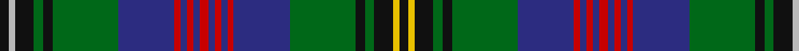

In pattern [KYKGKGBRBRBRBRBRBGKGKYK](/patterns/kykgkgbrbrbrbrbrbgkgkyk/).

This was sourced from house-of-tartan.  It is a [23 stripes tartan](/stripes/stripes23/).

Original link http://www.house-of-tartan.scotland.net/house/TartanViewjs.asp?colr=Def&tnam=6630

## Thread count
K/6 N4 K12 G6 K6 G42 DB36 R4 DB4 R4 DB4 R6 DB4 R4 DB4 R4 DB36 G42 K6 G6 K12 Y4 K/6

## Palette
Each colour and its ΔE from the base-6 reference it is a variant of.

| Colour | Shade | Base | ΔE (OKLab) |
|---|---|---|---|
| DB | <code style="background-color:#2C2C80;">#2C2C80</code> `#2C2C80` | B <code style="background-color:#2A418A;">#2A418A</code> | 0.06 |
| G | <code style="background-color:#006818;">#006818</code> `#006818` | G <code style="background-color:#006100;">#006100</code> | 0.02 |
| K | <code style="background-color:#101010;">#101010</code> `#101010` | K <code style="background-color:#000000;">#000000</code> | 0.17 |
| N | <code style="background-color:#B8B8B8;">#B8B8B8</code> `#B8B8B8` | Y <code style="background-color:#F2BF00;">#F2BF00</code> | 0.17 |
| R | <code style="background-color:#C80000;">#C80000</code> `#C80000` | R <code style="background-color:#CC0000;">#CC0000</code> | 0.01 |
| Y | <code style="background-color:#E8C000;">#E8C000</code> `#E8C000` | Y <code style="background-color:#F2BF00;">#F2BF00</code> | 0.02 |

## Nearest tartans

The nearest existing variants by ΔTartan distance.

1. [Nicolson Hunting Clan Tartan Tartan Number: 322. Earliest known date: Aberdeen From a kilt in the possession of the Aberdeen kiltmakers, Alex Scott and Company. See products available Copyright © Blair Urquhart, Comrie, 2015](/setts/s17/b10k1g1k1g1k1b10r3k10r3g10k1y1k1w1k1g10x2~b2c2c80-g006818-k101010-rc80000-we0e0e0-ye8c000/) — ΔT 0.78
1. [Empire Golf Check (Fashion)](/setts/s18/r2b4ba2g25ba4g2ba4k11b4w2b4g11ba2k2ba24b4ba2r2x2~b780078-ba003c64-g306800-k101010-rc80000-we0e0e0/) — ΔT 0.86
1. [MacNicol Htg (Clan)](/setts/s17/b20k2g2k2g2k2b20r5k19r5g19k2y2k2w2k2g20x2~b1474b4-g408060-k101010-rc80000-we0e0e0-ye8c000/) — ΔT 1.06
1. [Wood (Clan)](/setts/s23/k3y2k6g3k3g21b18r1b2r1b2r3b2r1b2r1b18g21k3g3k6ya2k3x2~b2c2c80-g006818-k101010-rc80000-yb8b8b8-yae8c000/) — ΔT 1.08
1. [Rankine](/setts/s23/b15k1b1k1b1k12g9r1g9k1w1k1g9r1g9k12r1b9r2b1r1b6w1x2~b2c2c80-g006818-k101010-rc80000-we0e0e0/) — ΔT 1.09
1. [Watson](/setts/s18/b24k2b2r2b2k20g16y2g2y3g2y2g16k20b2r2b2k2x2~b2c2c80-g006818-k101010-rc80000-ye8c000/) — ΔT 1.10
1. [Cooper/Couper (James Cant)](/setts/s18/r2ra3b2g18b3g2b3k10ra3g2ra3g8b2k2b14ra3b2r2x2~b202060-g006818-k101010-rc80000-rab468ac/) — ΔT 1.13
1. [Barkway (Name)](/setts/s18/g3ga2g2ga16g2ga2g2ga2g4b4k2b2k2b2k24r2k2w3x2~b5c5c5c-g408060-ga006818-k101010-rc8002c-we0e0e0/) — ΔT 1.13
1. [Ochiltree Family Tartan Tartan Number: 321. Earliest known date: 1988 O'Sullivan McCragh was designed by Chris Aitken for Geoffrey (Tailor) Highland Crafts Ltd. in June 1994. See products available Copyright © Blair Urquhart, Comrie, 2015](/setts/s19/b12k1g2k1g2k1b12r2k12y1k12r2g12k1b2k1b2k1g12x2~b2c2c80-g006818-k101010-rc80000-ye8c000/) — ΔT 1.15
1. [Stephenson](/setts/s20/b5r3g26b20y3k20ba2r5ba2g20k6g20ba2r5ba2k20y3b20g26r3x2~b1c0070-ba2474e8-g408060-k101010-r880000-yd09800/) — ΔT 1.16

## Neighbour map

Every grey dot is one of 15726 variants placed by the first two principal components of the ΔTartan feature space (44% of its variance). Red is this tartan; blue dots are its nearest — click one to open its page.

<svg viewBox="0 0 640 380" role="img" style="max-width:100%;height:auto;border:1px solid #e0e0e0;border-radius:4px;display:block" xmlns="http://www.w3.org/2000/svg"><image href="/nn/cloud.v1.png" width="640" height="380"/><a href="/setts/s17/b10k1g1k1g1k1b10r3k10r3g10k1y1k1w1k1g10x2~b2c2c80-g006818-k101010-rc80000-we0e0e0-ye8c000/"><circle cx="135.8" cy="123.5" r="4" fill="#3465a4"><title>Nicolson Hunting Clan Tartan Tartan Number: 322. Earliest known date: Aberdeen From a kilt in the possession of the Aberdeen kiltmakers, Alex Scott and Company. See products available Copyright © Blair Urquhart, Comrie, 2015</title></circle></a><a href="/setts/s18/r2b4ba2g25ba4g2ba4k11b4w2b4g11ba2k2ba24b4ba2r2x2~b780078-ba003c64-g306800-k101010-rc80000-we0e0e0/"><circle cx="172.2" cy="113.7" r="4" fill="#3465a4"><title>Empire Golf Check (Fashion)</title></circle></a><a href="/setts/s17/b20k2g2k2g2k2b20r5k19r5g19k2y2k2w2k2g20x2~b1474b4-g408060-k101010-rc80000-we0e0e0-ye8c000/"><circle cx="130.4" cy="117.9" r="4" fill="#3465a4"><title>MacNicol Htg (Clan)</title></circle></a><a href="/setts/s23/k3y2k6g3k3g21b18r1b2r1b2r3b2r1b2r1b18g21k3g3k6ya2k3x2~b2c2c80-g006818-k101010-rc80000-yb8b8b8-yae8c000/"><circle cx="198.8" cy="80.1" r="4" fill="#3465a4"><title>Wood (Clan)</title></circle></a><a href="/setts/s23/b15k1b1k1b1k12g9r1g9k1w1k1g9r1g9k12r1b9r2b1r1b6w1x2~b2c2c80-g006818-k101010-rc80000-we0e0e0/"><circle cx="177.0" cy="118.6" r="4" fill="#3465a4"><title>Rankine</title></circle></a><a href="/setts/s18/b24k2b2r2b2k20g16y2g2y3g2y2g16k20b2r2b2k2x2~b2c2c80-g006818-k101010-rc80000-ye8c000/"><circle cx="174.6" cy="124.0" r="4" fill="#3465a4"><title>Watson</title></circle></a><a href="/setts/s18/r2ra3b2g18b3g2b3k10ra3g2ra3g8b2k2b14ra3b2r2x2~b202060-g006818-k101010-rc80000-rab468ac/"><circle cx="154.6" cy="144.1" r="4" fill="#3465a4"><title>Cooper/Couper (James Cant)</title></circle></a><a href="/setts/s18/g3ga2g2ga16g2ga2g2ga2g4b4k2b2k2b2k24r2k2w3x2~b5c5c5c-g408060-ga006818-k101010-rc8002c-we0e0e0/"><circle cx="169.6" cy="98.0" r="4" fill="#3465a4"><title>Barkway (Name)</title></circle></a><a href="/setts/s19/b12k1g2k1g2k1b12r2k12y1k12r2g12k1b2k1b2k1g12x2~b2c2c80-g006818-k101010-rc80000-ye8c000/"><circle cx="181.0" cy="138.1" r="4" fill="#3465a4"><title>Ochiltree Family Tartan Tartan Number: 321. Earliest known date: 1988 O'Sullivan McCragh was designed by Chris Aitken for Geoffrey (Tailor) Highland Crafts Ltd. in June 1994. See products available Copyright © Blair Urquhart, Comrie, 2015</title></circle></a><a href="/setts/s20/b5r3g26b20y3k20ba2r5ba2g20k6g20ba2r5ba2k20y3b20g26r3x2~b1c0070-ba2474e8-g408060-k101010-r880000-yd09800/"><circle cx="159.5" cy="118.8" r="4" fill="#3465a4"><title>Stephenson</title></circle></a><circle cx="159.4" cy="104.9" r="5" fill="#c00000"/></svg>

ID: /setts/s23/k3y2k6g3k3g21b18r2b2r2b2r3b2r2b2r2b18g21k3g3k6ya2k3x2~b2c2c80-g006818-k101010-rc80000-yb8b8b8-yae8c000/
