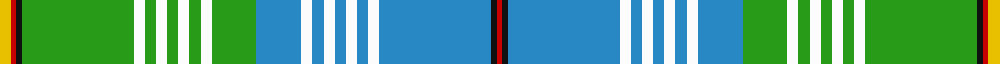

In pattern [RKBWBWBWBWBGWGWGWGWGKRY](/stripes/rkbwbwbwbwbgwgwgwgwgkry/).

This was sourced from register-of-tartans.  It is a [23 stripe tartan](/stripes/stripes23/).

Original link https://www.tartanregister.gov.uk/tartanDetails.aspx?ref=2019

## Attestations

This cloth appears in 2 source records; the oldest owns this page.

- 01/08/2000 — Lachine (register-of-tartans, [record](https://www.tartanregister.gov.uk/tartanDetails.aspx?ref=2019))
- pre 2004 — Lachine (District) (tartans-authority, [record](http://www.tartansauthority.com/tartan-ferret/display/6202/))

## Register references

External register numbers recorded for this tartan.

- Scottish Register of Tartans: [2019](https://www.tartanregister.gov.uk/tartanDetails.aspx?ref=2019)
- Scottish Tartans Authority (ITI): 6202
- Scottish Tartans World Register: 2910

## Thread count
Y/4 R2 K2 G40 W4 G4 W4 G4 W4 G4 W4 G16 B16 W4 B4 W4 B4 W4 B4 W4 B40 K2 R/2

## Palette
Each colour and the base-6 reference it is a variant of.

| Colour | Shade | Base |
|---|---|---|
| B | <code style="background-color:#2888C4;">#2888C4</code> `oklch(60.1% 0.125 241.5)` <small>#2888C4</small> | B <code style="background-color:#2A418A;">#2A418A</code> |
| G | <code style="background-color:#289C18;">#289C18</code> `oklch(60.6% 0.191 141.6)` <small>#289C18</small> | G <code style="background-color:#006100;">#006100</code> |
| K | <code style="background-color:#101010;">#101010</code> `oklch(17.3% 0.000 89.9)` <small>#101010</small> | K <code style="background-color:#000000;">#000000</code> |
| R | <code style="background-color:#C80000;">#C80000</code> `oklch(52.3% 0.215 29.2)` <small>#C80000</small> | R <code style="background-color:#CC0000;">#CC0000</code> |
| W | <code style="background-color:#FCFCFC;">#FCFCFC</code> `oklch(99.1% 0.000 89.9)` <small>#FCFCFC</small> | W <code style="background-color:#F7F7F7;">#F7F7F7</code> |
| Y | <code style="background-color:#E8C000;">#E8C000</code> `oklch(81.9% 0.168 93.7)` <small>#E8C000</small> | Y <code style="background-color:#F2BF00;">#F2BF00</code> |

## Nearest tartans

The nearest existing variants by ΔTartan distance, with this tartan at the top so the swatches line up against it.

ΔTartan

Tartan

Sett

—

<a href="/ttd/edit/#slug=ly2r1k1g20w2g2w2g2w2g2w2g8t8w2t2w2t2w2t2w2t20k1r1~x2">Lachine</a> <a class="nn-out" href="/setts/s23/ly2r1k1g20w2g2w2g2w2g2w2g8t8w2t2w2t2w2t2w2t20k1r1~x2/" title="open its dictionary page">↗</a>

1.77

<a href="/ttd/edit/#slug=lb7k1do1o2g18lb2k1lo2k1lb6k1do1lb1~x4">Wcwm 972-1</a> <a class="nn-out" href="/setts/s13/lb7k1do1o2g18lb2k1lo2k1lb6k1do1lb1~x4/" title="open its dictionary page">↗</a>

1.78

<a href="/ttd/edit/#slug=w6b6w3b44g20g8g2g8g6r3g2r3g4w25ly4">Anstey in New Scotland (Personal)</a> <a class="nn-out" href="/setts/s15/w6b6w3b44g20g8g2g8g6r3g2r3g4w25ly4/" title="open its dictionary page">↗</a>

1.80

<a href="/setts/s24/lb2w1lb12t6k3w1g1w1g4w2k1w1r1~x4/">Diana Princess of Wales Memorial</a>

1.80

<a href="/ttd/edit/#slug=w70o7db7w7db7o7w7db5o9ly4o3w4o3g13o70g30o4r10o4g30o15db4o4db4o4db27g6db27~x2">Unidentified Plaid 15</a> <a class="nn-out" href="/setts/s28/w70o7db7w7db7o7w7db5o9ly4o3w4o3g13o70g30o4r10o4g30o15db4o4db4o4db27g6db27~x2/" title="open its dictionary page">↗</a>

1.84

<a href="/ttd/edit/#slug=k1t2k2ly2t12w13r1w1r2w1r1w13t12ly2k2t2k1ly1~x4">Jong Nederland Born Union, Dress</a> <a class="nn-out" href="/setts/s18/k1t2k2ly2t12w13r1w1r2w1r1w13t12ly2k2t2k1ly1~x4/" title="open its dictionary page">↗</a>

1.93

<a href="/ttd/edit/#slug=ly3t2k1t24k2t2k2t2k2g8dp2g8k1w2~x2">Alexander-Johnstone (Personal)</a> <a class="nn-out" href="/setts/s14/ly3t2k1t24k2t2k2t2k2g8dp2g8k1w2~x2/" title="open its dictionary page">↗</a>

1.95

<a href="/setts/s20/w36g6r2g3w2g3dy6p4g2p2w2~x2/">Strathyre Dress (Dance) #2</a>

1.96

<a href="/ttd/edit/#slug=w4b30k3g20r4k1w3k1r4g20k3b30w4r2~x2">Scottish Prison Service</a> <a class="nn-out" href="/setts/s14/w4b30k3g20r4k1w3k1r4g20k3b30w4r2~x2/" title="open its dictionary page">↗</a>

1.96

<a href="/ttd/edit/#slug=r2dg20ly1dg1k2lb1ly1lb22w1lb1w1~x4">Unidentified (Tony Murray Collection</a> <a class="nn-out" href="/setts/s11/r2dg20ly1dg1k2lb1ly1lb22w1lb1w1~x4/" title="open its dictionary page">↗</a>

1.97

<a href="/setts/s18/t3ly1t23w20lo1w4b22t4b4r1~x2/">Forfar District Tartan Tartan Number: 6238. Earliest known date: 01/03/2004 Designed by Arthur Mackie of The Strathmore Woollen Co. Ltd of Forfar which is the county town of Angus in Scotland. Historically Forfar has royal connections with King Malcolm II and III, Alexander II and III and King Robert the Bruce, all of whom favoured the town which resulted in Forfar being created as a Royal Burgh in the mid 12th century. The colours of the tartan are from the Coat of Arms displayed in the Council Chambers and the tartan has been approved by the town's Community Council. See products available Copyright © Blair Urquhart, Comrie, 2015</a>

## Neighbour map

Every grey dot is one of 14299 variants placed by the first two principal components of the ΔTartan feature space (44% of its variance). Red is this tartan; blue dots are its nearest — click one to open its page.

<svg viewBox="0 0 640 380" role="img" style="max-width:100%;height:auto;border:1px solid #e0e0e0;border-radius:4px;display:block" xmlns="http://www.w3.org/2000/svg"><image href="/nn/cloud.v1.png" width="640" height="380"/><a href="/setts/s13/lb7k1do1o2g18lb2k1lo2k1lb6k1do1lb1~x4/"><circle cx="197.1" cy="81.0" r="4" fill="#3465a4"><title>Wcwm 972-1</title></circle></a><a href="/setts/s15/w6b6w3b44g20g8g2g8g6r3g2r3g4w25ly4/"><circle cx="141.8" cy="76.4" r="4" fill="#3465a4"><title>Anstey in New Scotland (Personal)</title></circle></a><a href="/setts/s24/lb2w1lb12t6k3w1g1w1g4w2k1w1r1~x4/"><circle cx="112.7" cy="76.7" r="4" fill="#3465a4"><title>Diana Princess of Wales Memorial</title></circle></a><a href="/setts/s28/w70o7db7w7db7o7w7db5o9ly4o3w4o3g13o70g30o4r10o4g30o15db4o4db4o4db27g6db27~x2/"><circle cx="147.1" cy="45.4" r="4" fill="#3465a4"><title>Unidentified Plaid 15</title></circle></a><a href="/setts/s18/k1t2k2ly2t12w13r1w1r2w1r1w13t12ly2k2t2k1ly1~x4/"><circle cx="158.5" cy="79.5" r="4" fill="#3465a4"><title>Jong Nederland Born Union, Dress</title></circle></a><a href="/setts/s14/ly3t2k1t24k2t2k2t2k2g8dp2g8k1w2~x2/"><circle cx="249.0" cy="79.6" r="4" fill="#3465a4"><title>Alexander-Johnstone (Personal)</title></circle></a><a href="/setts/s20/w36g6r2g3w2g3dy6p4g2p2w2~x2/"><circle cx="190.6" cy="52.1" r="4" fill="#3465a4"><title>Strathyre Dress (Dance) #2</title></circle></a><a href="/setts/s14/w4b30k3g20r4k1w3k1r4g20k3b30w4r2~x2/"><circle cx="252.0" cy="99.7" r="4" fill="#3465a4"><title>Scottish Prison Service</title></circle></a><a href="/setts/s11/r2dg20ly1dg1k2lb1ly1lb22w1lb1w1~x4/"><circle cx="244.2" cy="68.3" r="4" fill="#3465a4"><title>Unidentified (Tony Murray Collection</title></circle></a><a href="/setts/s18/t3ly1t23w20lo1w4b22t4b4r1~x2/"><circle cx="171.0" cy="82.8" r="4" fill="#3465a4"><title>Forfar District Tartan Tartan Number: 6238. Earliest known date: 01/03/2004 Designed by Arthur Mackie of The Strathmore Woollen Co. Ltd of Forfar which is the county town of Angus in Scotland. Historically Forfar has royal connections with King Malcolm II and III, Alexander II and III and King Robert the Bruce, all of whom favoured the town which resulted in Forfar being created as a Royal Burgh in the mid 12th century. The colours of the tartan are from the Coat of Arms displayed in the Council Chambers and the tartan has been approved by the town's Community Council. See products available Copyright © Blair Urquhart, Comrie, 2015</title></circle></a><circle cx="179.3" cy="57.9" r="5" fill="#c00000"/></svg>

ID: /setts/s23/ly2r1k1g20w2g2w2g2w2g2w2g8t8w2t2w2t2w2t2w2t20k1r1~x2/
