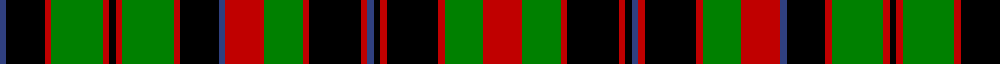

In pattern [BKRGRKRGRKBRGRKRBKRKRGR](/patterns/bkrgrkrgrkbrgrkrbkrkrgr/).

This was sourced from weddslist.  It is a [23 stripes tartan](/stripes/stripes23/).

Original link http://www.weddslist.com/cgi-bin/tartans/pg.pl?source=sts

## Thread count
B/2 K12 R2 G16 R2 K2 R2 G16 R2 K12 B2 R12 G12 R2 K16 R2 B2 K2 R2 K16 R2 G12 R/12

## Palette
Each colour and its ΔE from the base-6 reference it is a variant of.

| Colour | Shade | Base | ΔE (OKLab) |
|---|---|---|---|
| B | <code style="background-color:#304080;">#304080</code> `#304080` | B <code style="background-color:#2C4084;">#2C4084</code> | 0.01 |
| G | <code style="background-color:#008000;">#008000</code> `#008000` | G <code style="background-color:#006400;">#006400</code> | 0.09 |
| K | <code style="background-color:#000000;">#000000</code> `#000000` | K <code style="background-color:#000000;">#000000</code> | 0.00 |
| R | <code style="background-color:#C00000;">#C00000</code> `#C00000` | R <code style="background-color:#C80000;">#C80000</code> | 0.02 |

## Nearest tartans

The nearest existing variants by ΔTartan distance.

1. [Blackburn Appalachian Hunting](/setts/s16/g14k4g14y2k4y2k20y6r20y6k20y2g22k4g6k4-g124b24-k120a01-rdd1212-yf9c75c/) — ΔT 1.10
1. [Cumming Hunting](/setts/s23/k4r4g32r4k24b4r24g24r4k32r4b4k4r4k32r4g24r24b4k24r4g32r4-b2888c4-g006818-k101010-rc80000/) — ΔT 1.14
1. [Cumming Comyn Buchan Clan Tartan Tartan Number: 2012. Earliest known date: pre 2003 D.C.Stewart comments, "Still further confusion has arisen from Smibert's illustration.." The present editor is none the wiser. See products available Copyright © Blair Urquhart, Comrie, 2015](/setts/s23/r12g12r2k16r2k2b2r2k16r2g12r12b2k12r2g16r2k2r2g16r2k12b2-b2c2c80-g006818-k101010-rc80000/) — ΔT 1.22
1. [J & B Whisky (Original)](/setts/s18/k14r3k7g26w6g26k16r3k16r3k16g26w6g26k7r3k14r4-g5c6428-k000000-rc80000-wfcfcfc/) — ΔT 1.29
1. [Cumming/Comyn/Buchan](/setts/s23/r12g12r2k16r2k2b2r2k16r2g12r12b2k12r2g16r2k2r2g16r2k12b2-b2c4084-g005020-k101010-rdc0000/) — ΔT 1.35
1. [Sackett](/setts/s18/k32r32k4r32k32y4g32k4g32k32g32k4g32y4k32r32k4r32-g004028-k000000-r907048-ya0a0a0/) — ΔT 1.38
1. [Buchan, Cumming MacIntyre](/setts/s23/r12g12r4k48r4b4k4r4k48r4g12r12b4k12r4g54r4k4r4g54r4k12b4-b304080-g008000-k000000-rc00000/) — ΔT 1.43
1. [Kilbarchan Unidentified No. 7](/setts/s28/b8r8k8r12g48r8k6r12g6r8k48r12g8r8b8r8g8r12k48r8g6r12k6r8g48r12k8r8-b2888c4-g006818-k101010-rc80000/) — ΔT 1.46
1. [Highfield](/setts/s20/b40k8g8r8g8k8r8k8r16k4g8k4r16k8r8k8g8r8g8k8-b00008c-g007800-k000000-r8c0000/) — ΔT 1.53
1. [Lamquet (2015)](/setts/s22/b32k32g4k4g4k4g32k4g4k4g4k32y16k4b4k4y16k32b32k4r10k4-b003c64-g285800-k101010-r960000-yffe600/) — ΔT 1.55

## Neighbour map

Every grey dot is one of 15726 variants placed by the first two principal components of the ΔTartan feature space (44% of its variance). Red is this tartan; blue dots are its nearest — click one to open its page.

<svg viewBox="0 0 640 380" role="img" style="max-width:100%;height:auto;border:1px solid #e0e0e0;border-radius:4px;display:block" xmlns="http://www.w3.org/2000/svg"><image href="/nn/cloud.v1.png" width="640" height="380"/><a href="/setts/s16/g14k4g14y2k4y2k20y6r20y6k20y2g22k4g6k4-g124b24-k120a01-rdd1212-yf9c75c/"><circle cx="162.5" cy="162.0" r="4" fill="#3465a4"><title>Blackburn Appalachian Hunting</title></circle></a><a href="/setts/s23/k4r4g32r4k24b4r24g24r4k32r4b4k4r4k32r4g24r24b4k24r4g32r4-b2888c4-g006818-k101010-rc80000/"><circle cx="168.5" cy="160.8" r="4" fill="#3465a4"><title>Cumming Hunting</title></circle></a><a href="/setts/s23/r12g12r2k16r2k2b2r2k16r2g12r12b2k12r2g16r2k2r2g16r2k12b2-b2c2c80-g006818-k101010-rc80000/"><circle cx="172.0" cy="162.4" r="4" fill="#3465a4"><title>Cumming Comyn Buchan Clan Tartan Tartan Number: 2012. Earliest known date: pre 2003 D.C.Stewart comments, &quot;Still further confusion has arisen from Smibert's illustration..&quot; The present editor is none the wiser. See products available Copyright © Blair Urquhart, Comrie, 2015</title></circle></a><a href="/setts/s18/k14r3k7g26w6g26k16r3k16r3k16g26w6g26k7r3k14r4-g5c6428-k000000-rc80000-wfcfcfc/"><circle cx="192.2" cy="173.6" r="4" fill="#3465a4"><title>J &amp; B Whisky (Original)</title></circle></a><a href="/setts/s23/r12g12r2k16r2k2b2r2k16r2g12r12b2k12r2g16r2k2r2g16r2k12b2-b2c4084-g005020-k101010-rdc0000/"><circle cx="176.0" cy="163.2" r="4" fill="#3465a4"><title>Cumming/Comyn/Buchan</title></circle></a><a href="/setts/s18/k32r32k4r32k32y4g32k4g32k32g32k4g32y4k32r32k4r32-g004028-k000000-r907048-ya0a0a0/"><circle cx="126.2" cy="195.2" r="4" fill="#3465a4"><title>Sackett</title></circle></a><a href="/setts/s23/r12g12r4k48r4b4k4r4k48r4g12r12b4k12r4g54r4k4r4g54r4k12b4-b304080-g008000-k000000-rc00000/"><circle cx="200.0" cy="110.8" r="4" fill="#3465a4"><title>Buchan, Cumming MacIntyre</title></circle></a><a href="/setts/s28/b8r8k8r12g48r8k6r12g6r8k48r12g8r8b8r8g8r12k48r8g6r12k6r8g48r12k8r8-b2888c4-g006818-k101010-rc80000/"><circle cx="161.6" cy="136.9" r="4" fill="#3465a4"><title>Kilbarchan Unidentified No. 7</title></circle></a><a href="/setts/s20/b40k8g8r8g8k8r8k8r16k4g8k4r16k8r8k8g8r8g8k8-b00008c-g007800-k000000-r8c0000/"><circle cx="118.6" cy="162.1" r="4" fill="#3465a4"><title>Highfield</title></circle></a><a href="/setts/s22/b32k32g4k4g4k4g32k4g4k4g4k32y16k4b4k4y16k32b32k4r10k4-b003c64-g285800-k101010-r960000-yffe600/"><circle cx="156.5" cy="137.8" r="4" fill="#3465a4"><title>Lamquet (2015)</title></circle></a><circle cx="139.3" cy="151.4" r="5" fill="#c00000"/></svg>

ID: /setts/s23/r12g12r2k16r2k2b2r2k16r2g12r12b2k12r2g16r2k2r2g16r2k12b2-b304080-g008000-k000000-rc00000/
