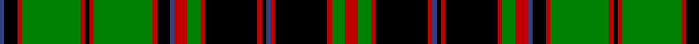

In pattern [BKRGRKRGRKBRGRKRKBRKRGR](/patterns/bkrgrkrgrkbrgrkrkbrkrgr/).

This was sourced from weddslist.  It is a [23 stripes tartan](/stripes/stripes23/).

Original link http://www.weddslist.com/cgi-bin/tartans/pg.pl?source=sts

## Thread count
B/4 K12 R4 G54 R4 K4 R4 G54 R4 K12 B4 R12 G12 R4 K48 R4 K4 B4 R4 K48 R4 G12 R/12

## Palette
Each colour and its ΔE from the base-6 reference it is a variant of.

| Colour | Shade | Base | ΔE (OKLab) |
|---|---|---|---|
| B | <code style="background-color:#304080;">#304080</code> `#304080` | B <code style="background-color:#2A418A;">#2A418A</code> | 0.02 |
| G | <code style="background-color:#008000;">#008000</code> `#008000` | G <code style="background-color:#006100;">#006100</code> | 0.10 |
| K | <code style="background-color:#000000;">#000000</code> `#000000` | K <code style="background-color:#000000;">#000000</code> | 0.00 |
| R | <code style="background-color:#C00000;">#C00000</code> `#C00000` | R <code style="background-color:#CC0000;">#CC0000</code> | 0.03 |

## Nearest tartans

The nearest existing variants by ΔTartan distance.

1. [Buchan Cumming MacIntyre District Tartan Tartan Number: 1991. Earliest known date: 1790 Also MacIntyre and Glenorchy. Adopted by the Buchan family around 1965, on account of their long association with the Cummings which began with the marriage of Margaret, daughter of King Edgar, to William Coymen, sheriff of Forfar in 1210. The name, Buchan, though a family name, is territorial in origin. The sett is asymmetrical. There is a sample in the collection of the Highland Society of London, housed in the National Museums of Scotland, Edinburgh. See products available Copyright © Blair Urquhart, Comrie, 2015](/setts/s23/r12g12r4k48r4b4k4r4k48r4g12r12b4k12r4g54r4k4r4g54r4k12b4-b2c2c80-g006818-k101010-rc80000/) — ΔT 1.37
1. [Comyn / Cumming, Buchan](/setts/s23/r12g12r2k16r2k2b2r2k16r2g12r12b2k12r2g16r2k2r2g16r2k12b2-b304080-g008000-k000000-rc00000/) — ΔT 1.43
1. [Stewart Old / Ancient](/setts/s17/b24k2g4k2g4k2b24r4k24r2k24r4g24k2b4k2g24-b304080-g008000-k000000-rc00000/) — ΔT 1.55
1. [Wcwm 1538](/setts/s21/r12k8b8g96b4k16b8k24g24r8g40r8g24k24b8k16b4k96g8b16r4-b0000e0-g004c00-k000000-ra0783c/) — ΔT 1.60
1. [Rankine](/setts/s23/b30k2b2k2b2k24g18r2g18k2w2k2g18r2g18k24r2b18r4b2r2b12w2-b304080-g008000-k000000-rc00000-we0e0e0/) — ΔT 1.64
1. [Campbell of Argyll](/setts/s28/k32g16k2y4k2g16k16b16k2b2k2b16k16g16k2w4k2g16k16b2k2b2k2b16k2b2k2b2-b304080-g008000-k000000-we0e0e0-yf0c000/) — ΔT 1.64
1. [Club World](/setts/s20/g28k14g42k4g4k4g4k8g14r50w4r4k6r32g18r4k8r4k8r4-g30a010-k000000-rc00000-we0e0e0/) — ΔT 1.67
1. [Ochiltree](/setts/s19/b24k2g4k2g4k2b24r4k24y2k24r4g24k2b4k2b4k2g24-b304080-g008000-k000000-rc00000-yf0c000/) — ΔT 1.67
1. [Cork, County](/setts/s16/g56r24g8k40y4k6y4k6g14k6y4k6y4k40g8r24-g003820-k000000-r880000-ybc8c00/) — ΔT 1.68
1. [Hammaby,The](/setts/s14/k2y4k42w4g4w4g4w4g4w4g40k2y4k2-g008000-k000000-we0e0e0-yf0c000/) — ΔT 1.70

## Neighbour map

Every grey dot is one of 15726 variants placed by the first two principal components of the ΔTartan feature space (44% of its variance). Red is this tartan; blue dots are its nearest — click one to open its page.

<svg viewBox="0 0 640 380" role="img" style="max-width:100%;height:auto;border:1px solid #e0e0e0;border-radius:4px;display:block" xmlns="http://www.w3.org/2000/svg"><image href="/nn/cloud.v1.png" width="640" height="380"/><a href="/setts/s23/r12g12r4k48r4b4k4r4k48r4g12r12b4k12r4g54r4k4r4g54r4k12b4-b2c2c80-g006818-k101010-rc80000/"><circle cx="237.6" cy="123.8" r="4" fill="#3465a4"><title>Buchan Cumming MacIntyre District Tartan Tartan Number: 1991. Earliest known date: 1790 Also MacIntyre and Glenorchy. Adopted by the Buchan family around 1965, on account of their long association with the Cummings which began with the marriage of Margaret, daughter of King Edgar, to William Coymen, sheriff of Forfar in 1210. The name, Buchan, though a family name, is territorial in origin. The sett is asymmetrical. There is a sample in the collection of the Highland Society of London, housed in the National Museums of Scotland, Edinburgh. See products available Copyright © Blair Urquhart, Comrie, 2015</title></circle></a><a href="/setts/s23/r12g12r2k16r2k2b2r2k16r2g12r12b2k12r2g16r2k2r2g16r2k12b2-b304080-g008000-k000000-rc00000/"><circle cx="139.3" cy="151.4" r="4" fill="#3465a4"><title>Comyn / Cumming, Buchan</title></circle></a><a href="/setts/s17/b24k2g4k2g4k2b24r4k24r2k24r4g24k2b4k2g24-b304080-g008000-k000000-rc00000/"><circle cx="152.0" cy="146.6" r="4" fill="#3465a4"><title>Stewart Old / Ancient</title></circle></a><a href="/setts/s21/r12k8b8g96b4k16b8k24g24r8g40r8g24k24b8k16b4k96g8b16r4-b0000e0-g004c00-k000000-ra0783c/"><circle cx="244.0" cy="109.6" r="4" fill="#3465a4"><title>Wcwm 1538</title></circle></a><a href="/setts/s23/b30k2b2k2b2k24g18r2g18k2w2k2g18r2g18k24r2b18r4b2r2b12w2-b304080-g008000-k000000-rc00000-we0e0e0/"><circle cx="136.9" cy="105.7" r="4" fill="#3465a4"><title>Rankine</title></circle></a><a href="/setts/s28/k32g16k2y4k2g16k16b16k2b2k2b16k16g16k2w4k2g16k16b2k2b2k2b16k2b2k2b2-b304080-g008000-k000000-we0e0e0-yf0c000/"><circle cx="173.9" cy="101.6" r="4" fill="#3465a4"><title>Campbell of Argyll</title></circle></a><a href="/setts/s20/g28k14g42k4g4k4g4k8g14r50w4r4k6r32g18r4k8r4k8r4-g30a010-k000000-rc00000-we0e0e0/"><circle cx="195.6" cy="118.3" r="4" fill="#3465a4"><title>Club World</title></circle></a><a href="/setts/s19/b24k2g4k2g4k2b24r4k24y2k24r4g24k2b4k2b4k2g24-b304080-g008000-k000000-rc00000-yf0c000/"><circle cx="134.4" cy="122.7" r="4" fill="#3465a4"><title>Ochiltree</title></circle></a><a href="/setts/s16/g56r24g8k40y4k6y4k6g14k6y4k6y4k40g8r24-g003820-k000000-r880000-ybc8c00/"><circle cx="220.1" cy="150.6" r="4" fill="#3465a4"><title>Cork, County</title></circle></a><a href="/setts/s14/k2y4k42w4g4w4g4w4g4w4g40k2y4k2-g008000-k000000-we0e0e0-yf0c000/"><circle cx="227.0" cy="96.5" r="4" fill="#3465a4"><title>Hammaby,The</title></circle></a><circle cx="200.0" cy="110.8" r="5" fill="#c00000"/></svg>

ID: /setts/s23/r12g12r4k48r4b4k4r4k48r4g12r12b4k12r4g54r4k4r4g54r4k12b4-b304080-g008000-k000000-rc00000/
