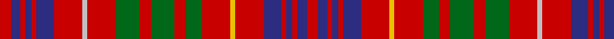

In pattern [RBRBRBRWRGRGRGRYRBRBRBR](/patterns/rbrbrbrwrgrgrgryrbrbrbr/).

This was sourced from register-of-tartans.  It is a [23 stripes tartan](/stripes/stripes23/).

Original link https://www.tartanregister.gov.uk/tartanDetails.aspx?ref=1241

## Attestations

This cloth appears in 2 source records; the oldest owns this page.

- 01/07/2004 — Fox, Red (register-of-tartans, [record](https://www.tartanregister.gov.uk/tartanDetails.aspx?ref=1241))
- July 2004 — Fox, Red (Name) (tartans-authority, [record](http://www.tartansauthority.com/tartan-ferret/display/6312/))

## Thread count
R/14 DB12 R6 DB8 R6 DB22 R36 N6 R36 G30 R14 G30 R14 G20 R36 Y6 R36 DB22 R6 DB8 R6 DB12 R/14

## Palette
Each colour and its ΔE from the base-6 reference it is a variant of.

| Colour | Shade | Base | ΔE (OKLab) |
|---|---|---|---|
| DB | <code style="background-color:#2C2C80;">#2C2C80</code> `#2C2C80` | B <code style="background-color:#2C4084;">#2C4084</code> | 0.05 |
| G | <code style="background-color:#006818;">#006818</code> `#006818` | G <code style="background-color:#006400;">#006400</code> | 0.02 |
| N | <code style="background-color:#C0C0C0;">#C0C0C0</code> `#C0C0C0` | W <code style="background-color:#F4F4F0;">#F4F4F0</code> | 0.16 |
| R | <code style="background-color:#C80000;">#C80000</code> `#C80000` | R <code style="background-color:#C80000;">#C80000</code> | 0.00 |
| Y | <code style="background-color:#E8C000;">#E8C000</code> `#E8C000` | Y <code style="background-color:#E8C000;">#E8C000</code> | 0.00 |

## Nearest tartans

The nearest existing variants by ΔTartan distance.

1. [Staffa (Silk)](/setts/s25/r34g28r8g8r34g8r8b24r26w10r26g28w6g28r8g8r34g8r8g16r8b8r8b8r28-b2c2c80-g003820-rc80000-we0e0e0/) — ΔT 0.97
1. [MacDougall #6](/setts/s19/k2r8g16r4g2r4b8r4w2r2w2r4g8r6g8r2k2r16w2-b2c4084-g005020-k101010-rdc0000-we0e0e0/) — ΔT 1.30
1. [Lumsden (Short)](/setts/s30/r18b2r2b4r2b2r18w2r8b22r4b22r8w2r18g4r8g4r18g10r6g8r6g6y2g6r6g12w2g12-b2c2c80-g006818-rc80000-we0e0e0-ye8c000/) — ΔT 1.39
1. [Fitzgerald](/setts/s15/b6r8w6r30b8r8b26r8g26r8b8r30w6r8b6-b304080-g008000-rc00000-we0e0e0/) — ΔT 1.41
1. [Lumsden Short Version](/setts/s30/r18b2r2b4r2b2r18w2r8b22r4b22r8w2r18g4r8g4r18g10r6g8r6g6y2g6r6g12w2g12-b304080-g008000-rc00000-we0e0e0-yf0c000/) — ΔT 1.49
1. [Drummond C](/setts/s15/r6b2r2b2r12y2r2k4r2g2r2g12r2k2r6-b000052-g11450d-k000000-raa0000-yaaaaaa/) — ΔT 1.55
1. [London Caledonian](/setts/s13/r16b4r28g4r4b12r4ga4r4ga22r4ba4r12-b440044-ba202060-g789484-ga003820-rc80000/) — ΔT 1.59
1. [Grant of Ballindalloch (Personal)](/setts/s15/r20b12r12g64r12g12r12b20r12ga20r48b20r12b12r20-b2c2c80-g006818-ga789484-rc80000/) — ΔT 1.60
1. [Drummond C](/setts/s15/r6b2r2b2r12w2r2k4r2g2r2g12r2k2r6-b000064-g004c00-k000000-rc80000-wd0d0d0/) — ΔT 1.62
1. [MacRae Red Clan Tartan Tartan Number: 885. Earliest known date: pre 2003 Paton's 'Red MacRae' Alexander Macrae received the lands of Conchra and Ardachy in 1677 and became progenitor of the Macraes of Conchra. The Conchra tartan is blue and white. See products available Copyright © Blair Urquhart, Comrie, 2015](/setts/s20/g20r3g20r20b3r3b6r3b3r20b3r3b6r3b3r20w3r4b20r4-b202060-g003820-rc80000-we0e0e0/) — ΔT 1.63

## Neighbour map

Every grey dot is one of 15726 variants placed by the first two principal components of the ΔTartan feature space (44% of its variance). Red is this tartan; blue dots are its nearest — click one to open its page.

<svg viewBox="0 0 640 380" role="img" style="max-width:100%;height:auto;border:1px solid #e0e0e0;border-radius:4px;display:block" xmlns="http://www.w3.org/2000/svg"><image href="/nn/cloud.v1.png" width="640" height="380"/><a href="/setts/s25/r34g28r8g8r34g8r8b24r26w10r26g28w6g28r8g8r34g8r8g16r8b8r8b8r28-b2c2c80-g003820-rc80000-we0e0e0/"><circle cx="240.7" cy="181.5" r="4" fill="#3465a4"><title>Staffa (Silk)</title></circle></a><a href="/setts/s19/k2r8g16r4g2r4b8r4w2r2w2r4g8r6g8r2k2r16w2-b2c4084-g005020-k101010-rdc0000-we0e0e0/"><circle cx="208.6" cy="142.1" r="4" fill="#3465a4"><title>MacDougall #6</title></circle></a><a href="/setts/s30/r18b2r2b4r2b2r18w2r8b22r4b22r8w2r18g4r8g4r18g10r6g8r6g6y2g6r6g12w2g12-b2c2c80-g006818-rc80000-we0e0e0-ye8c000/"><circle cx="221.6" cy="119.9" r="4" fill="#3465a4"><title>Lumsden (Short)</title></circle></a><a href="/setts/s15/b6r8w6r30b8r8b26r8g26r8b8r30w6r8b6-b304080-g008000-rc00000-we0e0e0/"><circle cx="230.5" cy="195.1" r="4" fill="#3465a4"><title>Fitzgerald</title></circle></a><a href="/setts/s30/r18b2r2b4r2b2r18w2r8b22r4b22r8w2r18g4r8g4r18g10r6g8r6g6y2g6r6g12w2g12-b304080-g008000-rc00000-we0e0e0-yf0c000/"><circle cx="223.6" cy="121.6" r="4" fill="#3465a4"><title>Lumsden Short Version</title></circle></a><a href="/setts/s15/r6b2r2b2r12y2r2k4r2g2r2g12r2k2r6-b000052-g11450d-k000000-raa0000-yaaaaaa/"><circle cx="252.5" cy="166.5" r="4" fill="#3465a4"><title>Drummond C</title></circle></a><a href="/setts/s13/r16b4r28g4r4b12r4ga4r4ga22r4ba4r12-b440044-ba202060-g789484-ga003820-rc80000/"><circle cx="296.9" cy="170.9" r="4" fill="#3465a4"><title>London Caledonian</title></circle></a><a href="/setts/s15/r20b12r12g64r12g12r12b20r12ga20r48b20r12b12r20-b2c2c80-g006818-ga789484-rc80000/"><circle cx="215.4" cy="199.6" r="4" fill="#3465a4"><title>Grant of Ballindalloch (Personal)</title></circle></a><a href="/setts/s15/r6b2r2b2r12w2r2k4r2g2r2g12r2k2r6-b000064-g004c00-k000000-rc80000-wd0d0d0/"><circle cx="237.4" cy="156.4" r="4" fill="#3465a4"><title>Drummond C</title></circle></a><a href="/setts/s20/g20r3g20r20b3r3b6r3b3r20b3r3b6r3b3r20w3r4b20r4-b202060-g003820-rc80000-we0e0e0/"><circle cx="238.0" cy="163.0" r="4" fill="#3465a4"><title>MacRae Red Clan Tartan Tartan Number: 885. Earliest known date: pre 2003 Paton's 'Red MacRae' Alexander Macrae received the lands of Conchra and Ardachy in 1677 and became progenitor of the Macraes of Conchra. The Conchra tartan is blue and white. See products available Copyright © Blair Urquhart, Comrie, 2015</title></circle></a><circle cx="233.6" cy="167.7" r="5" fill="#c00000"/></svg>

ID: /setts/s23/r14b12r6b8r6b22r36w6r36g30r14g30r14g20r36y6r36b22r6b8r6b12r14-b2c2c80-g006818-rc80000-wc0c0c0-ye8c000/
