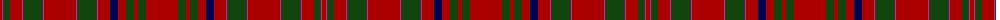

In pattern [RBRGRBRGRBRBRGRBRBRGRGR](/patterns/rbrgrbrgrbrbrgrbrbrgrgr/).

This was sourced from weddslist.  It is a [23 stripes tartan](/stripes/stripes23/).

Original link http://www.weddslist.com/cgi-bin/tartans/pg.pl?source=x

## Thread count
DR/4 B1 DR1 DG6 DR12 B1 DR1 DG18 DR1 B1 DR32 B1 DR1 DG18 DR1 B1 DR12 DB8 DR8 DG8 DR4 DG8 DR/32

## Palette
Each colour and its ΔE from the base-6 reference it is a variant of.

| Colour | Shade | Base | ΔE (OKLab) |
|---|---|---|---|
| B | <code style="background-color:#4367AE;">#4367AE</code> `#4367AE` | B <code style="background-color:#2C4084;">#2C4084</code> | 0.13 |
| DB | <code style="background-color:#000052;">#000052</code> `#000052` | B <code style="background-color:#2C4084;">#2C4084</code> | 0.20 |
| DG | <code style="background-color:#11450D;">#11450D</code> `#11450D` | G <code style="background-color:#006400;">#006400</code> | 0.10 |
| DR | <code style="background-color:#AA0000;">#AA0000</code> `#AA0000` | R <code style="background-color:#C80000;">#C80000</code> | 0.06 |

## Nearest tartans

The nearest existing variants by ΔTartan distance.

1. [MacAlister CC](/setts/s23/r64g16r8g16r16b16r24ba2r2g36r2ba2r64ba2r2g36r2ba2r24g12r2ba2r8-b000052-ba4367ae-g11450d-raa0000/) — ΔT 0.00
1. [MacAlister](/setts/s23/r64g16r8g16r16b16r24ba2r2g36r2ba2r64ba2r2g36r2ba2r24g12r2ba2r8-b304080-ba5480b0-g008000-rc00000/) — ΔT 1.03
1. [MacAlister (Cockburn Collection 1810-20)](/setts/s23/r64g16r8g16r16b16r24ba2r2g36r2ba2r64ba2r2g36r2ba2r24g12r2ba2r8-b2c4084-ba3c82af-g005020-rdc0000/) — ΔT 1.12
1. [MacAlister CC](/setts/s23/r64g16r8g16r16b16r24w2r2g36r2w2r64w2r2g36r2w2r24g12r2w2r8-b000064-g004c00-rc80000-wd0d0d0/) — ΔT 1.13
1. [Grant](/setts/s15/r12b4r4g48r4g4r4b16r4ba2r64b4r4b2r12-b000052-ba4367ae-g11450d-raa0000/) — ΔT 1.31
1. [Grant](/setts/s15/r6b2r2g24r2g2r2b8r2ba1r32b2r2b1r6-b000052-ba4367ae-g11450d-raa0000/) — ΔT 1.31
1. [Munro](/setts/s17/r48y2b2r6g32r6b2y2r6b12r6y2b2r32g4ba4g4-b000052-ba59110d-g11450d-raa0000-yaaaa00/) — ΔT 1.35
1. [Munro](/setts/s17/r24y1b1r3g16r3b1y1r3b6r3y1b1r16g2ba2g2-b000052-ba59110d-g11450d-raa0000-yaaaa00/) — ΔT 1.35
1. [MacCoul](/setts/s18/r24ra4r4g4r8g4r8b24ra12r4ra12g24r24g24r4b2r72ra8-b304080-g008000-rc00000-ra900030/) — ΔT 1.38
1. [Slessor (Personal)](/setts/s14/g4y2g22r100y24b4y8b4y8b4y24r100g22y2-b2c2c80-g003820-r880000-ya08858/) — ΔT 1.38

## Neighbour map

Every grey dot is one of 15726 variants placed by the first two principal components of the ΔTartan feature space (44% of its variance). Red is this tartan; blue dots are its nearest — click one to open its page.

<svg viewBox="0 0 640 380" role="img" style="max-width:100%;height:auto;border:1px solid #e0e0e0;border-radius:4px;display:block" xmlns="http://www.w3.org/2000/svg"><image href="/nn/cloud.v1.png" width="640" height="380"/><a href="/setts/s23/r64g16r8g16r16b16r24ba2r2g36r2ba2r64ba2r2g36r2ba2r24g12r2ba2r8-b000052-ba4367ae-g11450d-raa0000/"><circle cx="422.8" cy="100.5" r="4" fill="#3465a4"><title>MacAlister CC</title></circle></a><a href="/setts/s23/r64g16r8g16r16b16r24ba2r2g36r2ba2r64ba2r2g36r2ba2r24g12r2ba2r8-b304080-ba5480b0-g008000-rc00000/"><circle cx="406.1" cy="89.9" r="4" fill="#3465a4"><title>MacAlister</title></circle></a><a href="/setts/s23/r64g16r8g16r16b16r24ba2r2g36r2ba2r64ba2r2g36r2ba2r24g12r2ba2r8-b2c4084-ba3c82af-g005020-rdc0000/"><circle cx="400.0" cy="83.6" r="4" fill="#3465a4"><title>MacAlister (Cockburn Collection 1810-20)</title></circle></a><a href="/setts/s23/r64g16r8g16r16b16r24w2r2g36r2w2r64w2r2g36r2w2r24g12r2w2r8-b000064-g004c00-rc80000-wd0d0d0/"><circle cx="393.8" cy="83.7" r="4" fill="#3465a4"><title>MacAlister CC</title></circle></a><a href="/setts/s15/r12b4r4g48r4g4r4b16r4ba2r64b4r4b2r12-b000052-ba4367ae-g11450d-raa0000/"><circle cx="401.1" cy="98.4" r="4" fill="#3465a4"><title>Grant</title></circle></a><a href="/setts/s15/r6b2r2g24r2g2r2b8r2ba1r32b2r2b1r6-b000052-ba4367ae-g11450d-raa0000/"><circle cx="401.1" cy="98.4" r="4" fill="#3465a4"><title>Grant</title></circle></a><a href="/setts/s17/r48y2b2r6g32r6b2y2r6b12r6y2b2r32g4ba4g4-b000052-ba59110d-g11450d-raa0000-yaaaa00/"><circle cx="378.8" cy="91.3" r="4" fill="#3465a4"><title>Munro</title></circle></a><a href="/setts/s17/r24y1b1r3g16r3b1y1r3b6r3y1b1r16g2ba2g2-b000052-ba59110d-g11450d-raa0000-yaaaa00/"><circle cx="378.8" cy="91.3" r="4" fill="#3465a4"><title>Munro</title></circle></a><a href="/setts/s18/r24ra4r4g4r8g4r8b24ra12r4ra12g24r24g24r4b2r72ra8-b304080-g008000-rc00000-ra900030/"><circle cx="378.8" cy="102.6" r="4" fill="#3465a4"><title>MacCoul</title></circle></a><a href="/setts/s14/g4y2g22r100y24b4y8b4y8b4y24r100g22y2-b2c2c80-g003820-r880000-ya08858/"><circle cx="454.2" cy="94.1" r="4" fill="#3465a4"><title>Slessor (Personal)</title></circle></a><circle cx="422.8" cy="100.5" r="5" fill="#c00000"/></svg>

ID: /setts/s23/r32g8r4g8r8b8r12ba1r1g18r1ba1r32ba1r1g18r1ba1r12g6r1ba1r4-b000052-ba4367ae-g11450d-raa0000/
