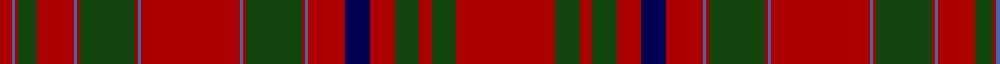

In pattern [RBRGRBRGRBRBRGRBRBRGRGR](/patterns/rbrgrbrgrbrbrgrbrbrgrgr/).

This was sourced from weddslist.  It is a [23 stripes tartan](/stripes/stripes23/).

Original link http://www.weddslist.com/cgi-bin/tartans/pg.pl?source=tinsel

## Thread count
DR/8 B2 DR2 DG12 DR24 B2 DR2 DG36 DR2 B2 DR64 B2 DR2 DG36 DR2 B2 DR24 DB16 DR16 DG16 DR8 DG16 DR/64

## Palette
Each colour and its ΔE from the base-6 reference it is a variant of.

| Colour | Shade | Base | ΔE (OKLab) |
|---|---|---|---|
| B | <code style="background-color:#4367AE;">#4367AE</code> `#4367AE` | B <code style="background-color:#2A418A;">#2A418A</code> | 0.12 |
| DB | <code style="background-color:#000052;">#000052</code> `#000052` | B <code style="background-color:#2A418A;">#2A418A</code> | 0.20 |
| DG | <code style="background-color:#11450D;">#11450D</code> `#11450D` | G <code style="background-color:#006100;">#006100</code> | 0.09 |
| DR | <code style="background-color:#AA0000;">#AA0000</code> `#AA0000` | R <code style="background-color:#CC0000;">#CC0000</code> | 0.07 |

## Nearest tartans

The nearest existing variants by ΔTartan distance.

1. [MacAlister CC](/setts/s23/r32g8r4g8r8b8r12ba1r1g18r1ba1r32ba1r1g18r1ba1r12g6r1ba1r4~b000052-ba4367ae-g11450d-raa0000/) — ΔT 0.00
1. [MacAlister](/setts/s23/r32g8r4g8r8b8r12ba1r1g18r1ba1r32ba1r1g18r1ba1r12g6r1ba1r4x2~b304080-ba5480b0-g008000-rc00000/) — ΔT 1.04
1. [MacAlister (Cockburn Collection 1810-20)](/setts/s23/r32g8r4g8r8b8r12ba1r1g18r1ba1r32ba1r1g18r1ba1r12g6r1ba1r4x2~b2c4084-ba3c82af-g005020-rdc0000/) — ΔT 1.14
1. [MacAlister CC](/setts/s23/r32g8r4g8r8b8r12w1r1g18r1w1r32w1r1g18r1w1r12g6r1w1r4x2~b000064-g004c00-rc80000-wd0d0d0/) — ΔT 1.15
1. [Grant](/setts/s15/r6b2r2g24r2g2r2b8r2ba1r32b2r2b1r6x2~b000052-ba4367ae-g11450d-raa0000/) — ΔT 1.32
1. [Grant](/setts/s15/r6b2r2g24r2g2r2b8r2ba1r32b2r2b1r6~b000052-ba4367ae-g11450d-raa0000/) — ΔT 1.32
1. [Munro](/setts/s17/r24y1b1r3g16r3b1y1r3b6r3y1b1r16g2ba2g2x2~b000052-ba59110d-g11450d-raa0000-yaaaa00/) — ΔT 1.35
1. [Munro](/setts/s17/r24y1b1r3g16r3b1y1r3b6r3y1b1r16g2ba2g2~b000052-ba59110d-g11450d-raa0000-yaaaa00/) — ΔT 1.35
1. [MacCoul](/setts/s18/r12ra2r2g2r4g2r4b12ra6r2ra6g12r12g12r2b1r36ra4x2~b304080-g008000-rc00000-ra900030/) — ΔT 1.38
1. [Slessor (Personal)](/setts/s14/g2y1g11r50y12b2y4b2y4b2y12r50g11y1x2~b2c2c80-g003820-r880000-ya08858/) — ΔT 1.38

## Neighbour map

Every grey dot is one of 15726 variants placed by the first two principal components of the ΔTartan feature space (44% of its variance). Red is this tartan; blue dots are its nearest — click one to open its page.

<svg viewBox="0 0 640 380" role="img" style="max-width:100%;height:auto;border:1px solid #e0e0e0;border-radius:4px;display:block" xmlns="http://www.w3.org/2000/svg"><image href="/nn/cloud.v1.png" width="640" height="380"/><a href="/setts/s23/r32g8r4g8r8b8r12ba1r1g18r1ba1r32ba1r1g18r1ba1r12g6r1ba1r4~b000052-ba4367ae-g11450d-raa0000/"><circle cx="425.0" cy="102.0" r="4" fill="#3465a4"><title>MacAlister CC</title></circle></a><a href="/setts/s23/r32g8r4g8r8b8r12ba1r1g18r1ba1r32ba1r1g18r1ba1r12g6r1ba1r4x2~b304080-ba5480b0-g008000-rc00000/"><circle cx="407.9" cy="91.6" r="4" fill="#3465a4"><title>MacAlister</title></circle></a><a href="/setts/s23/r32g8r4g8r8b8r12ba1r1g18r1ba1r32ba1r1g18r1ba1r12g6r1ba1r4x2~b2c4084-ba3c82af-g005020-rdc0000/"><circle cx="401.7" cy="85.9" r="4" fill="#3465a4"><title>MacAlister (Cockburn Collection 1810-20)</title></circle></a><a href="/setts/s23/r32g8r4g8r8b8r12w1r1g18r1w1r32w1r1g18r1w1r12g6r1w1r4x2~b000064-g004c00-rc80000-wd0d0d0/"><circle cx="395.4" cy="86.1" r="4" fill="#3465a4"><title>MacAlister CC</title></circle></a><a href="/setts/s15/r6b2r2g24r2g2r2b8r2ba1r32b2r2b1r6x2~b000052-ba4367ae-g11450d-raa0000/"><circle cx="403.3" cy="100.3" r="4" fill="#3465a4"><title>Grant</title></circle></a><a href="/setts/s15/r6b2r2g24r2g2r2b8r2ba1r32b2r2b1r6~b000052-ba4367ae-g11450d-raa0000/"><circle cx="403.3" cy="100.3" r="4" fill="#3465a4"><title>Grant</title></circle></a><a href="/setts/s17/r24y1b1r3g16r3b1y1r3b6r3y1b1r16g2ba2g2x2~b000052-ba59110d-g11450d-raa0000-yaaaa00/"><circle cx="381.0" cy="92.8" r="4" fill="#3465a4"><title>Munro</title></circle></a><a href="/setts/s17/r24y1b1r3g16r3b1y1r3b6r3y1b1r16g2ba2g2~b000052-ba59110d-g11450d-raa0000-yaaaa00/"><circle cx="381.0" cy="92.8" r="4" fill="#3465a4"><title>Munro</title></circle></a><a href="/setts/s18/r12ra2r2g2r4g2r4b12ra6r2ra6g12r12g12r2b1r36ra4x2~b304080-g008000-rc00000-ra900030/"><circle cx="381.1" cy="103.1" r="4" fill="#3465a4"><title>MacCoul</title></circle></a><a href="/setts/s14/g2y1g11r50y12b2y4b2y4b2y12r50g11y1x2~b2c2c80-g003820-r880000-ya08858/"><circle cx="456.7" cy="95.7" r="4" fill="#3465a4"><title>Slessor (Personal)</title></circle></a><circle cx="425.0" cy="102.0" r="5" fill="#c00000"/></svg>

ID: /setts/s23/r32g8r4g8r8b8r12ba1r1g18r1ba1r32ba1r1g18r1ba1r12g6r1ba1r4x2~b000052-ba4367ae-g11450d-raa0000/
