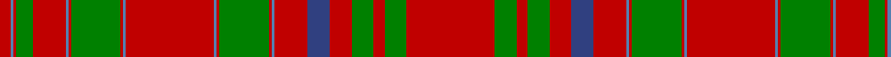

In pattern [RBRGRBRGRBRBRGRBRBRGRGR](/patterns/rbrgrbrgrbrbrgrbrbrgrgr/).

This was sourced from weddslist.  It is a [23 stripes tartan](/stripes/stripes23/).

Original link http://www.weddslist.com/cgi-bin/tartans/pg.pl?source=sts

## Thread count
R/8 Ba2 R2 G12 R24 Ba2 R2 G36 R2 Ba2 R64 Ba2 R2 G36 R2 Ba2 R24 B16 R16 G16 R8 G16 R/64

## Palette
Each colour and its ΔE from the base-6 reference it is a variant of.

| Colour | Shade | Base | ΔE (OKLab) |
|---|---|---|---|
| B | <code style="background-color:#304080;">#304080</code> `#304080` | B <code style="background-color:#2A418A;">#2A418A</code> | 0.02 |
| Ba | <code style="background-color:#5480B0;">#5480B0</code> `#5480B0` | B <code style="background-color:#2A418A;">#2A418A</code> | 0.19 |
| G | <code style="background-color:#008000;">#008000</code> `#008000` | G <code style="background-color:#006100;">#006100</code> | 0.10 |
| R | <code style="background-color:#C00000;">#C00000</code> `#C00000` | R <code style="background-color:#CC0000;">#CC0000</code> | 0.03 |

## Nearest tartans

The nearest existing variants by ΔTartan distance.

1. [MacAlister (Cockburn Collection 1810-20)](/setts/s23/r32g8r4g8r8b8r12ba1r1g18r1ba1r32ba1r1g18r1ba1r12g6r1ba1r4x2~b2c4084-ba3c82af-g005020-rdc0000/) — ΔT 0.73
1. [MacAlister CC](/setts/s23/r32g8r4g8r8b8r12w1r1g18r1w1r32w1r1g18r1w1r12g6r1w1r4x2~b000064-g004c00-rc80000-wd0d0d0/) — ΔT 0.78
1. [MacAlister CC](/setts/s23/r32g8r4g8r8b8r12ba1r1g18r1ba1r32ba1r1g18r1ba1r12g6r1ba1r4x2~b000052-ba4367ae-g11450d-raa0000/) — ΔT 1.04
1. [MacAlister CC](/setts/s23/r32g8r4g8r8b8r12ba1r1g18r1ba1r32ba1r1g18r1ba1r12g6r1ba1r4~b000052-ba4367ae-g11450d-raa0000/) — ΔT 1.04
1. [Dalziel](/setts/s17/r40w2b1r3g31r3b1w2r3b8r3w2b1r34g4r4g4x2~b304080-g008000-rc00000-we0e0e0/) — ΔT 1.06
1. [Munro](/setts/s20/r20g2r2g2r2g2r19b1y1r2b4r2y1b1r2g18r2b1y1r19x2~b304080-g008000-rc00000-yf0c000/) — ΔT 1.21
1. [Grant, or Drummond](/setts/s15/r6b2r2g24r2g2r2b8r2ba1r32b2r2b1r6x2~b304080-ba5480b0-g008000-rc00000/) — ΔT 1.21
1. [Drummond](/setts/s15/r6b2r2g24r2g2r2b8r2ba1r32b2r2b1r6x2~b1474b4-ba5c8ca8-g006818-rc80000/) — ΔT 1.25
1. [Munro (Logan)](/setts/s17/r19y1b1r2g18r2b1y1r2b4r2y1b1r19g2r2g2x2~b2c2c80-g006818-rc80000-ye8c000/) — ΔT 1.25
1. [MacDonald of Staffa 1](/setts/s31/r16g1r1g1r1g1r1g1r6g1b1g6b1r1g1r4g1r1b4r4w1r4g4w1g4r1g1r6g1r8w1x2~b304080-g008000-rc00000-we0e0e0/) — ΔT 1.30

## Neighbour map

Every grey dot is one of 15726 variants placed by the first two principal components of the ΔTartan feature space (44% of its variance). Red is this tartan; blue dots are its nearest — click one to open its page.

<svg viewBox="0 0 640 380" role="img" style="max-width:100%;height:auto;border:1px solid #e0e0e0;border-radius:4px;display:block" xmlns="http://www.w3.org/2000/svg"><image href="/nn/cloud.v1.png" width="640" height="380"/><a href="/setts/s23/r32g8r4g8r8b8r12ba1r1g18r1ba1r32ba1r1g18r1ba1r12g6r1ba1r4x2~b2c4084-ba3c82af-g005020-rdc0000/"><circle cx="401.7" cy="85.9" r="4" fill="#3465a4"><title>MacAlister (Cockburn Collection 1810-20)</title></circle></a><a href="/setts/s23/r32g8r4g8r8b8r12w1r1g18r1w1r32w1r1g18r1w1r12g6r1w1r4x2~b000064-g004c00-rc80000-wd0d0d0/"><circle cx="395.4" cy="86.1" r="4" fill="#3465a4"><title>MacAlister CC</title></circle></a><a href="/setts/s23/r32g8r4g8r8b8r12ba1r1g18r1ba1r32ba1r1g18r1ba1r12g6r1ba1r4x2~b000052-ba4367ae-g11450d-raa0000/"><circle cx="425.0" cy="102.0" r="4" fill="#3465a4"><title>MacAlister CC</title></circle></a><a href="/setts/s23/r32g8r4g8r8b8r12ba1r1g18r1ba1r32ba1r1g18r1ba1r12g6r1ba1r4~b000052-ba4367ae-g11450d-raa0000/"><circle cx="425.0" cy="102.0" r="4" fill="#3465a4"><title>MacAlister CC</title></circle></a><a href="/setts/s17/r40w2b1r3g31r3b1w2r3b8r3w2b1r34g4r4g4x2~b304080-g008000-rc00000-we0e0e0/"><circle cx="424.1" cy="75.0" r="4" fill="#3465a4"><title>Dalziel</title></circle></a><a href="/setts/s20/r20g2r2g2r2g2r19b1y1r2b4r2y1b1r2g18r2b1y1r19x2~b304080-g008000-rc00000-yf0c000/"><circle cx="442.2" cy="103.5" r="4" fill="#3465a4"><title>Munro</title></circle></a><a href="/setts/s15/r6b2r2g24r2g2r2b8r2ba1r32b2r2b1r6x2~b304080-ba5480b0-g008000-rc00000/"><circle cx="398.8" cy="94.1" r="4" fill="#3465a4"><title>Grant, or Drummond</title></circle></a><a href="/setts/s15/r6b2r2g24r2g2r2b8r2ba1r32b2r2b1r6x2~b1474b4-ba5c8ca8-g006818-rc80000/"><circle cx="400.9" cy="94.4" r="4" fill="#3465a4"><title>Drummond</title></circle></a><a href="/setts/s17/r19y1b1r2g18r2b1y1r2b4r2y1b1r19g2r2g2x2~b2c2c80-g006818-rc80000-ye8c000/"><circle cx="387.7" cy="105.3" r="4" fill="#3465a4"><title>Munro (Logan)</title></circle></a><a href="/setts/s31/r16g1r1g1r1g1r1g1r6g1b1g6b1r1g1r4g1r1b4r4w1r4g4w1g4r1g1r6g1r8w1x2~b304080-g008000-rc00000-we0e0e0/"><circle cx="372.7" cy="99.7" r="4" fill="#3465a4"><title>MacDonald of Staffa 1</title></circle></a><circle cx="407.9" cy="91.6" r="5" fill="#c00000"/></svg>

ID: /setts/s23/r32g8r4g8r8b8r12ba1r1g18r1ba1r32ba1r1g18r1ba1r12g6r1ba1r4x2~b304080-ba5480b0-g008000-rc00000/
