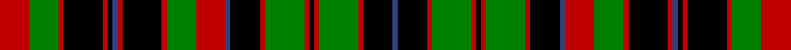

In pattern [BKRGRKRGRKBRGRKRBKRKRGR](/stripes/bkrgrkrgrkbrgrkrbkrkrgr/).

This was sourced from weddslist.  It is a [23 stripe tartan](/stripes/stripes23/).

Original link http://www.weddslist.com/cgi-bin/tartans/pg.pl?source=sts

## Also known as

This cloth is also recorded under:

- Comyn / Cumming, Buchan
- Cumming/Comyn/Buchan

## Attestations

This cloth appears in 2 source records; the oldest owns this page.

- undated — Comyn / Cumming, Buchan (weddslist, [record](http://www.weddslist.com/cgi-bin/tartans/pg.pl?source=sts))
- undated — Cumming Comyn Buchan Clan Tartan Tartan Number: 2012. Earliest known date: pre 2003 D.C.Stewart comments, "Still further confusion has arisen from Smibert's illustration.." The present editor is none the wiser. See products available Copyright © Blair Urquhart, Comrie, 2015 (house-of-tartan, [record](http://www.house-of-tartan.scotland.net/house/TartanViewjs.asp?colr=Def&tnam=2012))

## Thread count
R/12 G12 R2 K16 R2 K2 B2 R2 K16 R2 G12 R12 B2 K12 R2 G16 R2 K2 R2 G16 R2 K12 B/2

## Palette
Each colour and the base-6 reference it is a variant of.

| Colour | Shade | Base |
|---|---|---|
| B | <code style="background-color:#304080;">#304080</code> `oklch(39.4% 0.109 270.2)` <small>#304080</small> | B <code style="background-color:#2A418A;">#2A418A</code> |
| G | <code style="background-color:#008000;">#008000</code> `oklch(52.0% 0.177 142.5)` <small>#008000</small> | G <code style="background-color:#006100;">#006100</code> |
| K | <code style="background-color:#000000;">#000000</code> `oklch(0.0% 0.000 0.0)` <small>#000000</small> | K <code style="background-color:#000000;">#000000</code> |
| R | <code style="background-color:#C00000;">#C00000</code> `oklch(50.7% 0.208 29.2)` <small>#C00000</small> | R <code style="background-color:#CC0000;">#CC0000</code> |

## Nearest tartans

The nearest existing variants by ΔTartan distance.

1. [Blackburn Appalachian Hunting](/setts/s16/dg7k2dg7ly1k2ly1k10ly3r10ly3k10ly1dg11k2dg3k2~x2/) — ΔT 1.10
1. [Cumming Hunting](/setts/s23/k1r1g8r1k6t1r6g6r1k8r1t1k1r1k8r1g6r6t1k6r1g8r1~x4/) — ΔT 1.16
1. [J & B Whisky (Original)](/setts/s18/k14r3k7y26w6y26k16r3k16r3k16y26w6y26k7r3k14r4/) — ΔT 1.29
1. [Cumming/Comyn/Buchan](/setts/s23/r6dg6r1k8r1k1db1r1k8r1dg6r6db1k6r1dg8r1k1r1dg8r1k6db1~x2/) — ΔT 1.37
1. [Sackett](/setts/s18/k8dg8k1dg8lr1k8o8k1o8k8~x4/) — ΔT 1.39
1. [Kilbarchan Unidentified No. 7](/setts/s28/r4k4r6g24r4k3r6g3r4k24r6g4r4t4r4g4r6k24r4g3r6k3r4g24r6k4r4t4~x2/) — ΔT 1.48
1. [Highfield](/setts/s20/db10k2g2r2g2k2r2k2r4k1g2~x4/) — ΔT 1.53
1. [Lamquet (2015)](/setts/s22/dt16k16dg2k2dg2k2dg16k2dg2k2dg2k16ly8k2dt2k2ly8k16dt16k2r5k2~x2/) — ΔT 1.55
1. [Innes, of Cowie](/setts/s31/db1k6r1k1r1k1r6w1r2g3r2k1g5k1r2w1r2k1g5k1r2g3r2w1r6k1r1k1r1k6g1~x2/) — ΔT 1.58
1. [MacInroy](/setts/s28/r18k3r3k11g9k2g9k11r2k11r3k3r9g2k3g2r9k3r3k11r2k11r3k3r18db2r3db2~x2/) — ΔT 1.62

## Neighbour map

Every grey dot is one of 14299 variants placed by the first two principal components of the ΔTartan feature space (44% of its variance). Red is this tartan; blue dots are its nearest — click one to open its page.

<svg viewBox="0 0 640 380" role="img" style="max-width:100%;height:auto;border:1px solid #e0e0e0;border-radius:4px;display:block" xmlns="http://www.w3.org/2000/svg"><image href="/nn/cloud.v1.png" width="640" height="380"/><a href="/setts/s16/dg7k2dg7ly1k2ly1k10ly3r10ly3k10ly1dg11k2dg3k2~x2/"><circle cx="165.9" cy="162.5" r="4" fill="#3465a4"><title>Blackburn Appalachian Hunting</title></circle></a><a href="/setts/s23/k1r1g8r1k6t1r6g6r1k8r1t1k1r1k8r1g6r6t1k6r1g8r1~x4/"><circle cx="172.2" cy="162.8" r="4" fill="#3465a4"><title>Cumming Hunting</title></circle></a><a href="/setts/s18/k14r3k7y26w6y26k16r3k16r3k16y26w6y26k7r3k14r4/"><circle cx="195.0" cy="173.1" r="4" fill="#3465a4"><title>J &amp; B Whisky (Original)</title></circle></a><a href="/setts/s23/r6dg6r1k8r1k1db1r1k8r1dg6r6db1k6r1dg8r1k1r1dg8r1k6db1~x2/"><circle cx="179.7" cy="165.7" r="4" fill="#3465a4"><title>Cumming/Comyn/Buchan</title></circle></a><a href="/setts/s18/k8dg8k1dg8lr1k8o8k1o8k8~x4/"><circle cx="129.9" cy="196.5" r="4" fill="#3465a4"><title>Sackett</title></circle></a><a href="/setts/s28/r4k4r6g24r4k3r6g3r4k24r6g4r4t4r4g4r6k24r4g3r6k3r4g24r6k4r4t4~x2/"><circle cx="165.5" cy="138.4" r="4" fill="#3465a4"><title>Kilbarchan Unidentified No. 7</title></circle></a><a href="/setts/s20/db10k2g2r2g2k2r2k2r4k1g2~x4/"><circle cx="123.3" cy="163.8" r="4" fill="#3465a4"><title>Highfield</title></circle></a><a href="/setts/s22/dt16k16dg2k2dg2k2dg16k2dg2k2dg2k16ly8k2dt2k2ly8k16dt16k2r5k2~x2/"><circle cx="161.6" cy="139.9" r="4" fill="#3465a4"><title>Lamquet (2015)</title></circle></a><a href="/setts/s31/db1k6r1k1r1k1r6w1r2g3r2k1g5k1r2w1r2k1g5k1r2g3r2w1r6k1r1k1r1k6g1~x2/"><circle cx="116.7" cy="126.0" r="4" fill="#3465a4"><title>Innes, of Cowie</title></circle></a><a href="/setts/s28/r18k3r3k11g9k2g9k11r2k11r3k3r9g2k3g2r9k3r3k11r2k11r3k3r18db2r3db2~x2/"><circle cx="188.7" cy="139.3" r="4" fill="#3465a4"><title>MacInroy</title></circle></a><circle cx="143.2" cy="151.5" r="5" fill="#c00000"/></svg>

ID: /setts/s23/r6g6r1k8r1k1db1r1k8r1g6r6db1k6r1g8r1k1r1g8r1k6db1~x2/
