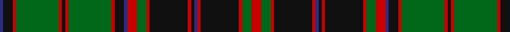

In pattern [BKRGRKRGRKBRGRKRKBRKRGR](/patterns/bkrgrkrgrkbrgrkrkbrkrgr/).

This was sourced from house-of-tartan.  It is a [23 stripes tartan](/stripes/stripes23/).

Original link http://www.house-of-tartan.scotland.net/house/TartanViewjs.asp?colr=Def&tnam=1991

## Thread count
DB/4 K12 R4 G54 R4 K4 R4 G54 R4 K12 DB4 R12 G12 R4 K48 R4 K4 DB4 R4 K48 R4 G12 R/12

## Palette
Each colour and its ΔE from the base-6 reference it is a variant of.

| Colour | Shade | Base | ΔE (OKLab) |
|---|---|---|---|
| DB | <code style="background-color:#2C2C80;">#2C2C80</code> `#2C2C80` | B <code style="background-color:#2A418A;">#2A418A</code> | 0.06 |
| G | <code style="background-color:#006818;">#006818</code> `#006818` | G <code style="background-color:#006100;">#006100</code> | 0.02 |
| K | <code style="background-color:#101010;">#101010</code> `#101010` | K <code style="background-color:#000000;">#000000</code> | 0.17 |
| R | <code style="background-color:#C80000;">#C80000</code> `#C80000` | R <code style="background-color:#CC0000;">#CC0000</code> | 0.01 |

## Nearest tartans

The nearest existing variants by ΔTartan distance.

1. [Buchan](/setts/s23/r6g6r2k24r2b2k2r2k24r2g6r6b2k6r2g27r2k2r2g27r2k6b2~b2c2c80-g006818-k101010-ra00000~x2/) — ΔT 0.46
1. [Cumming/Buchan Hunting](/setts/s24/k2r2g27r2k6b2r6g6r2k24r2b2k2r2k24r2g6r6b2k6r2g27r2k2~b2c4084-g005020-k101010-rdc0000~x2/) — ΔT 0.50
1. [Scottish Tourist Board (1981)](/setts/s20/b30k2b2k2b2k32g15r2g4r4g30r4g4r2g15k32b2k2b2k2~b2c2c80-g006818-k101010-rc80000~x2/) — ΔT 1.09
1. [Harbor Club](/setts/s18/g14k5y2k3g7k3y2k5g14r47g14k5y2k3g7k3y2k5~g006428-k101010-r800028-ye8c000~x2/) — ΔT 1.17
1. [Durie Clan Tartan Tartan Number: 2228. Earliest known date: 1988 When the matriculation of the Durie 'Arms' was updated in June 1988, this tartan was designed for family use by Harry G Lindlay of Kinloch & Anderson of Edinburgh. The design is said to be based on the Argyle & Southern Highlanders regimental tartan - the yellow is from the mess dress (military uniform evening wear) facings (lapels) and the burgundy represents the Durie family's French connections. Andrew, son of Lt. Col. Raymond Varley Dewar Durie succeded his father as clan chieftain in 1999. See products available Copyright © Blair Urquhart, Comrie, 2015](/setts/s16/g2y1g12r4b1r1b1r1b12r1b1r1b1r4g12y1~b202060-g006818-r880000-ye8c000~x4/) — ΔT 1.20
1. [Pilette of Kinnear (Personal)](/setts/s21/k4r2k10g3k10g30k8g3r4w2r4y2r4g3k8g30k10g3k10r2k4~g006818-k101010-rc80000-wc0c0c0-yd09800~x2/) — ΔT 1.23
1. [Park Clan/Family Weavers Tartan Tartan Number: 2387. Earliest known date: September 1996 William D. Park wished to have a tartan for himself and family. Can be worn by those of the same name. See products available Copyright © Blair Urquhart, Comrie, 2015](/setts/s22/g3r2g3r4g34k2g2k2g4k16b16r3b16k16g4k2g2k2g34r4g3r2~b2c2c80-g006818-k101010-rc80000~x2/) — ΔT 1.23
1. [Wilson Clan Tartan Tartan Number: 626. Earliest known date: 1780 Named after Janet Wilson, wife of the Bannockburn weaver, William Wilson who manufactured tartans from 1765. It is suggested in the extensive archives of the company that the tartan was prepared for the wedding in 1780 between the William Wilson, the son of the founder, and Janet Paterson. The sett was later introduced as the Wilson family tartan. Variations show blue instead of purple in the broad band and blue instead of azure (light blue) in the narrow stripes. See products available Copyright © Blair Urquhart, Comrie, 2015](/setts/s22/b45w4b6g6b6g6b6g37r6g6r6g6r6g6r6g39r27g6b6r12w4r30~b2c2c80-g006818-rc80000-we0e0e0/) — ΔT 1.37
1. [Wilson (Clan)](/setts/s22/b45w4b6g6b6g6b6g37r6g6r6g6r6g6r6g39r27g6b6r12w4r30~b2c2c80-g006818-rc80000-wfcfcfc/) — ΔT 1.39
1. [Buchan, Cumming MacIntyre](/setts/s23/r6g6r2k24r2b2k2r2k24r2g6r6b2k6r2g27r2k2r2g27r2k6b2~b304080-g008000-k000000-rc00000~x2/) — ΔT 1.40

## Neighbour map

Every grey dot is one of 15726 variants placed by the first two principal components of the ΔTartan feature space (44% of its variance). Red is this tartan; blue dots are its nearest — click one to open its page.

<svg viewBox="0 0 640 380" role="img" style="max-width:100%;height:auto;border:1px solid #e0e0e0;border-radius:4px;display:block" xmlns="http://www.w3.org/2000/svg"><image href="/nn/cloud.v1.png" width="640" height="380"/><a href="/setts/s23/r6g6r2k24r2b2k2r2k24r2g6r6b2k6r2g27r2k2r2g27r2k6b2~b2c2c80-g006818-k101010-ra00000~x2/"><circle cx="251.7" cy="130.1" r="4" fill="#3465a4"><title>Buchan</title></circle></a><a href="/setts/s24/k2r2g27r2k6b2r6g6r2k24r2b2k2r2k24r2g6r6b2k6r2g27r2k2~b2c4084-g005020-k101010-rdc0000~x2/"><circle cx="249.3" cy="124.8" r="4" fill="#3465a4"><title>Cumming/Buchan Hunting</title></circle></a><a href="/setts/s20/b30k2b2k2b2k32g15r2g4r4g30r4g4r2g15k32b2k2b2k2~b2c2c80-g006818-k101010-rc80000~x2/"><circle cx="240.4" cy="131.9" r="4" fill="#3465a4"><title>Scottish Tourist Board (1981)</title></circle></a><a href="/setts/s18/g14k5y2k3g7k3y2k5g14r47g14k5y2k3g7k3y2k5~g006428-k101010-r800028-ye8c000~x2/"><circle cx="260.9" cy="106.6" r="4" fill="#3465a4"><title>Harbor Club</title></circle></a><a href="/setts/s16/g2y1g12r4b1r1b1r1b12r1b1r1b1r4g12y1~b202060-g006818-r880000-ye8c000~x4/"><circle cx="273.2" cy="148.4" r="4" fill="#3465a4"><title>Durie Clan Tartan Tartan Number: 2228. Earliest known date: 1988 When the matriculation of the Durie 'Arms' was updated in June 1988, this tartan was designed for family use by Harry G Lindlay of Kinloch &amp; Anderson of Edinburgh. The design is said to be based on the Argyle &amp; Southern Highlanders regimental tartan - the yellow is from the mess dress (military uniform evening wear) facings (lapels) and the burgundy represents the Durie family's French connections. Andrew, son of Lt. Col. Raymond Varley Dewar Durie succeded his father as clan chieftain in 1999. See products available Copyright © Blair Urquhart, Comrie, 2015</title></circle></a><a href="/setts/s21/k4r2k10g3k10g30k8g3r4w2r4y2r4g3k8g30k10g3k10r2k4~g006818-k101010-rc80000-wc0c0c0-yd09800~x2/"><circle cx="253.1" cy="121.5" r="4" fill="#3465a4"><title>Pilette of Kinnear (Personal)</title></circle></a><a href="/setts/s22/g3r2g3r4g34k2g2k2g4k16b16r3b16k16g4k2g2k2g34r4g3r2~b2c2c80-g006818-k101010-rc80000~x2/"><circle cx="291.0" cy="125.3" r="4" fill="#3465a4"><title>Park Clan/Family Weavers Tartan Tartan Number: 2387. Earliest known date: September 1996 William D. Park wished to have a tartan for himself and family. Can be worn by those of the same name. See products available Copyright © Blair Urquhart, Comrie, 2015</title></circle></a><a href="/setts/s22/b45w4b6g6b6g6b6g37r6g6r6g6r6g6r6g39r27g6b6r12w4r30~b2c2c80-g006818-rc80000-we0e0e0/"><circle cx="212.3" cy="134.9" r="4" fill="#3465a4"><title>Wilson Clan Tartan Tartan Number: 626. Earliest known date: 1780 Named after Janet Wilson, wife of the Bannockburn weaver, William Wilson who manufactured tartans from 1765. It is suggested in the extensive archives of the company that the tartan was prepared for the wedding in 1780 between the William Wilson, the son of the founder, and Janet Paterson. The sett was later introduced as the Wilson family tartan. Variations show blue instead of purple in the broad band and blue instead of azure (light blue) in the narrow stripes. See products available Copyright © Blair Urquhart, Comrie, 2015</title></circle></a><a href="/setts/s22/b45w4b6g6b6g6b6g37r6g6r6g6r6g6r6g39r27g6b6r12w4r30~b2c2c80-g006818-rc80000-wfcfcfc/"><circle cx="208.6" cy="133.4" r="4" fill="#3465a4"><title>Wilson (Clan)</title></circle></a><a href="/setts/s23/r6g6r2k24r2b2k2r2k24r2g6r6b2k6r2g27r2k2r2g27r2k6b2~b304080-g008000-k000000-rc00000~x2/"><circle cx="201.7" cy="112.1" r="4" fill="#3465a4"><title>Buchan, Cumming MacIntyre</title></circle></a><circle cx="239.8" cy="123.9" r="5" fill="#c00000"/></svg>

ID: /setts/s23/r6g6r2k24r2b2k2r2k24r2g6r6b2k6r2g27r2k2r2g27r2k6b2~b2c2c80-g006818-k101010-rc80000~x2/
