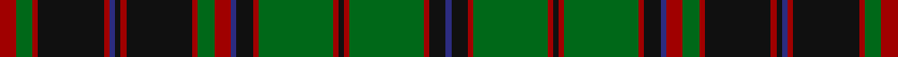

In pattern [BKRGRKRGRKBRGRKRKBRKRGR](/stripes/bkrgrkrgrkbrgrkrkbrkrgr/).

This was sourced from register-of-tartans.  It is a [23 stripe tartan](/stripes/stripes23/).

Original link https://www.tartanregister.gov.uk/tartanDetails.aspx?ref=413

## Also known as

This cloth is also recorded under:

- Buchan Cumming MacIntyre
- Buchan, Cumming MacIntyre

## Attestations

This cloth appears in 3 source records; the oldest owns this page.

- 01/01/1965 — Buchan (register-of-tartans, [record](https://www.tartanregister.gov.uk/tartanDetails.aspx?ref=413))
- undated — Buchan, Cumming MacIntyre (weddslist, [record](http://www.weddslist.com/cgi-bin/tartans/pg.pl?source=sts))
- undated — Buchan Cumming MacIntyre District Tartan Tartan Number: 1991. Earliest known date: 1790 Also MacIntyre and Glenorchy. Adopted by the Buchan family around 1965, on account of their long association with the Cummings which began with the marriage of Margaret, daughter of King Edgar, to William Coymen, sheriff of Forfar in 1210. The name, Buchan, though a family name, is territorial in origin. The sett is asymmetrical. There is a sample in the collection of the Highland Society of London, housed in the National Museums of Scotland, Edinburgh. See products available Copyright © Blair Urquhart, Comrie, 2015 (house-of-tartan, [record](http://www.house-of-tartan.scotland.net/house/TartanViewjs.asp?colr=Def&tnam=1991))

## Register references

External register numbers recorded for this tartan.

- Scottish Register of Tartans: [413](https://www.tartanregister.gov.uk/tartanDetails.aspx?ref=413)
- Scottish Tartans Authority (ITI): 1991
- Scottish Tartans World Register: 1991

## Thread count
DR/12 G12 DR4 K48 DR4 DB4 K4 DR4 K48 DR4 G12 DR12 DB4 K12 DR4 G54 DR4 K4 DR4 G54 DR4 K12 DB/4

## Palette
Each colour and the base-6 reference it is a variant of.

| Colour | Shade | Base |
|---|---|---|
| DB | <code style="background-color:#2C2C80;">#2C2C80</code> `oklch(35.0% 0.138 276.6)` <small>#2C2C80</small> | B <code style="background-color:#2A418A;">#2A418A</code> |
| DR | <code style="background-color:#A00000;">#A00000</code> `oklch(44.3% 0.182 29.2)` <small>#A00000</small> | R <code style="background-color:#CC0000;">#CC0000</code> |
| G | <code style="background-color:#006818;">#006818</code> `oklch(45.0% 0.142 145.0)` <small>#006818</small> | G <code style="background-color:#006100;">#006100</code> |
| K | <code style="background-color:#101010;">#101010</code> `oklch(17.3% 0.000 89.9)` <small>#101010</small> | K <code style="background-color:#000000;">#000000</code> |

## Nearest tartans

The nearest existing variants by ΔTartan distance.

1. [Cumming/Buchan Hunting](/setts/s24/k2r2dg27r2k6db2r6dg6r2k24r2k2db2r2k24r2dg6r6db2k6r2dg27r2k2~x2/) — ΔT 0.44
1. [Scottish Tourist Board (1981)](/setts/s20/db30k2db2k2db2k32g15r2g4r4g30~x2/) — ΔT 0.89
1. [Park Clan/Family Weavers Tartan Tartan Number: 2387. Earliest known date: September 1996 William D. Park wished to have a tartan for himself and family. Can be worn by those of the same name. See products available Copyright © Blair Urquhart, Comrie, 2015](/setts/s22/r3db16k16g4k2g2k2g34r4g3r2g3~x2/) — ΔT 1.10
1. [Durie Clan Tartan Tartan Number: 2228. Earliest known date: 1988 When the matriculation of the Durie 'Arms' was updated in June 1988, this tartan was designed for family use by Harry G Lindlay of Kinloch & Anderson of Edinburgh. The design is said to be based on the Argyle & Southern Highlanders regimental tartan - the yellow is from the mess dress (military uniform evening wear) facings (lapels) and the burgundy represents the Durie family's French connections. Andrew, son of Lt. Col. Raymond Varley Dewar Durie succeded his father as clan chieftain in 1999. See products available Copyright © Blair Urquhart, Comrie, 2015](/setts/s16/db12r1db1r1db1r4g12ly1g2~x4/) — ΔT 1.11
1. [Harbor Club](/setts/s18/r47g14k5ly2k3g7k3ly2k5g14~x2/) — ΔT 1.27
1. [Pilette of Kinnear (Personal)](/setts/s21/k4r2k10g3k10g30k8g3r4lo2r4lb2r4g3k8g30k10g3k10r2k4~x2/) — ΔT 1.30
1. [Ulster (Red)](/setts/s22/g10k1g10r1g1k1g1k1r10k1lo1k1~x4/) — ΔT 1.35
1. [MacDonald](/setts/s23/g20r2g4r6g32k32r2db32r6db3r2db20r2db3r6db32r2k32g32r6g4r2g10~x2/) — ΔT 1.37
1. [Norwich No.023](/setts/s26/db2t1r2g16r2db6t1r2g6r2db16t1r2g2~x2/) — ΔT 1.39
1. [Stewart of Bute](/setts/s32/g34k2b2k2g34r3k34r2k34r3b33k2g2k2g2k2b33~x2/) — ΔT 1.42

## Neighbour map

Every grey dot is one of 14299 variants placed by the first two principal components of the ΔTartan feature space (44% of its variance). Red is this tartan; blue dots are its nearest — click one to open its page.

<svg viewBox="0 0 640 380" role="img" style="max-width:100%;height:auto;border:1px solid #e0e0e0;border-radius:4px;display:block" xmlns="http://www.w3.org/2000/svg"><image href="/nn/cloud.v1.png" width="640" height="380"/><a href="/setts/s24/k2r2dg27r2k6db2r6dg6r2k24r2k2db2r2k24r2dg6r6db2k6r2dg27r2k2~x2/"><circle cx="251.9" cy="129.2" r="4" fill="#3465a4"><title>Cumming/Buchan Hunting</title></circle></a><a href="/setts/s20/db30k2db2k2db2k32g15r2g4r4g30~x2/"><circle cx="243.7" cy="137.8" r="4" fill="#3465a4"><title>Scottish Tourist Board (1981)</title></circle></a><a href="/setts/s22/r3db16k16g4k2g2k2g34r4g3r2g3~x2/"><circle cx="293.8" cy="130.2" r="4" fill="#3465a4"><title>Park Clan/Family Weavers Tartan Tartan Number: 2387. Earliest known date: September 1996 William D. Park wished to have a tartan for himself and family. Can be worn by those of the same name. See products available Copyright © Blair Urquhart, Comrie, 2015</title></circle></a><a href="/setts/s16/db12r1db1r1db1r4g12ly1g2~x4/"><circle cx="275.7" cy="152.7" r="4" fill="#3465a4"><title>Durie Clan Tartan Tartan Number: 2228. Earliest known date: 1988 When the matriculation of the Durie 'Arms' was updated in June 1988, this tartan was designed for family use by Harry G Lindlay of Kinloch &amp; Anderson of Edinburgh. The design is said to be based on the Argyle &amp; Southern Highlanders regimental tartan - the yellow is from the mess dress (military uniform evening wear) facings (lapels) and the burgundy represents the Durie family's French connections. Andrew, son of Lt. Col. Raymond Varley Dewar Durie succeded his father as clan chieftain in 1999. See products available Copyright © Blair Urquhart, Comrie, 2015</title></circle></a><a href="/setts/s18/r47g14k5ly2k3g7k3ly2k5g14~x2/"><circle cx="263.2" cy="110.0" r="4" fill="#3465a4"><title>Harbor Club</title></circle></a><a href="/setts/s21/k4r2k10g3k10g30k8g3r4lo2r4lb2r4g3k8g30k10g3k10r2k4~x2/"><circle cx="255.9" cy="124.8" r="4" fill="#3465a4"><title>Pilette of Kinnear (Personal)</title></circle></a><a href="/setts/s22/g10k1g10r1g1k1g1k1r10k1lo1k1~x4/"><circle cx="304.2" cy="146.6" r="4" fill="#3465a4"><title>Ulster (Red)</title></circle></a><a href="/setts/s23/g20r2g4r6g32k32r2db32r6db3r2db20r2db3r6db32r2k32g32r6g4r2g10~x2/"><circle cx="200.3" cy="139.3" r="4" fill="#3465a4"><title>MacDonald</title></circle></a><a href="/setts/s26/db2t1r2g16r2db6t1r2g6r2db16t1r2g2~x2/"><circle cx="244.4" cy="124.1" r="4" fill="#3465a4"><title>Norwich No.023</title></circle></a><a href="/setts/s32/g34k2b2k2g34r3k34r2k34r3b33k2g2k2g2k2b33~x2/"><circle cx="229.5" cy="107.9" r="4" fill="#3465a4"><title>Stewart of Bute</title></circle></a><circle cx="254.5" cy="135.1" r="5" fill="#c00000"/></svg>

ID: /setts/s23/r6g6r2k24r2db2k2r2k24r2g6r6db2k6r2g27r2k2r2g27r2k6db2~x2/
