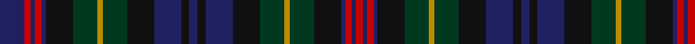

In pattern [BRBRBKGYGKBKBKBKGYGKBRBR](/patterns/brbrbkgygkbkbkbkgygkbrbr/).

This was sourced from house-of-tartan.  It is a [24 stripes tartan](/stripes/stripes24/).

Original link http://www.house-of-tartan.scotland.net/house/TartanViewjs.asp?colr=Def&tnam=5782

## Thread count
DB/18 R5 DB3 R5 DB3 K20 DG18 DY4 DG18 K20 DB20 K6 DB6 K6 DB20 K20 DG18 DY4 DG18 K20 DB3 R5 DB3 R/5

## Palette
Each colour and its ΔE from the base-6 reference it is a variant of.

| Colour | Shade | Base | ΔE (OKLab) |
|---|---|---|---|
| DB | <code style="background-color:#202060;">#202060</code> `#202060` | B <code style="background-color:#2A418A;">#2A418A</code> | 0.11 |
| DG | <code style="background-color:#003820;">#003820</code> `#003820` | G <code style="background-color:#006100;">#006100</code> | 0.15 |
| DY | <code style="background-color:#BC8C00;">#BC8C00</code> `#BC8C00` | Y <code style="background-color:#F2BF00;">#F2BF00</code> | 0.16 |
| K | <code style="background-color:#101010;">#101010</code> `#101010` | K <code style="background-color:#000000;">#000000</code> | 0.17 |
| R | <code style="background-color:#C80000;">#C80000</code> `#C80000` | R <code style="background-color:#CC0000;">#CC0000</code> | 0.01 |

## Nearest tartans

The nearest existing variants by ΔTartan distance.

1. [Bartlam (Personal)](/setts/s24/b12ba12y2ba12b12bb11b2bb2b2bb11b12ba12r2ba12b12bb2b2bb2b2bb12b2bb2b2bb2~b441800-ba5c5c5c-bb202060-r880000-ybc8c00~x2/) — ΔT 1.34
1. [Bartlam (Personal)](/setts/s24/b12ba2b2ba2b2ba12b2ba2b2ba2b12bb12r2bb12b12ba11b2ba2b2ba11b12bb12y2bb12~b441800-ba202060-bb5c5c5c-r880000-ybc8c00~x2/) — ΔT 1.34
1. [Unidentified 'Old tartan'](/setts/s35/b6g6k3g3k3g3k3g15r9g6b3k9b3g6r9g15k3g3k3g3k3g6ga9b3ga3b3ga3b3ga6b10ga3b3ga3b3ga3~b2c4084-g005020-ga503c14-k101010-rdc0000~x2/) — ΔT 1.39
1. [Gordonstoun #3](/setts/s21/r4g4r1k7r1k1ga1r1k7r1g4r4ga1b4r1g7y1g7r1b4ga1~b440044-g003820-ga789484-k101010-r880000-yd8b000~x4/) — ΔT 1.41
1. [Stuart/Stewart Hunting #3](/setts/s26/b8g2b8k2b2k2b2k4g11r2g11k4g2k9g2k9g2k4g11y2g11k4b2k2b2k4~b2c4084-g005020-k101010-rdc0000-ye8c000~x2/) — ΔT 1.46
1. [Polaris Corporate Tartan Tartan Number: 222. Earliest known date: 1964 Designed for the Officers and men of the American Submarine base at the Holy Loch - making the Polaris submarine the first ship in history to have its own tartan. The idea came from Captain Walter F Schlech, Commander of the submarine squadron. The arrangement of stripes between the cornflower yellows is blue-sky-blue (Dalgliesh). It was previously recorded as green-blue-green (STS). The sindex card created by Davidson c1964 is Black-Royal Blue-Black. The sky blue version was recently confirmed as the correct one by R. E. Trygstad, LCDR USN (Retired), who has in his possession an original scarf with the sky blue colours. See products available Copyright © Blair Urquhart, Comrie, 2015](/setts/s17/b6k1b1k1b1k7g6y1b1w1b1y1g6k7b7k1b1~b202060-g005028-k101010-w8ca0f0-ye0b000~x4/) — ΔT 1.46
1. [Forbes of Druinnor (Artefact)](/setts/s16/b6g2b2g2b2ba6ga8ba1w2ba1ga8gb2ba4b8g2b2~b202060-ba4c3428-g8c7038-ga003820-gb604000-wfcfcfc~x2/) — ΔT 1.50
1. [Humphries (Personal)](/setts/s14/k16ka4k4ka4k6ka14g17ka2r3ka2g17ka14k18w4~g003c14-k000028-ka101010-rdc0000-we0e0e0~x2/) — ΔT 1.54
1. [MacKinlay](/setts/s15/b6k2b2k2b2k6g8k1r2k1g8k6b8k2b2~b2c4084-g005020-k101010-rdc0000~x2/) — ΔT 1.57
1. [77th Regiment](/setts/s15/b16k3b3k3b3k16g14k2r3k2g14k16b14k2r3~b202060-g285800-k101010-rc80000~x2/) — ΔT 1.58

## Neighbour map

Every grey dot is one of 15726 variants placed by the first two principal components of the ΔTartan feature space (44% of its variance). Red is this tartan; blue dots are its nearest — click one to open its page.

<svg viewBox="0 0 640 380" role="img" style="max-width:100%;height:auto;border:1px solid #e0e0e0;border-radius:4px;display:block" xmlns="http://www.w3.org/2000/svg"><image href="/nn/cloud.v1.png" width="640" height="380"/><a href="/setts/s24/b12ba12y2ba12b12bb11b2bb2b2bb11b12ba12r2ba12b12bb2b2bb2b2bb12b2bb2b2bb2~b441800-ba5c5c5c-bb202060-r880000-ybc8c00~x2/"><circle cx="223.4" cy="195.1" r="4" fill="#3465a4"><title>Bartlam (Personal)</title></circle></a><a href="/setts/s24/b12ba2b2ba2b2ba12b2ba2b2ba2b12bb12r2bb12b12ba11b2ba2b2ba11b12bb12y2bb12~b441800-ba202060-bb5c5c5c-r880000-ybc8c00~x2/"><circle cx="223.4" cy="195.1" r="4" fill="#3465a4"><title>Bartlam (Personal)</title></circle></a><a href="/setts/s35/b6g6k3g3k3g3k3g15r9g6b3k9b3g6r9g15k3g3k3g3k3g6ga9b3ga3b3ga3b3ga6b10ga3b3ga3b3ga3~b2c4084-g005020-ga503c14-k101010-rdc0000~x2/"><circle cx="128.8" cy="181.8" r="4" fill="#3465a4"><title>Unidentified 'Old tartan'</title></circle></a><a href="/setts/s21/r4g4r1k7r1k1ga1r1k7r1g4r4ga1b4r1g7y1g7r1b4ga1~b440044-g003820-ga789484-k101010-r880000-yd8b000~x4/"><circle cx="142.4" cy="161.4" r="4" fill="#3465a4"><title>Gordonstoun #3</title></circle></a><a href="/setts/s26/b8g2b8k2b2k2b2k4g11r2g11k4g2k9g2k9g2k4g11y2g11k4b2k2b2k4~b2c4084-g005020-k101010-rdc0000-ye8c000~x2/"><circle cx="190.8" cy="190.6" r="4" fill="#3465a4"><title>Stuart/Stewart Hunting #3</title></circle></a><a href="/setts/s17/b6k1b1k1b1k7g6y1b1w1b1y1g6k7b7k1b1~b202060-g005028-k101010-w8ca0f0-ye0b000~x4/"><circle cx="183.5" cy="180.6" r="4" fill="#3465a4"><title>Polaris Corporate Tartan Tartan Number: 222. Earliest known date: 1964 Designed for the Officers and men of the American Submarine base at the Holy Loch - making the Polaris submarine the first ship in history to have its own tartan. The idea came from Captain Walter F Schlech, Commander of the submarine squadron. The arrangement of stripes between the cornflower yellows is blue-sky-blue (Dalgliesh). It was previously recorded as green-blue-green (STS). The sindex card created by Davidson c1964 is Black-Royal Blue-Black. The sky blue version was recently confirmed as the correct one by R. E. Trygstad, LCDR USN (Retired), who has in his possession an original scarf with the sky blue colours. See products available Copyright © Blair Urquhart, Comrie, 2015</title></circle></a><a href="/setts/s16/b6g2b2g2b2ba6ga8ba1w2ba1ga8gb2ba4b8g2b2~b202060-ba4c3428-g8c7038-ga003820-gb604000-wfcfcfc~x2/"><circle cx="135.8" cy="175.8" r="4" fill="#3465a4"><title>Forbes of Druinnor (Artefact)</title></circle></a><a href="/setts/s14/k16ka4k4ka4k6ka14g17ka2r3ka2g17ka14k18w4~g003c14-k000028-ka101010-rdc0000-we0e0e0~x2/"><circle cx="178.7" cy="202.4" r="4" fill="#3465a4"><title>Humphries (Personal)</title></circle></a><a href="/setts/s15/b6k2b2k2b2k6g8k1r2k1g8k6b8k2b2~b2c4084-g005020-k101010-rdc0000~x2/"><circle cx="201.8" cy="220.4" r="4" fill="#3465a4"><title>MacKinlay</title></circle></a><a href="/setts/s15/b16k3b3k3b3k16g14k2r3k2g14k16b14k2r3~b202060-g285800-k101010-rc80000~x2/"><circle cx="226.7" cy="210.1" r="4" fill="#3465a4"><title>77th Regiment</title></circle></a><circle cx="161.2" cy="195.1" r="5" fill="#c00000"/></svg>

ID: /setts/s24/b18r5b3r5b3k20g18y4g18k20b20k6b6k6b20k20g18y4g18k20b3r5b3r5~b202060-g003820-k101010-rc80000-ybc8c00/
