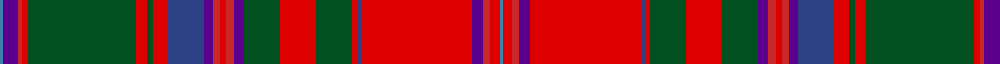

In pattern [BBRRGRGRBBRRRBGRGRBRBRRB](/patterns/bbrrgrgrbbrrrbgrgrbrbrrb/).

This was sourced from register-of-tartans.  It is a [24 stripes tartan](/stripes/stripes24/).

Original link https://www.tartanregister.gov.uk/tartanDetails.aspx?ref=2408

## Register references

External register numbers recorded for this tartan.

- Scottish Register of Tartans: [2408](https://www.tartanregister.gov.uk/tartanDetails.aspx?ref=2408)
- Scottish Tartans World Register: 68

## Thread count
B/4 P20 R6 Ra8 G144 Ra14 G8 Ra20 Ba48 P12 R10 Ra8 R10 P14 G48 Ra48 G48 Ra6 Ba6 Ra148 P14 R10 Ra12 B/4

## Palette
Each colour and its ΔE from the base-6 reference it is a variant of.

| Colour | Shade | Base | ΔE (OKLab) |
|---|---|---|---|
| B | <code style="background-color:#3C82AF;">#3C82AF</code> `#3C82AF` | B <code style="background-color:#2A418A;">#2A418A</code> | 0.19 |
| Ba | <code style="background-color:#2C4084;">#2C4084</code> `#2C4084` | B <code style="background-color:#2A418A;">#2A418A</code> | 0.01 |
| G | <code style="background-color:#005020;">#005020</code> `#005020` | G <code style="background-color:#006100;">#006100</code> | 0.07 |
| P | <code style="background-color:#5A008C;">#5A008C</code> `#5A008C` | B <code style="background-color:#2A418A;">#2A418A</code> | 0.13 |
| R | <code style="background-color:#C82828;">#C82828</code> `#C82828` | R <code style="background-color:#CC0000;">#CC0000</code> | 0.03 |
| Ra | <code style="background-color:#DC0000;">#DC0000</code> `#DC0000` | R <code style="background-color:#CC0000;">#CC0000</code> | 0.03 |

## Nearest tartans

The nearest existing variants by ΔTartan distance.

1. [MacDougall, of MacDougall](/setts/s24/b2ba10r3ra4g72ra7g4ra10bb24ba6r5ra4r5ba7g24ra24g24ra3bb3ra74ba7r5ra6b2~b5480b0-ba800080-bb304080-g008000-rd03030-rac00000~x2/) — ΔT 0.73
1. [MacDougall (Wilson)](/setts/s24/b1r4ra2rb2g27rb4g2rb4ba10r3ra2rb2ra2r3g10rb10g10rb2ba2rb26r3ra2rb3b1~b3c82af-ba5a008c-g005020-rc80050-rac82828-rbdc0000~x2/) — ΔT 0.83
1. [Sommerville Family Tartan Tartan Number: 1861. Earliest known date: 1930 The specimen in the Society's collection was obtained about 1930 from the firm J Johnston of Edinburgh. It was descibed at the time as a modern family tartan. The cloth archive also contains a sample from the Lochcarron weavers. See products available Copyright © Blair Urquhart, Comrie, 2015](/setts/s18/w2r3ra5r48b4r2g17ra5r3ra5b21r5g3r5g54r3ra5y2~b2c2c80-g006818-rc80000-rad05054-we0e0e0-ye8c000/) — ΔT 1.00
1. [Dundas (Red)](/setts/s18/g4r4b1k1r19k1ba1r2bb5r2ba1k1r2g24r5b1k1ba3~b840068-ba3c82af-bb2c4084-g005020-k101010-rdc0000~x2/) — ΔT 1.03
1. [Sommerville](/setts/s18/w2r3ra6r48b4r2g16ra5r3ra5b20r5g3r5g54r3ra5y2~b2c2c80-g006818-rc80000-rae87878-we0e0e0-ye8c000~x2/) — ΔT 1.04
1. [MacDougall #2](/setts/s24/b1r5ra2rb3g24rb5g2rb5ba11r3ra2rb2ra2r3g11rb11g11rb2ba2rb25r3ra2rb5b1~b3c82af-ba2c4084-g005020-r960028-rac82828-rbdc0000~x2/) — ΔT 1.09
1. [Whitworth Artifact Tartan Tartan Number: 1724. Earliest known date: c.1790-1800 A piece of material 11x8 inches supposedly cut from a plaid worn by Prince Charles during the '45 rebellion. The piece was loaned to the Scottish Tartans Society museum in 1978 by Anthony Whitworth. The tartan expert, James Scarlett, noted that the sample was woven with a flying shuttle and appeared to be of commercial manufacture. He suggests that it may be a commercial copy of one of the many 'Princes Plaids' made c.1790. See products available Copyright © Blair Urquhart, Comrie, 2015](/setts/s20/r5y1r8w1b20w1ba20w1g20y1r5y1r5y1g20y2r52w1y5w1~b202060-ba2888c4-g006818-rc80000-we0e0e0-ye8c000~x2/) — ΔT 1.11
1. [MacDougall (Logan)](/setts/s20/b1r12ra4g72ra8g4ra8ba18r12ra4r12g18ra18g18ra8ba4ra72r6ra4b1~b3c82af-ba2c4084-g005020-r960028-radc0000~x2/) — ΔT 1.20
1. [Birral/Burrell](/setts/s17/b4ba8w2g32w2r8ra4ba2ra4r8w2ba16r65w2ba8b4w2~b5c8ca8-ba440044-g006818-rc80000-rad05054-we0e0e0~x2/) — ΔT 1.24
1. [Birral (Clan)](/setts/s17/r65w2b8ba4w2ba4b8w2g32w2r8ra4b2ra4r8w2b16~b440044-ba5c8ca8-g006818-rc80000-rad05054-we0e0e0~x2/) — ΔT 1.24

## Neighbour map

Every grey dot is one of 15726 variants placed by the first two principal components of the ΔTartan feature space (44% of its variance). Red is this tartan; blue dots are its nearest — click one to open its page.

<svg viewBox="0 0 640 380" role="img" style="max-width:100%;height:auto;border:1px solid #e0e0e0;border-radius:4px;display:block" xmlns="http://www.w3.org/2000/svg"><image href="/nn/cloud.v1.png" width="640" height="380"/><a href="/setts/s24/b2ba10r3ra4g72ra7g4ra10bb24ba6r5ra4r5ba7g24ra24g24ra3bb3ra74ba7r5ra6b2~b5480b0-ba800080-bb304080-g008000-rd03030-rac00000~x2/"><circle cx="250.5" cy="34.5" r="4" fill="#3465a4"><title>MacDougall, of MacDougall</title></circle></a><a href="/setts/s24/b1r4ra2rb2g27rb4g2rb4ba10r3ra2rb2ra2r3g10rb10g10rb2ba2rb26r3ra2rb3b1~b3c82af-ba5a008c-g005020-rc80050-rac82828-rbdc0000~x2/"><circle cx="229.5" cy="51.4" r="4" fill="#3465a4"><title>MacDougall (Wilson)</title></circle></a><a href="/setts/s18/w2r3ra5r48b4r2g17ra5r3ra5b21r5g3r5g54r3ra5y2~b2c2c80-g006818-rc80000-rad05054-we0e0e0-ye8c000/"><circle cx="238.7" cy="55.4" r="4" fill="#3465a4"><title>Sommerville Family Tartan Tartan Number: 1861. Earliest known date: 1930 The specimen in the Society's collection was obtained about 1930 from the firm J Johnston of Edinburgh. It was descibed at the time as a modern family tartan. The cloth archive also contains a sample from the Lochcarron weavers. See products available Copyright © Blair Urquhart, Comrie, 2015</title></circle></a><a href="/setts/s18/g4r4b1k1r19k1ba1r2bb5r2ba1k1r2g24r5b1k1ba3~b840068-ba3c82af-bb2c4084-g005020-k101010-rdc0000~x2/"><circle cx="256.4" cy="56.0" r="4" fill="#3465a4"><title>Dundas (Red)</title></circle></a><a href="/setts/s18/w2r3ra6r48b4r2g16ra5r3ra5b20r5g3r5g54r3ra5y2~b2c2c80-g006818-rc80000-rae87878-we0e0e0-ye8c000~x2/"><circle cx="230.3" cy="52.0" r="4" fill="#3465a4"><title>Sommerville</title></circle></a><a href="/setts/s24/b1r5ra2rb3g24rb5g2rb5ba11r3ra2rb2ra2r3g11rb11g11rb2ba2rb25r3ra2rb5b1~b3c82af-ba2c4084-g005020-r960028-rac82828-rbdc0000~x2/"><circle cx="230.2" cy="65.2" r="4" fill="#3465a4"><title>MacDougall #2</title></circle></a><a href="/setts/s20/r5y1r8w1b20w1ba20w1g20y1r5y1r5y1g20y2r52w1y5w1~b202060-ba2888c4-g006818-rc80000-we0e0e0-ye8c000~x2/"><circle cx="247.9" cy="17.2" r="4" fill="#3465a4"><title>Whitworth Artifact Tartan Tartan Number: 1724. Earliest known date: c.1790-1800 A piece of material 11x8 inches supposedly cut from a plaid worn by Prince Charles during the '45 rebellion. The piece was loaned to the Scottish Tartans Society museum in 1978 by Anthony Whitworth. The tartan expert, James Scarlett, noted that the sample was woven with a flying shuttle and appeared to be of commercial manufacture. He suggests that it may be a commercial copy of one of the many 'Princes Plaids' made c.1790. See products available Copyright © Blair Urquhart, Comrie, 2015</title></circle></a><a href="/setts/s20/b1r12ra4g72ra8g4ra8ba18r12ra4r12g18ra18g18ra8ba4ra72r6ra4b1~b3c82af-ba2c4084-g005020-r960028-radc0000~x2/"><circle cx="302.6" cy="53.6" r="4" fill="#3465a4"><title>MacDougall (Logan)</title></circle></a><a href="/setts/s17/b4ba8w2g32w2r8ra4ba2ra4r8w2ba16r65w2ba8b4w2~b5c8ca8-ba440044-g006818-rc80000-rad05054-we0e0e0~x2/"><circle cx="269.1" cy="35.7" r="4" fill="#3465a4"><title>Birral/Burrell</title></circle></a><a href="/setts/s17/r65w2b8ba4w2ba4b8w2g32w2r8ra4b2ra4r8w2b16~b440044-ba5c8ca8-g006818-rc80000-rad05054-we0e0e0~x2/"><circle cx="269.1" cy="35.7" r="4" fill="#3465a4"><title>Birral (Clan)</title></circle></a><circle cx="248.6" cy="32.8" r="5" fill="#c00000"/></svg>

ID: /setts/s24/b2ba10r3ra4g72ra7g4ra10bb24ba6r5ra4r5ba7g24ra24g24ra3bb3ra74ba7r5ra6b2~b3c82af-ba5a008c-bb2c4084-g005020-rc82828-radc0000~x2/
