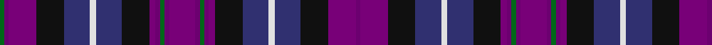

In pattern [BBKBWBKBBGBBBGBBKBWBKBBG](/patterns/bbkbwbkbbgbbbgbbkbwbkbbg/).

This was sourced from register-of-tartans.  It is a [24 stripes tartan](/stripes/stripes24/).

Original link https://www.tartanregister.gov.uk/tartanDetails.aspx?ref=5165

## Thread count
G/6 P6 Pa36 K36 DB34 LN8 DB34 K36 Pa8 P6 G6 P6 Pa34 P6 G6 P6 Pa8 K36 DB34 LN8 DB34 K36 Pa36 P/6

## Palette
Each colour and its ΔE from the base-6 reference it is a variant of.

| Colour | Shade | Base | ΔE (OKLab) |
|---|---|---|---|
| DB | <code style="background-color:#303070;">#303070</code> `#303070` | B <code style="background-color:#2A418A;">#2A418A</code> | 0.06 |
| DP | <code style="background-color:#440044;">#440044</code> `#440044` | B <code style="background-color:#2A418A;">#2A418A</code> | 0.18 |
| G | <code style="background-color:#006818;">#006818</code> `#006818` | G <code style="background-color:#006100;">#006100</code> | 0.02 |
| K | <code style="background-color:#101010;">#101010</code> `#101010` | K <code style="background-color:#000000;">#000000</code> | 0.17 |
| LN | <code style="background-color:#E0E0E0;">#E0E0E0</code> `#E0E0E0` | W <code style="background-color:#F7F7F7;">#F7F7F7</code> | 0.07 |
| P | <code style="background-color:#6C0070;">#6C0070</code> `#6C0070` | B <code style="background-color:#2A418A;">#2A418A</code> | 0.16 |
| Pa | <code style="background-color:#780078;">#780078</code> `#780078` | B <code style="background-color:#2A418A;">#2A418A</code> | 0.17 |

## Nearest tartans

The nearest existing variants by ΔTartan distance.

1. [Heart of Scotland (Milne) Fancy Tartan Tartan Number: 3105. Earliest known date: 2000 Designed by Ruthven Milne of Piob Mhor, Blairgowrie. Not recorded or registered with anyone so its existance and its 'duplicated' name were not known until September 2002. See products available Copyright © Blair Urquhart, Comrie, 2015](/setts/s18/b17ba3g3ba3b4k18bb17w4bb17k18b18ba3g3ba3b18k18bb17w4x2~b440044-ba6c0070-bb303070-g006818-k101010-we0e0e0/) — ΔT 0.85
1. [Heart of Scotland (Fashion)](/setts/s13/b17ba3g3ba3b4k18bb17w4bb17k18b18ba3g3x2~b780078-ba6c0070-bb303070-g006818-k101010-we0e0e0/) — ΔT 1.25
1. [South Lanarkshire](/setts/s16/b1ba7k1g6k1bb7w1k2w1bb7k1g6k1ba7b1k1x4~b2888c4-ba2c2c80-bb780078-g006818-k101010-we0e0e0/) — ΔT 1.59
1. [Pride of Bannockburn Fashion Tartan Tartan Number: 8978. Earliest known date: 2008 Original name was Scotland the Brave (design by Dalgleish) but changed to Spirit of Bannockburn by Lochcarron. Tartan Ribbon subsequently added a white stripe and called it Pride of Bannockburn See products available Copyright © Blair Urquhart, Comrie, 2015](/setts/s15/b20k16g3ba23r7g10r7ba23g3k16b23w2b2w2b3x2~b2c2c80-ba780078-g006818-k101010-rb468ac-wfcfcfc/) — ΔT 1.60
1. [Westwood MacPoiret (Fashion)](/setts/s13/b21r3b3r3b3k20ba18w3ba18k20b18r3b3x2~b1c1c50-ba780078-k101010-r888888-we0e0e0/) — ΔT 1.63
1. [Haughey (Personal)](/setts/s16/b6r2b2r4b14r2g12r2g3w2g3ga11ba9g2ba6w2x2~b141e46-ba5a008c-g003c14-ga2a2303-rdc0000-we0e0e0/) — ΔT 1.68
1. [Solberg-Bell Hunting](/setts/s13/k2r1y2k1b4k1y2ba8b2ba4b4w1k2x4~b2c4084-ba202060-k101010-r888888-we0e0e0-ya08858/) — ΔT 1.76
1. [Scotland Forever](/setts/s11/b6k3ba19k6ba4k3bb12g4bb12w2b5x2~b202060-ba14283c-bb780078-g006818-k101010-wfcfcfc/) — ΔT 1.78
1. [Glengoyne Distillery](/setts/s15/b11k3b3k3b3k9ba9k1y3k1ba9k9b9k1w3x2~b2c2c80-ba6c0070-k101010-we0e0e0-ybc8c00/) — ΔT 1.79
1. [Hird (Personal)](/setts/s29/b4g4k20r5k4ba5k4b5k18g4r8b2w2r16k4y2k4r16w2b2r6b6r2y2b20w2b20y2r3x2~b2c2c80-ba680028-g006818-k101010-r880000-wc0c0c0-yd09800/) — ΔT 1.84

## Neighbour map

Every grey dot is one of 15726 variants placed by the first two principal components of the ΔTartan feature space (44% of its variance). Red is this tartan; blue dots are its nearest — click one to open its page.

<svg viewBox="0 0 640 380" role="img" style="max-width:100%;height:auto;border:1px solid #e0e0e0;border-radius:4px;display:block" xmlns="http://www.w3.org/2000/svg"><image href="/nn/cloud.v1.png" width="640" height="380"/><a href="/setts/s18/b17ba3g3ba3b4k18bb17w4bb17k18b18ba3g3ba3b18k18bb17w4x2~b440044-ba6c0070-bb303070-g006818-k101010-we0e0e0/"><circle cx="114.6" cy="181.1" r="4" fill="#3465a4"><title>Heart of Scotland (Milne) Fancy Tartan Tartan Number: 3105. Earliest known date: 2000 Designed by Ruthven Milne of Piob Mhor, Blairgowrie. Not recorded or registered with anyone so its existance and its 'duplicated' name were not known until September 2002. See products available Copyright © Blair Urquhart, Comrie, 2015</title></circle></a><a href="/setts/s13/b17ba3g3ba3b4k18bb17w4bb17k18b18ba3g3x2~b780078-ba6c0070-bb303070-g006818-k101010-we0e0e0/"><circle cx="116.3" cy="183.7" r="4" fill="#3465a4"><title>Heart of Scotland (Fashion)</title></circle></a><a href="/setts/s16/b1ba7k1g6k1bb7w1k2w1bb7k1g6k1ba7b1k1x4~b2888c4-ba2c2c80-bb780078-g006818-k101010-we0e0e0/"><circle cx="82.6" cy="147.8" r="4" fill="#3465a4"><title>South Lanarkshire</title></circle></a><a href="/setts/s15/b20k16g3ba23r7g10r7ba23g3k16b23w2b2w2b3x2~b2c2c80-ba780078-g006818-k101010-rb468ac-wfcfcfc/"><circle cx="112.1" cy="139.5" r="4" fill="#3465a4"><title>Pride of Bannockburn Fashion Tartan Tartan Number: 8978. Earliest known date: 2008 Original name was Scotland the Brave (design by Dalgleish) but changed to Spirit of Bannockburn by Lochcarron. Tartan Ribbon subsequently added a white stripe and called it Pride of Bannockburn See products available Copyright © Blair Urquhart, Comrie, 2015</title></circle></a><a href="/setts/s13/b21r3b3r3b3k20ba18w3ba18k20b18r3b3x2~b1c1c50-ba780078-k101010-r888888-we0e0e0/"><circle cx="169.4" cy="192.5" r="4" fill="#3465a4"><title>Westwood MacPoiret (Fashion)</title></circle></a><a href="/setts/s16/b6r2b2r4b14r2g12r2g3w2g3ga11ba9g2ba6w2x2~b141e46-ba5a008c-g003c14-ga2a2303-rdc0000-we0e0e0/"><circle cx="65.4" cy="152.9" r="4" fill="#3465a4"><title>Haughey (Personal)</title></circle></a><a href="/setts/s13/k2r1y2k1b4k1y2ba8b2ba4b4w1k2x4~b2c4084-ba202060-k101010-r888888-we0e0e0-ya08858/"><circle cx="128.0" cy="173.9" r="4" fill="#3465a4"><title>Solberg-Bell Hunting</title></circle></a><a href="/setts/s11/b6k3ba19k6ba4k3bb12g4bb12w2b5x2~b202060-ba14283c-bb780078-g006818-k101010-wfcfcfc/"><circle cx="139.8" cy="178.9" r="4" fill="#3465a4"><title>Scotland Forever</title></circle></a><a href="/setts/s15/b11k3b3k3b3k9ba9k1y3k1ba9k9b9k1w3x2~b2c2c80-ba6c0070-k101010-we0e0e0-ybc8c00/"><circle cx="162.6" cy="173.0" r="4" fill="#3465a4"><title>Glengoyne Distillery</title></circle></a><a href="/setts/s29/b4g4k20r5k4ba5k4b5k18g4r8b2w2r16k4y2k4r16w2b2r6b6r2y2b20w2b20y2r3x2~b2c2c80-ba680028-g006818-k101010-r880000-wc0c0c0-yd09800/"><circle cx="106.6" cy="91.7" r="4" fill="#3465a4"><title>Hird (Personal)</title></circle></a><circle cx="102.7" cy="157.6" r="5" fill="#c00000"/></svg>

ID: /setts/s24/b3ba18k18bb17w4bb17k18ba4b3g3b3ba17b3g3b3ba4k18bb17w4bb17k18ba18b3g3x2~b6c0070-ba780078-bb303070-g006818-k101010-we0e0e0/
