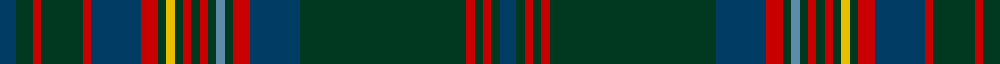

In pattern [BGRGRBRGYGRGRGBGRBGRGRGB](/patterns/bgrgrbrgygrgrgbgrbgrgrgb/).

This was sourced from house-of-tartan.  It is a [24 stripes tartan](/stripes/stripes24/).

Original link http://www.house-of-tartan.scotland.net/house/TartanViewjs.asp?colr=Def&tnam=2300

## Thread count
DB/4 DG4 R2 DG10 R2 DB12 R4 DG2 Y2 DG2 R2 DG2 R2 DG2 B2 DG2 R4 DB12 DG40 R2 DG2 R2 DG2 DB/4

## Palette
Each colour and its ΔE from the base-6 reference it is a variant of.

| Colour | Shade | Base | ΔE (OKLab) |
|---|---|---|---|
| B | <code style="background-color:#5C8CA8;">#5C8CA8</code> `#5C8CA8` | B <code style="background-color:#2C4084;">#2C4084</code> | 0.23 |
| DB | <code style="background-color:#003C64;">#003C64</code> `#003C64` | B <code style="background-color:#2C4084;">#2C4084</code> | 0.07 |
| DG | <code style="background-color:#003820;">#003820</code> `#003820` | G <code style="background-color:#006400;">#006400</code> | 0.16 |
| R | <code style="background-color:#C80000;">#C80000</code> `#C80000` | R <code style="background-color:#C80000;">#C80000</code> | 0.00 |
| Y | <code style="background-color:#E8C000;">#E8C000</code> `#E8C000` | Y <code style="background-color:#E8C000;">#E8C000</code> | 0.00 |

ID: /setts/s24/b4g4r2g10r2b12r4g2y2g2r2g2r2g2ba2g2r4b12g40r2g2r2g2b4-b003c64-ba5c8ca8-g003820-rc80000-ye8c000/
