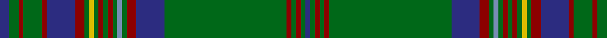

In pattern [BGRGRBRGYGRGRGBGRBGRGRGB](/patterns/bgrgrbrgygrgrgbgrbgrgrgb/).

This was sourced from register-of-tartans.  It is a [24 stripes tartan](/stripes/stripes24/).

Original link https://www.tartanregister.gov.uk/tartanDetails.aspx?ref=1137

## Attestations

This cloth appears in 2 source records; the oldest owns this page.

- 01/01/1995 — Ettrick Forest (register-of-tartans, [record](https://www.tartanregister.gov.uk/tartanDetails.aspx?ref=1137))
- 1995 — Ettrick Forest (District) (tartans-authority, [record](http://www.tartansauthority.com/tartan-ferret/display/4829/))

## Thread count
DB/4 G4 DR2 G8 DR2 DB12 DR4 G2 Y2 G2 DR2 G2 DR2 G2 B2 G2 DR4 DB12 G52 DR2 G2 DR2 G2 DB/2

## Palette
Each colour and its ΔE from the base-6 reference it is a variant of.

| Colour | Shade | Base | ΔE (OKLab) |
|---|---|---|---|
| B | <code style="background-color:#788CB4;">#788CB4</code> `#788CB4` | B <code style="background-color:#2C4084;">#2C4084</code> | 0.25 |
| DB | <code style="background-color:#2C2C80;">#2C2C80</code> `#2C2C80` | B <code style="background-color:#2C4084;">#2C4084</code> | 0.05 |
| DR | <code style="background-color:#8C0000;">#8C0000</code> `#8C0000` | R <code style="background-color:#C80000;">#C80000</code> | 0.13 |
| G | <code style="background-color:#006818;">#006818</code> `#006818` | G <code style="background-color:#006400;">#006400</code> | 0.02 |
| Y | <code style="background-color:#DCBC00;">#DCBC00</code> `#DCBC00` | Y <code style="background-color:#E8C000;">#E8C000</code> | 0.02 |

ID: /setts/s24/b4g4r2g8r2b12r4g2y2g2r2g2r2g2ba2g2r4b12g52r2g2r2g2b2-b2c2c80-ba788cb4-g006818-r8c0000-ydcbc00/
