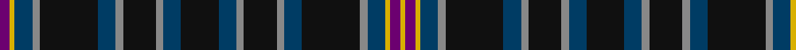

In pattern [BYBRKKBRKRBKBRKRBKKRBYBY](/patterns/bybrkkbrkrbkbrkrbkkrbyby/).

This was sourced from house-of-tartan.  It is a [24 stripes tartan](/stripes/stripes24/).

Original link http://www.house-of-tartan.scotland.net/house/TartanViewjs.asp?colr=Def&tnam=6447

## Thread count
P/8 Y4 DB14 N6 K20 K26 DB14 N6 K26 N6 DB14 K30 DB14 N6 K26 N6 DB14 K26 K20 N6 DB14 Y4 P8 Y/4

## Palette
Each colour and its ΔE from the base-6 reference it is a variant of.

| Colour | Shade | Base | ΔE (OKLab) |
|---|---|---|---|
| DB | <code style="background-color:#003C64;">#003C64</code> `#003C64` | B <code style="background-color:#2A418A;">#2A418A</code> | 0.08 |
| K | <code style="background-color:#101010;">#101010</code> `#101010` | K <code style="background-color:#000000;">#000000</code> | 0.17 |
| N | <code style="background-color:#888888;">#888888</code> `#888888` | R <code style="background-color:#CC0000;">#CC0000</code> | 0.24 |
| P | <code style="background-color:#6C0070;">#6C0070</code> `#6C0070` | B <code style="background-color:#2A418A;">#2A418A</code> | 0.16 |
| Y | <code style="background-color:#D8B000;">#D8B000</code> `#D8B000` | Y <code style="background-color:#F2BF00;">#F2BF00</code> | 0.06 |

## Nearest tartans

The nearest existing variants by ΔTartan distance.

1. [Westenra of Christchurch](/setts/s20/k20b4k8ba9k8b14k8r3w3ba10k12ba10w3r3k8b14k8ba9k8b4x2~b003c64-ba2c2c80-k101010-rc80000-we0e0e0/) — ΔT 1.26
1. [Dow-Aerlift (Name)](/setts/s22/b14g2b2g14k2g14k2g2k9r2k8y2k9g2k2g14k2g14b2g2b14w2x2~b9058d8-g003820-k101010-rc80000-wfcfcfc-ybc8c00/) — ΔT 1.52
1. [City of Sarnia (District)](/setts/s15/b10k2w2k3w2k10b10k1r2k1b10k10b10k1y2x2~b202060-k101010-rc80000-we0e0e0-yfccc00/) — ΔT 1.54
1. [Allen (1998)](/setts/s21/g2r2g12k4b11r2b11k4b2k9b2k9b2k4b11y2b11k4g12r2g2x2~b304c78-g006818-k101010-rc80000-ye8c000/) — ΔT 1.60
1. [MacEwen (Clans Originaux)](/setts/s28/k1g6k6b1k1b1k1b7k1b1k1b1k6g6k1r1k1g6k6b6k1b1k1b6k6g6k1y1x4~b2c2c80-g006818-k101010-rc80000-yd8b000/) — ΔT 1.62
1. [Lloyd of Dolobran (Personal)](/setts/s22/b5k1b5k5g4r1g4k1g4w1g4k10g4w1g4k1g4r1g4k5b5k1x4~b2c2c80-g006818-k101010-rc80000-wfcfcfc/) — ΔT 1.62
1. [Encyclopedia Britannica Corporate Tartan Tartan Number: 1968. Earliest known date: 1989 Based on Farquharson tartan after one of the company founders See products available Copyright © Blair Urquhart, Comrie, 2015](/setts/s14/b18k3b6k3b6k5g12r4g12k5b18k4w5k4x2~b2c2c80-g006818-k101010-rc80000-we0e0e0/) — ΔT 1.64
1. [Allen Personal Tartan Tartan Number: 2482. Earliest known date: 1997 Designed for Christopher Allen Holler of Winter Park Florida and for use by anyone of the name Allen or any of its variations. See products available Copyright © Blair Urquhart, Comrie, 2015](/setts/s40/g2r2g12k4b11r2b11k4b2k9b2k9b2k4b11y2b11k4g12r2g2r2g12k4b11y2b11k4b2k9b2k9b2k4b11r2b11k4g12r2x2~b2c2c80-g006818-k101010-rc80000-ye8c000/) — ΔT 1.64
1. [Stewart Hunting Early](/setts/s23/g4b9k3b3k8g27r8g27k8g5k13g8k13g5k8g27y8g27k8b3k3b9g4~b000052-g11450d-k000000-raa0000-yaaaa00/) — ΔT 1.65
1. [Stewart Hunting](/setts/s27/g2b7k1b1k1b1k3g11r4g11k3g2k6g4k6g2k3g11y4g11k3b1k1b1k1b7g2~b000052-g11450d-k000000-raa0000-yaaaa00/) — ΔT 1.66

## Neighbour map

Every grey dot is one of 15726 variants placed by the first two principal components of the ΔTartan feature space (44% of its variance). Red is this tartan; blue dots are its nearest — click one to open its page.

<svg viewBox="0 0 640 380" role="img" style="max-width:100%;height:auto;border:1px solid #e0e0e0;border-radius:4px;display:block" xmlns="http://www.w3.org/2000/svg"><image href="/nn/cloud.v1.png" width="640" height="380"/><a href="/setts/s20/k20b4k8ba9k8b14k8r3w3ba10k12ba10w3r3k8b14k8ba9k8b4x2~b003c64-ba2c2c80-k101010-rc80000-we0e0e0/"><circle cx="188.3" cy="211.1" r="4" fill="#3465a4"><title>Westenra of Christchurch</title></circle></a><a href="/setts/s22/b14g2b2g14k2g14k2g2k9r2k8y2k9g2k2g14k2g14b2g2b14w2x2~b9058d8-g003820-k101010-rc80000-wfcfcfc-ybc8c00/"><circle cx="172.1" cy="140.6" r="4" fill="#3465a4"><title>Dow-Aerlift (Name)</title></circle></a><a href="/setts/s15/b10k2w2k3w2k10b10k1r2k1b10k10b10k1y2x2~b202060-k101010-rc80000-we0e0e0-yfccc00/"><circle cx="259.2" cy="172.7" r="4" fill="#3465a4"><title>City of Sarnia (District)</title></circle></a><a href="/setts/s21/g2r2g12k4b11r2b11k4b2k9b2k9b2k4b11y2b11k4g12r2g2x2~b304c78-g006818-k101010-rc80000-ye8c000/"><circle cx="167.6" cy="186.2" r="4" fill="#3465a4"><title>Allen (1998)</title></circle></a><a href="/setts/s28/k1g6k6b1k1b1k1b7k1b1k1b1k6g6k1r1k1g6k6b6k1b1k1b6k6g6k1y1x4~b2c2c80-g006818-k101010-rc80000-yd8b000/"><circle cx="179.4" cy="160.9" r="4" fill="#3465a4"><title>MacEwen (Clans Originaux)</title></circle></a><a href="/setts/s22/b5k1b5k5g4r1g4k1g4w1g4k10g4w1g4k1g4r1g4k5b5k1x4~b2c2c80-g006818-k101010-rc80000-wfcfcfc/"><circle cx="163.4" cy="166.9" r="4" fill="#3465a4"><title>Lloyd of Dolobran (Personal)</title></circle></a><a href="/setts/s14/b18k3b6k3b6k5g12r4g12k5b18k4w5k4x2~b2c2c80-g006818-k101010-rc80000-we0e0e0/"><circle cx="165.4" cy="198.0" r="4" fill="#3465a4"><title>Encyclopedia Britannica Corporate Tartan Tartan Number: 1968. Earliest known date: 1989 Based on Farquharson tartan after one of the company founders See products available Copyright © Blair Urquhart, Comrie, 2015</title></circle></a><a href="/setts/s40/g2r2g12k4b11r2b11k4b2k9b2k9b2k4b11y2b11k4g12r2g2r2g12k4b11y2b11k4b2k9b2k9b2k4b11r2b11k4g12r2x2~b2c2c80-g006818-k101010-rc80000-ye8c000/"><circle cx="150.2" cy="158.1" r="4" fill="#3465a4"><title>Allen Personal Tartan Tartan Number: 2482. Earliest known date: 1997 Designed for Christopher Allen Holler of Winter Park Florida and for use by anyone of the name Allen or any of its variations. See products available Copyright © Blair Urquhart, Comrie, 2015</title></circle></a><a href="/setts/s23/g4b9k3b3k8g27r8g27k8g5k13g8k13g5k8g27y8g27k8b3k3b9g4~b000052-g11450d-k000000-raa0000-yaaaa00/"><circle cx="246.3" cy="163.3" r="4" fill="#3465a4"><title>Stewart Hunting Early</title></circle></a><a href="/setts/s27/g2b7k1b1k1b1k3g11r4g11k3g2k6g4k6g2k3g11y4g11k3b1k1b1k1b7g2~b000052-g11450d-k000000-raa0000-yaaaa00/"><circle cx="218.9" cy="142.5" r="4" fill="#3465a4"><title>Stewart Hunting</title></circle></a><circle cx="218.5" cy="181.9" r="5" fill="#c00000"/></svg>

ID: /setts/s24/b4y2ba7r3k10k13ba7r3k13r3ba7k15ba7r3k13r3ba7k13k10r3ba7y2b4y2x2~b6c0070-ba003c64-k101010-r888888-yd8b000/
