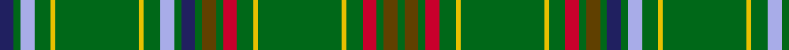

In pattern [BGWGYGYGWGBGGGRGYGYGRGGG](/patterns/bgwgygygwgbgggrgygygrggg/).

This was sourced from house-of-tartan.  It is a [24 stripes tartan](/stripes/stripes24/).

Original link http://www.house-of-tartan.scotland.net/house/TartanViewjs.asp?colr=Def&tnam=2197

## Thread count
DB/12 G6 LP12 G14 Y4 G72 Y4 G14 LP12 G6 DB12 G6 T12 G6 R12 G14 Y4 G72 Y4 G14 R12 G6 T12 G/6

## Palette
Each colour and its ΔE from the base-6 reference it is a variant of.

| Colour | Shade | Base | ΔE (OKLab) |
|---|---|---|---|
| DB | <code style="background-color:#202060;">#202060</code> `#202060` | B <code style="background-color:#2A418A;">#2A418A</code> | 0.11 |
| G | <code style="background-color:#006818;">#006818</code> `#006818` | G <code style="background-color:#006100;">#006100</code> | 0.02 |
| LP | <code style="background-color:#A8ACE8;">#A8ACE8</code> `#A8ACE8` | W <code style="background-color:#F7F7F7;">#F7F7F7</code> | 0.23 |
| R | <code style="background-color:#C8002C;">#C8002C</code> `#C8002C` | R <code style="background-color:#CC0000;">#CC0000</code> | 0.03 |
| T | <code style="background-color:#604000;">#604000</code> `#604000` | G <code style="background-color:#006100;">#006100</code> | 0.14 |
| Y | <code style="background-color:#E8C000;">#E8C000</code> `#E8C000` | Y <code style="background-color:#F2BF00;">#F2BF00</code> | 0.02 |

## Nearest tartans

The nearest existing variants by ΔTartan distance.

1. [Holmes](/setts/s28/g3y2g5r2g3r2g32b9k3b5k3b9g39y4g39b9k3b5k3b9g32r2g3r2g5y2g3r3x2~b2c2c80-g006818-k101010-rc80000-ye8c000/) — ΔT 1.14
1. [Bryant](/setts/s17/g20w2g2w2g2w8g2w2g2w2g20y4g8r2g4b1ba2x2~b441800-ba780078-g006818-r880000-wc0c0c0-yc4bc68/) — ΔT 1.15
1. [Holmes (Clan)](/setts/s15/y4g39b9k3b5k3b9g32r2g3r2g5y2g3r3x2~b2c2c80-g006818-k101010-rc80000-ye8c000/) — ΔT 1.40
1. [College of William & Mary Schools Tartan Tartan Number: 6522. Earliest known date: 2004 Designed by Carol Worthley of South Hiram, Maine for the Alma Mater of Stephen H Snell of Alexandria, Virginia - the College of William & Mary in VA. Stephen Snell has donated the tartan to the Earl Gregg Swem Library in that College to be sold as a fundraiser. See products available Copyright © Blair Urquhart, Comrie, 2015](/setts/s20/b10g25y2g2y3g2y2g25b10w3b10g25y2g2y3g2y2g25b10k3x2~b2c2c80-g285800-k101010-wf8f8f8-ye8c000/) — ΔT 1.43
1. [Seattle](/setts/s18/g14w1b2r1g1r1b2w1g4w1b2r1g1r1b2w1g14y1x4~b1c0070-g006818-re87878-wc0c0c0-yd09800/) — ΔT 1.45
1. [Heneghan Commemorative Family Tartan Tartan Number: 3841. Earliest known date: May 2002 Designed by Phil Heneghan for his family in San Francisco, Maryland and Alaska. The whole family took part in finalizing the design in preparation for parents 50th wedding anniversary celebration. See products available Copyright © Blair Urquhart, Comrie, 2015](/setts/s14/g16r3w1b2g4r2b4g2r1y1ya1y1b6g12x4~b2c2c80-g006818-rc80000-we0e0e0-yd87c00-yaf0c400/) — ΔT 1.51
1. [Kennedy](/setts/s15/y4g39b9k3b5k3b9g32r2g3r2g5y2g3r3x2~b304080-g008000-k000000-rc00000-yf0c000/) — ΔT 1.52
1. [Bryant (Name)](/setts/s17/g20w2g2w2g2w8g2w2g2w2g20y4g8r2g4b1ba2x2~b441800-ba780078-g006818-r880000-we0e0e0-yc4bc68/) — ΔT 1.56
1. [King Edward VII](/setts/s32/r6g5y3g10r3g6r3g62b21k10b10k10b10k10b21g84y8g84b21k10b10k10b10k10b21g62r3g6r3g10y3g5~b1474b4-g006818-k101010-rc80000-ye8c000/) — ΔT 1.62
1. [Kennedy Clan Tartan Tartan Number: 1123. Earliest known date: 1847 The Earls of Cassilis built Culzean Castle on the site of an ancient Kennedy stronghold. Dunure Castle near Culzean on the Ayrshire coast, was also owned by the Kennedys. The tartan was first recorded by MacIan in his book 'The Clans of the Scottish Highlands' (1847) which he co-authored with James Logan. See products available Copyright © Blair Urquhart, Comrie, 2015](/setts/s17/k2g2y1g3r1g2r1g12b4k3b3k3b3k3b4g24ra2x2~b2c2c80-g006818-k101010-ra00048-rac8002c-ye8c000/) — ΔT 1.63

## Neighbour map

Every grey dot is one of 15726 variants placed by the first two principal components of the ΔTartan feature space (44% of its variance). Red is this tartan; blue dots are its nearest — click one to open its page.

<svg viewBox="0 0 640 380" role="img" style="max-width:100%;height:auto;border:1px solid #e0e0e0;border-radius:4px;display:block" xmlns="http://www.w3.org/2000/svg"><image href="/nn/cloud.v1.png" width="640" height="380"/><a href="/setts/s28/g3y2g5r2g3r2g32b9k3b5k3b9g39y4g39b9k3b5k3b9g32r2g3r2g5y2g3r3x2~b2c2c80-g006818-k101010-rc80000-ye8c000/"><circle cx="398.3" cy="99.0" r="4" fill="#3465a4"><title>Holmes</title></circle></a><a href="/setts/s17/g20w2g2w2g2w8g2w2g2w2g20y4g8r2g4b1ba2x2~b441800-ba780078-g006818-r880000-wc0c0c0-yc4bc68/"><circle cx="384.0" cy="101.3" r="4" fill="#3465a4"><title>Bryant</title></circle></a><a href="/setts/s15/y4g39b9k3b5k3b9g32r2g3r2g5y2g3r3x2~b2c2c80-g006818-k101010-rc80000-ye8c000/"><circle cx="389.3" cy="120.0" r="4" fill="#3465a4"><title>Holmes (Clan)</title></circle></a><a href="/setts/s20/b10g25y2g2y3g2y2g25b10w3b10g25y2g2y3g2y2g25b10k3x2~b2c2c80-g285800-k101010-wf8f8f8-ye8c000/"><circle cx="333.9" cy="134.1" r="4" fill="#3465a4"><title>College of William &amp; Mary Schools Tartan Tartan Number: 6522. Earliest known date: 2004 Designed by Carol Worthley of South Hiram, Maine for the Alma Mater of Stephen H Snell of Alexandria, Virginia - the College of William &amp; Mary in VA. Stephen Snell has donated the tartan to the Earl Gregg Swem Library in that College to be sold as a fundraiser. See products available Copyright © Blair Urquhart, Comrie, 2015</title></circle></a><a href="/setts/s18/g14w1b2r1g1r1b2w1g4w1b2r1g1r1b2w1g14y1x4~b1c0070-g006818-re87878-wc0c0c0-yd09800/"><circle cx="361.0" cy="110.4" r="4" fill="#3465a4"><title>Seattle</title></circle></a><a href="/setts/s14/g16r3w1b2g4r2b4g2r1y1ya1y1b6g12x4~b2c2c80-g006818-rc80000-we0e0e0-yd87c00-yaf0c400/"><circle cx="313.9" cy="119.9" r="4" fill="#3465a4"><title>Heneghan Commemorative Family Tartan Tartan Number: 3841. Earliest known date: May 2002 Designed by Phil Heneghan for his family in San Francisco, Maryland and Alaska. The whole family took part in finalizing the design in preparation for parents 50th wedding anniversary celebration. See products available Copyright © Blair Urquhart, Comrie, 2015</title></circle></a><a href="/setts/s15/y4g39b9k3b5k3b9g32r2g3r2g5y2g3r3x2~b304080-g008000-k000000-rc00000-yf0c000/"><circle cx="368.9" cy="112.1" r="4" fill="#3465a4"><title>Kennedy</title></circle></a><a href="/setts/s17/g20w2g2w2g2w8g2w2g2w2g20y4g8r2g4b1ba2x2~b441800-ba780078-g006818-r880000-we0e0e0-yc4bc68/"><circle cx="364.1" cy="92.8" r="4" fill="#3465a4"><title>Bryant (Name)</title></circle></a><a href="/setts/s32/r6g5y3g10r3g6r3g62b21k10b10k10b10k10b21g84y8g84b21k10b10k10b10k10b21g62r3g6r3g10y3g5~b1474b4-g006818-k101010-rc80000-ye8c000/"><circle cx="355.1" cy="79.0" r="4" fill="#3465a4"><title>King Edward VII</title></circle></a><a href="/setts/s17/k2g2y1g3r1g2r1g12b4k3b3k3b3k3b4g24ra2x2~b2c2c80-g006818-k101010-ra00048-rac8002c-ye8c000/"><circle cx="330.4" cy="94.2" r="4" fill="#3465a4"><title>Kennedy Clan Tartan Tartan Number: 1123. Earliest known date: 1847 The Earls of Cassilis built Culzean Castle on the site of an ancient Kennedy stronghold. Dunure Castle near Culzean on the Ayrshire coast, was also owned by the Kennedys. The tartan was first recorded by MacIan in his book 'The Clans of the Scottish Highlands' (1847) which he co-authored with James Logan. See products available Copyright © Blair Urquhart, Comrie, 2015</title></circle></a><circle cx="361.3" cy="90.5" r="5" fill="#c00000"/></svg>

ID: /setts/s24/b6g3w6g7y2g36y2g7w6g3b6g3ga6g3r6g7y2g36y2g7r6g3ga6g3x2~b202060-g006818-ga604000-rc8002c-wa8ace8-ye8c000/
